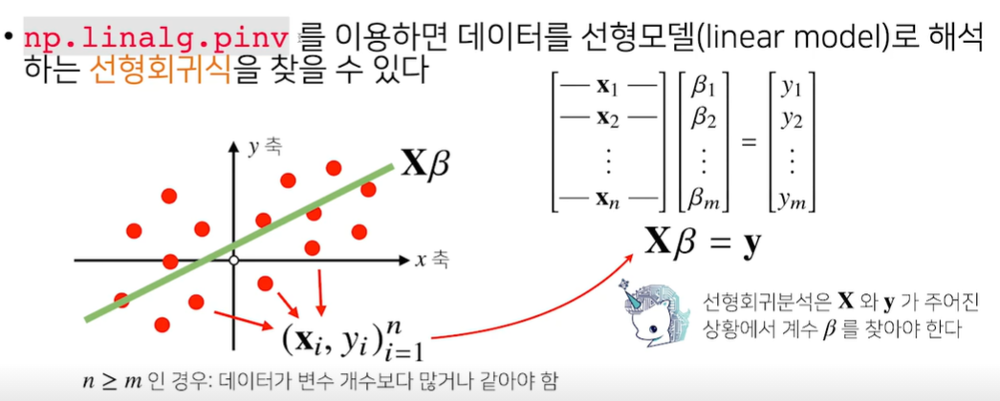
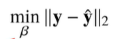

## 1. 무어펜로즈 역행렬의 정의

$$
A^+ = (A^TA)^{-1}A^T \\\\ where\ A\ is\ n\times m\ matrix\ (n\ge m)\\\\
\\\\
A^+ = A^T(AA^T)^{-1} \\\\ where\ A\ is\ n\times m\ matrix\ (n\le m)
$$

## 2. 선형회귀분석에 응용

- 본래 선형회귀분석에서 LSE를 추정하기 위해서는 주어진 데이터 행렬을 X라고 했을 때, X의 역행렬을 구해 y벡터에 곱해주었다.
- 하지만, 이는 X의 역행렬이 존재할 때에 한하여 생각할 수 있는 추정방법이다.
  - 행렬식이 0일 수도 있고, n x m 행렬 X가 행의 수와 열의 수가같지 않은 경우(n≠m)에는 역행렬을 구할수 없기 때문이다.
- 따라서, m≠n인 경우까지 확장하여 적용할 수 있는 추정방법은 무어펜로즈 역행렬을 사용하는 것이다.
- 다음 그림과 같이 데이터의 수(n)가 변수의 개수(m)보다 많은 경우를 생각해보는 것이 바로 그 적용 예시이다.

> **결국 정답레이블과 예측값 간의 차이를 최소화하는 벡터 B(베타)를 찾게 되는 것이고, 그 최소화해야하는 값은 바로 L2norm인 것이다.**

