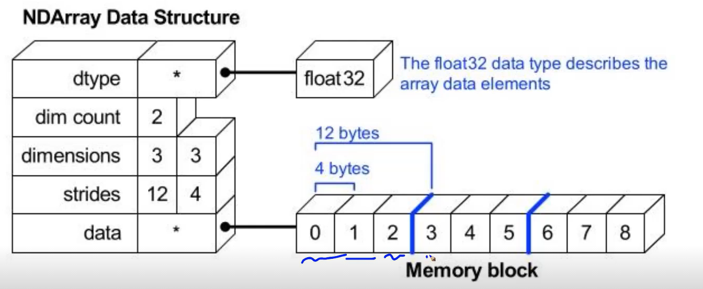

# Numpy Array


## 1. List보다 Array를 쓰는 이유 (메모리 효율 차이)


1. `list`는 가져올때 한번 더 추가적인 과정을 거침
2. `array`의 원소들은 메모리의 크기가 일정하기 때문에, 데이터를 저장하는 공간(메모리)를 사용하는 데 이점이 있다.


-  -5부터 256까지의 int값은 파이썬 특성상 원래 메모리의 `static`한 공간에 있음,
-  리스트는 값들을 저장하면 그 값들의 주소값을 저장해서 갖고있게 됨.
- 따라서 `array`는 한단계만 거치면 되는 것을 `list`는 인덱싱으로 접근 -> 그 값을 저장해놓은 주소값을 통해 값을 가져오기 2단계를 거쳐야한다.
-  `array`의 원소들은 다음과 같이 각각 메모리의 크기가 일정하기 때문에 데이터를 저장하는 공간 활용에 이점이 있다.





> **결론**
>
> - list보다 array의 메모리 효율이 좋다.
>
>   - `numpy`는 일반적인 `array`처럼 연속된 메모리 공간으로 할당하고,
>
>   - 파이썬 `list`는 각 위치에 실제 `value`값으로 연결되는 메모리 주소를 저장하고 있는 것이기 때문에,
>
>   - 주소값을 담아두는 공간이 추가적으로 필요없기 때문에 `array`가 `list`보다 메모리 효율이 좋다고 할 수 있습니다.
>   - 또한, `array`는 type을 미리 지정해두기 때문에 각 원소의 `type`을 따로 지정하지 않아도 된다는 점을 장점으로 볼 수 있습니다.
>
> 
>
> - `list`의 장점은 유연함.
>   - `list`는 포인터를 저장하고 있기 때문에 memory를 훨씬 많이 사용하는 반면, 서로 다른 타입의 원소를 저장할 수 있고, `list`의 길이를 유연하게 조정할 수 있다는 장점이 있습니다.


#

## 2. 리스트와 배열 원소 메모리주소 차이


- 리스트를 인덱싱했을 때와 


- 리스트에서의 결과와 array에서의 결과가 왜 이렇게 다르게 나오는 것일까? 아래 예시를 보도록 하자.


- 분명 -5부터 256 사이의 `python int` 객체들은 각각 같은 메모리 주소를 가진다고 배웠는데 왜 다른 결과가 나오는 걸까요?

  - 이는 `python native integer`가 아니라 `numpy object`이기 때문에 해당되지 않는 것입니다.

  - 따라서, `int type`이 아니라 `numpy.int type`이기 때문에 `id(a[0])`의 주소값은 다음과 같이 호출할 때마다 바뀌게 됩니다.

    ```python
    print(id(a[0]))
    print(id(a[0]))
    ```

    ```
    140452414823632
    140451605401488
    ```

    

- 먼저, Python에서 id는 객체의 메모리 주소값이고, 이는 객체가 존재하는 동안에만 unique하다는 것을 기억해야 합니다.
- 즉, 한 객체가 사라지고 다른 객체가 만들어졌을 때 이 두 객체는 같은 id를 가질 수도 있습니다. (이는 메모리를 재사용하기 때문입니다.)


- `a[0] is b[-1]`에서는 이 한 줄의 코드 내에서 `a[0]`가 아직 사라지지 않은 상태이기 때문에 해당 메모리를 차지하고 있고, `b[-1]`은 다른 메모리 주소를 가지게 되어 False를 반환하게 됩니다.
- `id(a[0]), id(b[-1])`에서는 한 줄의 코드지만 `id(a[0])`가 호출되었다가 사라지고 해당 메모리 주소가 비어있기 때문에 다시 해당 메모리 주소를 `id(b[-1])`가 가질 수 있게 된 것입니다.


> 참조 : https://stackoverflow.com/questions/52096582/how-unique-is-pythons-id#:~:text=The%20id%20is%20unique%20only,implementation%20provided%20by%20python.org


#


## 3. 연산 퍼포먼스 비교


- 앞으로 numpy 라이브러리의 array 자료를 많이 쓰게 될텐데 그것이 어떤 면에서 이득을 취할 수 있는지에 대한 설명이다.
- 단순 for loop는 물론이고 list comprehension보다도 더 빠른 속도를 자랑하고 있다. 이는 더 방대한 양의 데이터를 다룰수록 array의 퍼포먼스가 더 빛을 발하게 됨을 의미한다.
- 참고해야할 점은 계산을 하는 과정에서 이점을 가지는 것이지, 모든 연산들에서 효율적이라는 뜻은 아니다 (예를 들어, 할당과 같은)

#

## 4. 유용한 함수들
> ### 4.1 새로운 array 생성 함수 
> np.zeros(shape=(m,n), dtype=np.int8) : 0값으로 가득찬 array를 생성해주는 함수
> np.ones(shape=(m,n), dtype=np.int8) : 1값으로 가득찬 array를 생성해주는 함수
> np.empty(shape=(m,n), dtype=np.int8) : 비어있는 array를 생성해주는 함수

#

> ### 4.2 기존의 array와 같은 차원의 array 생성 함수
> np.zeros_like(array) : input과 같은 차원의 0으로 가득찬 array 생성
> np.ones_like(array) : input과 같은 차원의 1로 가득찬 array 생성
> np.empty_like(array) : input과 같은 차원의 비어있는 array 생성

#

> ### 4.3 Comparison Operation
>
#### 4.3.1 예시 1
> ```python
> a = np.arange(10)
> np.where(a>5) # 인덱스를 반환해준다는 것, 튜플 형태로 결과가 나온다는 것에 유의
> ```
>
> ```
> (array([6,7,8,9]),) 
> ```


#### 4.3.2 예시 2
> ```python
> a = np.array([1.,3.,0.],float)
> np.where(a>2) # 역시 인덱스를 반환하므로 1
> ```
>
> ```
> (array([1]),)
> ```


#### 4.3.3 예시 3

> ```python
> np.where(a<3)[0]  # 튜플이므로 인덱스 0을 출력하면 array
> ```
>
> ```
> array([0,2])
> ```


#### 4.3.4 예시 4

> ```python
> np.where(a<3 , 3, 2) # where이 if else 조건문처럼 적용가능 # where(condition, if반환값, else반환값)
> ```
>
> ```
> array([3,2,3])
> ```

- 이번에는 다른 때의 where 함수 결과와 다르게 튜플이 아닌 array를 반환해주었다.
- where의 2가지 쓰임에 유의하자.
  - 1. 조건을 물어보고 반환값 : 튜플(어레이(인덱스들))
  - 2. 혹은 조건을 물어봄과 동시에 if else에 따른 변환값을 사전에 지정하여 변환된 값을 array에 담아 반환.


**번외 함수(np.isnan)**
> ```python
> a = np.array([1,np.NaN,np.Inf],float)
> np.isnan(a)
> ```
>
> ```
> array([False,True,False],dtype=bool)
> ```


**번외 함수(np.isfinite)**
> ```python
> np.isfinite(a)
> ```
>
> ```
> array([True,False,False],dtype=bool)
> ```


#

> ### 4.4 argmax & argmin
- numpy에서 arg가 붙어있는 함수는 모두 index를 반환해준다고 생각하면 쉽다.
  - `argmax` : array 내에서 최댓값의 index를 반환함
  - `argmin` : array 내에서 최솟값의 index를 반환함
#### 4.4.1 예시 1
```py
import numpy as np
a = np.array([1,2,4,5,8,78,23,3])
print(np.argmax(a), np.argmin(a)) # 5 0
```

```
5 0
```
#### 4.4.2 예시 2

```py
a = np.array([
  [1,2,4,7],
  [9,88,6,45],
  [9,76,3,4]
  ])
print(np.argmax(a,axis=0))
print(np.argmax(a,axis=1))
```
```
[1 1 1 1]
[3 1 1]
```
- axis=0 : 결과값이 input array의 한 행의 길이와 같다. (즉, 각 열마다 최솟값을 찾는 연산을 실행)
- axis=1 : 결과값이 input array의 한 열의 길이와 같다. (즉, 각 행마다 최솟값을 찾는 연산을 실행)
#### 4.4.3 예시 3
```py
a = np.array([
  [1,2,4,7],
  [9,88,6,45],
  [9,76,3,4]
  ])
print(np.argmin(a,axis=0))
print(np.argmin(a,axis=1))
```

```
[0 0 2 2]
[0 2 2]
```
- axis=0 : 결과값이 input array의 한 행의 길이와 같다. (즉, 각 열마다 최솟값을 찾는 연산을 실행)
- axis=1 : 결과값이 input array의 한 열의 길이와 같다. (즉, 각 행마다 최솟값을 찾는 연산을 실행)

**번외 : argsort()**
- 역시 `index`를 반환하는데 크기순대로 반환을 해주는 것이다.
- 단순하게 생각해보면 `비모수 방법론`에서 `순위통계량`을 구할 때 활용할 수 있을 것이란 생각이 든다.
```py
print(a)
print(a.argsort())
```
```
[[ 1  2  4  7]
 [ 9 88  6 45]
 [ 9 76  3  4]]
[[0 1 2 3]
 [2 0 3 1]
 [2 3 0 1]]
```
#

> ### 4.5 boolean_index 
#### 4.5.1 예시 1
```py
print(a)
print(a<10) # boolean index
print(a[a<10]) # boolean indexing
```
```
[[ 1  2  4  7]
 [ 9 88  6 45]
 [ 9 76  3  4]]
[[ True  True  True  True]
 [ True False  True False]
 [ True False  True  True]]
[1 2 4 7 9 6 9 3 4]
```
- boolean index : 역시 `numpy`의 성질인 **broadcasting**에 의해 비교연산자가 각 `element`에 모두 적용이 되어 `boolean`을 배열로서 반환한다
- `indexing` 결과는 하나의 리스트로 반환되었다.

#

> ### 4.6 fancy index 
- 리스트에서 `int value` 로 `indexing` 해왔듯, `array` 에서도 똑같이 `int type` 을 통해 `indexing` 해오는 것을 뜻한다.
#### 4.6.1 예시 1
```py
a = np.array([2,4,6,8],float)
b = np.array([0,0,1,3,2,1],int) # 반드시 int로 선언해야한다.
print(a[b])
```
```
array([2., 2., 4., 8., 6., 4.])
```

#### 4.6.2 예시 2
- `matrix` 형태에도 적용이 가능하다.
```py
a = np.array([[1,4],[9,16]],float)
b = np.array([0,0,1,1,0],int)
c = np.array([0,1,1,1,1])
print(a[b,c])
# b를 row index
# c를 column index
# [0,0], [0,1],[1,1],[1,1],[0,1] 순으로 indexing 해온다.
```
```
array([1., 4., 16., 16., 4.])
```