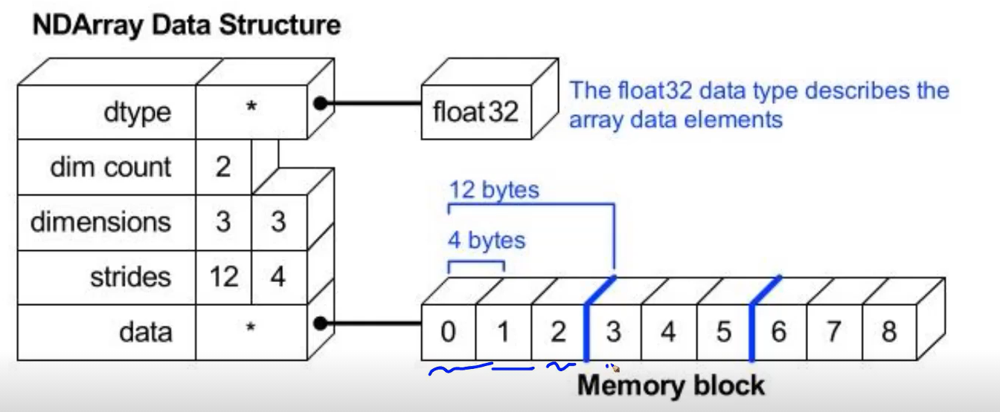
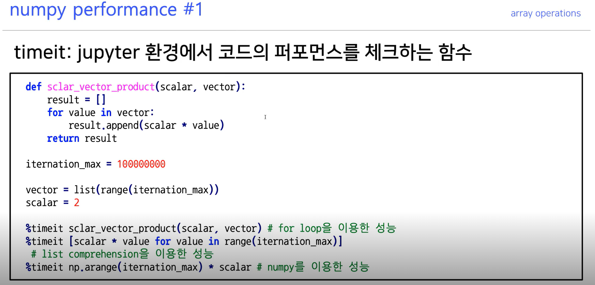
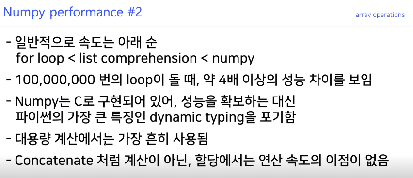

# 1. numpy array와 list의 메모리 효율 차이


1. `list`는 가져올때 한번 더 추가적인 과정을 거침
2. `array`의 원소들은 메모리의 크기가 일정하기 때문에, 데이터를 저장하는 공간(메모리)를 사용하는 데 이점이 있다.


-  -5부터 256까지의 int값은 파이썬 특성상 원래 메모리의 `static`한 공간에 있음,
-  리스트는 값들을 저장하면 그 값들의 주소값을 저장해서 갖고있게 됨.
- 따라서 `array`는 한단계만 거치면 되는 것을 `list`는 인덱싱으로 접근 -> 그 값을 저장해놓은 주소값을 통해 값을 가져오기 2단계를 거쳐야한다.
-  `array`의 원소들은 다음과 같이 각각 메모리의 크기가 일정하기 때문에 데이터를 저장하는 공간 활용에 이점이 있다.





> **결론**
>
> - list보다 array의 메모리 효율이 좋다.
>
>   - `numpy`는 일반적인 `array`처럼 연속된 메모리 공간으로 할당하고,
>
>   - 파이썬 `list`는 각 위치에 실제 `value`값으로 연결되는 메모리 주소를 저장하고 있는 것이기 때문에,
>
>   - 주소값을 담아두는 공간이 추가적으로 필요없기 때문에 `array`가 `list`보다 메모리 효율이 좋다고 할 수 있습니다.
>   - 또한, `array`는 type을 미리 지정해두기 때문에 각 원소의 `type`을 따로 지정하지 않아도 된다는 점을 장점으로 볼 수 있습니다.
>
> 
>
> - `list`의 장점은 유연함.
>   - `list`는 포인터를 저장하고 있기 때문에 memory를 훨씬 많이 사용하는 반면, 서로 다른 타입의 원소를 저장할 수 있고, `list`의 길이를 유연하게 조정할 수 있다는 장점이 있습니다.


## 2. 리스트와 배열 원소 메모리주소 차이


- 리스트를 인덱싱했을 때와 


- 리스트에서의 결과와 array에서의 결과가 왜 이렇게 다르게 나오는 것일까? 아래 예시를 보도록 하자.


- 분명 -5부터 256 사이의 `python int` 객체들은 각각 같은 메모리 주소를 가진다고 배웠는데 왜 다른 결과가 나오는 걸까요?

  - 이는 `python native integer`가 아니라 `numpy object`이기 때문에 해당되지 않는 것입니다.

  - 따라서, `int type`이 아니라 `numpy.int type`이기 때문에 `id(a[0])`의 주소값은 다음과 같이 호출할 때마다 바뀌게 됩니다.

    ```python
    print(id(a[0]))
    print(id(a[0]))
    ```

    ```
    140452414823632
    140451605401488
    ```

    

- 먼저, Python에서 id는 객체의 메모리 주소값이고, 이는 객체가 존재하는 동안에만 unique하다는 것을 기억해야 합니다.
- 즉, 한 객체가 사라지고 다른 객체가 만들어졌을 때 이 두 객체는 같은 id를 가질 수도 있습니다. (이는 메모리를 재사용하기 때문입니다.)


- `a[0] is b[-1]`에서는 이 한 줄의 코드 내에서 `a[0]`가 아직 사라지지 않은 상태이기 때문에 해당 메모리를 차지하고 있고, `b[-1]`은 다른 메모리 주소를 가지게 되어 False를 반환하게 됩니다.
- `id(a[0]), id(b[-1])`에서는 한 줄의 코드지만 `id(a[0])`가 호출되었다가 사라지고 해당 메모리 주소가 비어있기 때문에 다시 해당 메모리 주소를 `id(b[-1])`가 가질 수 있게 된 것입니다.


> 참조 : https://stackoverflow.com/questions/52096582/how-unique-is-pythons-id#:~:text=The%20id%20is%20unique%20only,implementation%20provided%20by%20python.org


## 3. 연산 퍼포먼스 비교






- 앞으로 numpy 라이브러리의 array 자료를 많이 쓰게 될텐데 그것이 어떤 면에서 이득을 취할 수 있는지에 대한 설명이다.
- 단순 for loop는 물론이고 list comprehension보다도 더 빠른 속도를 자랑하고 있다. 이는 더 방대한 양의 데이터를 다룰수록 array의 퍼포먼스가 더 빛을 발하게 됨을 의미한다.
- 참고해야할 점은 


## 4. 유용한 함수들
> ### 4.1 새로운 array 생성 함수 
> np.zeros(shape=(m,n), dtype=np.int8) : 0값으로 가득찬 array를 생성해주는 함수
> np.ones(shape=(m,n), dtype=np.int8) : 1값으로 가득찬 array를 생성해주는 함수
> np.empty(shape=(m,n), dtype=np.int8) : 비어있는 array를 생성해주는 함수


> ### 4.2 기존의 array와 같은 차원의 array 생성 함수
> np.zeros_like(array) : input과 같은 차원의 0으로 가득찬 array 생성
> np.ones_like(array) : input과 같은 차원의 1로 가득찬 array 생성
> np.empty_like(array) : input과 같은 차원의 비어있는 array 생성


> ### 4.3 Comparison Operation
>
> ```python
> a = np.arange(10)
> np.where(a>5) # 인덱스를 반환해준다는 것, 튜플 형태로 결과가 나온다는 것에 유의
> ```
>
> ```
> (array([6,7,8,9]),) 
> ```


> ```python
> a = np.array([1.,3.,0.],float)
> np.where(a>2) # 역시 인덱스를 반환하므로 1
> ```
>
> ```
> (array([1]),)
> ```


> ```python
> np.where(a<3)[0]  # 튜플이므로 인덱스 0을 출력하면 array
> ```
>
> ```
> array([0,2])
> ```


> ```python
> np.where(a<3 , 3, 2) # where이 if else 조건문처럼 적용가능 # where(condition, if반환값, else반환값)
> ```
>
> ```
> array([3,2,3])
> ```

- 이번에는 다른 때의 where 함수 결과와 다르게 튜플이 아닌 array를 반환해주었다.
- where의 2가지 쓰임에 유의하자.
  - 1. 조건을 물어보고 반환값 : 튜플(어레이(인덱스들))
  - 2. 혹은 조건을 물어봄과 동시에 if else에 따른 변환값을 사전에 지정하여 변환된 값을 array에 담아 반환.


> ```python
> a = np.array([1,np.NaN,np.Inf],float)
> np.isnan(a)
> ```
>
> ```
> array([False,True,False],dtype=bool)
> ```


> ```python
> np.isfinite(a)
> ```
>
> ```
> array([True,False,False],dtype=bool)
> ```


> ### 4.4 argmax & argmin