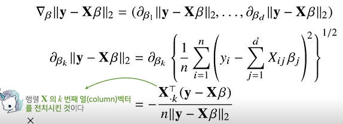

# 경사하강법으로 선형회귀 계수 구하기

- 목적식(오차의 L2 norm)을 최소로 하는 *`Beta`*를 구해야 한다.
- 이는 경사하강법 알고리즘을 통해서 이루어지는데 이 때, 다음과 같은 그레디언트 벡터의 계산이 필요하다.

- 위 그레디언트 벡터에서 k번째 원소는 다음의 값을 구하는 것과 같으며, 이번 시간에는 이 결과를 직접 수식으로 유도해보며 과정을 더 자세히 이해하도록 해본다.

$$
\part\beta_k\lVert y-XB \rVert_2\
$$

$$
\begin{align}

\part\beta_k\lVert y-XB \rVert_2\ \ \ 

&= \part\beta_k[\frac{1}{n}{\sum_{i=1}^n(y_i-\sum_{j=1}^dX_{ij}\beta_j)^2} ]^{1/2}\\
\\

&= \frac{1}{2\sqrt{n}}[{\sum_{i=1}^n(y_i-\sum_{j=1}^dX_{ij}\beta_j)^2} ]^{-1/2}\ \times\ 

{\sum_{i=1}^n\part\beta_k(y_i-\sum_{j=1}^dX_{ij}\beta_j)^2}\\
\\

&= \frac{1}{2\sqrt{n}}[{\sum_{i=1}^n(y_i-\sum_{j=1}^dX_{ij}\beta_j)^2} ]^{-1/2} \times\ 

{\sum_{i=1}^n2(y_i-\sum_{j=1}^dX_{ij}\beta_j)\ \ \part\beta_k(y_i-\sum_{j=1}^dX_{ij}\beta_j)}\\
\\

&= \frac{1}{\sqrt{n}}[{\sum_{i=1}^n(y_i-\sum_{j=1}^dX_{ij}\beta_j)^2} ]^{-1/2} \times\ 

{\sum_{i=1}^n(y_i-\sum_{j=1}^dX_{ij}\beta_j)}\ (-X_{\cdot k})\\
\\

&= \frac
{{\sum_{i=1}^n(y_i-\sum_{j=1}^dX_{ij}\beta_j)}\ (-X_{\cdot k})}

{\sqrt{n}[{\sum_{i=1}^n(y_i-\sum_{j=1}^dX_{ij}\beta_j)^2} ]^{1/2}}\\\\

&= -\frac
{X_{\cdot k}^T(y-X\beta)}
{\sqrt{n}\sqrt{n}[\frac{1}{n}{\sum_{i=1}^n(y_i-\sum_{j=1}^dX_{ij}\beta_j)^2} ]^{1/2}}\\

&= -\frac
{X_{\cdot k}^T(y-X\beta)}
{n\lVert y-XB_k \rVert_2}

\end{align}
$$

- 따라서, 최종적으로 우리가 구하고자 하는 그레디언트 벡터는 다음과 같게 된다.

$$
\begin{align}

\nabla\beta_\lVert y-XB \rVert_2\ &= (\part\beta_1\lVert y-XB \rVert_2, ... , \part\beta_d\lVert y-XB \rVert_2)\\

&= (-\frac
{X_{\cdot 1}^T(y-X\beta)}
{n\lVert y-XB_k \rVert_2},
...
,
-\frac
{X_{\cdot d}^T(y-X\beta)}
{n\lVert y-XB_k \rVert_2})\\

&=-\frac
{X^T(y-X\beta)}
{n\lVert y-XB \rVert_2}

\end{align}
$$

- 결국, 복잡한 계산과정을 거쳤지만 이제껏 배워왔던 다항함수의 미분과 표현이 비슷함을 알 수가 있다.
- 마치 합성함수의 미분에서 겉미분을 통해 `1/2승 => -1/2승` & 속미분을 통해 `(y-XB)`를 `{Beta}`에 대해 미분한 결과인 `-X^T`가 추가로 곱해지게 되는 모습을 볼 수 있는 것이다.

- `t`번째 계수 `Beta`에서 위에서 구한 그레디언트를 빼주면 다음 베타값으로 업데이트가 되는 과정을 거치게 되며, 이것이 바로 경사하강법 알고리즘이다.

$$
\beta^{(t+1)}\ ← \ \beta^{(t)}\ -\ \lambda\nabla_\beta\lVert{y-X\beta_{(t)}}\rVert
$$

