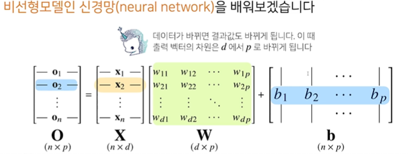
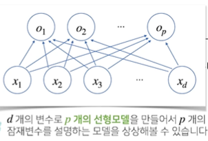
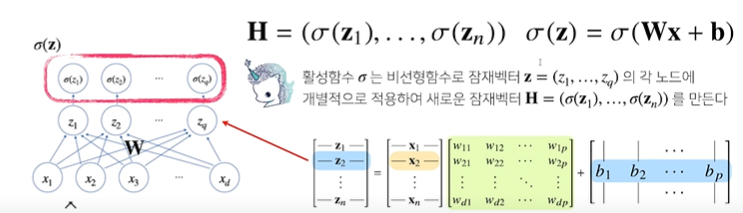
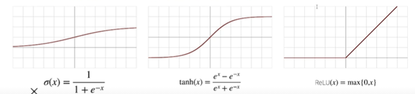
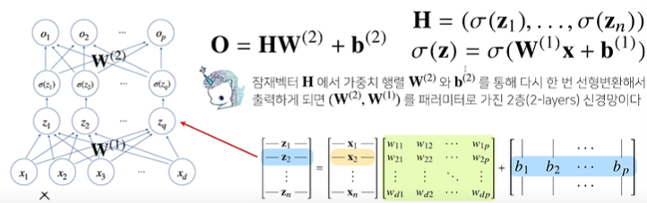
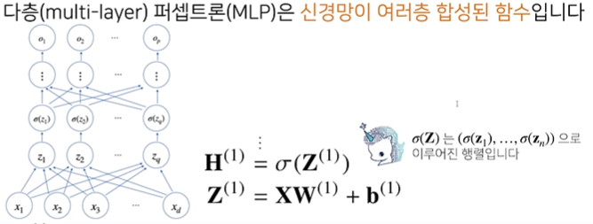
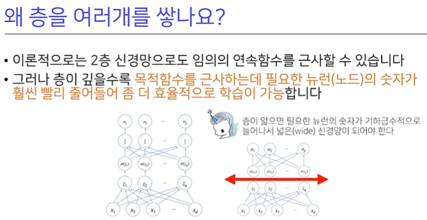

# 신경망 (Neural Network)

## 신경망의 구조 분해하고 살펴보기

$$
Output = XW + b\ \ (where\ X\ is\ given\ data,\ W\ is\ Weighted\ Matrix,\ b\ is\ biased\ matrix)
$$

- x1 ~ xd 까지의 변수들이 o1 ~ op 까지 영향을 끼치게 도식화되어있는데, 그려진 화살표들은 각 x가 p개씩 가지고 있으므로 총 d*p개이다.
- d*p 차원을 가지는 W matrix가 바로 이 화살표들을 뜻하고 있는 것이다.

## Softmax

- 소프트맥스(softmax) 함수는 모델의 출력을 확률로 해석할 수 있게 변환해주는 연산입니다.
- 분류 문제를 풀 때 선형모델과 소프트맥스 함수를 결합하여 예측합니다.

>  softmax 함수에서 input을 받을 때, 입력 벡터의 np.max를 value에서 빼주면 큰 벡터가 들어왔을 때의 overflow를 방지할 수 있다고 하는데 어떤 원리일까?

(출처: 위키백과 "지수함수" [https://ko.wikipedia.org/wiki/%EC%A7%80%EC%88%98_%ED%95%A8%EC%88%98](https://ko.wikipedia.org/wiki/지수_함수))

- 우선, `overflow 오버플로우`란 프로그램에 메모리 용량을 넘어선 값이 입력되어 생기는 오류입니다.
- 예를 들어, 0부터 15까지만 표현하는 4bit (0000) 체계에 사용자가 10000과 같이 큰 숫자를 입력하면 사용자의 의도와는 전혀 다른 엉뚱한 결과값이 나오는 오류를 오버플로우라고 합니다.

- 다시 질문으로 돌아가서, 주어진 벡터에서 가장 큰 값(=max)을 해당 벡터의 모든 요소에 대해 뺀다면 해당 벡터의 요소들은 [ - ∞ ~ 0 ]의 값을 가지게 될 것입니다.
- 이 경우 각 요소에 대한 exp() 함수의 출력 값은 0 과 1 사이의 값을 갖게 되므로 exp()가 너무 큰 값을 출력함으로써 발생할 수 있는 오버플로우를 방지하는 효과를 얻을 수 있습니다.

## Activation Function (활성화함수)

- 신경망은 선형모델과 활성함수를 합성한 함수입니다.

  

- 활성함수는 보통 비선형함수로 정의되며 활성함수를 쓰지 않으면 딥러닝은 선형모형과 차이가 없습니다.
- 시그모이드 함수나 tanh 함수는 전통적으로 많이 쓰이던 활성함수지만 딥러닝에선 ReLU를 많이 쓰고 있다.

- 아래 2-layers 신경망은 W행렬을 2개 가진다.

- 아래 그림의 MLP(다층신경망)에서 H랑 Z는 차원이나 모양은 같지만 H는 Z갑에 활성함수를 씌운 값이 된다.

> **층은 얼마나 깊게?**
>
> - 층이 깊어지게 되면 더 적은 노드로 복잡한 패턴을 표현할 수가 있게 됩니다. 
> - 하지만, 너무 지나치게 층을 깊게  쌓으면 연산량과 gradient Vanishing 문제 등이 발생할 수 있습니다.

