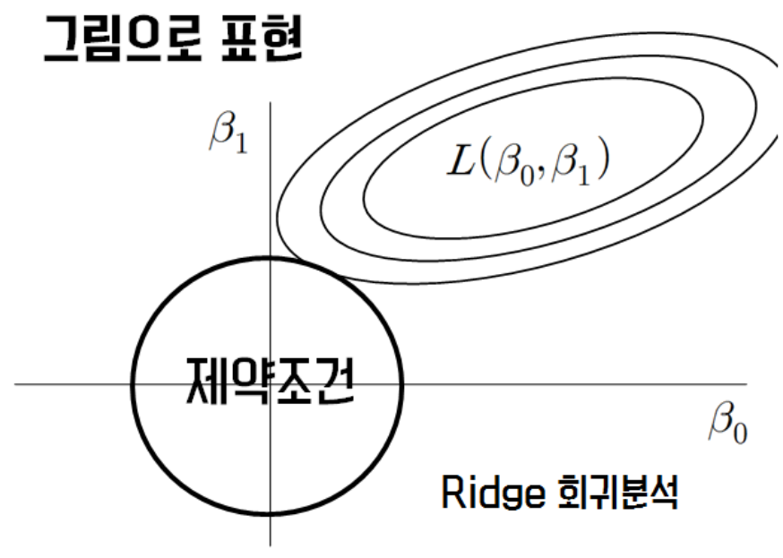

# L1 & L2 Norm

> #### Introduction)

> ***Machine Learning*을 공부할 때 Norm과 관련된 수식이 굉장히 많이 쓰인다는 것을 느낄 때가 있습니다. 그래서 이번에 다양한 기계학습에서 사용되는 Norm을 이해할 수 있도록 정리를 해보려 합니다**

> 일반적으로 기계학습시 Overfitting 문제를 해결하는 방법에는 다양한 방법들이 있습니다. 
>
> ​	1) Collecting More Data
>
> ​	2) Cross Validation
>
> ​	3) Batch Normalization
>
> ​	4) Drop Out
>
> ​	5) L1, L2 Regularization 등

- 이들 중 오늘 다룰 내용이 바로 *L1 L2 Norm*을 이용한 네트워크의 *Regularization*입니다.

## 0. What is Norm?

> *Norm*이란 벡터의 크기를 표현하는 방법입니다.
>
> 일반적으로 *p- Norm*은 다음과 같이  표현되는데, 이는 바로 원점에서 벡터좌표까지의  거리를 구한 것입니다.

$$
L_p = (\sum_i^n|x_i|^p)^\frac{1}{p}
$$

- 그리고 여기서 각각 `p = 1`일 때 *L1 Norm*
  - *L1 norm*은 대개 다음과 같은 영역에서 사용된다고 알려져있습니다.
    - *L1 Regularization*
    - *Computer Vision*

$$
\begin{align}
L_1 &= (\sum_i^n|x_i|)\\
&=|x_1|+ \cdot\cdot\cdot + |x_n|
\end{align}
$$

- `p= 2`일 때 *L2 Norm*
  - *L2 norm*은 대개 다음과 같은 영역에서 사용된다고 알려져있습니다.
    - *L2 Regularization*
    - *KNN 알고리즘*
    - *Kmeans 알고리즘*

$$
\begin{align}
L_2 &= (\sum_i^n|x_i|^2)\\
&=|x_1^2|+ \cdot\cdot\cdot + |x_n^2|
\end{align}
$$

> 우리가 관심있는 건 **그래서 이것을 어떤 식으로 사용하는가**입니다.
>
> - 우리가 흔히 알고 있던 Cost Function을 다음과 같이 변형하여 사용합니다.
> - 다음과 같이 변형된 함수는 보통 기존 함수에 L1 혹은 L2 규제를 위한 새로운 항을 추가한 형태의 *Cost Fucntion*입니다.

$$
cost(W,b) = \frac{1}{m}\sum_i^mL(\hat{y_i},y_i) + \lambda\lVert{w}\rVert\\
[Cost Function\ \ \ with \ \ \ L_1 \ Regularization]
$$

$$
cost(W,b) = \frac{1}{m}\sum_i^mL(\hat{y_i},y_i) + \lambda\lVert{w}^2\rVert\\
[Cost Function\ \ \ with \ \ \ L_2 \ Regularization]
$$

## 1. Ridge Lasso Regression

### 1.1 Ridge Regression

출처 : http://www.datamarket.kr/xe/index.php?mid=board_BoGi29&document_srl=7176&listStyle=viewer&page=9

$$
\begin{align}
L_2 &= (\sum_i^n|x_i|^2)\\
&=|x_1^2|+ \cdot\cdot\cdot + |x_n^2|
\end{align}
$$

$$
S(\beta) = \sum_i^n(y_i - \beta_0 - \sum\beta_jx_ij)^2 + \lambda\sum_j^p\beta_j^2
\\
$$

### 1.2 Lasso Regression

출처 : http://www.datamarket.kr/xe/index.php?mid=board_BoGi29&document_srl=7176&listStyle=viewer&page=9

$$
\begin{align}
L_2 &= (\sum_i^n|x_i|^2)\\
&=|x_1^2|+ \cdot\cdot\cdot + |x_n^2|
\end{align}
$$

$$
S(\beta) = \sum_i^n(y_i - \beta_0 - \sum\beta_jx_ij)^2 + \lambda\sum_j^p|\beta_j|
\\
$$

|                            Ridge                             |                            Lasso                             |
| :----------------------------------------------------------: | :----------------------------------------------------------: |
| *L2- Regularization 사용* 변수선택 불가능 Closed form Solution 존재 (미분으로 구함) 다중공선성(변수 간의 상관관계)이 존재할 때 더 좋은 예측 성능 크기가 큰 변수를 우선적으로 줄이는 경향이 존재 | *L1- Regularization 사용* 변수 선택 가능 Closed form Solution이 존재하지 않음 (수치해석방법 이용) 변수간의 상관관계가 높은 상황에는 Ridge에 비해 상대적으로 예측 성능이 줄어듦 |

`References : `

`https://towardsdatascience.com/visualizing-regularization-and-the-l1-and-l2-norms-d962aa769932`

