## 1. Cross-Validation (CV)

### 번외. Time Series에서는 어떻게 CV를 할까?

>  Nested Cross - Validation을 이용한다.

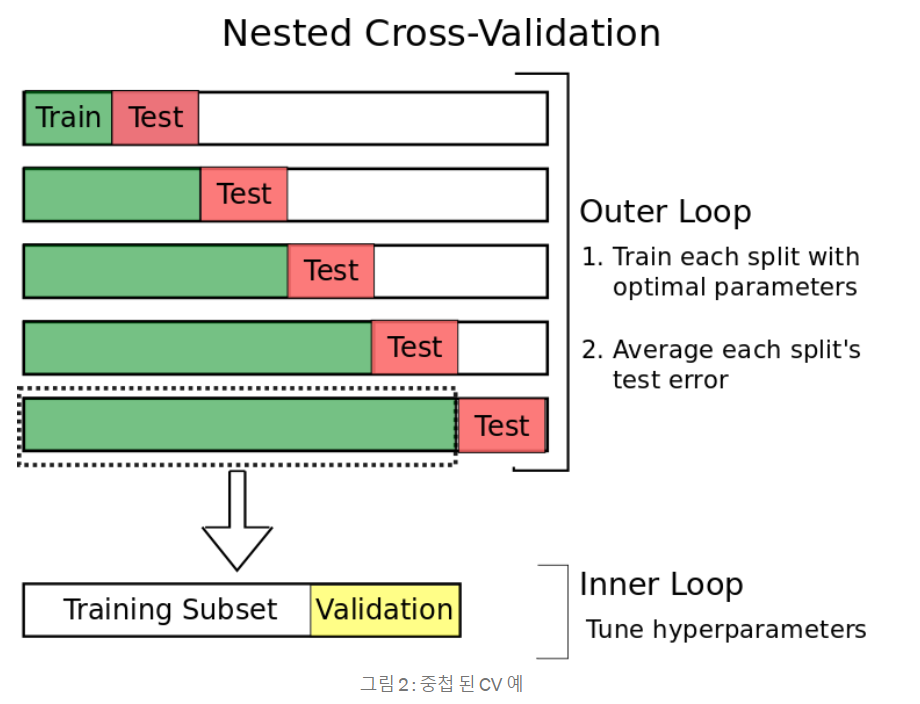

출처 : https://towardsdatascience.com/time-series-nested-cross-validation-76adba623eb9

## 2. BatchSize 조절

> 배치사이즈를 크게 하는 것이 좋은가? 적게 하는 것이 좋은가?
>
> - 결론부터 말하면, 이론적으로 너무 큰 배치사이즈는 그리 좋지 않다.

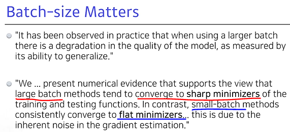

- large batch size로 학습한 모델이 퀄리티가 떨어질 수 있다.
- 왜냐하면 수렴할 가능성이 large batch ∽ sharp minimizer, small batch ∽ flat minimizer 일 가능성이 높기 때문이다.

- 그림을 보면 알다시피 테스트 셋의 분포와 트레이닝 셋의 분포가 그리 다르지 않다는 가정이 있는 것 같다. (이게 Training Function이랑 Test Function이라 적혀있어서 헷갈리긴 하네.. 데이터셋의 분포를 나타내는 그림 맞겠지?)
- Stochastic Gradient Descent로 최적화를 시키는 것을 생각해보자.
- large batch를 가지고 Sequential 하게 학습을 시켜가면 위와 같은 분포를 띌 때, small batch로 학습할 때보다 Sharp Minmum에 도달할 가능성이 크다.
  - 이것의 이유는 꽤 큰 batchsize를 가지고 최적화 과정을 거친다면 원래 GD랑 과정이 비슷해지지 않겠는가?
  - 즉, 다시말해 매번 Gradient로 업데이트를 할 때마다 그 함수의 모양이 보다 조금씩만 바뀌는 것이다.
  - 그러니까, 보다 Local의 정도가 심한 Minmum에 빠지게 될 가능성, 탈출하지 못할 가능성이 큰 것이다.

>  참고)
>
>  그런데 사실, 배치사이즈를 최대한 크게 가져가는 것이 좋다는 직접 실험한 결과에서 다음과 같이 나온 적이 있다.
>
> 이것은 너무나도 큰 데이터에 대해서 배치사이즈를 조정했기 때문일까?
>
> `참조 : https://www.youtube.com/watch?v=YjfryJhb9Zg`

## 3. Optimizer

- Optimizer 경사하강법의 종류

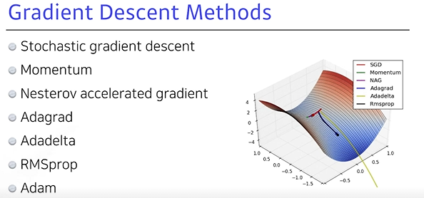

### 3.1 (Stochastic) Gradient Method

---

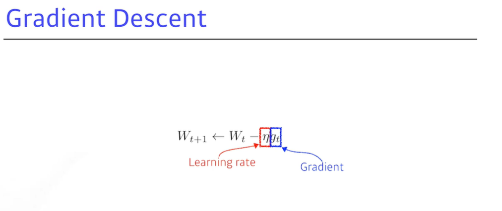

### 3.2 Momentum

---

- Gradient Method에서 이전의 움직이던 관성을 반영하자 라는 방법

  - 예를 들어서 만약 New Gradient가 이전과 다른 방향(왼쪽)으로 나왔다고 하더라도 **이전의 Gradient 방향(오른쪽)을 조금 반영하자**

- 식을 보면 딱 한줄만 간단하게 추가되어있는 형태이다.

- *Beta*라는 모멘텀 파라미터로부터 이전의 시점에서 구했던 *a_t*를 이용하여 *a_{t+1}*를 업데이트하는 과정을 거친 다음,

- 이를(모멘텀이 포함된 그레디언트를) 이용해 원래대로 LearningRate를 곱하여 가중치를 업데이트해준다.

  

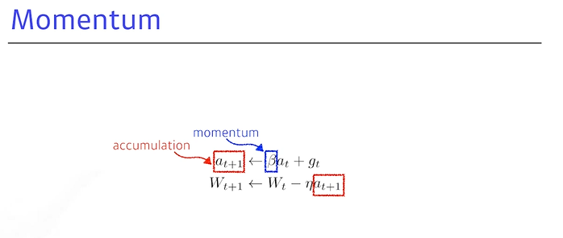

### 3.3 Nesterov Accelerated Gradient (NAG)

---

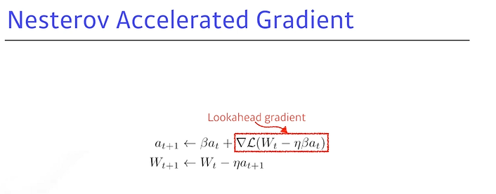

- 식을 보면 Momentum과 매우 비슷하지만, 미리 가보는 방법을 선택하는 것이다.
- a_t 가 구해지면 이를 이용해서 미리 그 방향으로 가보고, 그레디언트를 구한 다음 다음 업데이트시에 같이 더해준다.

> **왜 이렇게 하는 걸까?**

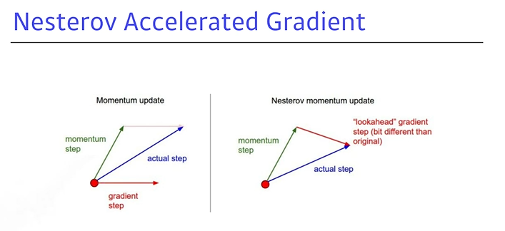 

- 사실, Momentum은 local minima를 중간에 두고도 계속 왔다갔다만 하고 잘 수렴되질 못한다.
- NAG를 쓰면 미리 가보고, 그 방향에서의 Gradient까지 더해주기 때문에 왔다갔다 할일을 줄여주고 바로 minima에 수렴할 수 있게 된다.

**이차함수 그림에서 minima에서 왔다갔다 하는 과정을 생각해보자 (Momentum vs NAG)**

> **Momentum**

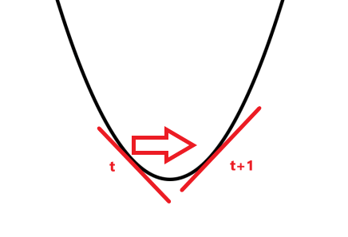

> **NAG**

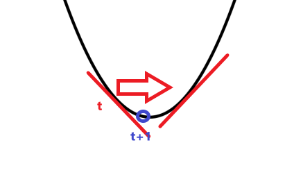

### 3.4 Adagrad

---

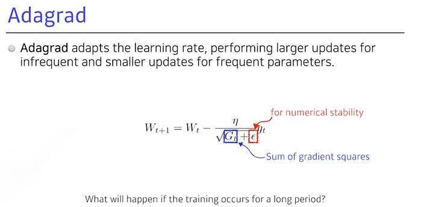

- *입실론* : 0으로 나누는 일이 없도록 하기 위한 상수항
- 파라미터가 많이 변해왔는지, 많이 안변해왔는지 기록했다가 이를 반영하는 것
  - 예를 들어 3번째 파라미터가 많이 변해왔던 파라미터라면 조금만 변화시키고
  - 만약 3번째 파라미터가 조금씩만 변해왔다면 많이 변화시키는 방법

- 만약 학습기간이 길어진다면 어떻게 될까?
  - 계속해서 더해왔기 때문에 *G_t*가 결국 무한대 값이 될 수 있음
  - 학습이 멈추게 되는 현상이 발생..

### 3.5 Adadelta

---

- *G_t*가 계속해서 커지는 *Adagrad*를 보완하기 위한 방법 => *G_t*를 조정한다.
- 현재 타임 t가 주어졌을 때, 윈도우사이즈(*gamma*)를 주어서 이전의 (그동안 쌓아온 그레디언트들의 합) 정보들은 일부분만 가지고 있겠다라는 방법
  - *G_t*를 업데이트 하는 수식에서 EMA = Exponential Moving Average (지수이동평균)
  - LearningRate가 없기 때문에 이를 보완하기 위해 
- <u>Learning Rate가 없다</u> => 결국 이 Adadelta는 우리가 조정해볼 수 있는 파라미터가 몇개 없다는 측면때문에 잘 쓰이지 않는 방법임

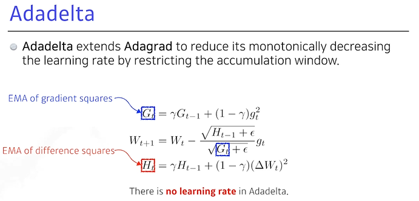

### 3.6 RMSprop

---

- *Adadelta*처럼 EMA(지수이동평균)을 구함 (*G_{t-1}*에 *gamma*를 곱해줌)
- **RMSprop**은 *Adadelta*에는 없던 stepsize(LearningRate) 파라미터를 다음과 같이 업데이트 시에 사용하였다.
  - 사실, 이는 Adagrad에서 *G_t*를 업데이트하는 라인 한줄만 추가된 것이다.

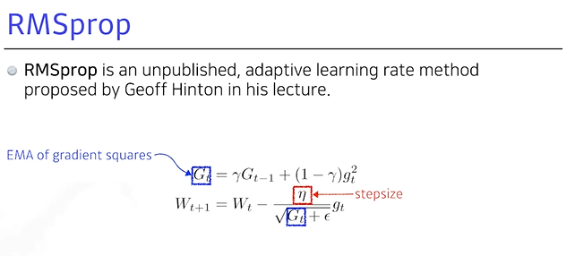

### 3.7 Adam

---

- *Adaptive Moment Estimation*(*Adam*) leverages both past gradients and squared gradients.
  - Adam은 이전 gradient를 반영하는 모멘텀과 이때까지의 Gradient 정보(많이 변했는지 적게 변했는지)를 지수평균으로서 반영함.
- Gradient를 EMA로 가져감과 동시에, 위에서 언급했던 Momentum을 적절하게 섞어 같이 활용한 방법론
  - *m_t*의 계수는 불편추정량이 되기 위해 곱해준 값
    - 참고 : (https://yjjo.tistory.com/6) `+ Adam 논문의 저자는 초기값으로 *beta_1*=0.9, *beta_2*=0.999, *epsilon*=10**(-8)을 제안했다.`
- 그저 분모가 0이 되지 않기 위해 조정하기 위해 추가해준 *epsilon* 파라미터가 생각외로 수렴을 결정하는데 중요한 요인이라서 잘 컨트롤해주어야 한다.

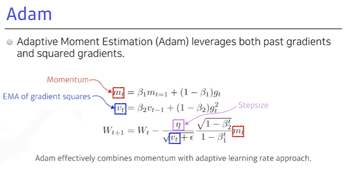

+) 여기서 질문 : 왜 모멘텀이랑만 같이 사용해봤을까..? **미리 가보고 선택하는 NAG**와 **Adaptive**를 옵티마이저랑 섞어서 써보는 옵티마이저도 따로 있을까?

=> ADAM에 Nestrov적용한 NADAM도 있네요 Adam 저자가 논문에서 함께 다루었다고 합니다. (추가적으로 Adamax까지)

## 4. Regularization

### 4.1 Early Stopping

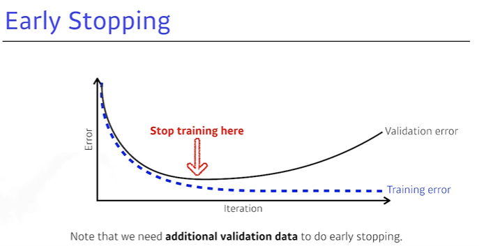

### 4.2 Parameter Norm Penalty

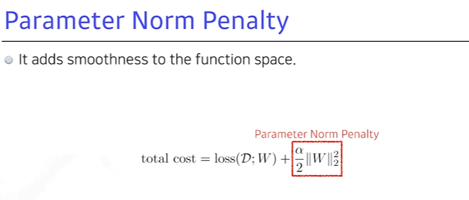

- 네트워크 파라미터가 너무 커지지 않게 제약을 걸어주는 것.
- L1 L2 정규화 공부했을 떄를 떠올려보면, 함수가 너무 과적합되어서 구불구불하지 않게, Smooth하게 만들어 줄 수 있다는 것이다.

### 4.3 Data Augmetation

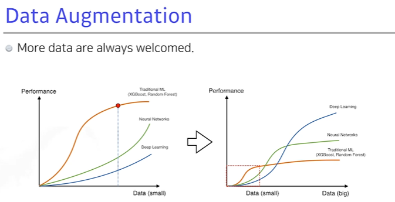

- 어떤 식으로든 데이터셋을 지지고 볶아서 늘리는 것.
- 강아지 분류를 한다고 했을 때, 90도 돌려보기도 하고 조금 찌그러뜨려보기도 하며 변형시켜 보는 것 (단, 주의할 사항은 해당 데이터의 라벨이 바뀌지 않는 한에서)
  - 주의해야할 사항에 대해 예시를 들어보면, MNIST 데이터에서 6을 9로 뒤집는다면? => 데이터가 의미하는 바가, 라벨링 자체가 변할 것이다.

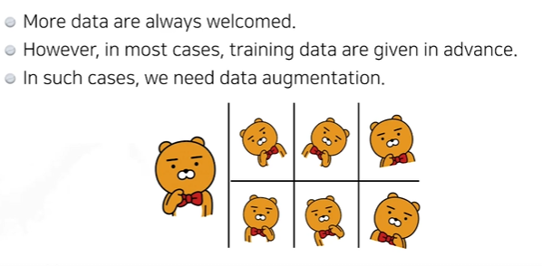

### 4.4 Noise Robustness

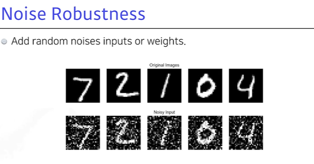

- Input에 Noise를 추가해준다는 부분에서 Data Augmentation과 비슷해 보이지만, 굳이 다른 점을 찾자면 얘는 동시에 Weight에도 Noise를 줘본다는 것임.
- 이렇게 Weight에도 Input에도 Noise를 넣어서 학습하게 되면, Test 단계에서도 잘 될 수 있다는 생각.

### 4.5 Label Smoothing

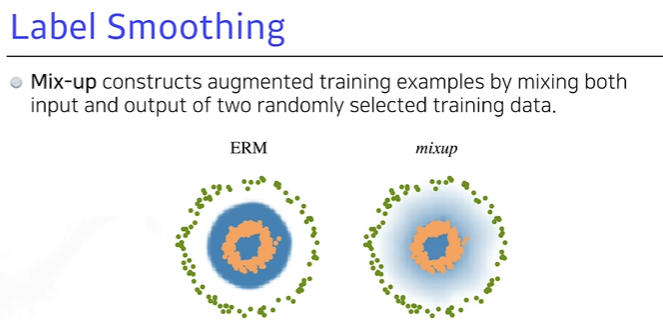

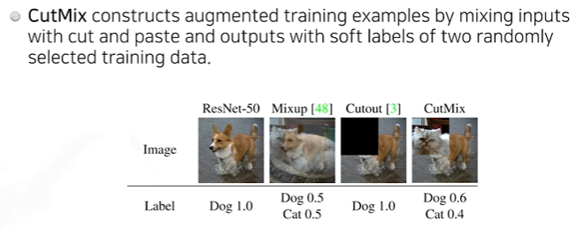

- 맨 왼쪽의 강아지 그림이 1.0 라벨을 가지고 있었는데, 여기서 강아지와 고양이를 0.5씩 섞어보는 것임. (Mix-up)
- 세번째 그림은 일정 영역을 빼버리는 것이다.(CutOut)
- 네번째 그림은 섞어주는 것은 비슷하지만, Blending하게 섞어주는 것이 아니라 아예 잘라서 위에 갖다붙여버리는 식으로! (CutMix)
  - 이것 역시도 Data Augmentation과 비슷해보이지만, Data Augmentation은 데이터 한개에 대해서 조작을 한 것이었다.
  - 지금 방법론은 학습 단계에서 두 개의 데이터를 뽑아서 그들을 서로 섞어주는 것이다.
  - 예를 들어서 분류 문제를 우리가 해결해야 한다고 했을 때, 이들의 Decision Boundary를 찾는 것이 목적인데 데이터들을 서로 섞어주고 학습하는 과정을 거침으로써 Decision Boundary를 더욱 Smooth하게 만들어줄 수 있다는 장점이 있는 것이다.

> 성능을 많이 올릴 수 있는 방법론이다.

### 4.6 Drop Out

- 랜덤하게 일부 뉴런의 가중치를 0으로 맞춰주는 것.

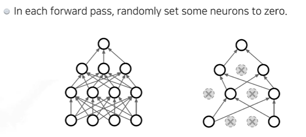

### 4.7 Batch Normalization

- 내가 BN을 어느 layer에 적용시킨다고 한다면, 이것은 그 layer의 Statistics를 정규화시키는 것.

- 이렇게 해서 얻는 효과? 만약 "뉴럴넷의 각각의 레이어가 1000개의 파라미터를 가진 layer다"라고 하면 이 1000개의 각각 파라미터들의 statistics가 means와 univariance(?)를 가지게 만들어 주는 것이다.

  - internal covariate shift를 줄일 수 있다 (covariate ==feature)
  - Covariate Shift : 이전 레이어의 파라미터 변화로 인하여 현재 레이어의 입력 분포가 바뀌는 현상
  - Internal Covariate Shift : 레이어를 통과할 때마다 Covariate Shift가 일어나면서 입력의 분포가 약간씩 변하는 현상 (네트워크의 각 레이어나 Activation마다 입력값의 분산이 달라지는 현상)

  - 아래와 같이 학습 과정에서 층 별로 입력의 데이터 분포가 달라지는 현상이 생기는 것이다.

  

  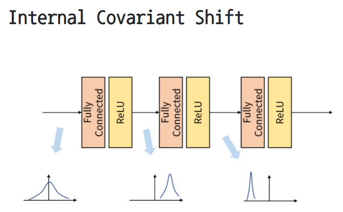

> 테스트 셋에서는 배치정규화를 어떻게 적용하지?
>
> - 트레이닝 단계에서 배치 단위의 평균/분산을 저장해놓고, 이렇게 고정된 값을 이용하여 테스트시 배치정규화에 있어서 사용합니다.
>
> - 이 때 사용하는 고정된 평균과 분산은 학습과정에서 이동평균 or 지수평균을 토하여 계산한 값입니다.
>
> - 더 자세히 알아보고 싶다면, 
>
> `참고 : https://gaussian37.github.io/dl-concept-batchnorm/#internal-covariant-shift-1`

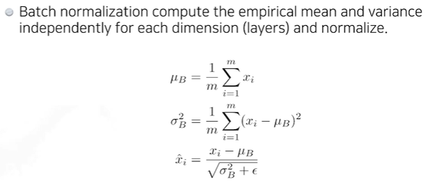

>  ++ 이외에 다음과 같은 정규화 방법론도 있다.
>
> - Layer Norm : 각각의 Layer 정보를 줄이는
>
> - Instance Norm : 인스턴스 하나당 (이미지 한장 별로 Statics를 정규화시키는)
> - Group Norm : Layer Norm과 Instance Norm의 중간 정도
> - 이런 다른 방법론들 (Layer Norm, Instance Norm)을 활용해보면 어떤 경우에서는 성능이 더 좋아지기도 함.

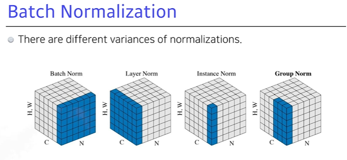