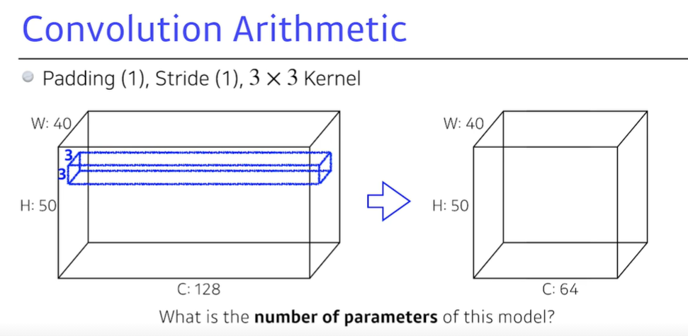
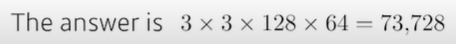
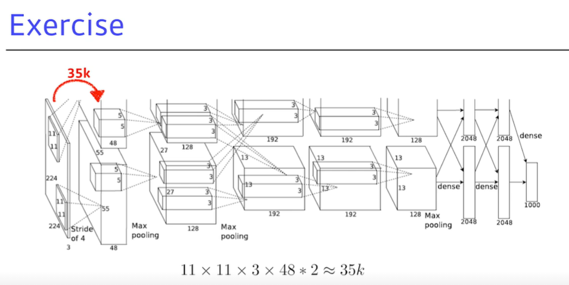
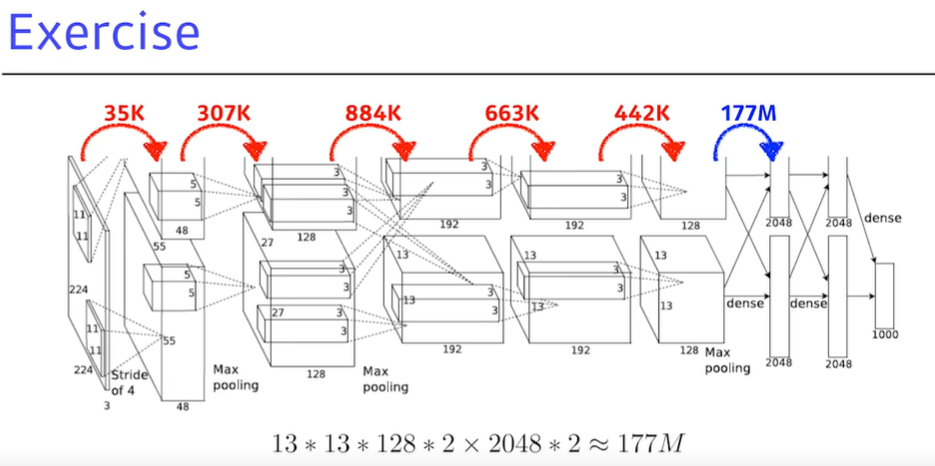
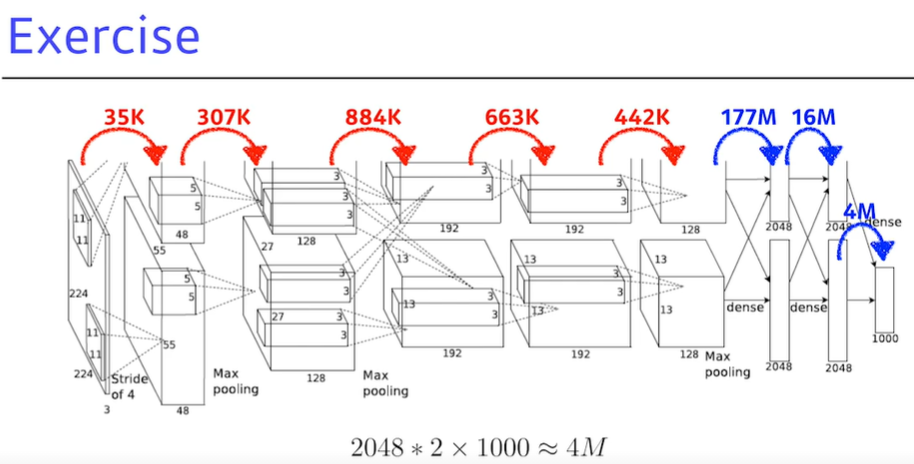
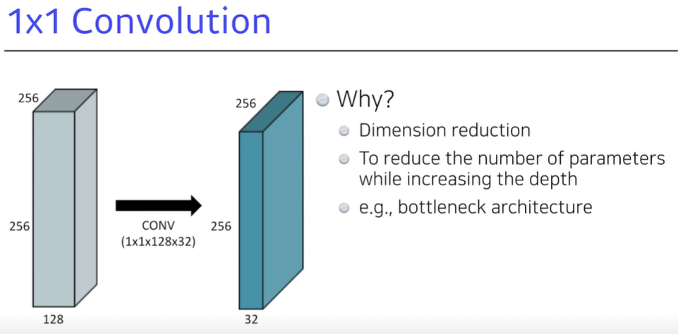

Stride=1, padding=1, kernelsize=3 이라면

커널을 통과해도 입력 디멘젼의 크기 그대로 가져감.

Stride=1일 때

Kernel 사이즈가 5라면

패딩사이즈가 2여야 입력디멘젼이랑 그대로가 된다?

=> ㅇㅇ 패딩사이즈가 1 늘어날 때마다 입력차원이 2 늘어나거든

=> 그렇다면 짝수 디멘젼이 input일 때는?

input 디멘젼 : I_d

kernel 사이즈 : K

stride : S

패딩사이즈 : P

Output 디멘젼 : O_d

계산방법 : I_d - (K-1) - (S-1) + (2*P) = O_d

=> I_d - K  - S + 2P + 2 = O_d

> 이를 통해, Input과 Output 디멘젼을 생각하며 커널 사이즈, 패딩, 스트라이드를 몇으로 해야할지 생각해볼 수 있다.

- 파라미터 개수 계산 공식 : (커널 사이즈) 3X3X128 X 64(Output채널이 64니까 커널도 64개의 채널==Output의 채널 디멘젼) * 

> 다음 AlexNet의 파라미터 개수를 구해보자.

> Dense Layer에서 모수의 개수 구할 때 주의!
>
> - 너무 많은 개수의 모수를 최적화시켜야 한다.
> - fully-connected layer라서 이런 거임. 모수의 개수를 줄이는게 네트워크를 좋게 만들 수 있는 것이기 때문에,
> - 일반적인 요즘 트렌드는 앞단의 컨벌루션 레이어에서 많이 쌓고, 마지막 단의 DenseLayer를 최대한 줄임.
> - 여기서 나온 생각이 1X1 Convolution 

- ResNet 뿐만 아니라 DenseNet 등 다양한 딥러닝 모델에 이용됨.