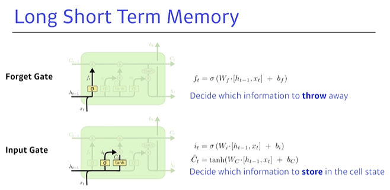
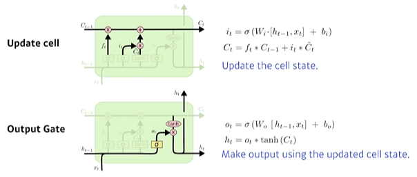

>  pytorch에서 batch_first=True 또는 False를 쓸 때 다른점


RNN에 feed할 때 input의 차원은 `[Seq_len, Batch_size, Hidden_size]`가 된다. 만일 `batch_first=True`라면, `[Batch_size, Seq_len, Hidden_size]` 형태로 feed하면 된다. 또 다른 input인 `hidden`의 경우, `[num_layers * num_directions, batch, hidden_size]`이 된다. 이는 `batch_first=True` 유무와 무관하다. 이는 초기 hidden state $h_0$를 의미한다.

또 모델을 만들면서 중요한 것은 batch_first를 True로 해줘야 한다는 것입니다. 그렇지 않으면 time-step(=sequence_length), batch_size, input_vector 의 형태가 됩니다.







```
여기서 LSTM은 Sigmoid와 tanh를 활성화함수로서 같이 쓰고 있는 구조이다.
왜 Relu를 안쓰고 이 둘을 쓰는 걸까? 그리고, 왜 둘 중 하나만 쓰지않고 둘다 쓰는 걸까?
내가 정확한 정답을 알고 있진 않지만, 나의 생각을 짧게 정리해보자면,
먼저 Relu를 쓰지 않는 이유는 exploding Gradient Problem 때문인 것 같다.

- Relu를 쓰게 되면 Gradient Update 연산과정에서 1이 넘는 값이 나오게 되면 Recurrent 구조의 특성상 굉장히 큰 값으로 도달하고 수렴되지 못하는 문제가 때문이다.
- 그리고, Sigmoid와 tanh를 둘다 쓰는 이유는 그 mapping space에 있다고 생각한다. 이 둘은 각각 (0,1)과 (-1,1)의 출력값 범위를 가지는데 Sigmoid가 0~1 사이에서 들어오는 값의 중요도를 조절하는 값이라면, tanh가 input을 받고 출력하는 값은 -1~1 사이의 값이므로 방향을 나타내는 값의 의미를 가질 수가 있는 것이다.
따라서 이 둘을 적절히 섞어서 사용하는 것이 LSTM의 디자인 아이디어가 아니었을까 생각한다.

위 수식에서 주의할 점
· : 행렬의 곱연산인것 같음. (그냥 상수곱인지 헷갈림.. 근데 [h{t-1},x{t}] 이 Notation이 행렬인듯)
* : element-wise 곱 (벡터의 내적처럼 같은 index의 원소끼리 곱해주는 연산)
```


> **Update Cell**

- 결국 LSTM의 Key point는, t번째 시점에서 **Update Cell 하는 Cell state 부분**이다.
- 여기서 **Cell state** 라는 건 <u>이전의 모든 t-1까지의 정보를 모아온 Cell state{t-1}</u> 를 얼마나 중간에서 필터링할지(가중치를 얼마나 조절할지) 컨베이어벨트이고, 그런 의미려면 이것이 <u>0~1 사이의 값</u>(0이면 이전 정보 다버림, 1이면 다 가져감)을 가지게 해줘야 하잖아?
  - 이 C{t-1}을 조절해주는 0~1 사이의 값 f{t}를 어떻게 도출해낼거냐?
  - => 이전의 h{t-1}과 이번 인풋 x{t}으로부터 결정해내는 구조다. (Forget Gate로부터 f{t}가 나오게 된다.)
    - 사실 <span style="color:red">이 Forget Gate 내부의 부분이 명확히 이해되진 않는다.</span>
    - => 내가 이해한 대로 설명하자면, 이전 h{t-1}과 이번 인풋 x{t} 둘을 Concatenate하면 t개 시점의 정보를 가지고 있는 t차원의 행렬이 나오잖아?
    - 시그모이드 함수를 통과하면서 그것들 중 어느 시점의 정보가 중요한지 안 중요한지를 각 0~t시점까지 각각의 비중을 정할 수 있게 되니까 의미가 있는 것 아닐까?
- 결과적으로 계산식을 보면, 시그모이드에 h{t-1}과 x{t}를 concatenate해서 (0~1사이의 값을 갖는)sigmoid 함수에 넣어주는 거지. 그럼 0~1 사이의 값이랑 C{t-1}이 곱해지며 이전 값들 C{t-1}의 가중치(중요도)를 고려할 수 있게 됨.
- 이렇게 구한 C{t}값이 바로 또 다시 이떄까지 t시점까지의 summary가 되고, 다음 cell update 때 활용하게 됨.
- 지금시점 t까지의 정보를 모아 저장하고 있는 C{t}와 이것의 중요도의 조절을 해주는 Cell state 덕분에 Long term 정보여도 (이전 정보가 소실되지 않고 최근 것만 강조되지 않고) 효과적으로 중요한 부분을 가지고 학습할 수 있게 되는 것이다. 


> **Input Gate**

- Input gate에서는 Sigmoid 함수를 통해 나온 {tilde}C{t} 값은 범위가 (0~1 사이값) 이와 같으므로 그 강도(중요도)를 나타내고,
- **tanh**를 통해 나온 i{t}값은 범위가 (-1~1) 이와 같으므로 **중요도의 방향성**을 나타낸다고 이해하였다.


> **OutputState**

- OutputGate에서 취합된 Cell state를 또 한번 건드려 조작한다.

- (사실 GRU에서는 이 단계가 빠져있고 구해놓은 C{t} 값을 그대로 아웃풋으로 사용한다.)

- 결국 어떤 값을 내보낼지 h{t-1}과 x{t}로부터 outputgate에서 살펴보고 시그모이드를 씌운 다음 이 값을 통해 C{t}를 한번더 조정한다.

- 마치 i{t}를 구하던 Input Gate와 Cell State의 방법을 마지막에 한번더 C{t}에 적용하는 그림이다.

  - 사실, 여기서 이 OutputState과정 (C{t}를 굳이 한번더 업데이트하는 과정) 이 과연 필요한가? 라는 의문이 들어 빼버린 것이 GRU(Gated Recurrent Unit) 인 것이다.
  - 계산해야할 파라미터를 빼버리며 수를 줄이고 그 구조와 기능은 그대로 가져가고 있기 때문인 것인지, GRU가 LSTM보다 성능이 더 좋은 경우가 좀 있다고 한다.

  


- 궁금한 점 : f{t}의 값 계산과정에서 0~1 사이로 해야 하는데 bias값까지 고려해서 0~1 사이로 계산되는 걸까? 아니면 시그모이드 함수값만 0~1 사이일까?

$$
T번째 시점에서 계산되는 항 :f_t, i_t, \tilde{C_t}, C_t, o_t,\ h_t(최종값)  \\ 
where\ \  \sigma \ \ is\ \  sigmoid \\
i_t\ = \ \sigma(W_i\cdot[h_{t-1},x_t]+b_i) \\
$$

