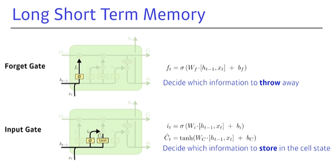
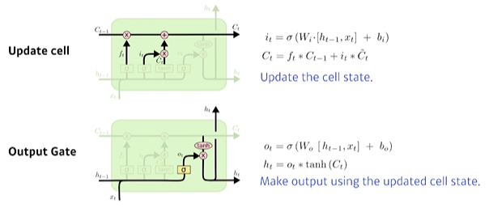
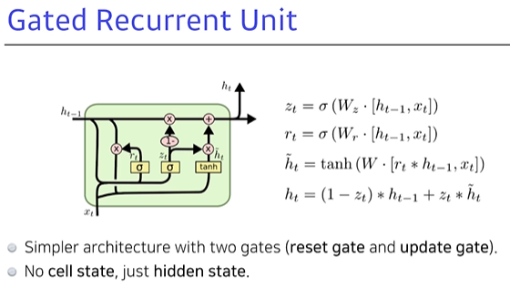
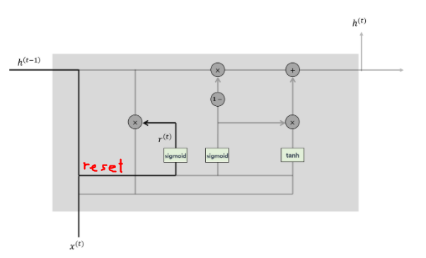

# LSTM

- LSTM은 Long-Term 정보에 있어서 약점이 있는 RNN을 보완한 모델입니다.
- LSTM은 C_t라는 t시점까지의 Summary term을 두고, 3가지의 Gate를 추가해줌으로써 Long-Term 문제를 해결해주었다.
- RNN의 한계점은 Gradient Vanishing 문제인데, 지금보다 훨씬 전의 정보는 무수히 많이 Recurrent 되면서 거의 무시된다는 것이다.
- LSTM은 C{t}라는 정보 축적 term을 따로 만들고, 이전의 정보더라도 다양한 Gate를 통해 중요한 부분과 안 중요한 부분을 중요도를 고려하면서 정보를 계속 가지고 갈 수 있다는 점이 이를 해결한 것이다. 그림으로 이해해보자.







```
여기서 LSTM은 Sigmoid와 tanh를 활성화함수로서 같이 쓰고 있는 구조이다.
왜 Relu를 안쓰고 이 둘을 쓰는 걸까? 그리고, 왜 둘 중 하나만 쓰지않고 둘다 쓰는 걸까?
내가 정확한 정답을 알고 있진 않지만, 나의 생각을 짧게 정리해보자면,
먼저 Relu를 쓰지 않는 이유는 exploding Gradient Problem 때문인 것 같다.

- Relu를 쓰게 되면 Gradient Update 연산과정에서 1이 넘는 값이 나오게 되면 Recurrent 구조의 특성상 굉장히 큰 값으로 도달하고 수렴되지 못하는 문제가 때문이다.
- 그리고, Sigmoid와 tanh를 둘다 쓰는 이유는 그 mapping space에 있다고 생각한다. 이 둘은 각각 (0,1)과 (-1,1)의 출력값 범위를 가지는데 Sigmoid가 0~1 사이에서 들어오는 값의 중요도를 조절하는 값이라면, tanh가 input을 받고 출력하는 값은 -1~1 사이의 값이므로 방향을 나타내는 값의 의미를 가질 수가 있는 것이다.
따라서 이 둘을 적절히 섞어서 사용하는 것이 LSTM의 디자인 아이디어가 아니었을까 생각한다.

위 수식에서 주의할 점
· : 행렬의 곱연산인것 같음.
* : element-wise 곱 (벡터의 내적처럼 같은 index의 원소끼리 곱해주는 연산)
```


> **Update Cell**

- 결국 LSTM의 Key point는, t번째 시점에서 **Update Cell 하는 Cell state 부분**이다.
- 여기서 **Cell state** 라는 건 <u>이전의 모든 t-1까지의 정보를 모아온 Cell state{t-1}</u> 를 얼마나 중간에서 필터링할지(가중치를 얼마나 조절할지) 컨베이어벨트이고, 그런 의미려면 이것이 <u>0~1 사이의 값</u>(0이면 이전 정보 다버림, 1이면 다 가져감)을 가지게 해줘야 하잖아?
  - 이 C{t-1}을 조절해주는 0~1 사이의 값 f{t}를 어떻게 도출해낼거냐?
  - => 이전의 h{t-1}과 이번 인풋 x{t}으로부터 결정해내는 구조다. (Forget Gate로부터 f{t}가 나오게 된다.)
    
    - 여기서 Input x{t}는 sequence data이므로 보통 어떠한 벡터이다.(One-hot vector는 아니고 어느정도 임베딩으로 reduction된 벡터일 것이다.)
    - 그러므로 보통 [h{t-1}, x{t}]는 t시점까지의 정보를 모두 축적하고 있는 행렬이다.
    - 그러니까 이전 h{t-1}과 이번 인풋 x{t} 둘을 Concatenate해서 t개 시점의 정보를 가지고 있는 t차원의 행렬이 나온 거잖아?
    - W라는 가중치 함수가 계속 역전파를 통해 업데이트될 것이고 이 행렬이 어느 시점의 정보가 중요한지 0~t시점 중 골라서 각각의 비중을 정할 수 있게 되니까 의미가 있는 것이다.
    - 시그모이드 함수는 활성화함수로서 0에서 1사이의 값을 가지므로 중요도를 판단하는 함수라는 것에 그 의미가 배가 될 수 있다.
    - 결국, 이때까지 축적해온 Summary 0~t시점들 중 어느 시점의 정보가 중요한지 안 중요한지를 0~t시점들에게 각각의 비중을 정할 수 있게 되니까 의미가 있는 것 아닐까?
    
  
- 결과적으로 계산식을 보면, 시그모이드에 h{t-1}과 x{t}를 concatenate해서 (0~1사이의 값을 갖는)sigmoid 함수에 넣어주는 거지. 그럼 0~1 사이의 값이랑 C{t-1}이 곱해지며 이전 값들 C{t-1}의 가중치(중요도)를 고려할 수 있게 됨.
- 이렇게 구한 C{t}값이 바로 또 다시 이떄까지 t시점까지의 summary가 되고, 다음 cell update 때 활용하게 됨.
- 지금시점 t까지의 정보를 모아 저장하고 있는 C{t}와 이것의 중요도의 조절을 해주는 Cell state 덕분에 Long term 정보여도 (이전 정보가 소실되지 않고 최근 것만 강조되지 않고) 효과적으로 중요한 부분을 가지고 학습할 수 있게 되는 것이다. 


> **Input Gate**

- Input gate에서는 Sigmoid 함수를 통해 나온 {tilde}C{t} 값은 범위가 (0~1 사이값) 이와 같으므로 그 강도(중요도)를 나타내고,
- **tanh**를 통해 나온 i{t}값은 범위가 (-1~1) 이와 같으므로 **중요도의 방향성**을 나타낸다고 이해하였다.


> **OutputState**

- OutputGate에서 취합된 Cell state를 또 한번 건드려 조작한다.

- (사실 GRU에서는 이 단계가 빠져있고 구해놓은 C{t} 값을 그대로 아웃풋으로 사용한다.)

- 결국 어떤 값을 내보낼지 h{t-1}과 x{t}로부터 outputgate에서 살펴보고 시그모이드를 씌운 다음 이 값을 통해 C{t}를 한번더 조정한다.

- 마치 i{t}를 구하던 Input Gate와 Cell State의 방법을 마지막에 한번더 C{t}에 적용하는 그림이다.

  - 사실, 여기서 이 OutputState과정 (C{t}를 굳이 한번더 업데이트하는 과정) 이 과연 필요한가? 라는 의문이 들어 빼버린 것이 GRU(Gated Recurrent Unit) 인 것이다.
  - 계산해야할 파라미터를 빼버리며 수를 줄이고 그 구조와 기능은 그대로 가져가고 있기 때문인 것인지, GRU가 LSTM보다 성능이 더 좋은 경우가 좀 있다고 한다.

  


$$
T번째 시점에서 계산되는 항 :f_t, i_t, \tilde{C_t}, C_t, o_t,\ h_t(최종값)  \\ 
where\ \  \sigma \ \ is\ \  sigmoid \\
i_t\ = \ \sigma(W_i\cdot[h_{t-1},x_t]+b_i) \\
$$


>  **번외) pytorch에서 batch_first=True 와 False 차이점**

- RNN 모델에 입력될 때에 있어서 input의 차원은`[Seq_len, Batch_size, Hidden_size]`입니다. (default, batch_first=False일때)

- Batch_Size=True라면, `[Batch_size, Seq_len, Hidden_size]`와 같이 바뀌게 된다. 이를 통해 맨 앞 index로부터 배치사이즈를 알 수 있고, (Training시 )코드를 작성할 때 편하게 된다.

- <span style="color:blue">예외 : 또다른 input인 <u>hidden은 batch_first옵션과 무관</u>하다, 원래대로 `[num_layers * num_directions, batch, hidden_size]` 이렇게 들어옴.</span>


<span style="color:red">-  궁금한 점 : ForgetGate의 f{t}의 값 계산과정에서 0~1 사이로 해야 하는데 bias값까지 고려해서 0~1 사이로 계산되는 걸까? 아니면 시그모이드 함수값만 0~1 사이일까?</span>


# GRU

- 위에서도 언급했듯, LSTM에서 OutputState과정 (C{t}를 굳이 한번더 업데이트하는 과정) 이 과연 필요한가? 라는 의문에서 그 과정을 제거해 GRU(Gated Recurrent Unit) 가 탄생(얘도 RNN 기반).
- 계산해야할 파라미터를 빼버리며 수를 줄이고 그 구조와 기능은 그대로 가져가고 있기 때문인 것인지, GRU가 LSTM보다 성능이 더 좋은 경우가 좀 있다고 한다.
- LSTM과 비교하자면 LSTM에서 Cell state의 C{t}값이 GRU에서는 Output Gate를 거치지 않고 바로 출력된다는 것이 다른 점이다.




> 결국, Gate는 2개 (Reset gate와 UpdateGate)
>
> - Update Gate가 Forget Gate와 Input Gate의 역할들을 혼자 대신하고 있는 형태.
> - OutputGate와 Cell State가 합쳐져 hidden State가 된 꼴이다. (결국 hiddenState에서 Output이 바로 나온다는 뜻이다.)
>   - 첫번째 수식이 Update Gate, 두번째 수식이 Reset Gate를 나타낸다.


- Update Gate의 연산

$$
z_t=\sigma(W_z)\cdot[h_{t-1},x_t]
$$


> Reset Gate 그림참고

- Reset Gate의 연산

$$
r_t=\sigma(W_r)\cdot[h_{t-1},x_t]
$$



