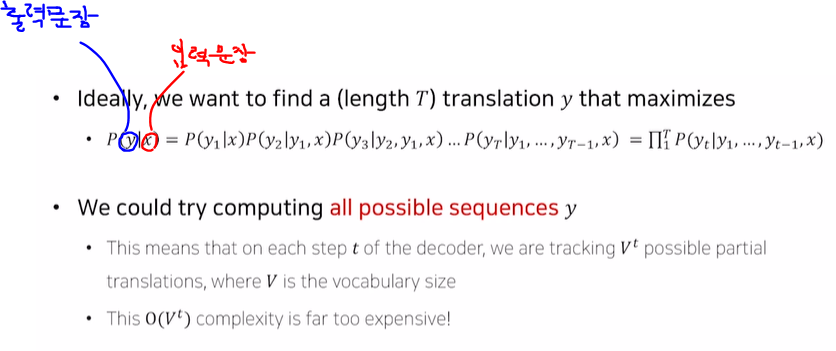
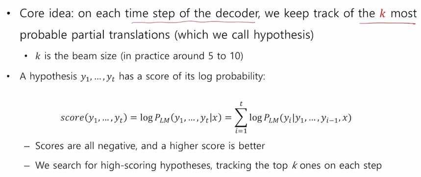
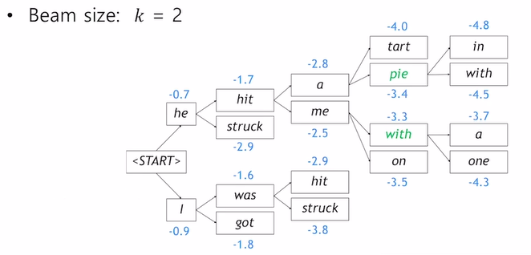
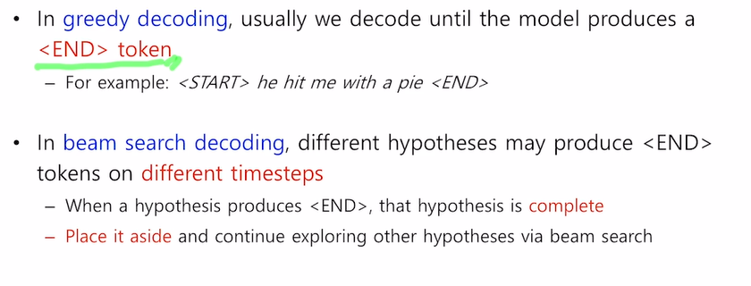
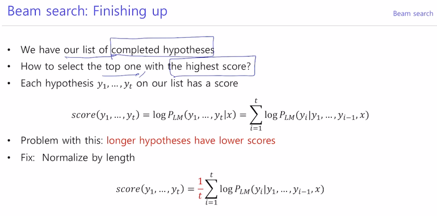
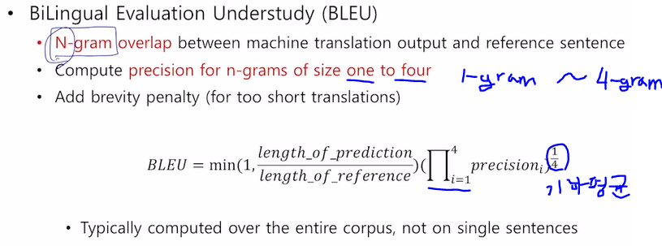
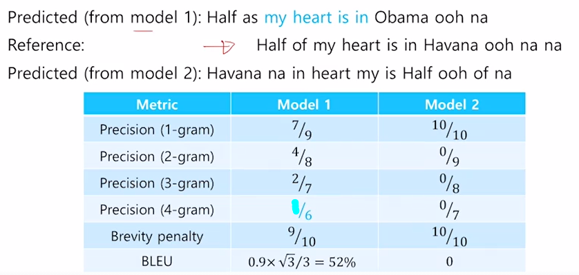
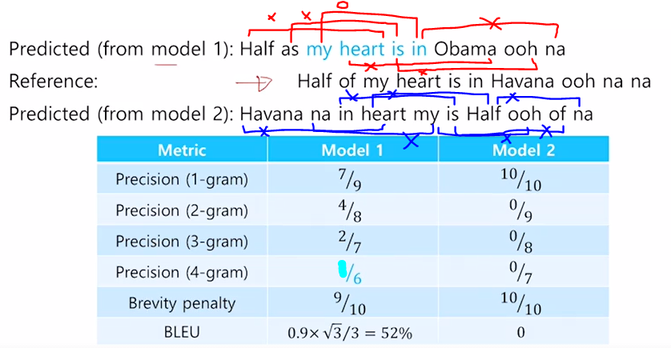

# 1. BeamSearch

BeamSearch는 문장을 Decoding 하는데 있어서 가장 대표적으로 사용되는 알고리즘입니다.


## 1.1 Introduction

Beam Search 방법을 알아보기에 앞서 이전에는 다음과 같은 방법론들이 있었습니다.


### 1.1.1 Greedy Decoding

- 먼저, 디코딩시 단순히 해당 time-step에서 가장 높은 확률값을 가지는 단어를 Generating하는 Greedy Decoding이라는 방법이 있습니다.
  - 다음 예시를 보면 `he hit` 까지는 잘 맞췄지만 `he hit a`의 a 부분에서 잘못 예측하을 하였다. 하지만 Greedy Decoding은 뒤로 돌아가거나 이를 무르지 못하는 방법론이다.
  - 이와 같은 방법론은 이전 time-step의 단어가 예측이 잘못된 경우, 굉장히 엉뚱하고 잘못된 예측을 하게 되므로 수정이 필요하다.


### 1.1.2 Exhaustive Search

- 위의 Greedy Decoding과는 반대된다고 볼 수 있는 Exhaustive Search라는 방법도 존재한다.
- 아래의 예시에서 `y`는 출력문장, `x`는 입력문장
  - `y1`은 출력할 문장 중 예측한 첫번째 단어이다.
  - `y2`는 출력할 문장 중 두번째 단어이므로 앞서 예측한 첫번째 단어`y1`과 입력문장 `x`이 주어졌을 때를 고려하여 구하게 된다.
  - 이와 같이 동시사건확률을 나타내는 joint Probabiliy를 고려하여 구할 수 있을 것이다.
  - 결국 가장 높은 확률을 가지는 P(y|x)를 구하는 것을 목표로 하게 된다.




- 결국 Exhaustive Search라는 관점에서 문장생성을 하게 된다면 문장을 여러가지 다 만들어놓고 이들 중 가장 높은 확률의 문장을 선택하게 된다.
  -  y1까지의 단어는 매우 큰 확률값이 되도록 예측해놓아도 뒤에서 노력하여 만들어낸 y2, .. yT 에 대한 확률값까지 고려하면 전체 joint 확률값이 상대적으로 작을 수 있게 된다.
  - 따라서 하나하나 각 문장들의 joint 확률을 다 비교하여 선택해야 하게 된다. (기하급수적으로 계산해봐야 할 경우의 수가 늘어날 수 있음..)


> 즉, 이러한 Exhaustive Search 방법으로 문장을 generate할 때 확률값에 기반한 무수히 많은 경우의 수가 존재하는데, 이들을 모두 고려하는 것은 비효율적입니다.(Vocab Size만큼에 비례하여 늘어나는 경우의 수...)
>
> 또한 너무 작은 확률값을 고려하게 되므로 문장의 quality가 떨어질 수 있다. 
>
> 그렇다고 해당 time-step에서 가장 높은 확률값만을 고려하는 Greedy Decoding방법 역시 모델이 단순한 generation을 하도록 하게 만드는 단점으로 작용할 수 있습니다.


- 이러한 문제들의 대안으로 제안된 것이 Beam Search입니다.


## 1.2 Beam Search

Beam Search는 위의 Greedy Decoding 방법과 Exhaustive Search 방법의 중간 정도의 개념이라고 볼 수 있습니다.

- 번역문제를 생각해보았을 때, 각 Time-step에서 단어를 Decoding할 때, k 개의 후보군들을 생각해놓습니다.

- 아래의 수식을 살펴보면, 위의 Exhaustive Search 방법과는 Log를 취해서 구해주었다는 점에서 그 차이가 있다.

  - 확률값의 곱이 아닌 합으로서 표현되는데 결국 이를 가장 높게 만든다는 점에서 동일하며, 확률값에 Log를 취해주었으므로 음의 값을 가지게 된다.

  

- 전역 최적의 솔루션을 가져다주진 않지만, Exhaustive Search 방법보다 훨씬 효율적이라는 것을 직관적으로 알 수 있습니다.





## 1.3 Example of Beam Search

Beam Size가 2인 경우를 생각해보자. (k=2)


> Step1)
>
> -0.7을 가지는 `he`가 -0.9를 가지는 `I`보다 확률값(Score)이 크긴 함.
>
> k=2 개의 Hypotheses를 고려하게 됨.
>
> 


> Step2)
>
> 현재 k^2=4 개의 Hypotheses를 고려하게 되었지만 k=2로 정해두었으므로 2개만을 고르게 됨.
>
> 


>Step3)
>
>이번에도 4개의 Hypotheses를 고려하게 되었지만 Top2를 고르게 됨.
>
>


>  Step N)
>
> 다음과 같이 반복...
>
> 


## 1.4 Beam Search: Stopping criterion


> Greedy Decoding은 <END> token이 생성되었을 때 멈췄었는데, 그렇다면 Beam Search는 언제 Decoding을 멈추게 되는 걸까?




```
Beam Search는 동일하지 않게, 각기 다른 time-step에서 END token을 생성하는 여러가지의 가설들이 생기게 됩니다.
- 여러가지 가설을 진행하면서 어느 가설에서 END token이 생성되었다면, 해당 가설은 Generate를 중지한다. (해당 가설은 문장이 끝난 것으로 본다.)
- 여전히 진행중인 다른 가설들은 END token이 생성될 때까지 Generate를 각각 진행하게 된다.
```


``` 
T라는 사전에 지정한 종료 time-step에 도달했을 때 멈추거나,

사전에 지정해놓은 n이라는 값에 도달할만큼의 완료된 가설들이 쌓였을 때 Beam Search를 중지하게 됩니다.

```


> Beam serach Stopping 후, 마무리 작업은 어떻게 하게 되는가?



```
가장 점수(joint Probability)가 높은 가설의 문장을 골라야 한다.
- 하지만 위의 점수를 사용하게 되면 긴 문장일수록 점수 측면에서 불리하게 됩니다. (음의 값을 계속해서 더해나가는 구조이기 때문에..)
- 따라서 문장의 길이로 Normalize를 해주어 점수를 구해 비교해주면 됩니다. (각 Word에 대한 확률의 평균 값)
```


# 2. BLEU SCORE

번역 task에서 번역된 문장을 평가하는 대표적인 metric이다.

BLEU SCORE를 살펴보기 전 다른 Metric은 어떤 위험이 있는지 알아보자.


### 2.1 Introduction

아래와 같이 각 time-step마다 정답을 맞췄는지를 고려하는 Metric은 성능 평가에 있어 실수를 범하게 된다.


> 그렇다면, 모델의 성능을 평가하기 위한 Metric으로 Precision(정밀도) 과 Recall(재현율), F-measure 값을 생각해보자.
>
> - Precision 값은 예측결과가 생성되었을 때 우리가 실질적으로 느끼는 정확도.
>
>   - 우리가 구글검색을 했을 때 검색결과로 나온 결과들이 몇개나 겹치게 나타내고 있는지 느낄 수 있는 정확도
>
> - Recall 값은 내가 어떤 키워드를 가지고 검색을 했을 때, 이 입력 키워드들을 기반으로 얼마나 겹치게 검색결과를 냈는가를 나타내는 정확도.
>
> - F-measure 값은 Precision과 Recall 값의 조화평균으로부터 생성되는 정확도
>
>   


- 평균들 중 가장 작은 조화평균


> 그렇다면 이러한 정확도들을 사용해도 될까?
>
> - 다음과 같은 예시를 보면, Model2의 예측결과는 문법이 전혀 맞고 있지 않다 (문법적 어순 무시)
> - 그런데도 불구하고 100%라는 정확도 측정값을 도출해내는 실수를 범하였다.
>
> 
>
> 


## 2.2 BLEU SCORE

1-gram씩 살펴보는 것은 물론이고, N-gram 뭉텅이가 겹치는지까지 고려하여 측정하는 정확도




```
산술평균보다는 쫌 작은 값의 기하평균을 고려하였습니다.
- 조화평균은 왜 사용하지 않았을까?
- 조화평균은 작은 값에 너무 큰 가중치를 두게 되는 경향이 있기 때문에 사용되지 않았다고 함.

brevity penalty (짧은 문장에 대한 Penalty)
- min() 항이 Penalty를 나타내는데, 다음과 같은 원리이다.
- 만약 ref 길이가 10인데 prediction을 7만큼만 했다고 하자.
- 그렇다면 min(1, 0.7)로부터 0.7값을 해당 정확도(Score)값에 곱하여 패널티를 주게 되는 것이다.
- 만약 1보다 클 때(pred가 ref보다 길이가 크거나 같을때)에는 1로 유지되므로 정확도 값이 그대로 유지된다. (패널티 x)
- Recall값 없이 Precision 값만을 고려하기 때문에 Predict를 짧게 할수록 Score 상에서 유리하기 때문이다(길이가 짧아질수록 정확도값이 높아지는 경향)
```


> ※ 유의할 점 : 수식을 보면 알 수 있듯, BLEU SCORE를 계산할 시에는 precision 값만을 고려합니다 (Recall 값은 전혀 고려하지 않는다)
>
> - 가령 `I love this movie very much`라는 G.T 문장이 있을 때, `나는 이 영화를 많이 사랑한다`라고 Decoding 해냈을 때를 생각해보자.
> - 이는 번역결과가 `very`에 해당하는 `정말`이라는 단어를 빠뜨렸음을 알 수 있지만, 이는 번역에 있어서 그다지 큰 오류를 나타내지 않습니다.
> - 따라서, Reference에 기반하여 정확도를 구하기보다(Recall보다)
> - Predict 결과만을 보고 실질적으로 느끼는 정확도를 나타내는 Precision을 고려하는 것이 일리가 있습니다.


>  ※ 유의할 점 : Recall 값 역할도 하는 brevity Penalty
>
> 이처럼 간단하게 계산되는 Brevity Penaly는 또한 Recall 값의 최대값으로서 역할을 할 수가 있다.
> 1) 예를 들어, ref 길이도 10이고 pred 길이도 10인 경우에 10개의 단어가 모두 매칭되었다고 생각해보자. (recall의 최대값=10/10=1)
>
> - 그러면 penalty 항 역시 1이고 recall 값으로서 나올 수 있는 최대값임.
>
> 2) 두번째 예로서 ref 길이가 11, pred가 10일 때 10개의 단어가 모두 매칭되었다고 생각하면 (recall의 최대값)=10/11)
>
> - penalty 항은 min(1,10/11)=10/11이고 역시 이 상황에서 나올 수 있는 recall의 최대값임.
>
> 2) 세번째 예로서 ref 길이가 9, pred가 10일 때 9개의 단어가 모두 매칭되었다고 생각하면 (recall의 최대값=9/9=1)
>
> - penalty 항은 min(1,10/9)=1이고 이 상황에서 나올 수 있는 recall의 최대값과 일치함.
>
> 이처럼, Penalty값은 Recall 값의 역할도 어느 정도 하고 있음을 직관적으로 알 수 있다.


## 2.3 BLEU SCORE 예시


#### N-gram

- n-gram 각각에 대해 Score를 계산해보면 다음과 같이 나옵니다.




#### 4-gram

예시로 4-gram을 직접 다음과 같이 구해보았습니다. (Model1 = 1/6), (Model2 = 0)



> 결국,
>
> Model1의 BLEU SCORE값은 0.52
>
> Model2의 BLEU SCORE는 0으로 구해졌습니다.