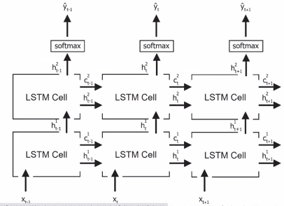

# 0302 피어세션 정리

## 면접 연습 질문과 답변

1. Transformer의 구조를 attention을 기반으로 설명해주세요. ( Attention 3개를 생각하며 설명해보기 )

   - 기존의 Seq2Seq 모델과는 달리 데이터를 Sequential 하게 입력받아 Attention Score를 도출하지 않고, 전체를 input으로서 받아 Attention Score를 구하는 과정을 거치게 된다.
   - 이를 통해 Long-term Dependancy 문제를 해결할 수 있다. 전체 input으로부터 query key value vector를 각각 구성한 다음 이들에 대한 가중치를 따로 업데이트해줄 수 있게 하는 메커니즘을 사용한다. (즉, query key value 벡터가 동일한 출처로부터 나온다는 뜻이다.)
     - 이렇게 동일한 출처로부터 나온 벡터들로부터 Attention 메커니즘이 수행되기 때문에 이를 Self-Attention이라고 부른다.
   - Encoder에서 이루어지는 self-attention (동일한 출처에서의 query, key, value vector를 활용하여 Attention Distribution을 구하는 구조)
   - Decoder에서 이루어지는 Masked Self attention
   - Decoder에서 이루어지는 Multi-head attention (query는 Decoder에서 입력받고 나머지 key와 value는 Encoder로부터 나온 값을 입력으로 받는다.)

   

   > 참고  : https://wikidocs.net/31379

2. 딥러닝 가중치 초기값이 0이라면 어떤 문제가 생길까요?

   - 순전파시 입력층의 가중치가 0이니, 이것과 입력값을 곱하면, 모든 값이 0이 되어버립니다.
   - 이렇게되면 입력층의 값이 무의미해지고, 역전파시에도 모든 매개변수가 똑같이 갱신되어 버린다. 

   - 결국 역전파 시에 학습이 이루어지지 않는다.

> 참고 : Xaiver 가중치 초기화, He 가중치 초기화

3. 여러개의 LSTM 단을 여러 층으로 쌓을 수 있을까, 그렇다면 성능은 기존보다 더 좋을까?
- LSTM을 여러 층으로 쌓을 수 있다 (우리가 알고있는 MLP의 형태처럼) 
- => 이는 Stacked-LSTM이라고 부르는 구조이며, Long-term Dependancy가 별로 문제되지 않는 Task를 수행할 때 적용해볼 수 있고 이 경우 단층 LSTM보다 성능이 좋다고 알려져있다.

4. DataLoaer에서 num_workers는 어떤 역할을 하는 파라미터인가?

- 학습 도중 CPU의 작업을 몇 개의 코어를 사용해서 진행할지에 대한 설정 파라미터

5. 어느 설명변수(x)와 반응변수(y) 간의 상관계수가 0에 가까운 값이었지만, 모델 예측에 있어서 유의한 변수로 나타날 수 있습니다. 어떻게 이런 경우가 발생할까요?

- 상관계수로는 변수의 유의성을 판단할 수가 없다. 상관계수는 단지 x와 y 간에 얼마나 선형관계가 뚜렷한지를 나타내는 지표일 뿐이기 때문이다.
- 예를 들어, x와 y간의 산점도 분포가 이차함수에 가까운 형태를 띈다고 가정해보면 두 변수 사이의 상관계수는 매우 낮은 값이지만, 단순 polynomial regression 모델을 적합하게 되면 자료를 잘 설명할 수 있으며 x가 유의한 변수로서 기능할 수 있기 때문이다.

6. 경사하강법을 초중생에게 가르쳐야 한다면 뭐라고 설명하겠는가?

- 산에서 조난을 당했을 때 산의 맨 아래로 내려오고 싶은 상황이라고 가정해보자. 어느 방향으로 내려가야 할지를 생각해보면 무조건 내리막길로 내려가야 하고(하강법), 그 중에서도 가장 가파른 경사를 찾아 내려가야 하는데 이 때 사용할 수 있는 것이 미분값이다.  그리고 이 때 보폭의 크기를 learning rate라고 이해할 수 있다.
- 보폭의 크기를 너무 작게 설정하면 내려가는 속도가 매우 느리게 될 수 있고, 너무 크게 설정하면 맨 아래가 아닌 어떤 움푹 파인 곳으로 빠지게 될 위험이 있다.(local minima)

3. 여러개의 LSTM 단을 여러 층으로 쌓으면 좋을까?
   - Stacked-LSTM : 비디오 Data와 같이 Long-term Dependancy가 별로 문제되지 않는 부분은 

4. DataLoaer에서 num_workers는 어떤 역할을 하는 파라미터인가?
   - 학습 도중 CPU의 작업을 몇 개의 코어를 사용해서 진행할지에 대한 설정 파라미터

5. 어느 설명변수와 반응변수 간의 상관계수가 0에 가까운 값이었지만, 모델 예측에 있어서 유의한 변수로 나타날 수 있습니다. 어떻게 이런 경우가 발생할까요?

6. 경사하강법을 초중생에게 가르쳐야 한다면 뭐라고 설명하겠는가?

   - 산에서 조난을 당했을 때 산의 맨 아래로 내려오고 싶은 상황이라고 가정해보자.  어느 방향으로 내려가야 할지를 생각해보면 내리막길로 내려가야 하고, 그 중에서도 가장 가파른 경사를 찾아 내려가야 하는데 그때 사용할 수 있는 것이 미분값이다.  이 때 보폭의 크기를 learning rate라고 이해할 수 있다.

   

1.Transformer의 구조를 attention을 기반으로 설명해주세요. ( Attention 3번을 각각 설명해보기 )

2.딥러닝 가중치 초기값이 0이라면 어떤 문제가 생길까요?

3.LSTM 단을 여러 층으로 쌓을 수 있을까, 그리고 성능이 좋을까?

4.DataLoaer에서 num_workers는 어떤 역할을 하는 파라미터인가?

5.어느 설명변수와 반응변수 간의 상관계수가 0에 가까운 값이었지만, 모델 예측에 있어서 유의한 변수로 나타날 수 있습니다. 어떻게 이런 경우가 발생할까요?

6.경사하강법을 초중생에게 가르쳐야 한다면 뭐라고 설명하겠는가?