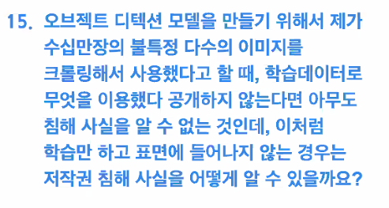

**질문1-1) local minima 해결방법?**

- GD -> SGD

- learning rate scheduler

- swa와 같은 앙상블

**질문1-2) local minima 문제에도 불구하고 딥러닝이 잘되는 이유?**

> 참고 : https://nittaku.tistory.com/271

**질문2) Optimizer의 종류 아는대로 말하고 비교해서 말해보기 (Adam을 왜 많이 쓰는지)**

>  참고 : http://shuuki4.github.io/deep%20learning/2016/05/20/Gradient-Descent-Algorithm-Overview.html

**질문3) Plateu Problem에 대해 아는지**

> 참고 : https://nittaku.tistory.com/271

**질문4) Transformer 구조에서 시점의 정보를 어떻게 반영하는지?**

- Positional Encoding을 활용한다
- 홀수와 짝수는 sin cos으로 구분하고,
- 동시에 인덱스에 따라 분모의 지수승을 취해 각기 다른값, 그리고 상한이 있는 크지 않은 값

> 참고 : https://skyjwoo.tistory.com/entry/positional-encoding%EC%9D%B4%EB%9E%80-%EB%AC%B4%EC%97%87%EC%9D%B8%EA%B0%80

1) 데이터에 0~1사이의 label을 붙인다. 0이 첫번째 단어, 1이 마지막 단어

   **→** ex) I love you: `I`는 0 /`love`는 0.5/ `you`는 1

   **→** Input의 총 크기를 알 수 없다. 따라서 delta 값이 일정한 의미를 갖지 않는다.(delta = 단어의 label 간 차이)

 

  2) 각 time-step마다 선형적으로 숫자를 할당하는 것이다.(총 크기에 따라 가변적, delta일정해짐) 따라서 첫번째 단어 는 1, 두 번째 단어는 2를 갖게 됨

   **→** ex) I love you: `I` 1/ `love` 2/ `you` 3

   **→** 숫자가 매우 커질 수 있고, 훈련 시 학습할 때보다 큰 값이 입력값으로 들어오게 될 때 문제 발생 모델의 일반화 가 어려워짐-특정한 범위 값을 갖는게 아니기에

> 문지형님 마스터세션 중:

https://www.kisa.or.kr/public/laws/laws2_View.jsp?cPage=1&mode=view&p_No=282&b_No=282&d_No=3&ST=T&SV=

> https://ai.googleblog.com/2020/12/privacy-considerations-in-large.html

> https://arxiv.org/pdf/2012.07805

