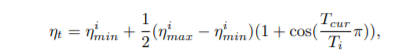
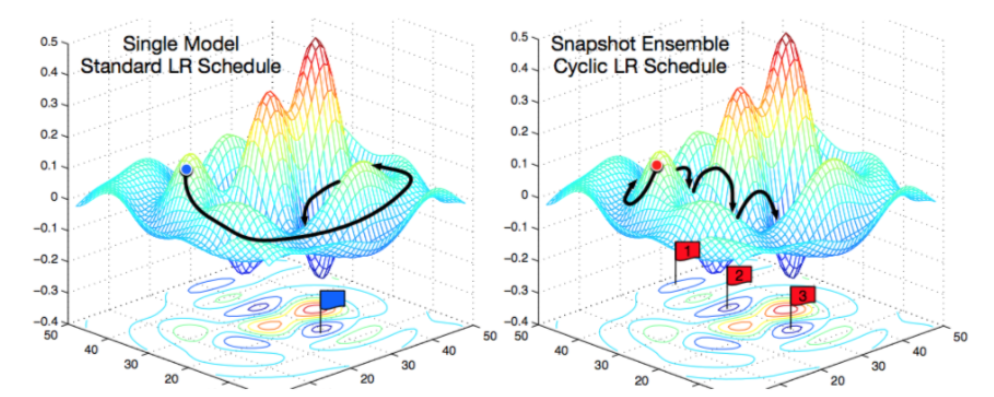
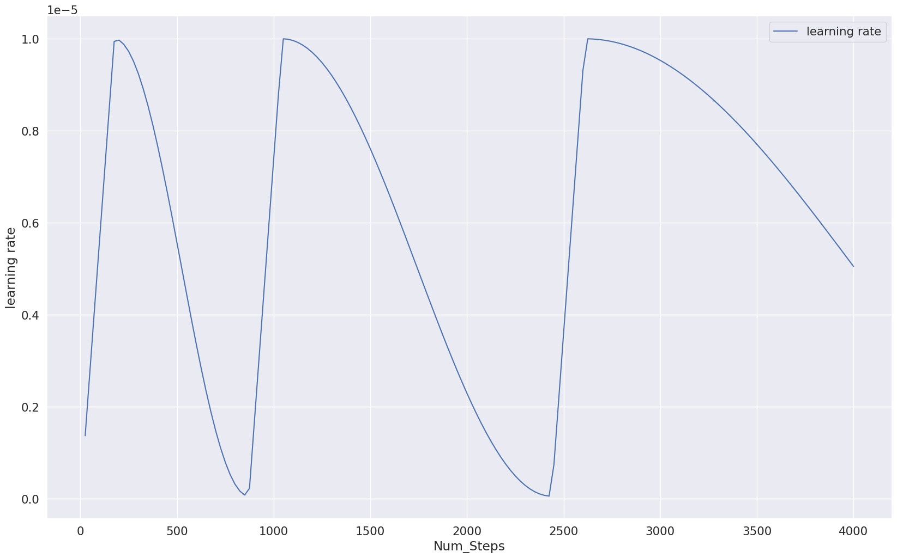

## 코사인 스케쥴러 커스텀

CustomizedCosineAnnealingWarmRestarts.py 모듈을 다운받고 import 하여 사용


- 다음 수식과 논문을 참고 (SGDR 관련)



> ref : https://arxiv.org/pdf/1608.03983.pdf


- cyclic한 scheduler에 기대하는 효과는 다음과 같습니다.




### 이번 Pstage2 KLUE 中 Trainer를 사용하면서도 적용해보았습니다.
- Transformer 기반 모델 Trainer 사용하여 학습하고 싶으시면 다음과 같이 추가하면 됩니다.
- optimizer와 scheduler를 튜플형태로 전달해주면 됩니다. (이외의 arguments는 설명 생략)

- pytorch 기반으로 모델 코드 작성시에는 그냥 본래 scheduler 객체에 Class를 생성하여 넣어주면 됩니다.


```python
from CustomizedCosineAnnealingWarmRestarts import CustomizedCosineAnnealingWarmRestarts
from torch.optim import Adam, SGD
optimizer = Adam(model.parameters(), lr=args.min_lr)
scheduler = CustomizedCosineAnnealingWarmRestarts(optimizer, T_0=50, T_mult=2, eta_max=0.1,  T_up=10, gamma=0.5)

trainer = Trainer(
  model=model,                         #  Transformers model to be trained
  args=training_args,                  # training arguments, defined above
  train_dataset=RE_train_dataset,         # training dataset
  eval_dataset=RE_val_dataset,             # evaluation dataset
  compute_metrics=compute_metrics,         # define metrics function
  optimizers=  (optimizer,scheduler), # optimizers: Tuple[torch.optim.Optimizer, torch.optim.lr_scheduler.LambdaLR]=(None, None))
  callbacks=  [early_stopping], # callbacks: Optional[List[TrainerCallback]]=None
)
```


하이퍼파라미터에 따른 lr 변화 플랏은 다음과 같다.

- gamma = 1,

- T_0 = 0.05 X total steps

- T_w = T_0 X 0.2

- max_lr = 1e-5

- min_lr = 1e-7

