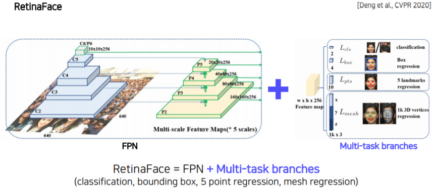

# Instance/Panoptic segmentation

## 1. Instance segmentation

 

Instance segmentation은 물체의 class뿐 아니라 물체 각가을 비교해낼 수 있습니다.

 

 

### 1.1 Mask R-CNN

Mask R-CNN은 R-CNN과 비슷한 구조를 가지고 있습니다.

Mask R-CNN에서는 RoIAlign이라는 pooling layer을 제안했습니다.

 

RoIAlign에서는 Interpolation (보간법)을 통해서 정교화된 subpixel (소수점 pixel level)의 pooling을 지원합니다. 이로써 정교화된 feature을 뽑을 수 있게되고, 성능 향상으로 이어졌습니다.

 

 

기존 Faster R-CNN에서는 pooling된 feature 위에 올라가있던 header가 두 개 (classification, regression) 있었습니다.

Mask R-CNN에서는 기존 header들 옆에 **Mask branch를 추가**해주었습니다.

 

Mask branch는 14 x 14로 upsampling을 하고 channel 수 256개로 줄였습니다. 이후, 80개 즉, class의 개수로 channel 수를 맞추게 됩니다. 각 80개의 class 별로 Binary classification(있는지 없는지)을 prediction하도록 합니다.

 

하나의 bounding box에 대해서 일괄적으로 모든 class에 대한 mask를 다 생성합니다. 그리고 classification head에서 "class가 어떤 곳에 모일 것이라는 prediction 결과"를 이용해서 어떤 mask를 참조할지 결정합니다. 이렇게 참조를 함으로써 mask 중 하나를 골라서 사용하게 되고, 최종적인 mask를 반환합니다.

 

따라서 Mask R-CNN 구조를 간단히 그려보면 다음과 같습니다.

 

 

### 1.2 YOLACT(You Only Look At CoefficienTs)

 

YOLACT는 Mask R-CNN과 다르게 Single stage 구조입니다.

YOLACT는 Real time으로 semantic segmentation이 가능한 single stage network입니다.

 

YOLACT는 Feature Pyramid 구조를 가지고 와서 사용합니다. 고해상도 feature map을 가지고 사용할 수 있습니다.

 

그리고 가장 큰 특징은 Mask의 **Prototype**을 추출해서 사용합니다. Prototype에서는 Mask는 아니지만 Mask를 합성해 낼 수 있는 기본적인 여러 물체의 soft segmentation component들을 생성해 낼 수 있습니다. prototype 부분은 mask는 아니지만, 추후에 mask로 합성될 수 있는 재료를 제공합니다.

 

 

이후 prediction head에서는 각 detection에 대해 protonet에서 나온 prototype들을 잘 합성하기 위한 **Coefficients**(계수)들을 출력해줍니다.

 

그리고 Coefficients와 prototype들을 선형결합을 해줍니다. 각 detection에 적합한 mask response map을 생성해줍니다.

그림을 확대해서 보면, Detection 1은 사람에 대한 경향이 있고, Detection 2는 라켓에 대해 검출하는 경향이 있습니다.

따라서 이 prototype들에 Coefficients들을 곱한(여기서는 덧셈/뺄셈으로 표현했지만) 후, 더한 다음에 최종적인 detection response map을 만듭니다.

 

 

여기서 mask를 효율적으로 생성하기 위해서는 prototype 개수를 object 개수에 맞추지 않아도 됩니다. 적당하게 작게 설정하는 대신에 그것의 선형결합으로 다양한 mask를 생성하는게 포인트입니다. 

 

### 1.3 YolactEdge

 

YOLACT는 빠르기는 하지만 소형으로 동작하기에는 부족함이 있습니다.

YolactEdge는 빠르면서 소형화되어서 동작합니다.

 

이전 frame 중에서 key frame에 해당하는 feature를 다음 frame에 전달을 해서 feature map의 계산량을 획기적으로 줄였습니다. 따라서 소형화된 모바일에서도 굉장히 빠른 속도로 동작합니다.

 

 

## 2. Panoptic sementation

기존 Instance Segmentation은 배경에는 관심이 없고, 움직이는 물체에 대해서만 관심을 가졌습니다. 따라서 instance segmentation은 배경이 없습니다.

 

따라서 Panoptic segmentation은 배경 정보뿐만 아니라 관심을 가질만한 물체의 Instance까지 뽑아줍니다.

 

 

### 2.1 UPSNet

 

UPSNet은 FPN 구조를 사용하고, head branch를 여러개로 나눕니다.

 

Semantic Head는 FCN(Fully Convolution Network) 구조로 되어있어서 Semantic prediction을 하게됩니다. 

Instance Head는 물체의 detection과 Mask의 logit을 추천하는 task를 담당합니다.

 

이후, 개별적인 task들을 모아줄 Panoptic Head가 존재합니다.

 

 

 

자세히 알아보면 다음과 같습니다.

 

- Yi : instance에 해당하는 mask
- Xthing : 물체 prediction mask
- Xstuff : 배경 prediction mask

배경을 나타내는 Xstuff는 최종 출력으로 바로 들어갑니다.

 

 

각 Instance들을 bounding box 형태가 아닌 전체 영상에 해당하는 위치에 다시 넣으면서 보강하기 위해서, Xthing을 masking한 response를 더해줘서 최종출력을 뽑아냅니다.

 

resize/pad는 Yi가 어디 위치에 존재해야하는지를 조정해서 넣어주게 됩니다.

 

Instance와 배경에 관련된 물체 이외에 Unknown class을 검출하기 위해,

Xthing에서 Instance로 사용된 부분들을 제외해서 나머지 배타적인 부분들을 Unknown class로 합쳐서 한 channel로 추가하게 됩니다.

 

전체를 3단계로 요약하자면,

1. Instance mask와, semantic mask를 더해준다.
   - 더 선명하게 하기 위함인듯 함. 여기서 semantic mask는 feature map과 같은 크기를 가지고 있고 Instance mask는 해당 object의 ROI영역만 가지고 있으므로, 모자란 부분을 모두 padding으로 채워준다.
2. unknown 영역 검출
   - 라벨링 되지 않아서 object로 특정지을 수 없는 것들을 따로 한장의 feature map으로 만들어주는데, feature map에서 object 부분만 제거하는 식으로 만든다.
3. 배경 mask
   - semantic을 통해 추출한 배경 mask를 그대로 사용한다.

 

### 2.2 VPSNet

 

VPSNet은 두 시간차 ( t−τ, t )를 가지는 영상 사이에 ϕinit이라는 모션 맵을 사용하게 됩니다.

 

이후, 각 frame에서 나온 feature map을 모션 ϕ에 따라서 wrapping을 해주게 됩니다. 모션맵이라는 것은 한 영상의 점(위치)가 다음 t+1에서 어디로 가는지 (모든 픽셀에 대해서) 대응 관계를 가지고 있습니다. 즉, **t−τ에서 뽑았던 feature를 모션맵 phi를 사용해 현재 target frame인 t로 옮겨줍니다.** 그리고 원래 target feature (파란색)과 wrapping된 feature (노란색)을 합쳐줍니다.

 

 

 

이렇게 함으로써 target frame에서 추출된 feature만으로 대응하지 못하거나 보이지 않게 가렸던 부분들을 이전 frame에서 빌려온 feature 덕분에 더욱 높은 detection 성공률을 자랑할 수 있습니다.

 

다음으로는 **Trak head를 통해서 기존 ROI들과 현재 ROI들이 어떻게 서로 연관되어있는지 연관성을 업로드합니다.**

 

 

나머지는 UPSNet과 동일합니다.

 

전체구조를 3단계로 요약하자면,

1. 첫번째 단계에서는 파이맵을 구하는데, 이 파이맵이라는건 t-tau시간에서의 feature map과 t시간에서의 feature map 간의 픽셀 이동 정보를 트래킹한 것이다. 파이맵과 t시간의 feature map을 합쳐서 사용한다.

2. 두번째 단계에서는 각 ROI별로 이동 정보를 트래킹을 진행한다.

3. 세번째 단계는 UPSNet과 동일하다.

   

 

## 3. Landmark localization

 

Landmark localization : 얼굴이나 사람의 pose를 측정하고 tracking하는데 많이 사용됩니다.

얼굴이나 사람의 몸통 등 특정 물체에 대해서 중요하다고 생각하는 특징 부분(landmark)들을 정의하고 추적합니다.

 

 

Landmark localization은 Heatmap classification을 사용합니다.

 

### 3.1 Coordinateregressionvs.heatmap classification 

 

따라서 Landmark location을 Gaussian heatmap으로 변환하기 위해서는 다음과 같은 과정이 필요합니다.

 

\* xc,yc : 각 가우시안분포에서의 평균

 

https://scipython.com/blog/visualizing-the-bivariate-gaussian-distribution/

 

### 3.2 Hourglass network

Hourglass network은 Landmark 구조에 딱 맞춘 구조입니다.

 

영상의 해상도를 작게 만들어서 (receptive field를 크게 만들어서) 이 것을 기반으로 Landmark를 찾는 방법입니다.

receptive field를 크게 만들어서 큰 영역을 보면서도 skip connection을 통해 low level을 참조해 정확한 위치를 특정하게끔 유도를 했습니다.

 

이후, stack을 여러번 쌓아서 큰 그림과 detail을 구체화해 나가면서 결과를 계산합니다.

 

 

Hourglass 부분을 확대해서 보면 UNet과 비슷한 구조를 가진 것을 알 수 있습니다.

다른 점은 UNet은 합칠 때 Concat을 사용하지만, Hourglass는 덧셈을 사용합니다. 그래서 dimension이 늘지는 않습니다. 대신에 skip할 때 또다른 convolution layer를 통과해서 전달이 됩니다.

 

### 3.3 DensePose

 

신체 모든 부위에 대해서 dense한 Landmark를 수행합니다.

신체 모든 부위에 대해서 Landmark를 알게되면 3D를 알게되는 것과 마찬가지입니다.

아래 사진과 같은 표현법은 UV map이라고 합니다.

 

 

**UV map**은 **표준 3D 모델의 각 부위를 2D로 펼쳐서 UV좌표 내에 이미지 형태로 만들어 놓은 표기법**입니다.

UV map의 한 점은 3D mesh에서 한 점에 1:1 대응되는데, 따라서 UV map은 변화하지 않습니다. 따라서 영상에서의 tracking이 가능합니다.

 

 

DensePose의 구조는 Mask R-CNN과 비슷합니다.

DensePose는 Faster R-CNN에 3D surface regression branch를 추가로 도입해서 만들어졌습니다.

 

여기서 Patch라고 되어있는 부분은 각 body 파트의 segmentation 부분입니다.

 

 

### 3.4 RetinaFace

 

RetinaFace는 기본 FPN 구조에 classification, regression, landmark, 3D face 등 다양한 task(Multi-task)를 출력하는 network입니다.

 

Multi-task를 사용하면 backbone network가 더 강하게 학습되게 됩니다. 왜냐하면 다양한 task에서 여러 gradient가 backbone network로 backpropagation되기 때문에 많은 상황에 대처할 수 있는 network가 만들어집니다.

 

 

## 4. Detecting objects as keypoints

bounding box가 아닌 keypoints 형태로 detection을 하는 방법들입니다.

 

### 4.1 CornerNet

 

CornerNet은 bounding box가 {Top-left, Bottom-right} 두 개의 corner 점으로 결정되는 방법입니다.

 

따라서 Backbone network에서 나온 feature map에 여러가지 head를 통해 heatmap에서 두 개의 corner 점을 추출합니다. 그리고 **Embedding map(각 point가 가지는 정보를 표현한 head)을 통과하면서 같은 object는 같은 embedding을 출력되게 만듭니다.**

 

그리고 Embedding matching (pair 형태)를 통해서 bounding box를 추출합니다. 

 

 

### 4.2 CenterNet

 

CenterNet은 CornerNet에서 Center 점을 추가한 구조입니다.

 

(1) "Bounding box = {Top-left, Bottom-right, Center}"

 

(2) "Bounding box ={Width, Height, Center}"

 

