## **1. Pruning**

#### **1) Weighted sum**

Weighted sum은 **가중해서 sum을 한다**는 의미입니다.

 

결정 이론에서 "중요도가 있는 것"은 "높은 가중(weight)"을 곱하고, "중요도가 낮은 것"은 "낮은 가중(weight)"을 곱해서 **어떤 부분에 중점을 두어야 하는지를** 알려줍니다.

 

$S=N∑_{i}w_ix_i$

 

#### **2) Pruning**

**"자주 사용하는 node" 또는 "중요한 node"는 놔두고, "자주 사용하지 않는 node"나 "중요하지 않는 node"는 pruning(가지치기)를 통해 없애주는 기법입니다.**

 

Prunning을 하면 **얻는 점**과 **잃는 점**이 존재합니다.

 

**얻는 점**

\- Inference speed (속도)

\- Regularization (lessen model complexity) brings generalization (정규화)

 

**잃는 점**

\- Information loss (정보)

\- The granularity affects the efficiency of hardware accelerator design (디자인)

 

 

 

 

#### **3) Deep Learning에서의 Pruning**

Deeop Learning에서의 pruning은 화살표로 표시되어있는 **weight들을 잘라내서 만들게 됩니다.**

 

아래 사진은 before pruning과 after pruning의 Weight distriubtion을 나타낸 것입니다.

 

**Weight distribution**은

**Before pruning**일 때는 0 주변에 분포되어 있었지만,

**After pruning**일 때는 0 부분이 움푹 꺼진 모양으로 들어가 있습니다. 대신 옆으로 퍼진 것을 알 수 있습니다.(x축의 범위가 다름; -0.02 ~ 0.02로 before pruning보다 퍼짐)

 

**After pruning**의 0 부분이 움푹 꺼진 모양을 하고 있는 이유는 0 주변의 weight 값들이 결과값에 영향을 거의 끼치지 않는다는 뜻입니다.

 

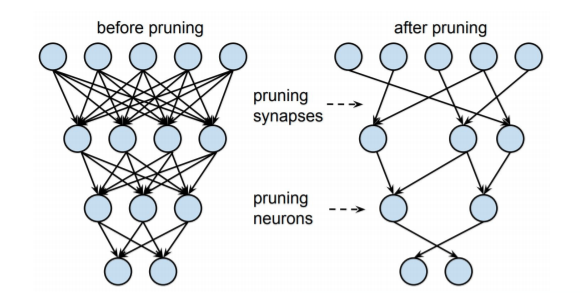

 

## **2. Pruning vs Dropout**

 

Pruning과 Dropout의 공통점과 차이점을 나누면 다음과 같습니다.

 

**공통점**

\- 중간의 weight들을 끄고, 켜고 할 수 있습니다.

\- Regularization을 위해 사용합니다.

 

**차이점**

\- Pruning은 한 번 잘라낸 weight를 복원하지 않지만, Dropout은 weight들을 끄고, 켜고를 할 수 있으며 inference 할 때는 모든 네트워크를 켜서 사용합니다.

 

 

 

Dropout과 Pruning에 대해 자세히 알아보면 다음과 같습니다.

 

#### **1) Dropout**

Dropout은 앙상블 효과를 내기도 합니다. (하나를 끄고 켤 때마다 서로 다른 네트워크처럼 동작하기 때문에)

 

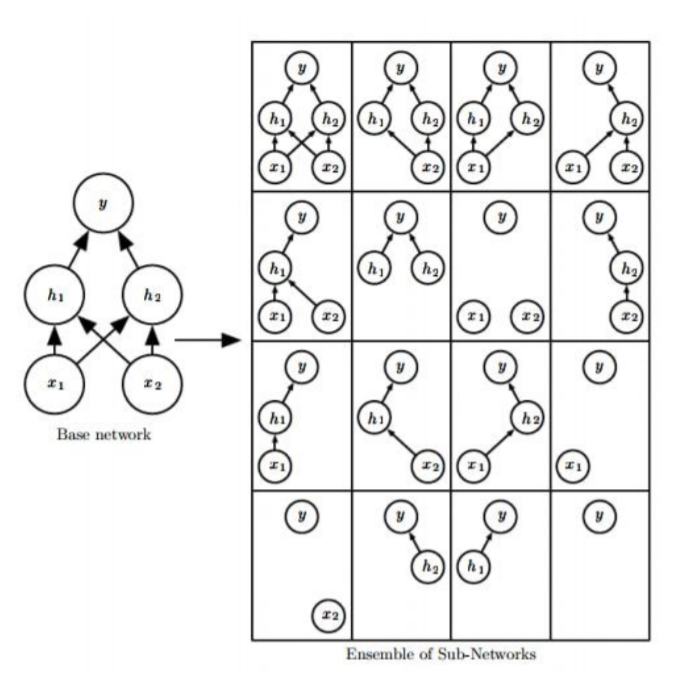

 

Dropout은 다음과 같은 방식으로 동작합니다.

 

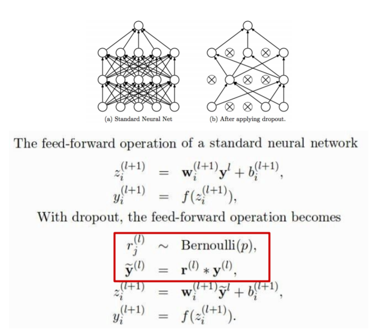

 

#### **2) Pruning**

Pruning의 경우에는 다음 순서로 동작합니다.

 

1. neuron의 importance를 측정합니다.

   

2. least important neuron을 제거합니다.

   

3. neruon이 제거된 network를 가지고 fine-tuning 합니다.

   

4. pruning을 다시 수행하던지, 아니면 종료합니다.

 

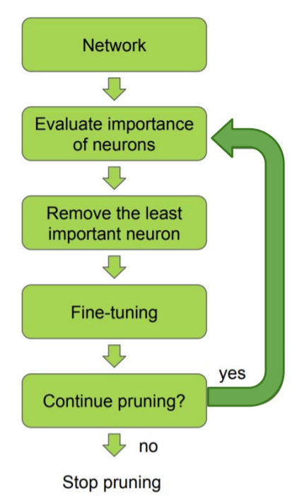

 

Pruning의 Alogorithm은 다음과 같습니다.

 

- **W** : Weight들의 set

  

- **M** : W 크기만큼의 1로 가득 차 있는 tensor (Mask)

 

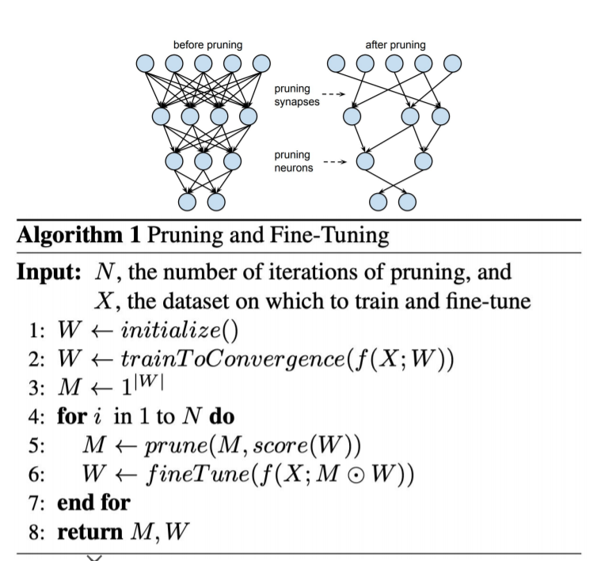

 

 

## **3. Pruning 비율에 따른 모델의 Accuarcy와 Loss**

 

**L1, L2 norm으로 정규화한** **Pruning 비율**에 따른 모델의 accuracy와 loss를 비교한 도표입니다.

 

retrain 없는 L2 regularization (보라색)을 했을 때 성능이 좋지 않지만,

retrain과 prune을 L2 regularization (빨간색)을 했을 때는 성능이 많이 올라갑니다.

 

즉, Iterative prune과 retrain을 하는 것이 성능 향상으로 이어집니다.

 

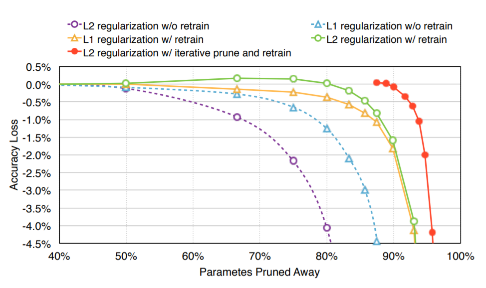

 

 

## **4. 여러 Pruning 방법들**

 

Pruning 방법에는 정말 정말 다양합니다.

다양한 pruning 방법들은 아래 github에서 확인할 수 있습니다.

[ he-y/Awesome-PruningA curated list of neural network pruning resources. - he-y/Awesome-Pruninggithub.com](https://github.com/he-y/Awesome-Pruning)

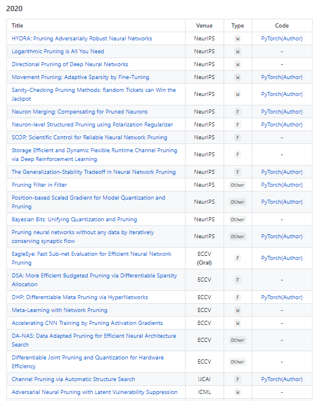

 

이렇게 많은 Pruning을 **category로 묶으면** 다음과 같습니다.

 

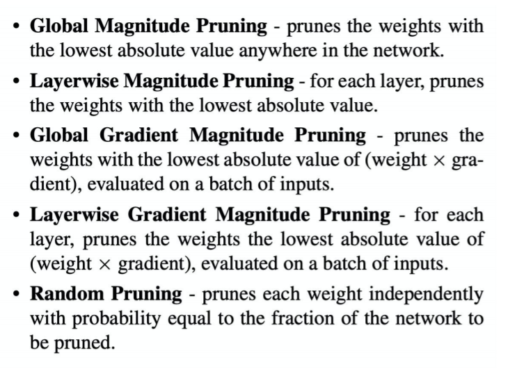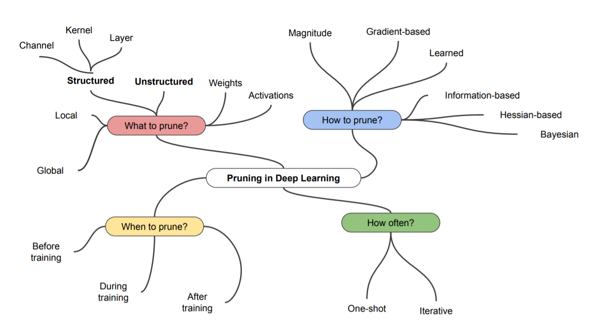

 

#### **1) Unstructured Pruning & Structured Pruning**

- **Unstructured Pruning :** weight를 아무 규격 없이 잘라내는 pruning

  

- **Structured Pruning :** weight를 channel / layer 단위로 규격을 잡아 제거하는 pruning

  규격을 잡아 제거했기 때문에 hardward optimization이 잘 되는 경향이 있습니다.

 

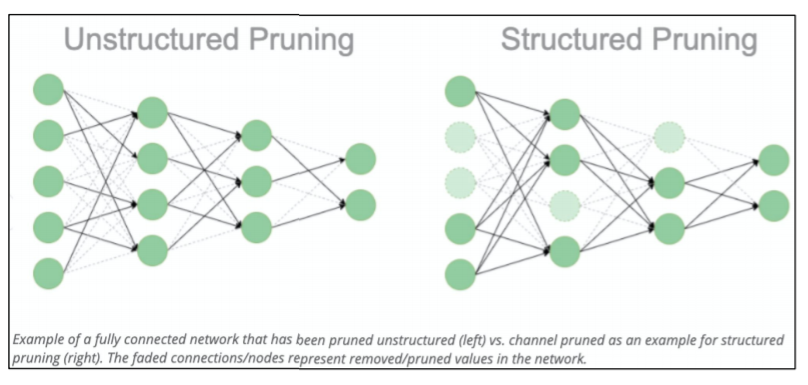

 

아래 그림은 Unstructured Pruning과 Structured Pruning을 각각 수행한 Model들의 Weight distribution입니다.

**(**Weight distribution이 x축은 각 weight들이 가지고 있는 값 (-0.2, 0.12, 0, 1.1 등), y축은 모든 weight들의 각각의 값을 count 한 분포)

 

weight value가 0에 많다는 의미는 "중요하지 않은 weight들"이 몰려있다는 의미입니다.

따라서 weight에서 pruning을 하면 0에 가까운 값들이 제거됩니다.

 

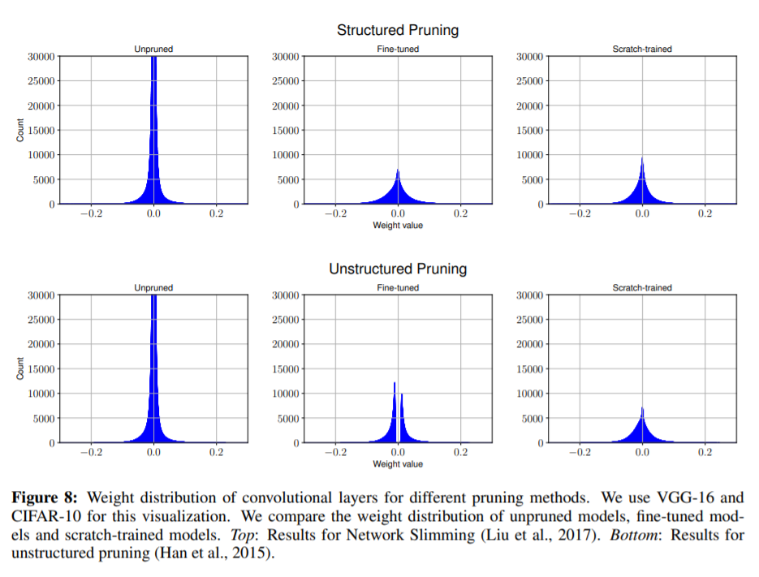

 

여기서 **"Pruning을 수행한 Fine-tuned와 Scratch-training"**은 **"Unpruned model"**과 비교되는 부분은 다음과 같습니다.

바로 0에 가까운 weight value가 적어졌다는 것입니다.

이 것은 pruning을 수행한 architecture에서 0에 가까운 weight들에서 중복된 구조(redundant sturctures)를 많이 찾았다는 의미입니다.

 

또한, unstructured prunning에서 fine-tuned와 scratch training의 weight distribution이 많이 다르게 나왔다는 것을 알 수 있습니다. fine-tuned의 weight distribution에는 0 부분이 비어져 있습니다. 이 부분 때문에 "scratch training 된 모델"이 "fine-tuned 모델"의 accuracy를 따라잡을 수 없습니다.

 

 

 

#### **2) Iterative pruning**

Pruning을 한 번만 수행하고 종료하는 것이 아니라 **Iterative (반복적)**으로 수행합니다.

Pruning을 한 번에 많이 수행하게 되면, 많은 weight가 사라지게 되어pruning loss가 줄어든 후 Accuracy가 다시 올라가지 않는다고 알려져 있습니다.

 

그래서 **pruning loss -> retraining -> pruning loss -> retraining ...을 반복적으로 수행**합니다.

 

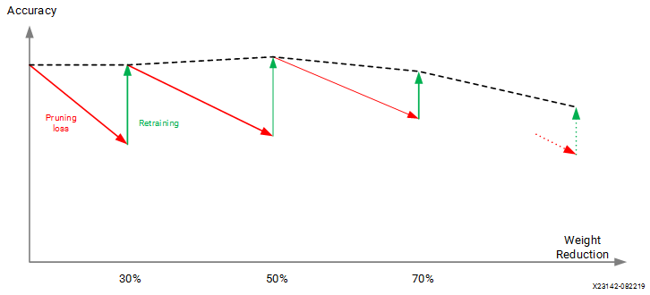

 

Iterative Pruning의 algorithm은 다음과 같습니다.

 

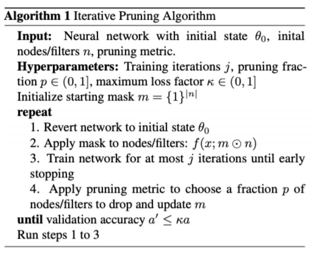

 

 

## **5. Lottery Ticket Hypothesis**

 

Lottery Ticket Hypothesis의 정의는 다음과 같습니다.

> **The Lottery Ticket Hypothesis.** A randomly-initialized, dense neural network contains a subnetwork that is initialized such that—when trained in isolation—it can match the test accuracy of the original network after training for at most the same number of iterations
>
> [Frankle et al., arXiv 2018]

 

정리해보면 다음과 같습니다.

 

Random으로 초기화된, dense 한 neural network는 subnetwork가 존재합니다. 만약, 그 subnetwork가 독립적으로 train 된다면, **pruning 하기 전 얻었던 Accuracy (91%)를 pruning 하고 나서도 얻을 수 있는 subnetwork가 원래 network 안에 존재할 것이다**라는 가설입니다.

 

 

이 가설에는 subnetwork가 **original network보다 epoch을 덜 돌면서, accuracy가 같거나 높고, parameter 수가 더 적을 것**이라고 적어놓았습니다.

 

하지만 중요한 것은 **original network를 reuse(재사용)해야 한다는 점**입니다.

orignal network를 reuse하지 않고 subnetwork를 initialization을 새로해서 train 시키면 lottery ticket 효과가 사라지게 됩니다. 즉, original network의 initialization 된 parameter를 그대로 사용해야 Accuracy가 잘 나오는 subnetwork가 나오게 됩니다.

 

그렇기 때문에 이 논문의 한계점은 subnetwork를 찾기 위해서는 어쨌든 original network를 train 해서 찾아야 한다는 것입니다. original network를 훈련시키고 subnetwork를 다시 찾아야 하기 때문에 더 많은 cost를 소요하게 됩니다.

 

 

 

이러한 한계점을 극복하기 위해 차후에 나온 논문들입니다.

#### **1) Iterative Magnitude pruning**

Tickets을 찾기 위해 Iterative Magnitude pruning을 수행합니다.

(여기서 magnitude는 weight의 크기 기준으로 정렬해서 크기가 낮은 기준으로 잘라낸다는 의미)

 

**init -> train -> prune -> mask를 씌우고 구조만 가지고 옴 (다른 내용은 remove) -> 다시 init 형태로 수행**합니다.

 

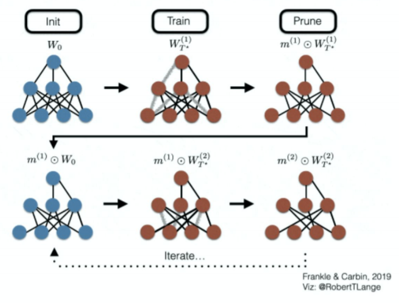

 

#### **2) Iterative Magnitude Pruning with Rewinding**

여기서 rewinding은 되돌리다, 되감기를 의미합니다.

 

**init -> train -> k 번째까지 iter 하고 weight를 저장 -> 다시 train -> prune -> 저장해놓은 k번째 weight을 모델에 덮어 씌운 후 iter 시작**합니다.

 

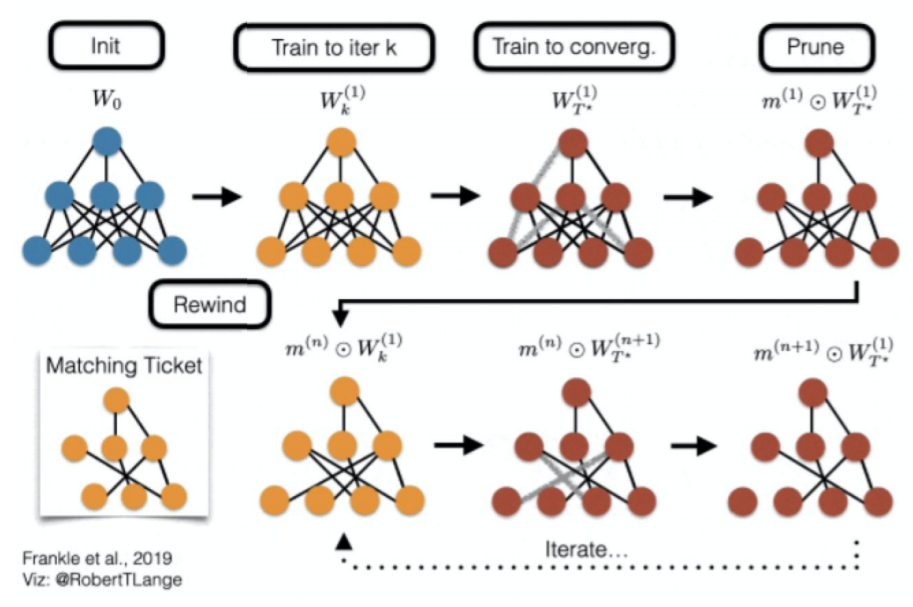

 

이렇게 사용하면 cost를 절감해서 사용할 수 있습니다.

 

Weight rewinding을 Algorithm으로 표현하면 다음과 같습니다.

- uu : noise
- m⊙Wkm⊙Wk : WkWk에 마스크를 씌움

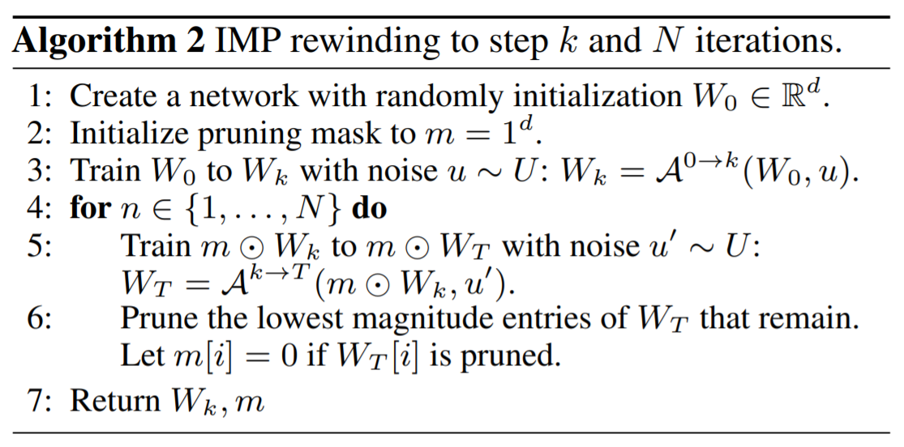

 

아래 그림을 가지고 설명하면 다음과 같습니다.

 

랜덤하게 initalization 된 W0W0에서 kk번째까지 iteration을 수행하면 WkWk가 나오게 됩니다.

이때, **약간의 noise**를 집어넣고서 W1TWT1와 W2TWT2 등 **여러 방향으로 train 시킵니다.** (똑같은 방향으로 train 시키면 rewind 의미가 없어짐)

 

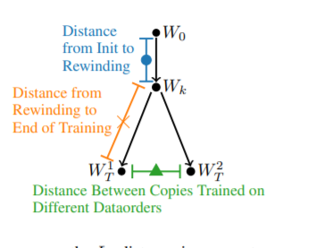