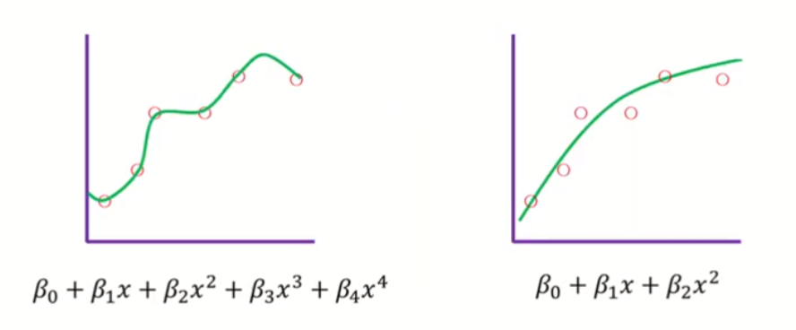
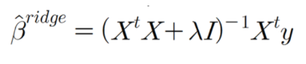
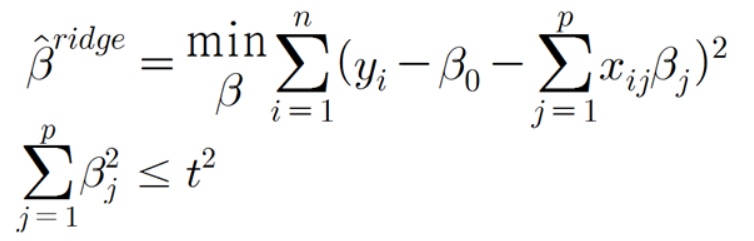
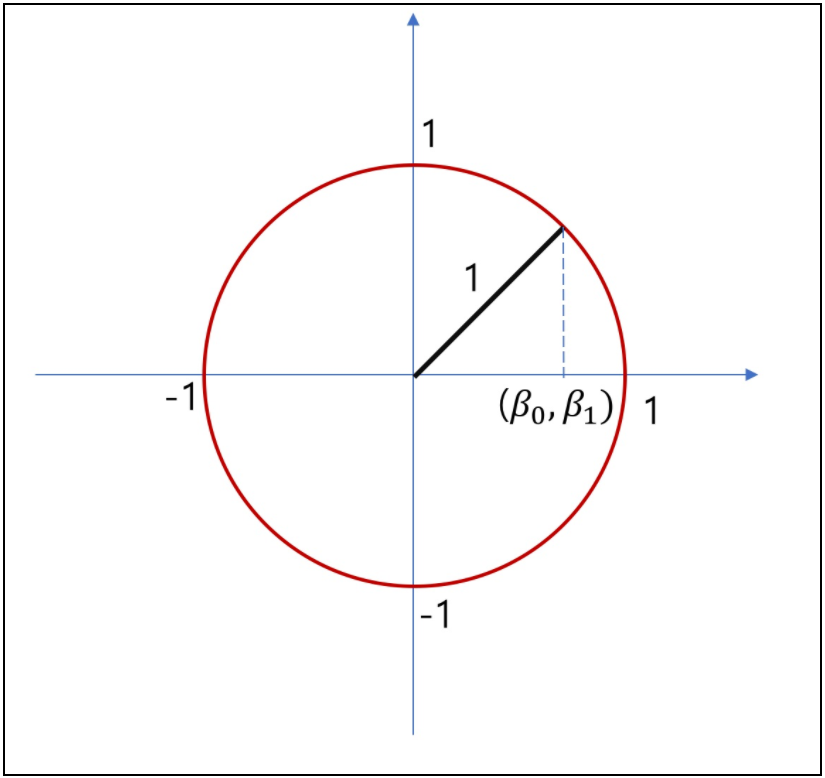
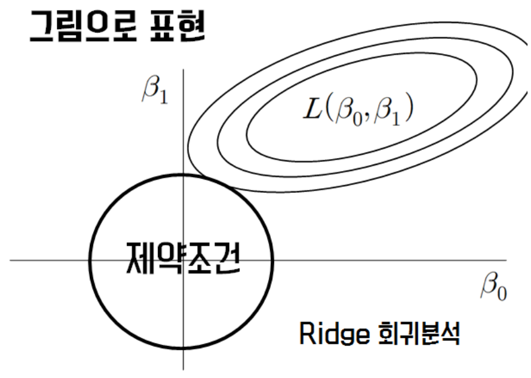
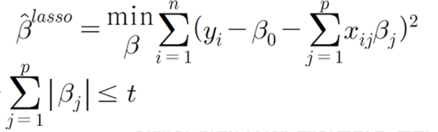
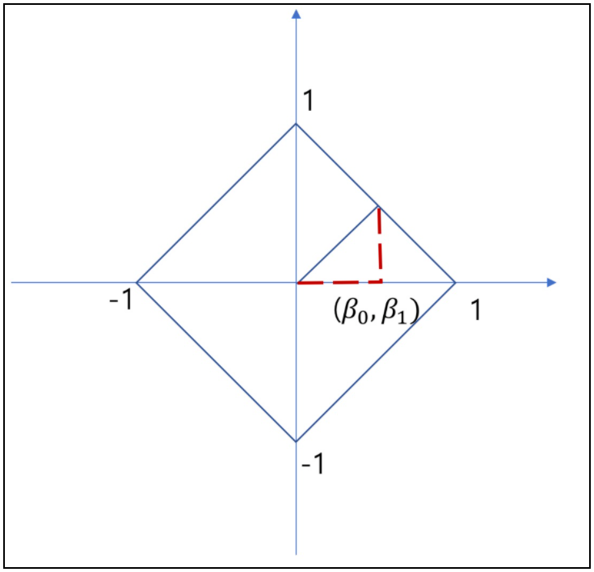
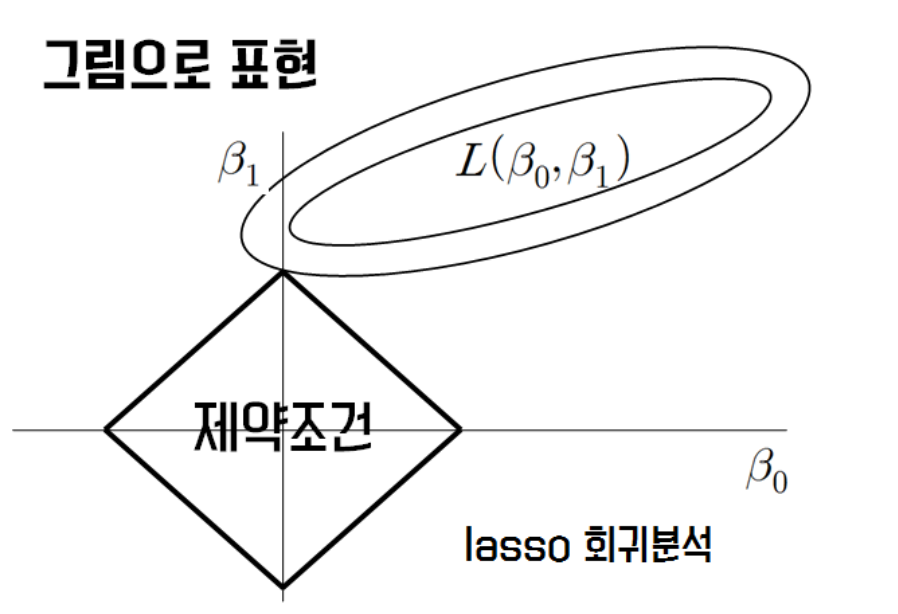
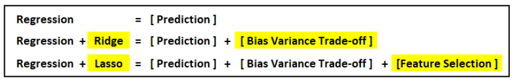
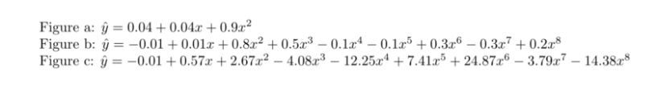

# L1 & L2 Norm

#### \<Introduction>

> ***Machine Learning*을 공부할 때 Norm과 관련된 수식이 굉장히 많이 쓰인다는 것을 느낄 때가 있습니다.**
>
> **그래서 이번에 다양한 기계학습에서 사용되는 Norm을 이해할 수 있도록 정리를 해보려 합니다**

#### Model Overfitting (과적합)

> 일반적으로 기계학습시 *Overfitting* 문제를 해결하는 방법에는 다양한 방법들이 있습니다. 
>
> ​	1) Collecting More Data
>
> ​	2) Cross Validation
>
> ​	3) Batch Normalization
>
> ​	4) Drop Out
>
> ​	5) Early Stopping
>
> ​	6) L1, L2 Regularization 등

- 이들 중 오늘 다룰 내용이 바로 *L1 L2 Norm*을 이용한 네트워크의 *Regularization*입니다.

## 0. What is Norm?

> *Norm*이란 벡터의 크기를 표현하는 방법입니다.
>
> 일반적으로 *p- Norm*은 다음과 같이  표현되는데, 이는 바로 원점에서 벡터좌표까지의  거리를 구한 것입니다.

$$
L_p = (\sum_i^n|x_i|^p)^\frac{1}{p}
$$

- 그리고 여기서 각각 `p = 1`일 때 *L1 Norm*
  - *L1 norm*은 대개 다음과 같은 영역에서 사용된다고 알려져있습니다.
    - *L1 Regularization*
    - *Computer Vision*

$$
\begin{align}
L_1 &= (\sum_i^n|x_i|)\\
&=|x_1|+ \cdot\cdot\cdot + |x_n|
\end{align}
$$

- `p= 2`일 때 *L2 Norm*
  - *L2 norm*은 대개 다음과 같은 영역에서 사용된다고 알려져있습니다.
    - *L2 Regularization*
    - *KNN 알고리즘*
    - *Kmeans 알고리즘*

$$
\begin{align}
L_2 &= (\sum_i^n|x_i|^2)\\
&=|x_1^2|+ \cdot\cdot\cdot + |x_n^2|
\end{align}
$$

> 우리가 관심있는 건 **그래서 이것을 어떤 식으로 사용하는가**입니다.
>
> - 우리가 흔히 알고 있던 Cost Function을 다음과 같이 변형하여 사용합니다.
> - 다음과 같이 변형된 함수는 보통 기존 함수에 `L1 혹은 L2 규제`를 위한 새로운 항을 추가한 형태의 *Cost Fucntion*입니다.

$$
cost(W,b) = \frac{1}{m}\sum_i^mL(\hat{y_i},y_i) + \lambda\lVert{w}\rVert\\
[Cost Function\ \ \ with \ \ \ L_1 \ Regularization]
$$

$$
cost(W,b) = \frac{1}{m}\sum_i^mL(\hat{y_i},y_i) + \lambda\lVert{w}^2\rVert\\
[Cost Function\ \ \ with \ \ \ L_2 \ Regularization]
$$

> 여기서 *w*는 `가중치 벡터`이고, 그렇기에 위 수식은 원래의 Cost Function에 `가중치 벡터의 크기`를 넣음으로서 규제를 걸어주었다는 의미입니다.
>
> - 이를 직관적으로 생각해보면, 가중치를 기하급수적으로 크게 한다면 *Cost Function* 역시 높은 값을 가지게 되는 것이죠.
> - 가중치(계수)벡터의 크기에 제한을 두는 것이 왜 합리적일까요?
>   - 회귀분석을 수행하며 계수의 표준오차 (*S.E*)를 살펴보면 그 계수가 커짐에 따라 불안정성이 높아지기 때문입니다.
> - 가중치가 커지는 것에 대해서 얼마나 `패널티`를 추가할 것인지 *lambda* 값을 조정할 수 있는 형태입니다.

#### 

#### 이제 어느정도 L1, L2 규제의 활용에 대한 이론적인 이해는 되셨을 것이라 생각합니다.

#### 다음으론 이러한 파라미터들을 실제 모델에서는 어떻게 이용하고 있는지 그 예시를 보도록 하겠습니다.

## 1. Ridge & Lasso Regression

- *Ridge & Lasso Regression*은 우리가 흔히 알고있는 *Linear Regression*에 *L1 L2 regularization*을 활용한 대표적인 예시입니다.

### 1.1 Ridge Regression

> 먼저, **L2 정규화**를 이용하고 있는 *Ridge Regression*입니다.
>
> 사실 *Ridge Regression*은 다음과 같이 역행렬이 존재하지 않을 경우, 대각원소에 임의의 수를 더해주어 추정치를 구한다는 생각에서 유래되었습니다.
>
> - 본래 회귀계수에서는 역행렬이 존재하지 않았지만 다음과 같은 수정된 파라미터를 구해준다면 역행렬이 존재하게 된다는 생각이었던 거죠.

> 본래 회귀계수 *OLSE* 참고)

$$
\hat\beta^{original} = (X^tX)^{-1}X^ty
$$

#### 1.1.1. 수식적인 관점에서의 이해

>  위 ridge parameter를 구하는 식은 다음과 같은 *Lagrange multiplier*의 관점에서 다시 생각해볼 수가 있습니다. 
>
> - 제약조건에 의해 위에서 배웠던 2-Norm을 제한하고, 이 제약조건에 맞추어 본래 추정하던 *Original LSE*를 구하는 것이라 생각할 수 있는 것이죠.

> 참고) *Cost Function for Ridge Parameter*

$$
S(\beta) = \sum_i^n(y_i - \beta_0 - \sum\beta_jx_ij)^2 + \lambda\sum_j^p\beta_j^2
\\
$$

### 1.1.2 Ridge 그림으로 이해해보기

> `t=1` & `p=1`일 때, 제약조건을 그림으로 표현하면

$$
\beta_0^2+\beta_1^2=1
$$

> **그렇다면 다음 Cost Function을 라그랑주 승수법과 연관지어 그림을 그려보면**
> $$
> S(\beta) = \sum_i^n(y_i - \beta_0 - \beta_1x_i)^2 + \lambda\sum_0^1\beta_j^2
> \\
> $$

`Source : http://www.datamarket.kr/xe/index.php?mid=board_BoGi29&document_srl=7176&listStyle=viewer&page=9`

> **그림해석**
>
> - 제약조건 B0^2+B1^2에 닿기 위해 기존의 Original Cost Function이 그 영역을 늘리고 있음을 볼 수 있습니다.
> - Bias가 높아지긴 하지만 회귀계수 B를 훨씬 줄일 수 있게 됩니다.
> - 이 때 접하는 부분은 축 위의 점이 아니게 될 가능성이 매우 크다. (장축과 단축이 같은 비율로 서서히 늘어날 때 그려진 원과 가장 처음 닿는 부분이 어느 곳일지를 생각해보자.)
> - 결국, Bias가 약간의 희생은 하지만 Variance를 줄이기 위해서 아래의 그림처럼 제약조건까지 오는 가장 작은 Cost 값을 고르면 되는 것이죠

### 1.2 Lasso Regression

> 다음으론 L1 정규화를 이용하고 있는 *Lasso Regression*입니다.

#### 1.2.1. 수식적인 관점에서의 이해

>  Lasso Parameter를 구하는 식 역시 다음과 같은 *Lagrange multiplier*의 관점에서 생각해볼 수가 있습니다. 
>
> - 1-Norm으로 제약조건을 걸고, 이 제약조건에 한하여 본래 추정하던 *Original LSE*를 구하는 것이라 생각할 수 있는 것이죠.

#### 1.2.2 Lasso 그림으로 이해해보기

> `t=1` & `p=1`일 때, 제약조건을 그림으로 표현하면

$$
|\beta_0|+|\beta_1|=1
$$

> **이제 다음 Cost Function을 라그랑주 승수법과 연관지어 그림을 그려보면**

$$
S(\beta) = \sum_i^n(y_i - \beta_0 - \sum\beta_jx_i)^2 + \lambda\sum_j^p|\beta_j|
\\
$$

`Source : http://www.datamarket.kr/xe/index.php?mid=board_BoGi29&document_srl=7176&listStyle=viewer&page=9`

> **그림해석**
>
> - 제약조건인 사각형에 닿기 위해 기존의 Original Cost Function이 그 영역을 늘리고 있음을 볼 수 있습니다.
> - 역시 Bias가 높아지긴 하지만 회귀계수 B를 훨씬 줄일 수 있게 되는데 L2와 다른 점은 위와 같이 축에 접하는 경우를 해로 정할 가능성이 매우 높다는 것입니다.
> - 이런 현상이 나타나는 이유는 Loss Function이  제약 조건에 맞추면서도 영역을 최대한 줄이기 위해 노력하여 나타나는 결과라고 볼 수 있습니다. (장축과 단축이 같은 비율로 서서히 늘어날 때 사각형과 가장 처음 닿는 부분이 어느 곳일지를 생각해보자.)
> - 이와 같이 Lasso는 L1 regularization을 일부 가중치를 0으로 만들며 Feature Selection의 효과를 가지게 된다.
> - 이로부터 Out of Memory, Curse of Dimension 등 해결에 굉장히 도움이 됩니다.

( 그래도 그림해석이 이해가 안된다면.. https://towardsdatascience.com/regularization-in-machine-learning-connecting-the-dots-c6e030bfaddd )

### 1.3 Ridge vs Lasso 비교

> 다음 그림에서는 위에서 봤던 *L1 Regularization*과 *L2 Regularization*의 차이를 가중치 w를 변화시키며 더 직접적으로 살펴보았다.
>
> 	1. 왼쪽그림은 `x축 : 가중치 w`에 대한 `y축 : Deviance`
> 	2. 오른쪽 그림은 `x축 : 가중치 w`, `y축 : Norm에 대한 기울기(Gradient)`를 나타내고 있습니다.

`Source:`

`https://towardsdatascience.com/visualizing-regularization-and-the-l1-and-l2-norms-d962aa769932`

> **L2 Norm**에 대한 오른쪽 그림을 보며 *Gradient*도 작아지므로 업데이트도 점점 더 작아진다는 것을 알 수 있습니다. 가중치가 0에 가까워지면 어차피 업데이트가 거의 무시할 수 있을 정도로 작아 지므로 가중치가 0이 될 가능성이 더 적습니다.

> 반면에 왼쪽 그림을 보면 **L1 Regularization** 에서는 Gradient가 일정합니다.
>
> 즉, w가 작아진다고 해서 업데이트가 변경되는 것에 대해 더 큰 보상이 아니라 동일한 보상을 계속받게 됩니다.
>
> 따라서 L1 Regularization은 일부 가중치를 0으로 줄일 가능성이 L2에 비해 훨씬 더 높습니다.

### 1.4 결론

+ 더 공부해보고 싶다면 L1의 weight 분포는 Laplace, L2의 weight 분포는 정규분포와 비슷한 분포의 형태를 띄게 되는 것을 알 수 있습니다.

|                            Ridge                             |                            Lasso                             |
| :----------------------------------------------------------: | :----------------------------------------------------------: |
| *L2- Regularization 사용*  Robust하지 않다  변수선택 불가능  Closed form Solution 존재 (미분으로 구함)  다중공선성(변수 간의 상관관계)이 존재할 때 더 좋은 예측 성능  크기가 큰 변수를 우선적으로 줄이는 경향이 존재 | *L1- Regularization 사용*  Robust하다  변수 선택 가능  Closed form Solution이 존재하지 않음 (수치해석방법 이용)  변수간의 상관관계(다중공선성)가 높은 상황에는 Ridge에 비해 상대적으로 예측 성능이 줄어듦 |

`References : `

`https://towardsdatascience.com/visualizing-regularization-and-the-l1-and-l2-norms-d962aa769932`

## 2. 다양한 예시들

### 2.0 Linear Regression뿐만이 아닌 Extension

### 2.1 Polynomial Regression

### 2.2 Boosting based-on Tree

> Iteration 증가에 따른 테스트 셋에 대한 

추가적으로 보고싶다면, 

`참고 : https://www.kaggle.com/jaehoonmoon/all-of-parameter-tuning-in-gbm-xgb-in-r`

### 2.3 Deep Learning

- 딥러닝에선 이런 가중치 규제화를 Weight Regularization라고도 부름
- 모델마다 다르겠지만 대부분 모델들에서 파라미터 중 clip_norm 파라미터를 통해 이를 조절할 수 있음.

> Weight Regularization(가중치 규제)  적용 전(왼쪽) vs후(오른쪽) 비교

