## 1. **Vanilla RNN**

### **1) $y_t$는 언제 출력해야 하나요?**

 

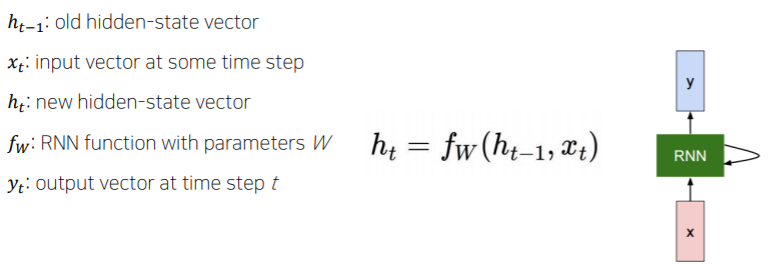

 

예측값을 나타내는 $y_t$는 매 타임스텝에 계산해야 할 때도 있고 마지막 타임스텝에 계산해야 할 때도 있습니다.

ex) 문장에서 각 품사를 예측 -> 매 타임스텝마다 계산, 문장이 긍정인지 부정인지 -> 마지막 타임스텝에만

### **2) 입력 $x_{t}$와 이전 정보 $h_{t−1}$의 행렬곱**

 

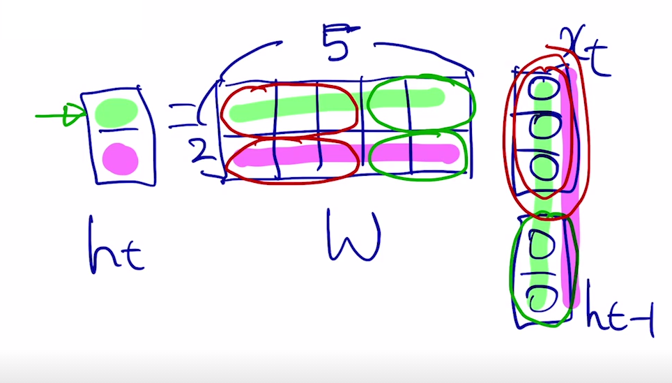

 

입력 $x_t$와 $h_{t−1}$은 concat 후 가중치 $W$와 계산됩니다. 이때, $x_t$가 3 x 1 dimension, $h_{t−1}$이 2 x 1 dimension을 가지고 있을 때, 가중치는 $W$는 2 x 5 dimension을 가지게 됩니다. ($h_t$도 2 x 1 dimension)

 

위 사진의 가중치 $W$를 빨간색 $W_{xh}$와 초록색 $W_{hh}$로 나눌 수 있습니다. 빨간색 $W_{xh}$는 $x_t$와 대응하고, 초록색 $W_{hh}$는 $h_{t−1}$과 대응합니다.

$W_{xh}$$x_t$+$W_{hh}$ $h_{t−1}$ $W_{xh}$ $x_t$ + $W_{hh}$$h_{t−1}$

 

### **3) Type of RNNS**

 

- One-to-one

  ex) 키,몸무게,나이 => 혈압

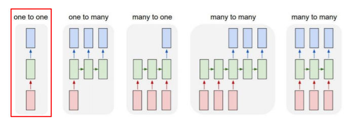

 

- One-to-many

  (RNN은 매 타임스텝마다 입력이 들어가야 하기 때문에 나머지 입력에는 0으로 채워진 vector가 입력으로 주어짐)

  ex) image captioning (단일한 입력) -> 각 필요한 단어를 타임스텝으로 생성

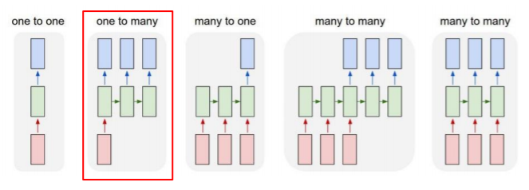

 

- Many-to-one

  ex) Sentiment classification, 감정분석

 

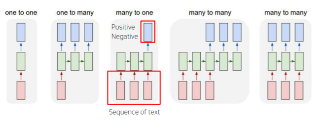

 

- Many-to-Many (1)

  ex) Machine translation (번역)

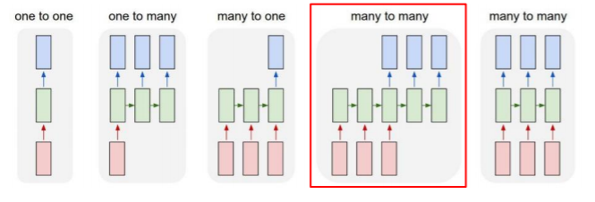

 

- Many-to-Many (2)

  입력 여러 개, 출력은 여러 타임스텝 (입력이 주어질 때마다, delay가 없는)

  ex) POS tag, video classification on frame level

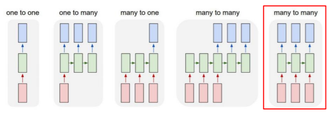

###  

### **4) Character-level Language Model**

 

글자 수준에서의 RNN은 다음과 같이 진행됩니다.

예를 들어, "hello"라는 word를 글자 하나하나씩 RNN을 수행하려면,

 

 

- **STEP 1 : Vocabulary 생성**

  Vocabulary: [h, e, l, o]

  

- **STEP 2 : One-hot vector 생성
  **

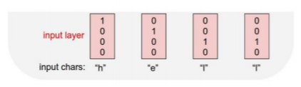

 

- **STEP 3 : $W_{hh}$와 $W_{xh}$를 사용해 $h_t$구하기
  **($h_t$의 초기값 $h_0$은 모두 0으로 구성되어 있음)

  **$h_t=tanh(W_{hh}h_{t}−1+W_{xh}x_{t}+b)$**

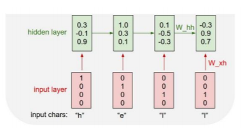

 

- **STEP 4 : $W_{hy}$를 사용해 Logit 구하기

  **Logit은 $W_{hy}$를 통해 예측값을 출력합니다.

  한 character로써 다음에 나올 character을 예측하는 task를 수행해야 하기 때문에 4개의 dimension으로 구성되어 있습니다.

  Output layer에서 softmax를 통과하고 **Ground**-**truth** (학습하고자 하는 데이터의 원본 혹은 실제 값을 표현)를 찾기 위해서는 학습을 통해 확률을 높여야 합니다.

  중요한 점은 3번째 timestep과 4번째 timestep에서 같은 "l"임에도 불구하고 **3 timestep에서는 "l"을 예측해야 하고, 4 timestep에서는 "o"를 예측해야 합니다.**따라서 입력으로 들어오는 "l"값뿐만 아니라 3 timestep에서는 "h", "e"가 들어왔다는 정보와 4 timestep에서는 "h", "e", "l"이 모두 들어왔다는 정보가 있어야 합니다. 이 것이 바로 $h_{t−1}$ vector입니다.

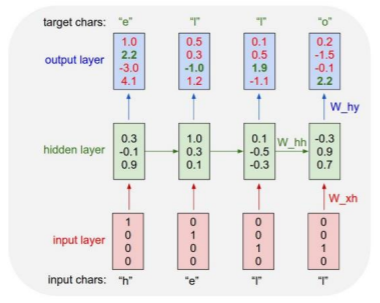

 

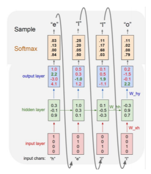

 

### **5) Train of RNN**

 

Train을 많이 시키게 되면 첫 번째 단어만 주어져도, 사람이 알아볼 수 있는 문장을 생성하는 것이 가능합니다.

 

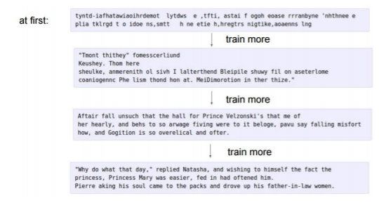

 

또한, 특수문자나 공백 등을 같이 학습시켜서 사용합니다.

예를 들어, : 을 주고 줄 바꿈을 해야 한다고 훈련시키면, 컴퓨터가 : 이 나왔을 때 자동으로 줄 바꿈 수행합니다.

 

 

### **6) Bi-Directional RNNs** 

 

 

Forward RNN에서 사용되는 parameter와 다른 **별개의 parameter를 가지는** 또 다른 RNN인 Backward RNN을 만들 수 있습니다. 이러한 RNN을 양방향 RNN 즉, **Bi-Directional RNNs**이라고 합니다.

 

이렇게 되면 항상 왼쪽(과거)에 있는 정보만 가지고 판단하는 것이 아닌 오른쪽(미래)에 있는 정보를 활용할 수 있게 됩니다. 이 두 정보 $h^f_2$와 $h^b_2$를 concat 해서 hidden state vector의 사이즈를 2배로 만듭니다.

 

 

## 2. **LSTM**

 

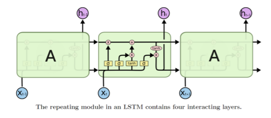

### **1) LSTM의 입력과 출력**

 

LSTM의 입력과 출력은 두 식으로 계산됩니다.

 

**$h_t=f_w(x_t,h_{t−1})$**

**$(c_t,h_t)=LSTM(x_t,c_{t−1},h_{t−1})$**

 

여기서 주의 깊게 보아야 할 점은,

 

**$C_t$는 기억해야 할 모든 정보를 담고 있는 vector**이며,

**$h_t$는 현재 timestep에서 예측값에 직접 필요한 정보만 담은 vector**입니다.

(양이 많은 $C_t$에서 당장 필요한 정보만을 선별한 정보)

 

즉, hidden state vector는 cell state vector에서 가공하고 filtering 된 정보입니다.

 

### **2) Backpropagation in LSTM**

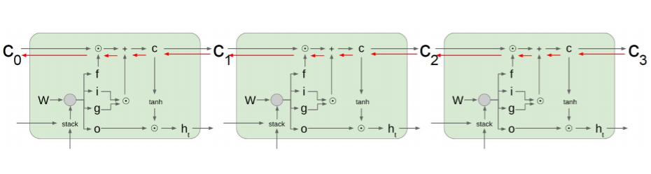

 

Backpropagation in LSTM에서는 RNN처럼 $W_{hh}$를 계속적으로 곱해주는 연산이 아닙니다.

전 timestep의 cell state에서 서로 다른 값으로 이루어진 forget gate를 곱하고, 필요로 하는 정보를 곱셈이 아닌 **덧셈을 통해서 원하는 정보를 만들었기 때문에** **gradient vanish 문제가 사라짐**을 알 수 있습니다.

 

기본적으로 덧셈 연산은 backpropagation을 수행할 때 **gradient를 복사해주는 연산**이 됩니다.

따라서 멀리 있는 timestep까지 gradient를 큰 변형 없이 전달해줄 수 있습니다.

 

 

## 3. **GRU**

GRU는 LSTM을 경량화해서 적은 메모리와 빠른 계산이 가능하도록 만들었습니다.

따라서 GRU는 $C_t$가 없고 일원화해서 $H_t$만 가지고 있습니다.

 

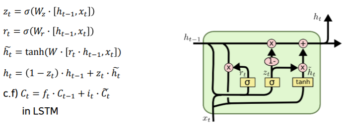

 

LSTM과 다르게 GRU에서는 각각의 독립적인 vector인 $f_t$, $i_t$를 곱한 후 더하는 것이 아닌, **$h_{t−1}$와 $h_t$의 가중평균 $z_t$을 구하는 것**을 알 수 있습니다.

 

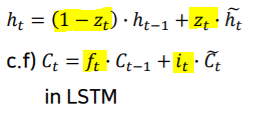