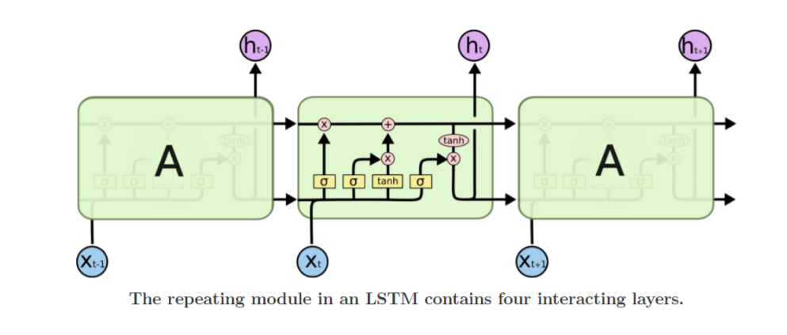

# LSTM & GRU

## LSTM

**`Long Short-Term Memory(LSTM)`**은 기존 RNN모델에서 **`Vanishing/Exploding Gradient`** 문제를 해결하고, **`long-term depandancy`** 문제를 개선한 모델이다.

hidden state를 단기(short-term)기억소자로 볼 수 있고, 보다 먼 timestep(long-term)의 정보까지 잘 반영하도록 만들었기 때문에 이러한 이름이 붙었다.

# 

### 구조

기존의 RNN 모델이 다음과 같은 형태였다면,
$$
h _
t
​	
 =f _
w
​	
 (x _
t
​	
 ,h _
{t−1}
​	
 )
$$
LSTM 모델의 형태는 다음과 같다.
$$
\{C _
t
​	
 ,h _
t
​	
 \}=LSTM(x _
t
​	
 ,C_ 
{t−1}
​	
 ,h _
{t−1}
​	
 )
$$

$$
C_t
​	
  : Cell\ State\ Vector
$$

$$
h _
t
​	
  : Hidden State Vector
$$

