1. Seq2Seq Model

## 1.1 RNN을 이용한 seq2seq

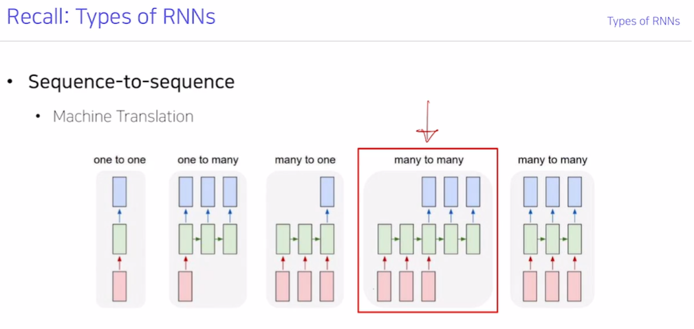

- Seq2seq는 RNN의 종류 중 입력도 sequence, 출력도 sequence인 many to many RNN에 해당합니다.

- Seq2seq는 sequence로부터 sequence를 예측 또는 생성하는 모델이라고 생각할 수 있음.

## 1.2 Seq2Seq의 구조

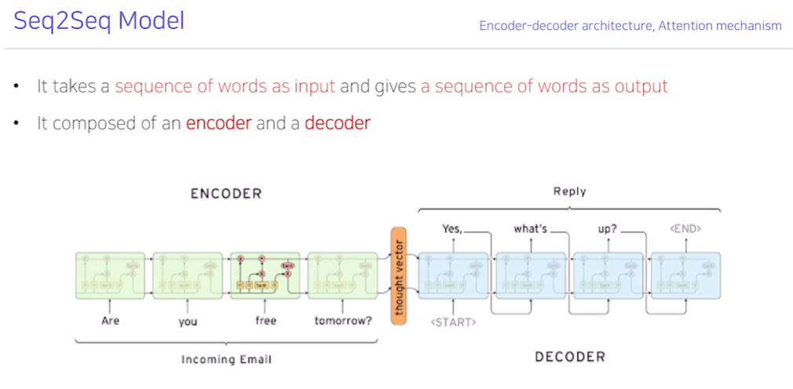

- 입력문장을 읽어들이는 RNN 부분을 ENCODER, 출력문장을 순차적으로 하나하나씩 생성하는 RNN 부분을 DECODER라고 부릅니다.

- ENCODER에서 `Are you free tomorrow`라는 입력을 다 읽은 후 나온 마지막 time-step의 hidden state 값은 DECODER 부분의 첫번째 time-step의 입력으로 주어지는 h0로서 역할을 하게 된다.
- DECODER의 첫번째 time-step의 `<START>`와 같이 (SOS)를 입력으로 넣어주어 문장의 시작이라고 알려주어 문장의 시작 단어를 예측함.
- 당연히 `<SOS>`를 미리 Vocabulary에 정의해놓고 사용하는 것임.
- `<EOS>`와 같은 문장을 종료하는 특수 토큰도 있음.

- 이 그림에서는 RNN 모델 종류 중 LSTM을 사용하고 있음.

> ※ 유의할 부분 : ENCODER의 RNN에서 매 time-step마다 동일한 paramter를 사용했을 것이고, DECODER에서는 매 time-step마다 ENCODER의 것과는 또다른 Parameter를 매 time-step마다 사용한다.
>
> - 즉, ENCODER와 DECODER 부분은 Prameter 업데이트에 있어 별개의 RNN 구조이다.

​	

## 1.3 Seq2Seq의 개선할 점

- ENCODER의 마지막 time-step에서 나온 hidden state 값에 input sequence의 모든 정보를 다 우겨넣은 형태로 구조가 이루어져있음.
- 맨마지막 hidden state값에 정보가 모두 잘 들어있지 않을 수 있음.
  - 예를 들어, 기계번역 seq2seq 태스크에 있어서 input으로 `I go home`이 입력되어, ouput으로 `나는 집에 간다`를 출력해야 할 때를 생각해보자.
  - 마지막 hidden state만을 사용하면 DECODER의 h0에 `I`라는 정보가 우겨넣어져 있기 때문에 그 의미를 제대로 담고 있지 못해서 첫 번째 예측 결과부터 `나는`을 못 뽑아내고 엉뚱한 단어가 출력될 가능성이 높음.
  - input의 주어인 `I` 라는 정보를 가지고 있는 해당 time-step의 hidden state가 입력으로 주어져야 `나는`과 같은 출력을 뽑아내기가 쉬워질 것이다.
- 그러므로 ENCODER의 마지막 hidden state만이 아닌, 매 time-step 마다 나온 hidden state 값을 모두 사용할 수는 없을까?

- 이러한 관점에서 고안된 것이 바로 Attention 메커니즘이다.

> 추가 : Attention이 나오기 전, 위와 같은 기계번역 태스크에서 `I`라는 첫번째 정보를 DECODER에 손실없이 전달하기 위해 ENCODER의 입력 문장순서를 아예 뒤집어서 시도도 해보았다고 한다. (`I go home` => `home go I`)

# 2. Attention

## 2.1 Attention 메커니즘의 구조

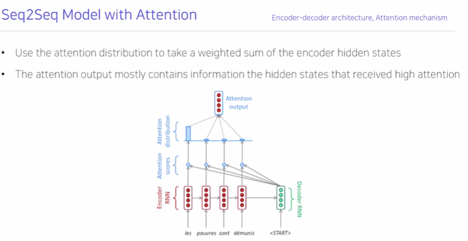

- 위의 그림은 프랑스어를 영어로 번역하는 예시

- ENCODER의 각 time-step의 결과 hidden state들을 Attention score를 구하기 위해 각각 사용하고 있음.

- 위의 Seq2seq에서는 `h0(d)`만을 사용했던 것과 달리,  **ENCODER의 마지막 step으로부터 나온 `h4(e)`이자 `h0(d)`를 입력받아 구해진, DECODER의 첫번째 time-step 결과 hidden state `h1(d)` 값을 ** 각 Attention score를 구하기 위해 동시에 사용하고 있음

- `h1(d)`값은 각각 `h1(e)`, `h2(e)`, `h3(e)`, `h4(e)`과 내적연산을 통해 Attention score가 구해지게 되는 것임. (벡터와 벡터의 내적연산이므로 Attention Scores 값은 각각 Scala)

  - 이 내적 연산 부분은 유사도를 구하는 과정이라고 생각할 수가 있다.
  - `h1(d)`값을 각각 `h1(e)`, `h2(e)`, `h3(e)`, `h4(e)`에 내적연산을 취해줌으로써 이들 중 무엇과 유사한가를 판단할 수 있게 되는 것이다.

- 해당 scala를 사용하여 각각 확률값을 구하게 됨 (softmax), 이것이 Attention Distribution 값.

  - Attention Distribution 값이 아래와 같이 (0.85,0.08,0.04,0.03)구해졌다면, `h1(e)`라는 ENCODER의 첫번째 time step hidden state vector에 가장 많은 가중치를 주게 되는 역할을 하게 된다.

  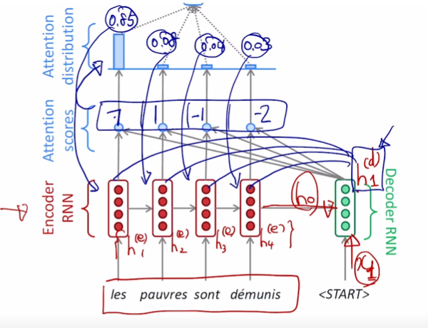

- 이런 식으로 Attention 메커니즘을 통해 벡터들에 가중평균을 취해 나온 형태의 Attention Output 벡터를 `Context Vector`라고 부름.

- 위의 예시는 DECODER의 첫 time-step에 해당하는 `Context Vector`를 구하기 위한 과정이었음
  - 만약 DECODER의 두번째 time-step에 해당하는 `Context Vector`를 구하려고 한다면 DECODER의 두번째 `h2(d)` 벡터를 가져와서 이용하여 Attention 모듈을 거쳐 `Context Vector`를 구하게 된다.
  - 이와 같이 DECODER의 hidden state는 하나씩 가져와서 DECODER의 해당 time-step에 대해 <u>ENOCDER sequence 중에서 중요하게 생각해야 할 부분을 집중</u>해주는  `Context Vector`를 구한다.
  - 이렇게 구해낸 Context vector와 DECODER의 hidden state를 이용하여 다음 단어를 예측해내는 것을 볼 수 있다.

> 1) DECODER의 첫번째 time-step에 해당하는 context vector(가중평균벡터)를 구하고 DECODER의 첫번째 output을 구하는 과정.

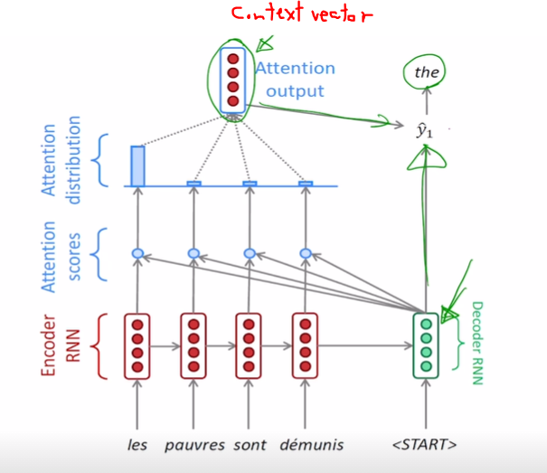

> 2) DECODER의 두번째 time-step의 `h2(d)`를 사용하여 각각의 `h1(e)`, `h2(e)`, `h3(e)`, `h4(e)` 벡터들과 내적을 한 다음 두번째 time-step에서 집중해야될 부분을 나타내는 context vector를 구하고 DECODER의 두번째 output을 구하는 과정.
>
> - 다음을 보면 `poor`이라는 두번째 time-step의 아웃풋을 구하기 위해 두번째 word에 집중하는(가중치를 많이 둔) Attention Distribution (Softmax의 Output)을 구해낸 것을 볼 수 있다.
> - 합이 1인 Attention Distribution, Softmax Layer의 Output에 해당하는 부분을 `Attention Vector`라고 부릅니다.

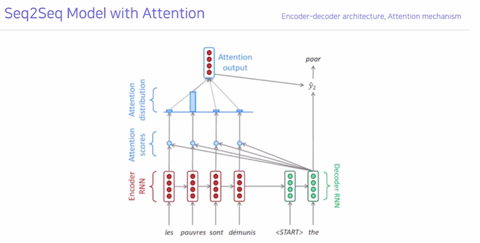

> 3) 세번째 단어를 예측해내는 그림

> 4) 네번째 단어를 예측해내는 그림

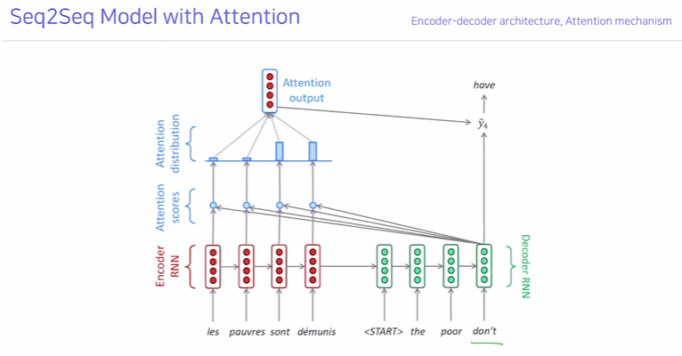

> 5) 5번째 단어를 예측해내는 그림

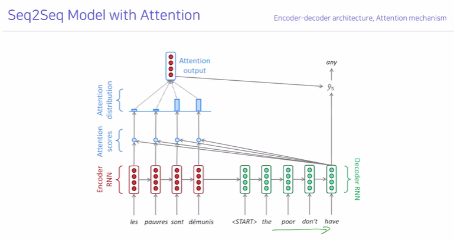

> 6) 6번째 단어를 예측해내는 그림

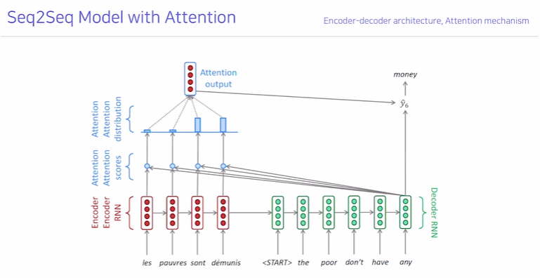

## 2.2 Attention 메커니즘의 역전파

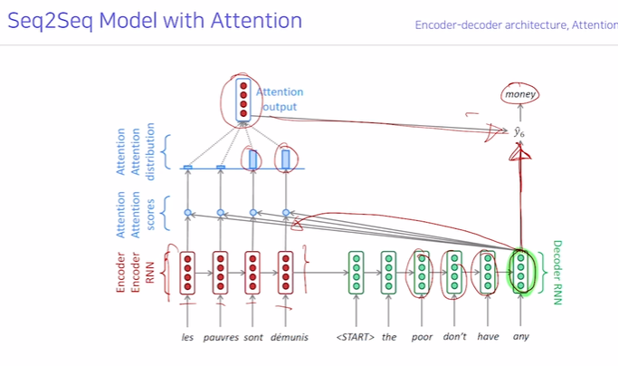

- DECODER RNN의 해당 time-step의 hidden state vector(여기선 `any`에 의해 만들어진 hidden state `h5(d)`)는 1)Output 단어를 예측하는 데, 2) Encoder에서 어떤 단어를 중점적으로 볼지 정하는데 사용된다.

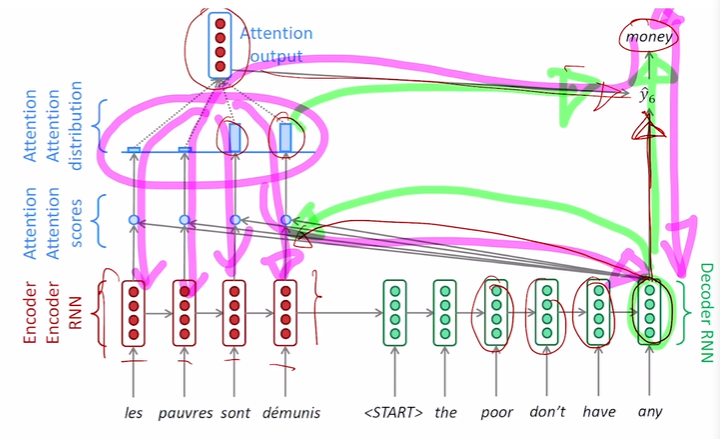

- ENCODER 부분의 역전파 부분에 대해 생각해보자. 만약 context vector를 구성하는데 있어 `les`가 중요하다고 표현하는 context vector로 잘못 생성한 경우, 원하는 정보가 선택될 수 있도록 업데이트된다.

## 2.3 Teacher Forcing (교사강요)

>  **(Teacher Forcing)교사강요** : 만약 `<SOS>` 이후 the를 잘못 예측해낸 경우에도 그대로 이를 다음 time-step을 예측하는데 사용하게 된다면 잘못 예측하는 결과를 내기 때문에 Ground truth(실제 옳은 단어)를 주고 학습하게 된다.

- 하지만, Test시에 실제 모델을 사용하여 단어를 하나씩 생성하게 될 때에는 아래와 같이 Ground truth를 줄 수 없고, 이전의 input값을 사용하게 된다.

> Ground truth를 input으로 주는 Teacher Forcing은 학습을 용이하고 빠르게 만들어주긴 합니다.
>
> 하지만, 결국 우리가 모델을 사용할 때에는 이전의 time-step 결과이자 현재의 input이 잘못 생성되더라도 이를 그대로 사용하는 경우가 있으므로 Teacher Forcing을 사용하지 않는 학습이 더 실제 Test와 가깝다는 것을 알 수 있습니다.
>
> - 이와 같은 부분을 보완하기 위해 `With Teacher Forcing`과 `WithOut Teacher Forcing`을 적절히 혼합하여 수행하는 방법이 있습니다.
> - 가령, 초반에는 `With Teacher Forcing` 방법으로 학습을 하다가 모델이 보다 성능과 정확도가 좋아지는 후반부에는 `WithOut Teacher Forcing`을 사용하여 모델이 실제 사용되는 Test 상황과 부합하도록 만들어주는 것입니다.

## 2.4 Different Attention Mechanisms

> 위에서 Attention Score를 구하기 위해, Decoder의 hidden state vector와 Encoder의 각 hidden state를 내적 연산하여 유사도를 구해내는 부분을 기억할 것이다.
>
> 이렇게 유사도를 구하는 부분을 다르게 변화시켜 Attention Score를 다르게 도출해내는 다양한 어텐션 메커니즘들이 존재한다.

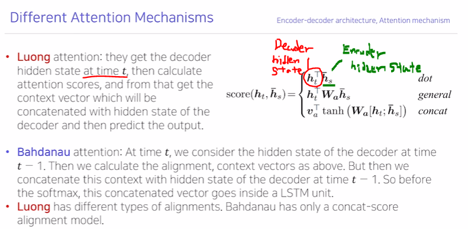

>  Score를 구하는 내적연산을 다양한 연산으로 바꾸어 구함으로써 다른 어텐션 메커니즘이 구현되었다.

### 2.4.1 원래의 내적연산 (dot product)

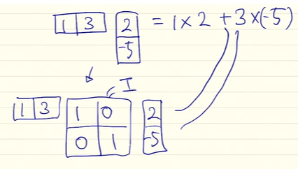

### 2.4.2 확장된 형태의 내적연산인(Generalized dot product)

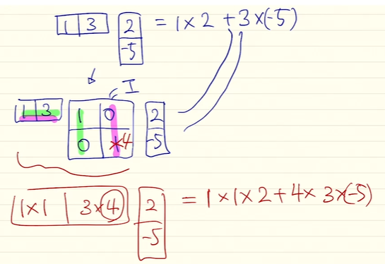

- 원래의 내적연산에서 두번째 Dimension에 가중치 4가 추가된 것임을 알 수 있다.

- 해당 W matrix를 한번더 일반화하여 연산해보자.

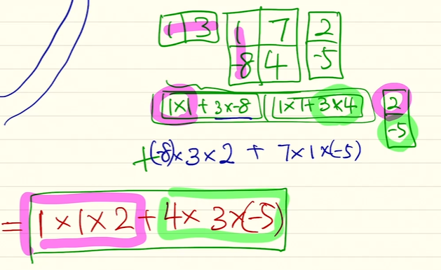

- 앞서 계산했던 부분에서 추가된 부분은 `(-8)X3X2`와 `7X1X(-5)`부분이다.
  - (1,3)은 Decoder의 time-step 단어에 해당하는 hidden state, (2,-5)는 Encoder의 time-step 단어에 해당하는 hidden state이며 이 둘의 유사도(Score)를 구하는 과정임을 기억하자.
  - 같은 디멘젼끼리만의 내적연산이 이루어지던 것을, 다른 디멘젼끼리의 연산까지 고려할 수 있다는 점 (Decoder 1번째와 Encoder 2번째, Decoder 2번째와 Encoder 1번째)
  - 따라서 해당 W Matrix를 학습 가능한 파라미터(a,b,c,d)로 이루어진 행렬이라 생각한다면 이 파라미터들을 조정함으로써 더욱 유연하고 적절하게 유사도를 구해낼 수 있다는 장점이 생기는 것이다.

### 2.4.3. concat 기반의 Attention (Score를 concat 기반으로)

>  아래와 같이 (1,3)은 Decoder의 time-step 단어에 해당하는 hidden state, (2,-5)는 Encoder의 time-step 단어에 해당하는 hidden state가 주어졌을 때 이 둘의 유사도(Score)를 구하는 방법 중 단층 혹은 다층 퍼셉트론을 사용하는 방법이 있을 것이다.

- 단층 퍼셉트론

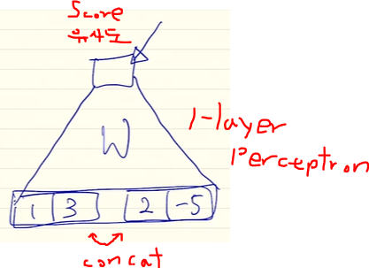

- 다층 퍼셉트론

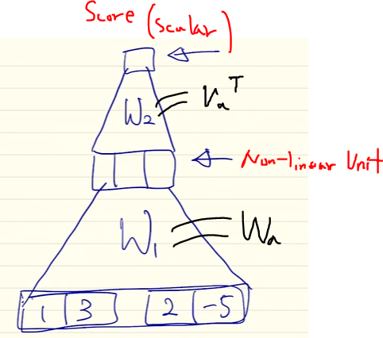

- 유사도(Score)를 구하는 부분이 Generalized Dot product 혹은 concat 기반 MLP를 통해 학습가능한 파라미터가 포함된 모듈로 바뀐 것이다.
- 결국 역전파를 통해 업데이트하고 학습되는 파라미터가 한 단계 더 추가되게 됩니다.
  - 원래도 학습가능한 파라미터가 존재했잖아? 뭔말이야?
  - 아니지, 벡터의 내적을 통해 유사도를 구하는 부분은 업데이트할 파라미터가 없었다. 단순 내적이 아닌 학습가능한 파라미터를 이용한 유사도 측정이라는 부분이 바뀐 것.
  - 원래는 내적을 통해 Score를 구하는 과정이 업데이트 되었던 것이 아니라 역전파를 통해 hidden state vector가 바뀌었을 것임.

## 2.5 Effects of Attention

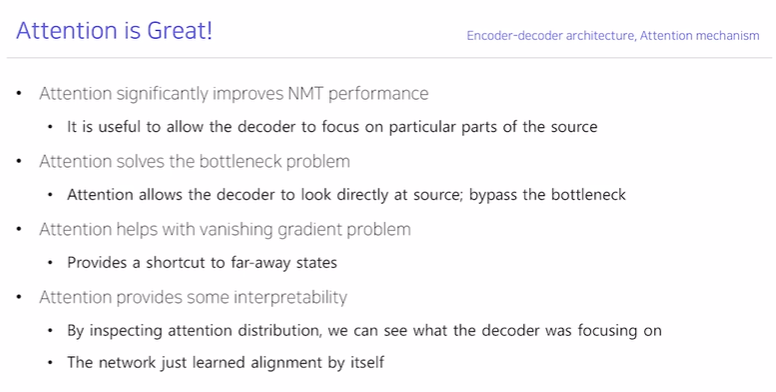

- 기계번역 분야에서 성능을 많이 올릴 수 있었다.
  
  - 이는 Decoder의 매 time-step마다 Encoder의 어떤 부분에 집중할지 결정하고 사용할 수  있기 때문.
- Information BottleNeck 문제, 즉 Encoder의 마지막 hidden state만을 가지고 번역을 해야하는 태스크라는 문제 (이는 긴 문장의 번역에 있어서 매우 성능이 좋지 않게 됨) 를 해결하였음.

- Gradient Vanishing까지 해결가능하다.

  - Encoder의 마지막 hidden state만을 사용해야 한다면, 긴 문장에 있어서 전반에 위치한 단어들에 대해 Long term Dependancy 문제가 대두된다는 것을 알 수 있다.
  - 즉, 다음 그림과 같이 Back propagation을 통해 Gradient가 전달됨에 있어 어떠한 time-step도 거치지 않고 있다는 것이다.
  - 결국 Attention 메커니즘은 Encoder의 모든 hidden state 중 어떤 것에 집중하여 사용할지 결정할 수 있기 때문에 이를 해결했다고 볼 수 있다.

  

  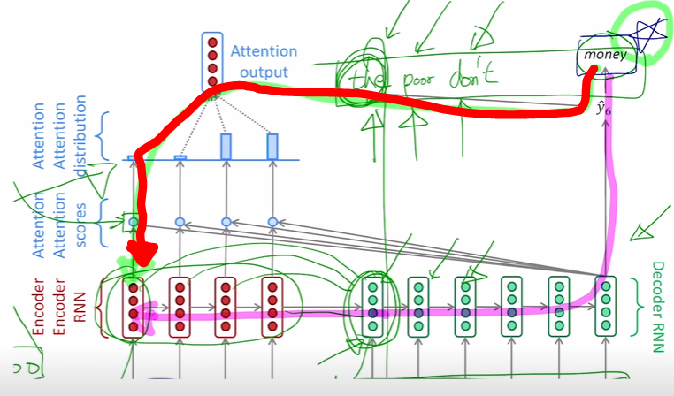

  

- 해석가능성까지 주고 있다.
  
  - Encoder 상의 어떤 단어에 집중해서 현재 time-step의 단어를 예측해냈는지 알 수가 있다.

## 2.6 Attention Examples

- Attention 메커니즘을 통해 문법의 어순까지 적절히 학습할 수 있다.

  - 아래와 같이 번역 태스크를 진행함에 있어서 언어에 따라 문법의 어순이 다른 것까지 고려하여 중요한 부분을 알아서 가중치를 많이 주고 번역해냈음을 알 수 있다.

  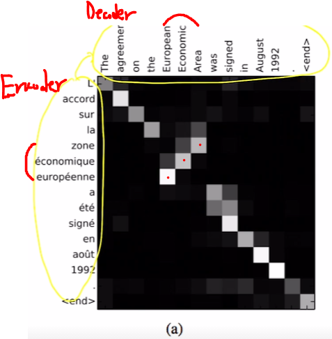

  

  

- 기사에서 불필요한 단어들을 스킵해버릴 수도 있다.

  - 아래와 같이 하나의 단어를 Decoding 해낼 때 여러개의 Encoder상의 단어를 비중두어 사용하는 경우도 있고, Encoder 내의 한 단어가 여러 단어들로 Decoding 되는데 중점적으로 사용되는 경우가 있다.

  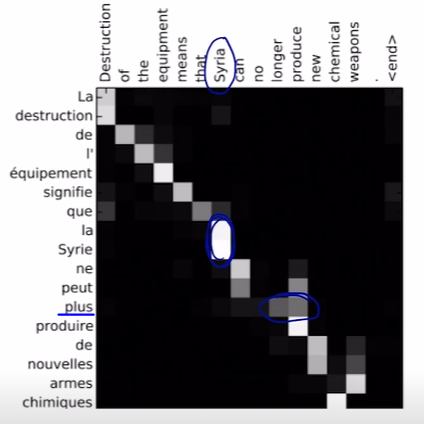

