# 1. BeamSearch

BeamSearch는 문장을 Decoding 하는데 있어서 가장 대표적으로 사용되는 알고리즘입니다.


## 1.1 Introduction

Beam Search 방법을 알아보기에 앞서 이전에는 다음과 같은 방법론들이 있었습니다.


### 1.1.1 Greedy Decoding

- 먼저, 디코딩시 단순히 해당 time-step에서 가장 높은 확률값을 가지는 단어를 Generating하는 Greedy Decoding이라는 방법이 있습니다.
  - 다음 예시를 보면 `he hit` 까지는 잘 맞췄지만 `he hit a`의 a 부분에서 잘못 예측하을 하였다. 하지만 Greedy Decoding은 뒤로 돌아가거나 이를 무르지 못하는 방법론이다.
  - 이와 같은 방법론은 이전 time-step의 단어가 예측이 잘못된 경우, 굉장히 엉뚱하고 잘못된 예측을 하게 되므로 수정이 필요하다.

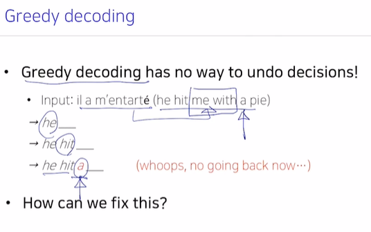


### 1.1.2 Exhaustive Search

- 위의 Greedy Decoding과는 반대된다고 볼 수 있는 Exhaustive Search라는 방법도 존재한다.
- 아래의 예시에서 `y`는 출력문장, `x`는 입력문장
  - `y1`은 출력할 문장 중 예측한 첫번째 단어이다.
  - `y2`는 출력할 문장 중 두번째 단어이므로 앞서 예측한 첫번째 단어`y1`과 입력문장 `x`이 주어졌을 때를 고려하여 구하게 된다.
  - 이와 같이 동시사건확률을 나타내는 joint Probabiliy를 고려하여 구할 수 있을 것이다.
  - 결국 가장 높은 확률을 가지는 P(y|x)를 구하는 것을 목표로 하게 된다.


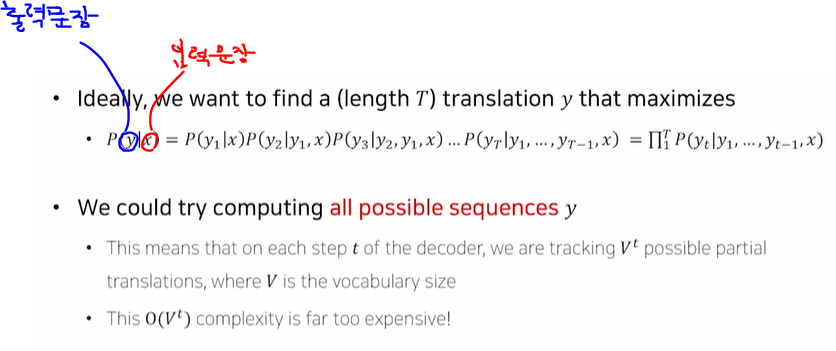

- 결국 Exhaustive Search라는 관점에서 문장생성을 하게 된다면 문장을 여러가지 다 만들어놓고 이들 중 가장 높은 확률의 문장을 선택하게 된다.
  -  y1까지의 단어는 매우 큰 확률값이 되도록 예측해놓아도 뒤에서 노력하여 만들어낸 y2, .. yT 에 대한 확률값까지 고려하면 전체 joint 확률값이 상대적으로 작을 수 있게 된다.
  - 따라서 하나하나 각 문장들의 joint 확률을 다 비교하여 선택해야 하게 된다. (기하급수적으로 계산해봐야 할 경우의 수가 늘어날 수 있음..)


> 즉, 이러한 Exhaustive Search 방법으로 문장을 generate할 때 확률값에 기반한 무수히 많은 경우의 수가 존재하는데, 이들을 모두 고려하는 것은 비효율적입니다.(Vocab Size만큼에 비례하여 늘어나는 경우의 수...)
>
> 또한 너무 작은 확률값을 고려하게 되므로 문장의 quality가 떨어질 수 있다. 
>
> 그렇다고 해당 time-step에서 가장 높은 확률값만을 고려하는 Greedy Decoding방법 역시 모델이 단순한 generation을 하도록 하게 만드는 단점으로 작용할 수 있습니다.


- 이러한 문제들의 대안으로 제안된 것이 Beam Search입니다.


## 1.2 Beam Search

Beam Search는 위의 Greedy Decoding 방법과 Exhaustive Search 방법의 중간 정도의 개념이라고 볼 수 있습니다.

- 번역문제를 생각해보았을 때, 각 Time-step에서 단어를 Decoding할 때, k 개의 후보군들을 생각해놓습니다.

- 아래의 수식을 살펴보면, 위의 Exhaustive Search 방법과는 Log를 취해서 구해주었다는 점에서 그 차이가 있다.

  - 확률값의 곱이 아닌 합으로서 표현되는데 결국 이를 가장 높게 만든다는 점에서 동일하며, 확률값에 Log를 취해주었으므로 음의 값을 가지게 된다.

  

- 전역 최적의 솔루션을 가져다주진 않지만, Exhaustive Search 방법보다 훨씬 효율적이라는 것을 직관적으로 알 수 있습니다.


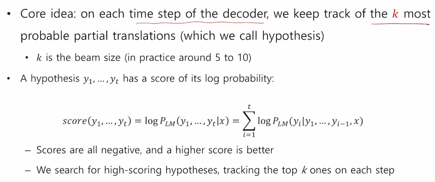

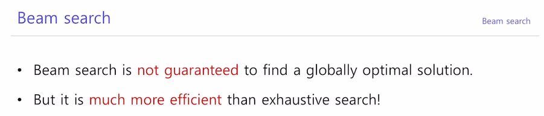


## 1.3 Example of Beam Search

Beam Size가 2인 경우를 생각해보자. (k=2)


> Step1)
>
> -0.7을 가지는 `he`가 -0.9를 가지는 `I`보다 확률값(Score)이 크긴 함.
>
> k=2 개의 Hypotheses를 고려하게 됨.
>
> 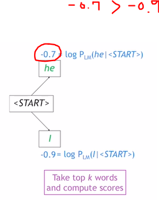


> Step2)
>
> 현재 k^2=4 개의 Hypotheses를 고려하게 되었지만 k=2로 정해두었으므로 2개만을 고르게 됨.
>
> 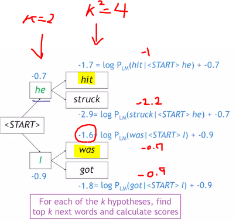


>Step3)
>
>이번에도 4개의 Hypotheses를 고려하게 되었지만 Top2를 고르게 됨.
>
>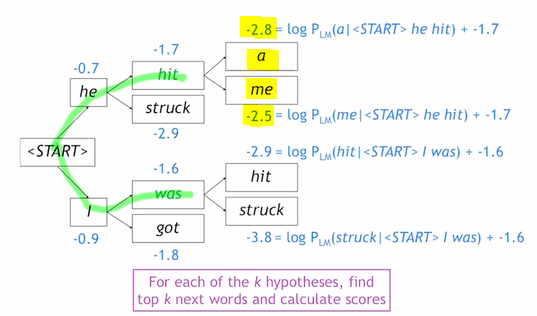


>  Step N)
>
> 다음과 같이 반복...
>
> 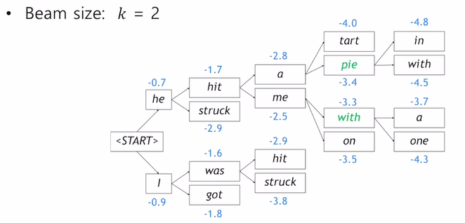


## 1.4 Beam Search: Stopping criterion


> Greedy Decoding은 <END> token이 생성되었을 때 멈췄었는데, 그렇다면 Beam Search는 언제 Decoding을 멈추게 되는 걸까?


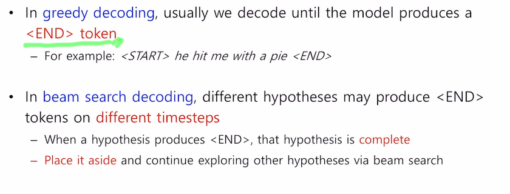

```
Beam Search는 동일하지 않게, 각기 다른 time-step에서 END token을 생성하는 여러가지의 가설들이 생기게 됩니다.
- 여러가지 가설을 진행하면서 어느 가설에서 END token이 생성되었다면, 해당 가설은 Generate를 중지한다. (해당 가설은 문장이 끝난 것으로 본다.)
- 여전히 진행중인 다른 가설들은 END token이 생성될 때까지 Generate를 각각 진행하게 된다.
```


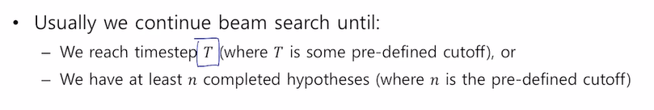

``` 
T라는 사전에 지정한 종료 time-step에 도달했을 때 멈추거나,

사전에 지정해놓은 n이라는 값에 도달할만큼의 완료된 가설들이 쌓였을 때 Beam Search를 중지하게 됩니다.

```


> Beam serach Stopping 후, 마무리 작업은 어떻게 하게 되는가?

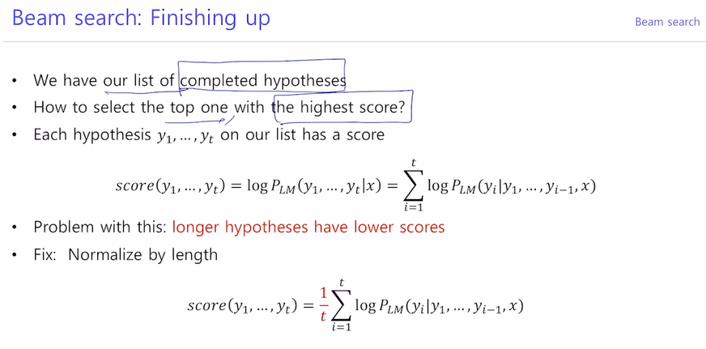

```
가장 점수(joint Probability)가 높은 가설의 문장을 골라야 한다.
- 하지만 위의 점수를 사용하게 되면 긴 문장일수록 점수 측면에서 불리하게 됩니다. (음의 값을 계속해서 더해나가는 구조이기 때문에..)
- 따라서 문장의 길이로 Normalize를 해주어 점수를 구해 비교해주면 됩니다. (각 Word에 대한 확률의 평균 값)
```


# 2. BLEU SCORE

번역 task에서 번역된 문장을 평가하는 대표적인 metric이다.

BLEU SCORE를 살펴보기 전 다른 Metric은 어떤 위험이 있는지 알아보자.


### 2.1 Introduction

아래와 같이 각 time-step마다 정답을 맞췄는지를 고려하는 Metric은 성능 평가에 있어 실수를 범하게 된다.

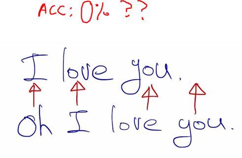


> 그렇다면, 모델의 성능을 평가하기 위한 Metric으로 Precision(정밀도) 과 Recall(재현율), F-measure 값을 생각해보자.
>
> - Precision 값은 예측결과가 생성되었을 때 우리가 실질적으로 느끼는 정확도.
>
>   - 우리가 구글검색을 했을 때 검색결과로 나온 결과들이 몇개나 겹치게 나타내고 있는지 느낄 수 있는 정확도
>
> - Recall 값은 내가 어떤 키워드를 가지고 검색을 했을 때, 이 입력 키워드들을 기반으로 얼마나 겹치게 검색결과를 냈는가를 나타내는 정확도.
>
> - F-measure 값은 Precision과 Recall 값의 조화평균으로부터 생성되는 정확도
>
>   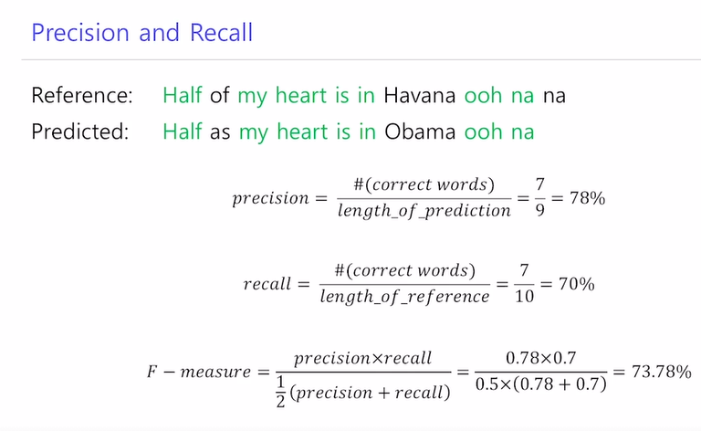


- 평균들 중 가장 작은 조화평균

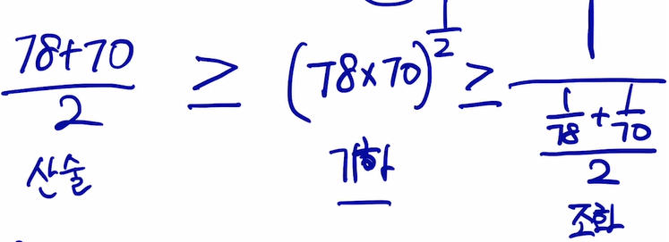


> 그렇다면 이러한 정확도들을 사용해도 될까?
>
> - 다음과 같은 예시를 보면, Model2의 예측결과는 문법이 전혀 맞고 있지 않다 (문법적 어순 무시)
> - 그런데도 불구하고 100%라는 정확도 측정값을 도출해내는 실수를 범하였다.
>
> 
>
> 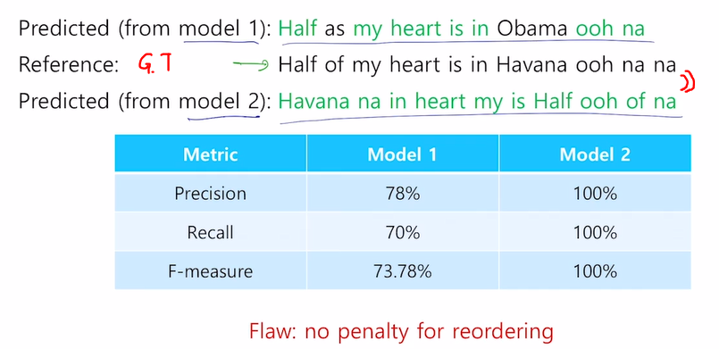


## 2.2 BLEU SCORE

1-gram씩 살펴보는 것은 물론이고, N-gram 뭉텅이가 겹치는지까지 고려하여 측정하는 정확도


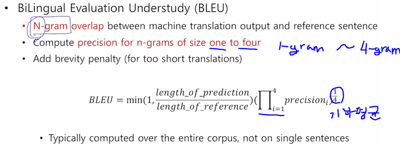

```
산술평균보다는 쫌 작은 값의 기하평균을 고려하였습니다.
- 조화평균은 왜 사용하지 않았을까?
- 조화평균은 작은 값에 너무 큰 가중치를 두게 되는 경향이 있기 때문에 사용되지 않았다고 함.

brevity penalty (짧은 문장에 대한 Penalty)
- min() 항이 Penalty를 나타내는데, 다음과 같은 원리이다.
- 만약 ref 길이가 10인데 prediction을 7만큼만 했다고 하자.
- 그렇다면 min(1, 0.7)로부터 0.7값을 해당 정확도(Score)값에 곱하여 패널티를 주게 되는 것이다.
- 만약 1보다 클 때(pred가 ref보다 길이가 크거나 같을때)에는 1로 유지되므로 정확도 값이 그대로 유지된다. (패널티 x)
- Recall값 없이 Precision 값만을 고려하기 때문에 Predict를 짧게 할수록 Score 상에서 유리하기 때문이다(길이가 짧아질수록 정확도값이 높아지는 경향)
```


> ※ 유의할 점 : 수식을 보면 알 수 있듯, BLEU SCORE를 계산할 시에는 precision 값만을 고려합니다 (Recall 값은 전혀 고려하지 않는다)
>
> - 가령 `I love this movie very much`라는 G.T 문장이 있을 때, `나는 이 영화를 많이 사랑한다`라고 Decoding 해냈을 때를 생각해보자.
> - 이는 번역결과가 `very`에 해당하는 `정말`이라는 단어를 빠뜨렸음을 알 수 있지만, 이는 번역에 있어서 그다지 큰 오류를 나타내지 않습니다.
> - 따라서, Reference에 기반하여 정확도를 구하기보다(Recall보다)
> - Predict 결과만을 보고 실질적으로 느끼는 정확도를 나타내는 Precision을 고려하는 것이 일리가 있습니다.


>  ※ 유의할 점 : Recall 값 역할도 하는 brevity Penalty
>
> 이처럼 간단하게 계산되는 Brevity Penaly는 또한 Recall 값의 최대값으로서 역할을 할 수가 있다.
> 1) 예를 들어, ref 길이도 10이고 pred 길이도 10인 경우에 10개의 단어가 모두 매칭되었다고 생각해보자. (recall의 최대값=10/10=1)
>
> - 그러면 penalty 항 역시 1이고 recall 값으로서 나올 수 있는 최대값임.
>
> 2) 두번째 예로서 ref 길이가 11, pred가 10일 때 10개의 단어가 모두 매칭되었다고 생각하면 (recall의 최대값)=10/11)
>
> - penalty 항은 min(1,10/11)=10/11이고 역시 이 상황에서 나올 수 있는 recall의 최대값임.
>
> 2) 세번째 예로서 ref 길이가 9, pred가 10일 때 9개의 단어가 모두 매칭되었다고 생각하면 (recall의 최대값=9/9=1)
>
> - penalty 항은 min(1,10/9)=1이고 이 상황에서 나올 수 있는 recall의 최대값과 일치함.
>
> 이처럼, Penalty값은 Recall 값의 역할도 어느 정도 하고 있음을 직관적으로 알 수 있다.


## 2.3 BLEU SCORE 예시


#### N-gram

- n-gram 각각에 대해 Score를 계산해보면 다음과 같이 나옵니다.

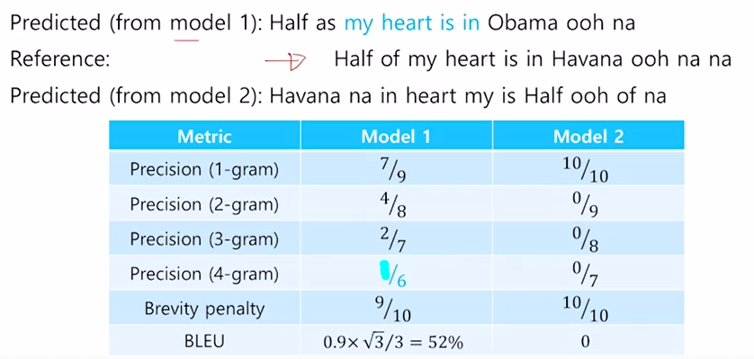


#### 4-gram

예시로 4-gram을 직접 다음과 같이 구해보았습니다. (Model1 = 1/6), (Model2 = 0)

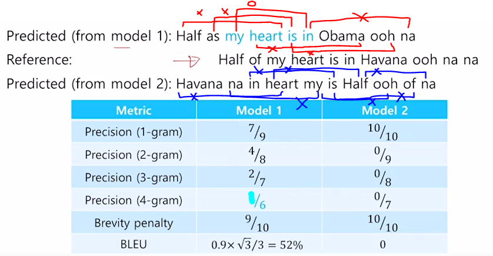

> 결국,
>
> Model1의 BLEU SCORE값은 0.52
>
> Model2의 BLEU SCORE는 0으로 구해졌습니다.


## 2.4 BLEU SCORE 단점

BLEU score가 번역 문장 평가에 있어서 갖는 단점은 무엇이 있을까요?


> ex)  Ground Truth : 나는 정말 맛있게 밥을 먹었다
>
> predicted1 : 나는 밥을 정말 맛있게 먹었다
>
> predicted2 : 나는 매우 맛있게 쌀밥을 먹었다


BLEU의 단점)


It doesn't consider meaning.
It doesn't directly consider sentence structure.
It doesn't handle morphologically rich languages well.
It doesn't map well to human judgements.

One problem with BLEU scores is that they tend to favor short translations, which can produce very high precision scores, even using modified precision.