# 그래프

## 그래프란 무엇이고 왜 중요할까?

### 그래프란 무엇일까?

그래프(Graph)는 정점 집합과 간선 집합으로 이루어진 수학적 구조입니다.

하나의 **간선**은 두 개의 **정점**을 연결합니다.
모든 **정점** 쌍이 반드시 **간선**으로 직접 연결되는 것은 아닙니다.

그래프는 **네트워크(Network)**로도 불립니다.
**정점(Vertex)**은 **노드(Node)**로 **간선**은 **엣지(Edge)** 혹은 **링크(Link)**로도 불립니다.

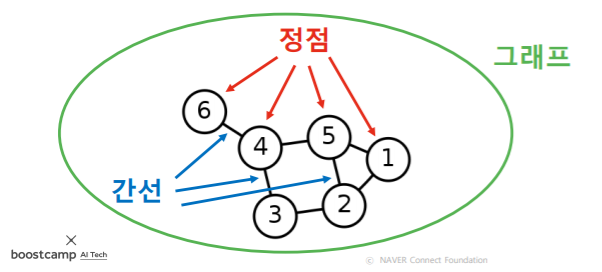

우리 주변에는 많은 복잡계(ComplexSystem)가 있습니다.

사회는 70억 인구로 구성된 복잡계입니다.
통신 시스템은 전자 장치로 구성된 복잡계입니다.
그 밖에도, 정보와 지식, 뇌, 신체 역시 복잡계로 생각할 수 있습니다.

Q. 이런 복잡계가 가진 공통적인 특성은 무엇일까요?
A. 구성 요소 간의 복잡한 상호작용입니다.


Q. 이런 복잡계를 어떻게 표현할까요?
A. 그래프(Graph) 입니다!

**그래프**는 복잡계를 표현하고 분석하기 위한 **언어**입니다.

복잡계는 구성 요소들 간의 **상호작용**으로 이루어집니다.
**상호작용**을 표현하기 위한 수단으로 **그래프**가 널리 사용됩니다.

복잡계를 **이해**하고, 복잡계에 대한 정확한 **예측**을 하기 위해서는 복잡계 이면에 있는 **그래프**에 대한 이해가 반드시 필요합니다.

그래프를 공부함으로써 복잡계가 등장하는 **수많은 분야**에 활용할 수 있습니다. 전산학, 물리학, 생물학, 화학, 사회과학 등이 그 예시입니다.


## 그래프 관련 인공지능 문제

### 정점 분류(Node Classification) 문제

트위터에서의 공유(Retweet) 관계를 분석하여, 각 사용자의 정치적 성향을 알 수 있을까?

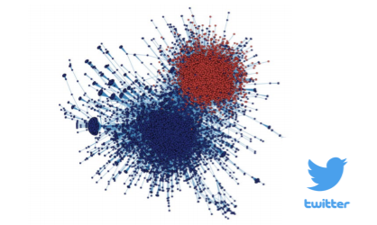

단백질의 상호작용을 분석하여 단백질의 역할을 알아낼 수 있을까?

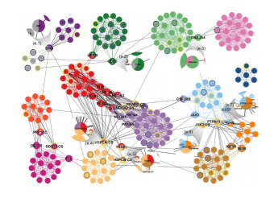


### 연결예측(Link Prediction) 문제

페이스북 소셜네트워크는 어떻게 진화할까?

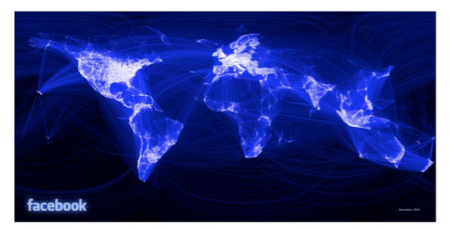


### 추천(Recommendation) 문제

각자에게 필요한 물건은 무엇일까? 어떤 물건을 구매해야 만족도가 높을까?


### 군집분석(Community Detection) 문제

연결 관계로부터 사회적무리(Social Circle)을 찾아낼 수 있을까?

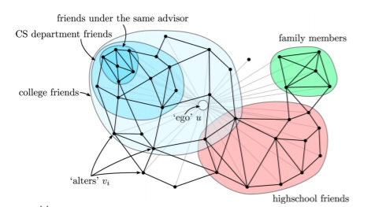


### 랭킹(Ranking) 및 정보 검색(Information Retrieval) 문제

웹(Web)이라는 거대한 그래프로부터 어떻게 중요한 웹페이지를 찾아낼 수 있을까?

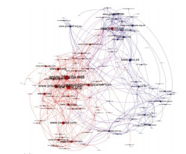


### 정보전파(Information Cascading) 및 바이럴 마케팅(Viral Marketing) 문제

정보는 네트워크를 통해 어떻게 전달될까? 어떻게 정보 전달을 최대화 할 수 있을까?

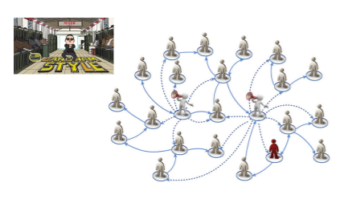


------

## 그래프 관련 필수 기초 개념

### 그래프의 유형 및 분류

- 방향 (Undeirected Graph vs Directed Graph)


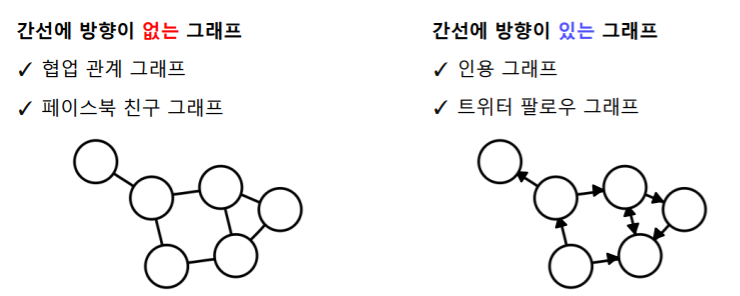

- 가중치 (Unweighted Graph vs Weighted Graph)


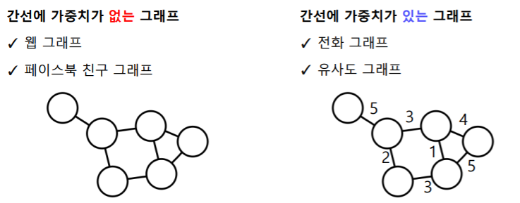

- 종류 (Unpartite Graph vs Bipartite Graph)


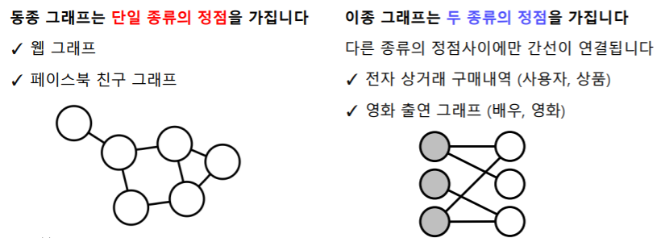


Q. 다음 전자 상거래 구매 내역은 어떤 유형의 그래프일까요?


> A. 방향성이 없고, 가중치가 있는 이종 그래프입니다.


### 그래프 관련 필수 기초 개념

**그래프(Graph)**는 정점 집합과 간선 집합으로 이루어진 수학적 구조입니다.

보통 정점들의 집합을 *V*, 간선들의 집합을 *E*, 그래프를 *G*=(*V*,*E*) 로 적습니다.

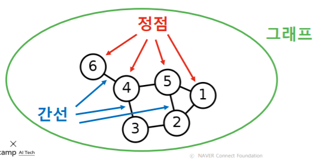


정점의 **이웃(Neighbor)**은 그 정점과 연결된 다른 정점을 의미합니다.

정점 *V* 의 이웃들의 집합을 보통 *N*(*v*) 혹은 $N_v$ 로 적습니다.

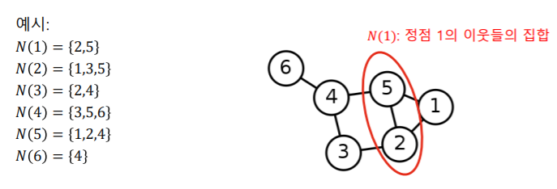


방향성이 있는 그래프에서는 나가는 이웃과 들어오는 이웃을 구분합니다.

정점 *v* 에서 간선이 나가는 이웃(Out-Neighbor)의 집합을 보통 *N*_out(*v*) 로 적습니다.
정점 *v* 에서 간선이 들어오는 이웃(In-Neighbor)의 집합을 보통 *N* _in(*v*) 로 적습니다.

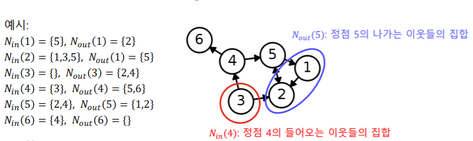


## 그래프의 표현 및 저장

### 파이썬 라이브러리 NetworkX

NetworkX를 이용하여, 그래프를 생성, 변경, 시각화할 수 있습니다.
그래프의 구조와 변화 역시 살펴볼 수 있습니다.

자세한 정보는 아래 링크에서 찾을 수 있습니다.
https://networkx.org/documentation/stable/index.html

본 수업에서는 사용하지 않지만, Snap.py 라는 라이브러리도 많이 사용됩니다.

https://snap.stanford.edu/snappy/

- 필요한 라이브러리를 불러옵니다.

```python
# 실습에 필요한 library를 임포트합니다.
import network x as nx # NetworkX
import numpy as np # 선형대수를 위한 라이브러리
import matplotlib.pyplot as plt # 그림을 그리기 위한 라이브러리
```

- 그래프를 초기화합니다.

```python
print('###### Graph Init ######')
G = nx.Graph() # 방향성이 없는 그래프 초기화
DiGraph = nx.DiGraph() # 방향성이 있는 그래프 초기화
```

- 정점을 추가하고, 정점의 수를 세고, 목록을 반환합니다.

```python
print('###### Add Node to Graph ######')
print('# Add node 1')
G.add_node(1) # 정점 1 추가
print('Num of nodes in G : ' + str(G.number_of_nodes())) # 정점의 수 반환
print('Graph : ' + str(G.nodes) + '\n') # 정점의 목록 반환
```

- 더 많은 정점을 추가합니다

```python
print('# Add node 2 ~ 10') # 정점 2 ~ 10 추가
for i in range(1, 11):
    G.add_node(i)
print('Num of nodes in G : ' + str(G.number_of_nodes()))
print('Graph : ' + str(G.nodes) + '\n')
```

- 간선을 추가하고, 목록을 반환합니다

```python
print('###### Add Edge to Graph ######')
print('#Add edge (1, 2)')
G.add_edge(1, 2) # 정점 1 과 2 사이에 간선 추가
print('Graph : ' + str(G.edges) + '\n') # 간선의 목록을 반환
```

- 더 많은 간선을 추가합니다.

```python
print('#Add edge (1, i) for i = 2 ~ 10') # 정점 1과 다른 정점 사이의 간선 추가
for i in range(1, 11):
    G.add_edge(1, i)
print('Graph : ' + str(G.edges) + '\n')
```

- 만들어진 그래프를 시각화합니다

```python
# 그래프를 시각화
# 정점의 위치 결정
pos = nx.spring_layout(G)
# 정점의 색과 크기를 지정하여 출력
im = nx.draw_networkx_nodes(G, pos, node_color='red', node_size=100)
# 간선 출력
nx.draw_networkx_edges(G, pos)
# 각 정점이 라벨을 출력
nx.draw_networkx_labels(G, pos, font_size=10, font_color='black')
plt.show()
```

### 그래프의 표현 및 저장

**간선 리스트(Edge List)**: 그래프를 간선들의 리스트로 저장

각 간선은 해당 간선이 연결하는 두 정점들의 순서쌍(Pair)으로 저장됩니다.


방향성이 있는 경우에는 **(출발점, 도착점)** 순서로 저장됩니다.


**인접 리스트(Adjacent list)**

- 방향성이 없는 경우
  각 정점의 이웃들을 리스트로 저장
  
- 방향성이 있는 경우
  각 정점의 나가는 이웃들과 들어오는 이웃들을 각각 리스트로 저장
  


**인접 행렬(AdjacencyMatrix)**

- 방향성이 없는 경우

  정점 수

   

  ×

   

  정점 수 크기의 행렬

  - 정점 *i* 와 *j* 사이에 간선이 **있는** 경우, 행렬의 *i* 행 *j* 열 (그리고 *j* 행 *i*열) 원소가 **1**
  - 정점 *i* 와 *j* 사이에 간선이 **없는** 경우, 행렬의 *i* 행 *j* 열 (그리고 *j* 행 *i*열) 원소가 **0**


- 방향성이 있는 경우

  정점 수

   

  ×

   

  정점 수 크기의 행렬

  - 정점 *i* 에서 *j* 로의 간선이 **있는** 경우, 행렬의 *i* 행 *j* 열 원소가 **1**
  - 정점 *i* 에서 *j* 로의 간선이 **없는** 경우, 행렬의 *i* 행 *j* 열 원소가 **0**


### NetworkX를 이용하여 그래프를 표현하고 저장하기

**인접 리스트**

```python
# 그래프를 인접 리스트로 저장
nx.to_dict_of_lists(G)
```


**간선 리스트**

```python
# 그래프를 간선 리스트로 저장
nx.to_edgelist(G)
```


**일반 행렬**
전체 원소를 저장하므로 정점 수의 제곱에 비례하는 저장 공간을 사용

```python
# 그래프를 인접 행렬(일반 행렬)로 저장
nx.to_numpy_array(G)
```


**희소 행렬**
0이 아닌 원소만을 저장하므로 간선의 수에 비례하는 저장 공간을 사용

```python
# 그래프를 인접 행렬(희소 행렬)로 저장
nx.to_scipy_sparse_matrix(G)
```


**일반 행렬** vs **희소 행렬**
정점의 수가10만, 간선의 수가 100만이라면
정점의 수의 제곱 (100억) >> 간선의 수 (100만)


# 실제 그래프

## 실제 그래프

> 실제 그래프(Real Graph)란 다양한 복잡계로 부터 얻어진 그래프를 의미합니다

소셜 네트워크, 전자상거래 구매 내역, 인터넷, 웹, 뇌, 단백질 상호작용, 지식 그래프 등


MSN 메신저 그래프

- 1억 8천만 정점 (사용자)
- 13억 간선 (메시지를 주고받은 관계)


------

## 랜덤 그래프

> 랜덤 그래프(Random Graph)는 확률적 과정을 통해 생성한 그래프를 의미합니다.

### 에르되스-레니 랜덤 그래프(Erdős-Rényi Random Graph)

임의의 두 정점 사이에 간선이 존재하는지 여부는 동일한 확률 분포에 의해 결정됩니다.

에르되스-레니 랜덤그래프 *G*(*n*,*p*) 는

- *n*개의 정점을 가집니다
- 임의의 두 개의 정점 사이에 간선이 존재할 확률은 *p*입니다
- 정점 간의 연결은 서로 독립적(Independent)입니다.


Q. *G*(3,0.3) 에 의해 생성될 수 있는 그래프와 각각의 확률은?
A.


------

## 작은 세상 효과

### 경로

정점 𝑢와 𝑣의 사이의 **경로(Path)**는 아래 조건을 만족하는 정점들의 순열(Sequence)입니다.

(1) *u* 에서 시작해서 *v* 에서 끝나야 합니다.
(2) 순열에서 연속된 정점은 간선으로 연결되어 있어야 합니다.


정점 1과 8 사이의 경로 예시:
1, 4, 6, 8
1, 3, 4, 6, 8
1, 4, 3, 4, 6, 8

정점 1과 8 사이의 경로가 아닌 순열의 예시:
**1**, **6**, 8
1, 3, 4, **5**, **6**, 8


**경로의 길이**

경로의 길이는 해당 경로 상에 놓이는 간선의 수로 정의됩니다.

경로 1, 4, 6, 8의 길이는 3 입니다
경로 1, 3, 4, 6, 8의 길이는 4 입니다
경로 1, 4, 3, 4, 6, 8의 길이는 5 입니다


### 거리

정점 *u* 와 *v* 의 사이의 **거리(Distance)**는 *u* 와 *v* 사이의 최단 경로의 길이입니다.


정점 1과 8 사이의 **최단 경로(Shortest Path)**는 1, 4, 6, 8 입니다.
해당 경로의 **길이**는 3 입니다.
따라서 정점 1과 8 사이의 **거리**는 3 입니다.


### 지름

그래프의 **지름(Diameter)**은 정점 간 거리의 최댓값입니다


예시 그래프에서의 **지름**은 4 입니다.
이는 정점 2와 8 사이의 최단 경로의 거리와 같습니다.


### 작은 세상 효과

여섯 단계 분리(Six Degrees of Separataion) 실험

- 사회학자 스탠리 밀그램(Stanley Milgram)에 의해 1960년대에 수행된 실험입니다.
- 오마하 (네브라스카 주)와 위치타 (켄사스 주)에서 500명의 사람을 뽑았습니다.
- 그들에게 보스턴에 있는 한 사람에게 편지를 전달하게끔 하였습니다
- 단, 지인를 통해서만 전달하게끔 하였습니다.


Q. 목적지에 도착하기까지 몇 단계의 지인을 거쳤을까요?
A. 25%의 편지만 도착했지만, 평균적으로 **6** 단계만을 거쳤습니다.


Q. MSN 메신저 그래프에서는 어떨까요?
A. 정점 간의 평균 거리는 7 정도 밖에 되지 않습니다.
(단, 거대 연결 구조만 고려했습니다.)


이러한 현상을 **작은 세상 효과(Small-world Effect)**라고 부릅니다.

한국에서는 “사돈의 팔촌”이 먼 관계를 나타내는 표현으로 사용됩니다.
즉, 아무리 먼 관계도 결국은 사돈의 팔촌(10촌 관계)입니다.

작은 세상 효과는 높은 확률로 랜덤 그래프에도 존재합니다.

모든 사람이 100명의 지인이 있다고 가정해봅시다.
다섯 단계를 거치면 최대 100억(= 1005)명의 사람과 연결될 수 있습니다.
단, 실제로는 지인의 중복 때문에 100억 명보다는 적은 사람일 겁니다.
하지만 여전히 많은 사람과 연결될 가능성이 높습니다.


하지만 모든 그래프에서 작은 세상 효과가 존재하는 것은 아닙니다

체인(Chain), 사이클(Cycle), 격자(Grid) 그래프에서는 작은 세상 효과가 존재하지 않습니다.


------

## 연결성의 두터운 꼬리 분포

### 연결성

정점의 **연결성(Degree)**은 그 정점과 연결된 간선의 수를 의미합니다.

정점 *v* 의 연결성은 해당 정점의 이웃들의 수와 같습니다.
보통 정점 *v* 의 연결성은 *d*(*v*), *d**v*​ 혹은 ∣*N*(*v*)∣ 로 적습니다.


정점의 **나가는 연결성(Out Degree)**은 그 정점에서 나가는 간선의 수를 의미합니다.
보통 정점 𝑣의 나가는 연결성은 *d**o**u**t*​(*v*) 혹은 ∣*N**o**u**t*​(*v*)∣ 으로 표시합니다.

정점의 **들어오는 연결성(In Degree)**은 그 정점으로 들어오는 간선의 수를 의미합니다.
보통 정점 𝑣의 들어오는 연결성은 *d**i**n*​(*v*) 혹은 ∣*N**i**n*​(*v*)∣으로 표시합니다.


### 연결성의 두터운 꼬리 분포

실제 그래프의 연결성 분포는 **두터운 꼬리(Heavy Tail)**를 갖습니다. 즉, 연결성이 매우 높은 **허브(Hub)** 정점이 존재함을 의미합니다.


랜덤 그래프의 연결성 분포는 높은 확률로 **정규 분포**와 유사합니다.
이 경우, 연결성이 매우 높은 **허브(Hub)** 정점이 존재할 가능성은 0에 가깝습니다.
정규 분포와 유사한 예시로는 키의 분포가 있습니다.
키가 10 미터를 넘는 극단적인 예외는 존재하지 않습니다.


### 실제 그래프 vs 랜덤 그래프


------

## 거대 연결 요소

### 연결 요소

**연결 요소(Connected Component)**는 다음 조건들을 만족하는 정점들의 집합을 의미합니다.

(1) 연결 요소에 속하는 정점들은 경로로 연결될 수 있습니다.
(2) (1)의 조건을 만족하면서 정점을 추가할 수 없습니다.


예시 그래프에는 3개의 연결 요소가 존재합니다.
{1,2,3,4,5}, {6,7,8}, {9}

{1,2,3,4}는 조건 (2)를 위배합니다.
→ (1)의 조건을 만족하면서 정점 5를 추가할 수 있다.

{6,7,8,9}는 조건 (1)을 위배합니다.


### 거대 연결 요소

실제 그래프에는 **거대 연결 요소(Giant Connected Component)**가 존재합니다.
거대 연결 요소는 대다수의 정점을 포함합니다.

MSN 메신저 그래프에는 99.9%의 정점이 하나의 거대 연결 요소에 포함됩니다.


랜덤 그래프에도 높은 확률로 **거대 연결 요소(Giant Connected Component)**가 존재합니다.

단, 정점들의 평균 연결성이 1보다 충분히 커야 합니다.
자세한 이유는 **Random Graph Theory**를 참고하시기 바랍니다.


------

## 군집 구조

### 군집

**군집(Community)**이란 다음 조건들을 만족하는 정점들의 집합입니다.

(1) 집합에 속하는 정점 사이에는 많은 간선이 존재합니다.
(2) 집합에 속하는 정점과 그렇지 않은 정점 사이에는 적은 수의 간선이 존재합니다.

수학적으로 엄밀한 정의는 아닙니다.


예시 그래프에는 11 개의 군집이 있는 것으로 보입니다.


### 지역적 군집 계수

**지역적 군집 계수(Local Clustering Coefficient)**는 한 정점에서 군집의 형성 정도를 측정합니다.

정점 *i* 의 지역적 군집 계수는 정점 *i* 의 이웃 쌍 중 간선으로 직접 연결된 것의 비율을 의미합니다.
정점 *i* 의 지역적 군집 계수를 *C**i*​로 표현합시다.

예시 그래프를 살펴봅시다.

정점 1의 이웃은 4개이며, 총 6개의 이웃 쌍이 존재합니다.
**(2, 3)**, **(2, 4)**, (2, 5), (3, 4), (4, 5), **(3, 5)**
그 중 3개의 쌍이 간선으로 직접 연결 되어 있습니다.

따라서, *C*1=63=0.5


이웃쌍 사이에 간선이 추가될 경우 지역적 군집 계수가 높아지는 것을 확인할 수 있다.

참고로 연결성이 0인 정점에서는 지역적 군집 계수가 정의되지 않습니다.


잠깐, 지역적 군집 계수가 군집이랑 어떻게 연결되는 것이죠?

정점 *i* 의 지역적 군집 계수가 매우 높다고 합시다.
즉, 정점 *i* 의 이웃들도 높은 확률로 서로 간선으로 연결되어 있습니다.
정점 *i* 와 그 이웃들은 높은 확률로 군집을 형성합니다.


### 전역 군집 계수

**전역 군집 계수(Global Clustering Coefficient)**는 전체 그래프에서 군집의 형성 정도를 측정합니다.

그래프 *G* 의 **전역 군집 계수**는 각 정점에서의 지역적 군집 계수의 **평균**입니다.
단, 지역적 군집 계수가 정의되지 않는 정점은 제외합니다.


실제 그래프에서는 **군집 계수**가 높습니다. 즉 많은 **군집**이 존재합니다.

여러가지 이유가 있을 수 있습니다.

**동질성(Homophily)**: 서로 유사한 정점끼리 간선으로 연결될 가능성이 높습니다. 같은 동네에 사는 같은 나이의 아이들이 친구가 되는 경우가 그 예시입니다.


**전이성(Transitivity)**: 공통 이웃이 있는 경우, 공통 이웃이 매개 역할을 해줄 수 있습니다. 친구를 서로에게 소개해주는 경우가 그 예시입니다.


반면 랜덤 그래프에서는 **지역적 혹은 전역 군집 계수**가 높지 않습니다.
구체적으로 랜덤 그래프 *G*(*n*,*p*) 에서의 군집 계수는 *p* 입니다.
랜덤 그래프에서의 간선 연결이 독립적인 것을 고려하면 당연한 결과입니다.
즉 공통 이웃의 존재 여부가 간선 연결 확률에 영향을 미치지 않습니다. (동질성, 전이성이 없다.)


------

## 군집 계수 및 지름 분석

다음 세 종류의 그래프의 구조를 분석합니다.
작은 세상 그래프는 균일 그래프의 일부 간선을 임의로 선택한 간선으로 대체한 그래프입니다.


