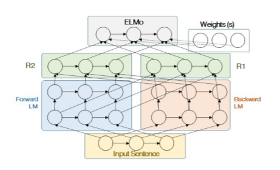
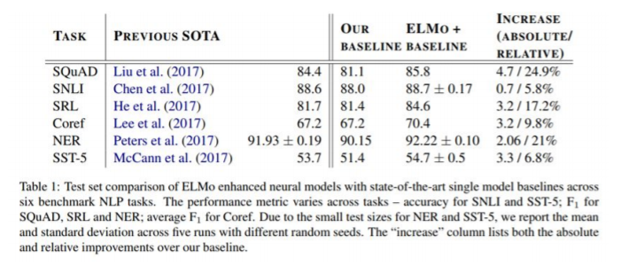
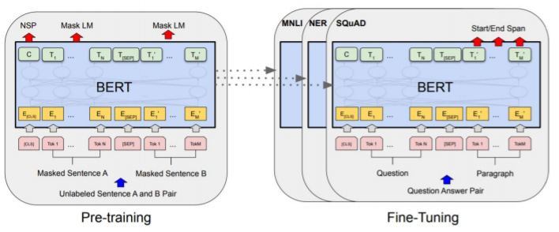
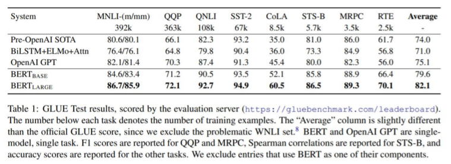
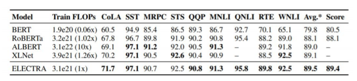

## 1. **양방향 언어 모델링 (Bidirectional Language Modeling)**

 

Language Modeling은 **주어진 문맥을 활용해 다음에 나타날 단어를 예측하는 모델**을 뜻합니다. 

양방향 언어 모델링에는 대표적인 ELMo, BERT 두 가지가 있습니다.

 

#### **1) ELMo**

ELMo는 텍스트에 대응되는 embedding을 뽑아서 특정한 task를 수행했을 때 모든 task에 대해서 효과적인 Model입니다. ELMo는 다음과 같이 Forward LM과 Backward LM으로 구성됩니다.

 

- Forward LM : 단어의 순서대로 Language Modeling을 수행
- Backward LM : 단어의 반대 순서대로 Language Modeling을 수행

이후, 두 개의 모델의 output embedding을 합쳐서 새로운 embedding을 뽑은 후 task를 수행합니다.

 

 

ELMo는 "각각의 task에서 각각의 모델을 사용한 방법"보다 "ELMo 한 모델을 가지고 다양한 task"를 수행했을 때 더 좋은 성과가 나왔습니다.

 

여기서 보여준 task는 6가지가 있습니다.

- **SQuAD :** 질의응답 데이터셋
- **SNLI :** 두 개의 문장이 있을 때, 두 개의 문장 사이의 모순이 있는지 없는지
- **SRL :** 의역 Labeling
- **Coref :** he, she, it과 같은 지칭 단어들이 무엇을 의미하는지
- **NER :** 문장에 나타나는 고유명사가 사람명인지 기관명인지 등을 맞추는 객체명 인식 task
- **SST-5 :** 문장 분류

 

 

#### **2) BERT**

BERT는 현재까지 널리 쓰이는 **Pre-trained 모델**입니다.

Pre-trained 모델은 한 모델을 여러 데이터셋으로 훈련시켜놓고, 필요에 따라 task를 달리 해 (Fine-tuning) 사용하는 방법입니다. 

 

 

BERT는 "각각의 task에 따른 각각의 모델"보다 성능이 훨씬 잘 나오는 것을 알 수 있습니다.

 

 

 

## 2. **GLUE (General Language Understanding Evaluation)**

 

GLUE는 BERT에서 들고 나온 평가 체계를 **자연어 처리에서 사용하는 평가 체계로 굳어지게** 되었습니다.

 

GLUE는 **자연어 모델을 여러가지 방면에서 측정하는 척도**라고 말할 수 있습니다. 즉, 기계가 사람의 언어를 얼마나 잘 이해하는지에 대한 "언어의 모델 평가 영어 벤치마크"입니다.

 

GLUE는 다음과 같이 구분됩니다.

 

● Quora Question Pairs (QQP, 문장 유사도 평가)

● Question NLI (QNLI, 자연어 추론)

● The Stanford Sentiment Treebank (SST, 감성 분석)

● The Corpus of Linguistic Acceptability (CoLA, 언어 수용성)

● Semantic Textual Similarity Benchmark (STS-B, 문장 유사도 평가)

● Microsoft Research Paraphrase Corpus (MRPC, 문장 유사도 평가)

● Recognizing Textual Entailment (RTE, 자연어 추론)

 

● SQAUD 1.1 / 2.0 (질의응답)

(SQuAD는 GLUE에 포함되어있지는 않지만 자연어 모델을 평가할 때 같이 사용됨)

 

● MultiNLI Matched (자연어 추론)

● MultiNLI Mismatched (자연어 추론)

● Winograd NLI (자연어 추론)

 

 

아래 표는 ELECTRA에서 발표한 GLUE Benchmark입니다.

 

 

위에서 보이다시피 NLP 모델이 발전함에 따라 GLUE 모델도 지속적으로 발전합니다.

아래 3개의 task도 BERT 이후에 추가가 된 task입니다.

 

● MultiNLI Matched (자연어 추론)

● MultiNLI Mismatched (자연어 추론)

● Winograd NLI (자연어 추론)

 

 

## 3. **다국어 벤치마크**

 

기본적으로 GLUE가 영어 기반으로 되어있어서 다국어를 벤치마크하는데 각기 다른 벤치마크가 필요합니다.

 

따라서 다양한 다국어 벤치마크가 등장했습니다.

 

● FLUE(프랑스어)

● CLUE(중국어)

● IndoNLUbenchmark(인도네시아)

● IndicGLUE(인도어)

● RussianSuperGLUE(러시아어)

 

 

## 4. **KLUE (Korean Language Understanding Evaluation)**

 

한국에는 **한국어 자연어 이해 벤치마크(KLUE)**가 존재합니다.

KLUE는 총 8개의 benchmark로 이루어져 있습니다.

 

● **개체명 인식(Named Entity Recognition) :** 개체의 속성을 tagging하는 task

● **품사 태깅 및 의존 구문 분석(POS tagging + Dependency Parsing) :** 어떤 문장이 주어졌을 때 문장 안에 있는 단어들이 서로 수식(의존)하는지를 분석하는 방법

● **문장 분류(Text classification)**

● **자연어 추론(Natural Language Inference) :** 두 개의 문장이 모순, 상세 설명 등 관계를 의미적으로 평가

● **문장 유사도(Semantic Textual Similarity) :** 두 개의 문장이 얼마나 유사한지

● **관계추출(RelationExtraction) :** 문장에서 Entity 두 개가 등장했을 때 둘 간의 관계가 무엇인지 맞추는 방법

● **질의응답(Question&Answering) :** SQuAD의 한국판

● **목적형대화(Task-orientedDialogue) :** 두 사람의 대화 패턴을 이해하고, 유의미한 정보를 뽑아내는 방법