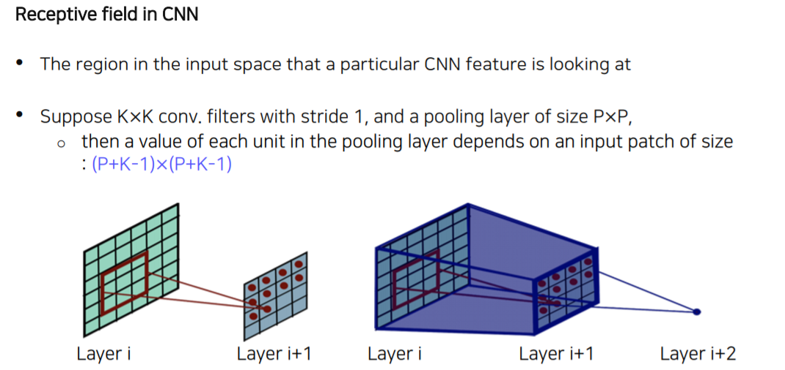
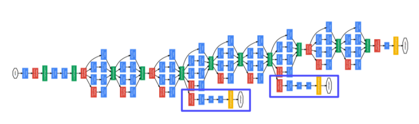

# Computer Vision 01 (Image Classfication)

인공지능으로 인간의 지능을 구현하려면 가장 먼저 인간의 다양한 지각능력들을 구현해야 합니다.

이것은 input, output을 통해 구현되죠. (입력은 단순히 오감에 그치는 것이 아니라 face, touch, speech, social 같은 복합적인 감각의 이해까지 포함)

그 중에서도 **시각적 지각능력(visual perception)**은 인간 지능의 중요한 부분으로 취급된다. 그리고 바로 **`Computer Vision`**이 이러한 지각능력을 재현하고자 하는 분야이다.

- 시각의 프로세스는 *[Visual world - Sensing device(눈) - Interpreting device(뇌) - Interpretation]* 네 단계로 이루어진다. 마찬가지로, 컴퓨터 비젼도 동일한 네 단계로 이루어진다.

- 다만 Sensing device가 눈이 아닌 카메라이고, Interpreting device가 뇌가 아닌 GPU와 알고리즘이라는 것만 다르다.

- 이를 통해 나오게 된 해석(Interpretation, representation)은 하이 레벨의 description이 된다.

- 이 representation을 통해 장면에 해당하는 이미지나 3D 모델을 재구현하는것을 `Computer Graphics`, 또는 `렌더링(Rendering)`이라고 한다.

- 거꾸로, 시각적 데이터(visual data)에서 representation을 추출하는 일을 **`Inverse Rendering`**이라고 하며, 컴퓨터 비젼의 task에 해당한다.

# 

# Image Classification

분류기(Classifier)는 입력을 어떤 카테고리 값과 매핑시켜 내보내는 장치이다. 이미지 분류는 이 분류기의 입력값으로 시각적 데이터만을 사용하여 추론하는 것을 일컫는다.

극단적으로 생각해보았을 때, 모든 분류 문제는 세상의 모든 시각적 데이터를 가지고 있다면 아주 쉽게 해결된다. 그냥 모든 데이터들 사이에서 비슷한 것들끼리 모으기만 하면 된다.


즉, **K Nearest Neighbors(K-NN) 문제**로 해결할 수 있다. K-NN 문제는 단순히 이미지 레이블 데이터 값을 주위의 다른 데이터 레이블들과 비교하여 가장 비슷하다고 판단되는 후보군으로 편입시키는 문제이다. 이렇게 해결하는 분류기가 있다면, 마치 검색엔진처럼 작동한다. 그러나, 이러한 접근 방식은 불가능하다. Time/Memory Complexity 무한대일 것이라는 점과, '비슷하다'는 기준을 어떻게 잡을건지가 모호하다는 것이 결정적인 불가능 요인이다. 따라서 컴퓨터 비젼은 방대한 데이터를 제한된 complexity의 시스템(인공 신경망)이라는 분류기에 녹여넣는 것이 목표이다.

# 

### Fully Connected Layer Network

이런 이미지 분류를 가장 간단한 형태의 인공 신경망 분류기, 즉 **단일 계층의 Fully Connected Layer Network**로 구현했다고 생각해보자.


기존의 이미지에 W(weight)를 내적한 것을 다시 이미지로 치환시켜보면, 아래와 같이 실제 레이블과 어느정도 관련이 있는 이미지 형상을 추출할 수 있다. 그러나 이 형태는 너무 흐릿하여 정확도가 떨어진다. **계층을 너무 얕게 쌓았기 때문에 디테일을 충분히 표현할 수 없는 것**이다.


또, 모든 노드들이 출력층으로 전연결(fully-connect)되기 때문에, **전체적인 형상만을 학습**한다. 따라서 만약 이 사진을 잘라낸 사진을 제공하면 인식을 전혀 할 수 없게 된다.

# 

## Convolutional Neural Network(CNN)


이러한 전연결 신경망의 한계점을 극복하기 위하여 **`합성곱 신경망(Convolution Neural Network, CNN)`**가 나오게 되었다. CNN은 모든 노드들을 다음 계층으로 전연결시키는 것이 아니라, **국소적인 연결(locally connect)**을 사용한다. 동일한 국소적 sliding window를 이미지의 모든 부분에 대입시켜 feature들을 뽑아냄으로써, 치우쳐 있는 이미지나 잘린 이미지라도 feature를 추출할 수 있고, 파라미터를 재활용하여 메모리도 적게 사용할 수 있다. 이런 장점 때문에 많은 CV task의 backbone으로 활용되고 있다.


## 이미지 분류를 위한 CNN 아키텍쳐의 종류

### 간략한 역사 개요


> LeNet (AlexNet 이전 모델이라서 소개)

- 1998년 Yann Lecun비교적 간단하며, 한 글자 정도의 손글씨를 인식하기 위해 사용되었다.
- 구조 : Conv-Pool-Conv-Pool-FC-FC


> AlexNet

- LeNet에서 모티베이션을 따와서 비슷하다.
- 파라미터와 학습 데이터를 훨씬 더 크게 늘렸다.
- 필터 사이즈가 11x11로 아주 크다. 
- 최근에는 이런 큰 필터를 사용하지 않는다.
- 활성화 함수로 ReLU를 사용하고, dropout 정규화 기법을 사용했다.
- 논문에는 메모리 문제로 두 GPU에 올려서 학습했으며, 그 당시 명암을 조정하기 위해 사용했던 LRN(Local Response Normalization) 기법은 현재는 사용하지 않는다.
- 구조 : Conv - Pool - LRN - Conv - Pool - LRN - Conv - Conv - Conv - Pool - FC - FC - FC


**※ 알고 넘어가야할 것 : (Receptive Field)** 



CNN에서 현재 feature map의 픽셀은 이전의 layer로부터 정보를 모아두고 있는 것이다.

이 때, 이전으로 거슬러 올라가 반영되는 영역을 체크할 수 있을 것이고 이를 Receptive Field라고 한다.


> VGGNet

- 3x3의 작은 필터와 2x2 max pooling 사용, LRN 제거로 아키텍쳐가 비교적 간단해졌으나 성능은 더 좋아졌다.
- 19 layer로 AlexNet(12 layer)보다 더 깊다.
- 작은 필터크기임에도 불구하고, 더 깊이 층을 쌓아 receptive field의 크기를 키웠다.
- 미리 학습된 feature를 fine-tuning하지 않고도 다른 task에 적용 가능할 정도로 일반화가 잘 되었다.


- AlexNet과 VGGNet의 구조비교
  - VGG 뒤의 숫자는 층의 개수를 의미함.


```
Q) AlexNet에서 VGGNet으로 발전하면서, 더 깊은 네트워크일수록 더 좋은 성능을 낸다는 것을 확인했다. 그렇다면 단순히 층을 더 깊게 쌓으면, 더 좋은 네트워크를 얻을 수 있을까?

물론 그렇지 않았다. 층을 깊게 쌓으면 쌓을수록 학습을 어렵게 만드는 문제들이 있었다.
```

- 문제점들
  - **기울기 소실/폭발(Gradient vanishing/exploding)**
  - 연산 복잡도 증가(Computationally complex)
  - depth가 어느정도 깊어지면, 성능이 떨어지기 시작→ 기울기 소실/폭발로 인한 Degradation 문제
    - 처음엔 Overfitting이 아닌가 생각을 했었다고 하는데, 단순히 층을 깊게 쌓는다고 Overfitting이 일어나는 것이 아니라는 게 밝혀졌다.
    - 단순히 그림을 통해 확인할 수 있는데 이는 아래 ResNet 부분에서 보이겠다. 
  - 어쨌든 층을 더 쌓는다고 Overfitting이 일어나는 게 아니란 걸 알 수가 있었다.

이러한 문제점들을 인식한 채로 새로운 네트워크 형태들이 등장하기 시작했다.


> GoogLeNet



-  **Inception Module** 을 여러 층 쌓는 형태를 제안한다.
- 하나의 층에서 다양한 크기의 필터를 사용하여 여러 측면에서 보겠다(depth 확장이 아닌 수평확장)
- 이 결과들은 모두 concatenation 하여 다음 층으로 넘겨주게 된다.
- 이 때, 1x1 conv를 한 번 적용해 채널 수를 줄여 계산 복잡도를 떨어뜨린다. 
- 이를 병목(bottleneck) 층이라고 한다.


- 3x3, 5x5 conv 직전 / pooling 연산 직후 **<u>Auxiliary classifier</u>**

- 역전파 중 기울기 소실 문제를 해결하기 위해 Loss를 측정하는 Auxiliary classifier를 네트워크 중간 중간에 둔다.

  - 위의 파랑색 블록 부분이 Softmax 연산을 수행하는 부분이고, 이런 것이 중간중간 끼워져있는 구조인 것이다.

  - 중간중간에 loss를 측정해주니까 앞단의 정보를 통한 loss도 모델이 알 수가 있는 것이다. (gradient vanishing 문제를 없앨 수 있는 것이다.)

    

다시 한번 설명하자면,

- GoogLeNet 구조 중 Pooling 계층에서 시작해 1x1 conv → FC → FC → softmax로 Loss를 측정하는 구조이다.
- 역전파 시 여기에서도 역전파가 수행되고, 기존의 기울기와 결합하여 학습을 돕는다. 
- 학습이 끝나면 제거한다.
- regularization 역할도 수행하는 것으로 알려져있다.


> ResNet


-  최초로 100개가 넘는 layer를 쌓음으로써, 더 깊은 layer를 쌓을수록 성능이 더 좋아진다는 것을 보여준 첫 모델이다. 

- 다른 모델 아키텍쳐와 비교해보자면 다음 그림과 같다 (층이 매우 깊을 수 있는 이유는 Skip connection이 있음, 아래에서 설명)

  ​	


- 또한, 인간의 지각 능력을 뛰어넘은 첫 모델이기도 하다.
- 계기네트워크 깊이를 늘리다보면 어느 순간부터 정확도(accuracy) 감소가 포화상태(saturated)에 이른다.
- 기존 인식(가설)모델 파라미터가 너무 많아지면 overfitting 되어 training error가 더 적고 test error가 더 많은 결과가 나올 것이다.
- 실험 결과overfitting 문제가 아니다. 
- training error든 test error든 더 깊은 층(56)의 네트워크가 더 얕은 층(20)의 네트워크보다 에러 수가 높게 나온다.degradation 문제이다. (기울기소실)
- 기울기 소실 때문에 최적화(optimization)이 덜 되어 깊은 층의 네트워크가 학습이 덜 된 것이다!

**※ 다음 그림을 보면, 층이 깊어도 학습이 추가적으로 더 되질 않음 (만약 Overfitting이라고 할 수 있으려면 Traing error가 줄어야 함.)**


**※ 가장 큰 문제점 : 층이 깊어질수록 기존의 input x의 영향력(기울기)이 소실되어 충분히 학습하기 어렵다.** 

- 그래서 나온 방법이 residual(skip) connection이다.

- 중간중간에 몇 개의 층을 지나면 기존의 x와 동일한 값(identity)를 잔차(residual)로 더해주어, 잔여부분만 학습함으로써 학습 부담을 경감시킨다. (분할정복과 비슷한 원리)

- 역전파 시에도 gradient가 원래 네트워크 레이어 쪽과 skip connection 쪽 두 군데로 흐르므로, 한 곳에서 기울기 소실이 일어나더라도 다른 한쪽을 통해 학습을 정상적으로 지속할 수 있게 된다.

  - 원래의 layer(왼쪽) vs Residual block(오른쪽)

    

    

    

    - 원래 우리의 목표함수가 `H(x)`였다고 보면, Residual block에서는 목표함수를 `F(x)+x` 로서 그 개념을 동일시한다.
    - 이것은 기존의 입력 `x`를 (x와 동일한 값을 더해준다는 표현으로 identity를 사용한 것)
    - layer에서 수행하는 function의 기존결과 `F(x)`에 더해주어 output을 `F(x)+x`로 내어주는 꼴인 것 뿐인데 이렇게 해서 얻는 효과가 뭘까?
      - 만약, 기존결과 F(x)가 잘못된 결과를 냈을 때의 에러를 메꾸는 것보다, 그 에러 중 x부분만큼은 미리 제외하고 잔여부분만 학습하는 것이 학습 부담을 줄여준다는 의미라고 이해하였다.


- skip connection이 한번 일어날 때마다 역전파 gradient가 흐르는 방법의 경우의 수가 2배로 늘어나므로, 전체 경우의 수는 2^n2n개가 된다.
- residual block은 2개의 3x3 conv layer로 이루어져 있다.출력 직전 FC 층은 하나만 존재한다.


모델의 전체 구조를 그림으로 보면 다음과 같다.


```
슬라이드에 파이토치 코드까지 첨부되어있으니 궁금하면 슬라이드 참고하기
```


#### ResNet의 등장 이후

> DenseNet

​	그냥 모조리 다 이어줬음


- **<u>Dense block</u>** : x identity를 그대로 더하던 ResNet의 Residual block과 달리, 각 layer의 output을 채널 축 방향으로 concatenation한다.
  - 기울기 소실 문제 해결
  - featrue propagation 강화
  - feature 재활용 가능(Encourage the reuse of features) : concat으로 메모리는 더 많이 쓰게 되지만, 이전 층 layer들의 정보를 합치지 않고 그대로 보존하고 있어 필요할 때 꺼내 쓸 수 있게 된다.


>SENet

- 마치 Seq2Seq에서의 Attention을 보는 듯한 구조이다.

- 채널별로 중요한 곳에 더 높게 하는 식으로 Attention Score 매겨줌. (1x1 convolution 덕분에 이게 가능)


- 다시 말하자면 depth를 높이거나 connection을 사용하지 않고, 채널간의 관계를 모델링하여 중요한 특징에 Attention할 수 있도록 만드는 방법.
- Attention 생성 방법
  - **Squeeze** : global average pooling으로 각 채널의 공간정보(H,W)를 없애고 분포(또는 magnitude)만 보게 한다.
  - **Excitation** : FC layer를 하나 두어 Squeeze 한 값을 통과시키면서 채널간의 연관성을 나타내는(채널을 reweighting 하는) attention score를 계산한다.


> EfficientNet


- 기존에 네트워크 성능을 높이는 방법에는
  - depth scaling
  - width scaling
  - high resolution scaling (input의 해상도를 높여주는 것)
    - 애초에 input 이미지의 resolution이 높으면 성능이 더 좋아진다.
- 그러나 위의 세 방법은 각각 accuracy saturate의 시점이 다르다.
- 그래서 세 방법 모두를 적절히 섞은 compound scaling이 등장한다. (마치 Grid Search, Random Search같은)
- 지금까지 나왔던 모든 방식들을 대상으로, 적은 FLOP에서도 압도적인 성능차를 보였다.


>Deformable Convolution Network


- 불규칙적인 2D 이미지에 대한 convolution이다.
- 사람이나 동물등의 사진은 팔다리가 어떤 형태로 있느냐에 따라 각기 다른 모양을 가진다.
  - 기존의 정사각형 이런 식으로 모여있는 곳으로부터 연산을 하는게 아니라,
  - 불규칙하게 골라서 convolution 연산하는 거임.
- 기존의 convolution 필터에 추가로 2D offset map을 추정하기 위한 branch가 따로 결합되어있다.
- conv 연산의 결과에 offset field를 추가시키면, offset된 feature map이 나온다.

# 

간단하게 요약하자면 다음과 같으며, 자세히 알고싶다면 논문을 참고해야 할 것이다.

| **모델명** |   구조    | 메모리사용량 |  연산량   |  정확도   |       etc       |
| :--------: | :-------: | :----------: | :-------: | :-------: | :-------------: |
|  AlexNet   | 매우 간단 |     높음     |   적음    |   낮음    |                 |
|   VGGNet   |   간단    |     높음     | 매우 높음 |   높음    |    사용 쉬움    |
| GoogLeNet  |   복잡    |     낮음     |   보통    | 매우 높음 | 사용하기 어려움 |
|   ResNet   |   보통    |     보통     |   보통    |   높음    |    사용 쉬움    |

