# Annotation Data Efficient Learning

Computer Vision 분야에서 데이터가 부족할 때, 간단하지만 많이 쓰이는 방법론들을 배워보는 강의입니다.

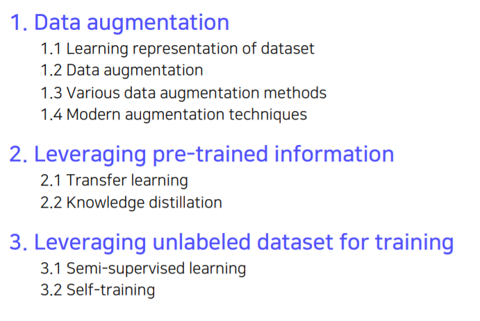


## 1. Data Augmentation

데이터를 압축해서 가지고 있는 과정을 갖고 있는 딥러닝 학습방법,

그러니 골고루 데이터를 압축해서 가지고 있게 되면 좋을 텐데.. 이것은 그리 쉽지 않다.

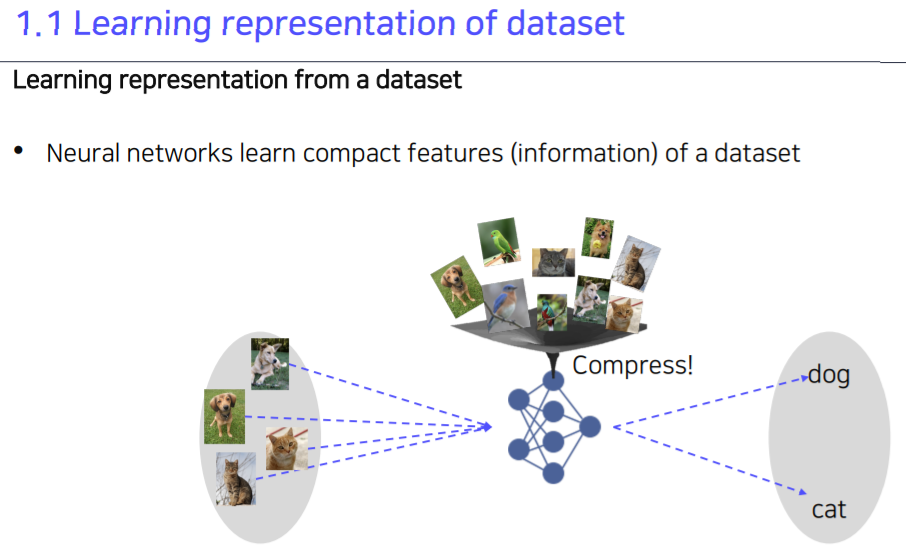


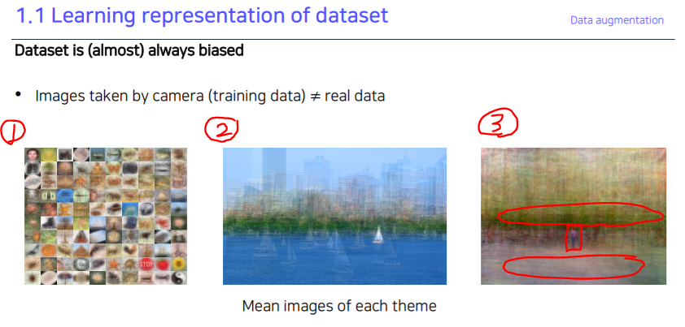

1번 : 각 class별로 평균을 낸 이미지

2번 : 강을 키워드로 가지고 있는 영상의 평균 이미지

3번 : 공원이라는 키워드에 관련된 영상의 평균영상

> 평균만 냈는데도 어떠한 패턴이 잘 보이는 것을 볼 수 있다.
>
> 이는 사람이 인위적으로 예쁘게 어떠한 특정 구도에서 찍었기 때문에 평균을 냈을 뿐인데도 쉽게 패턴이 나타나는 것임.
>
> Bias가 많이 가미된 데이터들이라고 할 수가 있다. (이대로 학습을 시켜선 모델을 활용할 수가 없음)


※ 결국 우리가 카메라로 찌거서 training에 쓰는 데이터는 실제 데이터와 다르다는 것이다.


다음 예시를 보자.

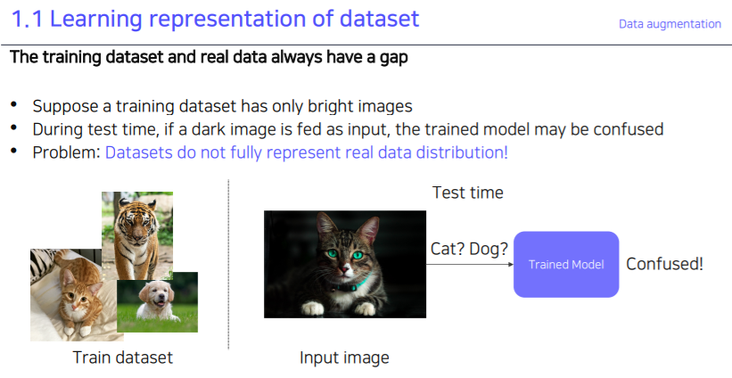

- 밝은 배경으로만 구성된 데이터들을 가지고 트레인시킨 모델로 다크한 이미지를 예측하려고 하면 당연히 성능이 잘 나오지 않게 된다.


그래서 다음과 같이 학습데이터를 살짝씩 바꿔주면서 해당데이터의 주변 데이터들을 생성해냄으로써 조금더 Real Data에 적용하기 좋은 모델을 학습시킬 수가 있습니다.

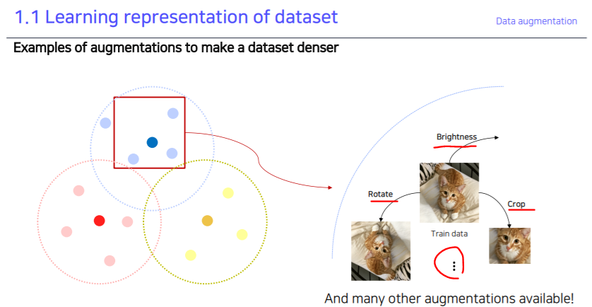


이와 같이 우리는 데이터에 어떠한 변형을 줘서 실제 데이터에 조금더 가깝게 만드는 기법들을 사용해야 하고, 이들은 Numpy 와 OpenCV 모듈로 쉽게 구현할 수 있습니다.

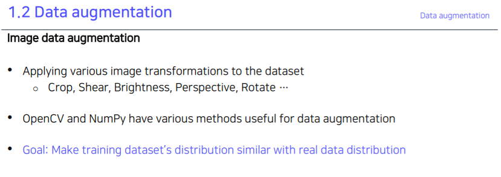


### 1.3.1 Brightness

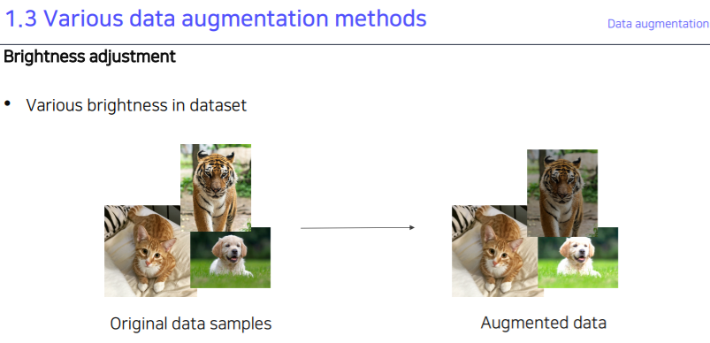

위와 같이 사진의 밝기를 조정하기 위한 코드는 어떻게 구현할 수 있을까?

- 아래와 같이 3번째 Dim에 해당하는 R,G,B 3개의 Channel 각각에 어떠한 임의값(난수생성해도 됨)을 더해서 변형을 줄 수가 있다.
- 이 때 주의할 점은 픽셀값은 255를 넘어갈 수 없기 때문에 255를 초과한 value들은 255로 제한을 둬야한다.
  - 이러한 방법말고 255가 상한값이 되게 적당한 값을 곱하여 scaling을 해주거나 할 수도 있을 것이다.

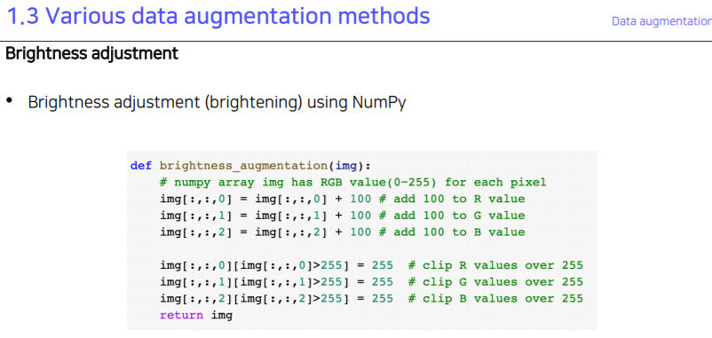


### 1.3.2 Rotate, Flip

> Rotate, Flip

밝기 조정말고 아래와 같이 데이터를 회전시켜볼 수도 있다.

opencv 모듈에 rotate를 사용하여도 되고, numpy의 flip을 사용해도 된다고 한다.

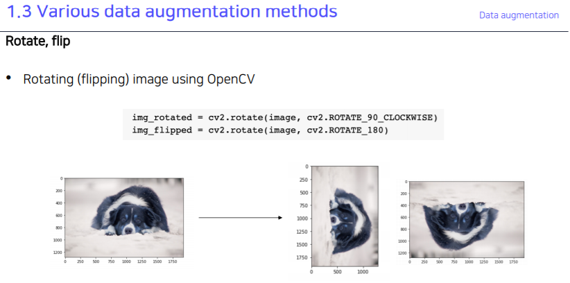


### 1.3.3 Crop

> Crop

Crop은 간단하지만 그 효과는 매우 강력하게 쓰일 수 있다.

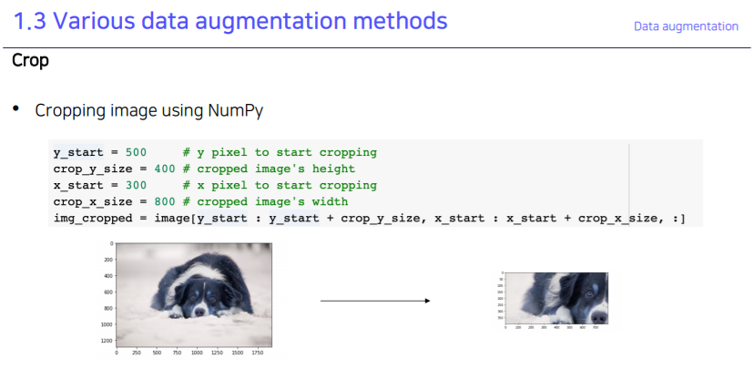


### 1.3.4 Affine transformation

> Affine transformation

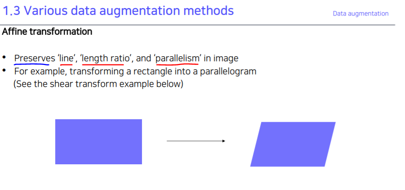

- 직선(선의 형태)는 유지한다.

- 사진의 가로와 세로의 길이 비율은 유지한다.

- 가로변 2개, 세로변 2개 각각의 평행성도 유지한다.

- 위는 조건을 만족시키며, 직사각형을 평행사변형으로 만든 예시이다.


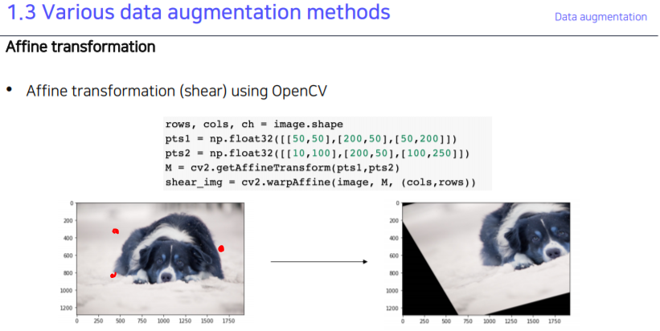

- Affine transformation은 getAffineTransformation 함수를 쓰면 쉽게 구현이 가능하다.
  - 세 개의 점을 골라서 그 친구들을 임의로 위치를 옮겨버리는 것이다.
  - 그러면 사진 전체가 위처럼 움직여서 변형이 가능하게 된다.


### 1.4.1 Cut Mix

> Cut Mix

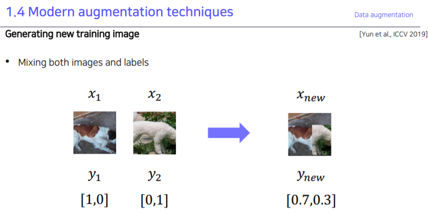

- 말그대로 사진데이터를 잘라서 섞는 것
- 이 때 중요한 것은 섞은 그 비율만큼 Smooth Labeling으로 고쳐주어야 한다는 것이다.


### 1.4.2 RandAugment

Augmentation 방법들이 너무 많다보니까 어느 것들을 어떻게 섞어써야할지 고민이 되고, 어떤 것이 가장 나을지 모르기 때문에 Random으로 조합해서 해보는 방법이다.

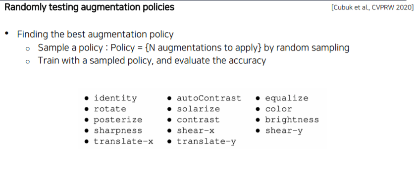

다음 예시를 보자.

- RandArgument 수행시 필요한 parameter는 어느 augmentation을 수행할지 명시해야 하고, 몇의 강도만큼 augmentation을 적용할지이다.
- 아래 그림에선 ShearX와 AutoContrast를 9의 강도만큼 적용한 것이다.

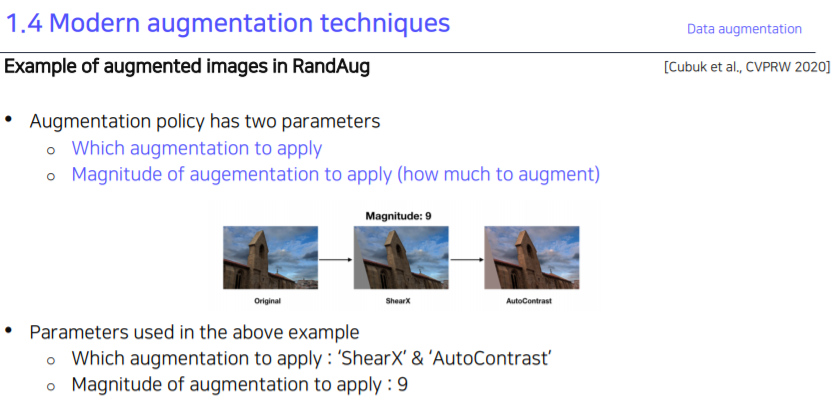


다음과 같이 간단하게 Data Augmentation을 적용하였을 때, 적용하지 않았을 때보다 훨씬 성능이 좋음을 알 수 있다.

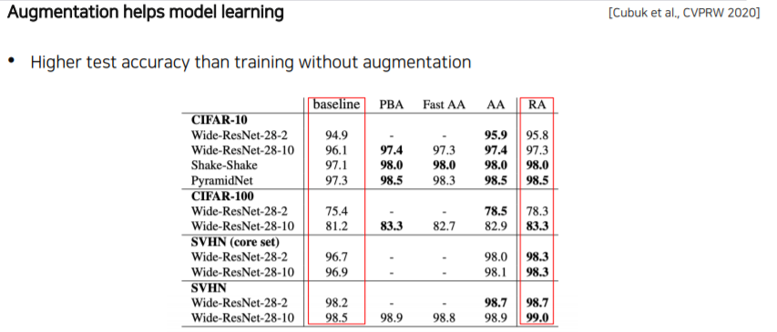


## 2. Leveraging pre-trained information


### 2.1 Transfer Learning

Transfer Learning이란 어느 데이터에서 얻은 정보를 다른 데이터 학습에서 활용하는 것이다.

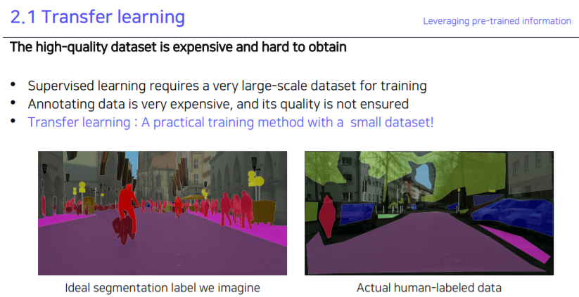

- 지도학습을 위해서는 엄청 많고 질 좋은 데이터가 필요하다 (라벨링 되어있는)
- 그래서 라벨링업체에 위탁을 맡겨보게 되면 우리가 원하는 라벨링 결과는 `왼쪽`이지만, `오른쪽`이 Sourcing Company에서 가져다주는 라벨링 결과물일 것이다.
- 작은 데이터만 가지고 학습시켜놓고, Transfer Learning으로 이를 해결할 것이다.
  1. 우선 Transfer Learning의 지금 생각나는 예시로는 적은 데이터로 학습시킨 친구들을 이용해서 Pseudo Labeling을 시키고 사용하는 것.
  2. 두번째 예시로는 Pretrained Model을 우리의 Task (Ground Truth를 가지고 있을 때)에 대하여 추가학습시키는 것이다.

※ 결국 중요한 것은 Transfer Learning이 우리가 사전학습시킨 지식을 활용해서 New Task를 수행하는 것을 쉽게 만들어냈다는 것이다.


- 다음 예시에는 4개의 데이터셋이 있다.
- 이 데이터들의 공통점은 모두 어떤 영상 데이터라는 점, 영상 중 비슷한 패턴이 반복되고 있다는 것이다.
  - 예를 들어 (버스의 바퀴, 오토바이의 바퀴) (여러 그림의 잔디)가 비슷한 패턴들이다.
  - 어느 데이터셋에서 사전학습된 지식이 다른 데이터셋을 학습하는데 활용한다면 분명 도움이 될 것이다.

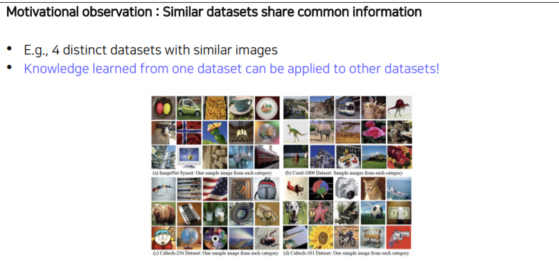


#### 2.1.1  Convolution 부분을 건드리지 않는 Transfer

> 데이터의 어떤 특정 정보들만 (FeatureMap을 Compress) 압축시켜놓은 부분인 Convolution Layer의 가중치는 전혀 건드리지 않고 Transfer Learning을 진행하는 방법이 그 첫번째 방법이다.

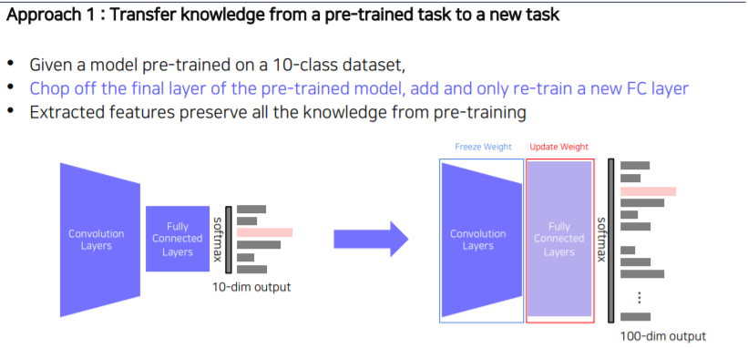


#### 2.1.2 Convolution 부분까지 조정하는 Transfer

> 데이터의 어떤 특정 정보들만 (FeatureMap을 Compress) 압축시켜놓은 부분인 Convolution Layer의 가중치도 학습을 같이 시키며 Transfer Learning을 진행하는 방법이 그 첫번째 방법이다.

- 이 때에는 보통 앞의 Convolution 부분은 lr을 작게 설정하고 뒤의 FC 부분은 lr을 크게 하면서 사전학습된 부분은 상대적으로 매우 작게만 업데이트 되게끔, FC layer는 보다 빠르게 해당 Task를 수행하기 위해 학습되도록 구조를 정한다.

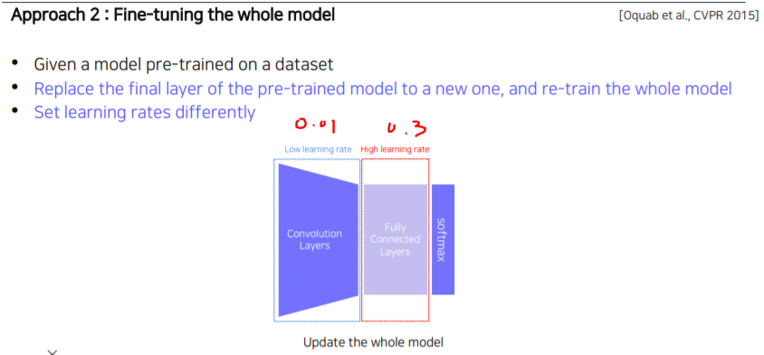


### 2.2 Knowledge distillation

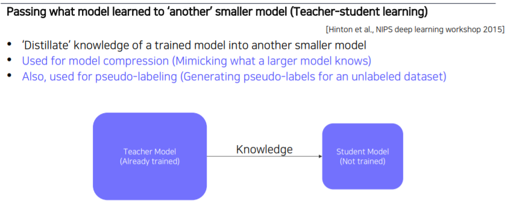


#### 2.2.1. Ground Truth 없는 Teacher-Student Network

> 대략적인 Teacher-Student network 구조는 다음과 같다.

- 핵심은 Student가 Teacher를 흉내내게 만드는 구조라는 것
- 여기선 Student가 목표로 하는 Ground Truth가 따로 없고 라벨을 새로 만들어내는 구조이기 때문에 비지도학습 구조이다.


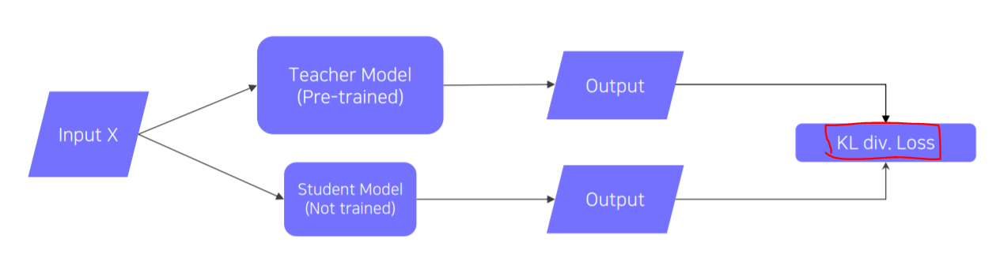


#### 2.2.2. Ground Truth 있는 Teacher-Student Network

그럼 Transfer Learning을 통해 새로 수행하고 싶은 New Task에 Ground Truth가 있다면 어떤 식으로 학습을 하게 될까?

- 대략적인 구조를 그림으로 나타내면 다음과 같다.

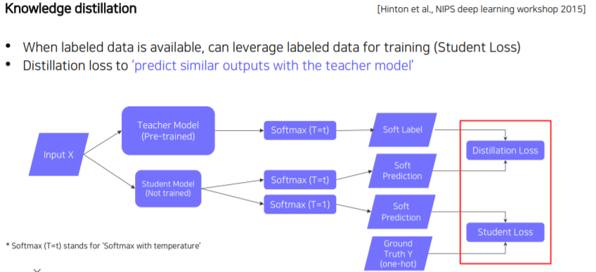


> Hard vs Soft

Hard 는 정답을 알려주는 것, True인지 False인지 중요한 것

Soft 는 추론을 위한 것, 사전지식을 나타내는 부분이기 때문에 어떠한 확률값로서 모델이 어떻게 생각하고 있는지를 보여줌.

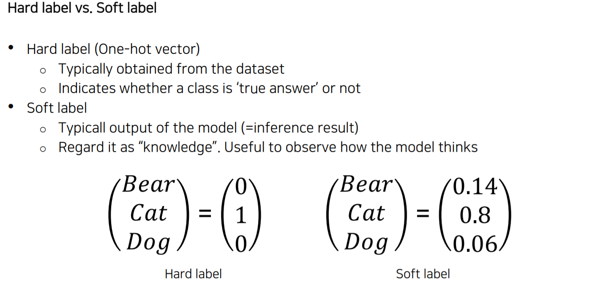


> **Softmax(T=1) vs Softmax(T=t)**

Softmax(T=1) Prediction, (T=1은 원래의 Softmax 함수)

- 원래의 softmax 값, input이 어느정도 차이가 나면 확률을 각각 0과 1에 가깝게 매핑

Softmax(T=t) Prediction

- 보정된 softmax 값 , input이 어느정도 차이가 나더라도 확률을 soft하게 (0과 1에 그다지 가깝지 않게끔) 매핑을 해준다.


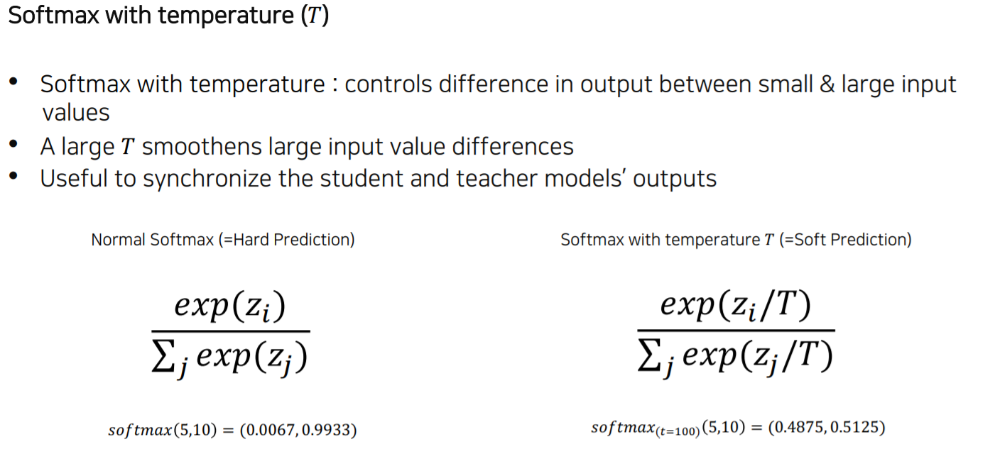


#### 2.2.3 Distillation loss에 대해 알아보자.

**Distillation Loss**는 Student Model이 Teacher Model과 출력분포가 비슷하게 되도록(모델이 비슷해지도록) 어떠한 사전지식을 걸어놓은 역할을 하는 것이다.


※ Semantic Information

- 예를 들어 설명하자면, 우리가 어떤 사진 데이터에서 바나나인지 사과인지 등 특성을 판별하는 Task에서 semantic은 특성을 의미한다고 볼 수 있다.
- Semantic Information이라 함은 특성정보라고 이해할 수 있을 것이다.


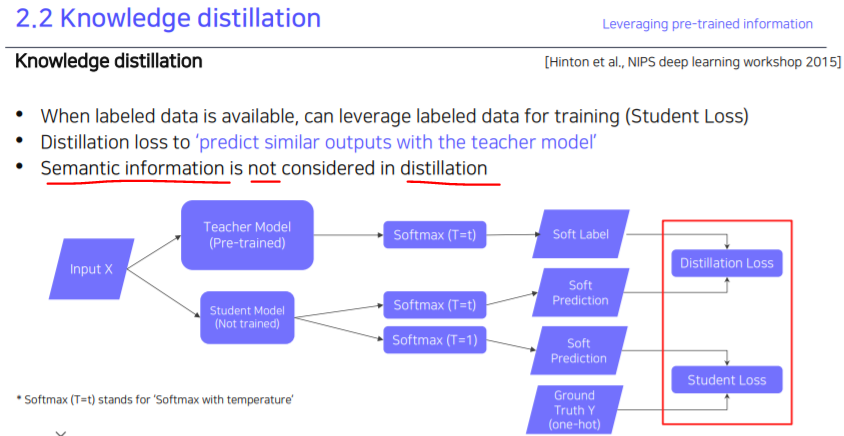


> 질문)
>
> 그래서 강의내용 중 Teacher Network의 Softmax로부터 나온 Distillation loss가 **semantic information**를 가지고 있지 않다는 것이 무슨 뜻일까?


- 현재 최종 Task의 목표로서 학습시키고 있는 네트워크는 Student Network이다.

- 그렇다면, Student Network가 목표로 하고 있는 Task의 Semantic Information은 어디에 존재하는 걸까?
  - 그것은 바로 Ground Truth에 존재하는 것이다. (최종목표인 Task 정보를 담고 있는 것이니까)
- 그리고 결국, 이 Ground Truth라는 Semantic Information과 관련된 loss는 Student Loss, cross entropy loss라고 할 수 있겠다.
- Ground Truth이자 Semantic Information과 비슷해지기 위해 학습되는 라벨은 아래의 Softmax(T=1) Prediction, (T=1은 원래의 Softmax 함수), 우리 Task에서 최종 Output이 학습되고 있음.


다음 예시를 보면서 Distillation Loss의 역할에 대해 한번더 생각해보자.

1. 다른 예를 들어보자면, Teacher Network는 Tire 데이터를 찾아내는 Task를 목적으로 사전학습된 네트워크라고 하고 Student Network는 Car(차)를 찾아내는 Task를 목적으로 한다고 하자.

   - 현재 최종목표로 하고 있는 Car 를 찾아내는 Task를 수행하는데 있어서 Teacher Network는 Car에 대한 어떠한 특성정보(Semantic Information)도 들고 있지 않다.

   - 정확히는 Teacher Network의 softmax 결과값인 Tire에 관련한 Soft Label 부분이 Car 를 찾아내기 위한 Semantic Information은 들고 있지 않다는 것이다.
   - 하지만 Tire 에 대한 사전지식이 있는 모델을 이용하여 Car를 찾아내는 Student Network를 학습시키기 때문에 Teacher Network가 없는 경우보다 성능이 훨씬 좋을 것이다.


2. 예를 들어서 Teacher Network는 10 dimension을 Classifying하는 것을 목적으로 사전학습된 네트워크라고 하고, 현재 Student Network를 이용해서 수행하려는 Task는 100 dimension을 Classify하는 것이라 하자.

   - 구체적으로 Teacher Network는 (0~9를 나타내는 사진) Classifier로 학습되었고, Student Network는 (1~100)을 판별하기 위해 학습된다고 하자.
   - 이 때, Teacher Network는 현재 100 dimension 판별 Task에 있어서 사전지식으로서 현재 판별하려는 1~100 중 1~9를 판별하는 것에 대해 Distillation loss를 이용해 도움을 주게 될 것이다.
   - 그렇다면, D loss를 계산하기 위해 나온 Soft Label을 보자.
   - Soft Label은 0~10에 관한 확률값들을 벡터로 가지고 있을 것이고, 이는 1~100 분류 Task를 위한 Semantic Information을 가지고 있다고 말하기에는 어려움이 있는 것이다.
   - 내 나름대로 결론을 내려서 이해하자면, D loss 부분은 Ground Truth와는 별개로 Student가 Teacher를 닮게 학습시키기 위한 어떠한 WarmUp 혹은 규제(둘다 표현이 적절하진 않지만 의미상)일 뿐이라는 것이다.

   

   > 여기서 궁금한 점은 그럼 이 예시에서는 Student Model이 출력해내는 Softmax 결과값은 같은 차원이 아니네?
   >
   > (10차원 label에 대해 soft prediction한 결과 10차원 Vector, 100차원 Label에 대해 soft prediction하여 구한 100차원 Vector) 
   >
   > 맞다. Transfer Learning에서는 동일 Task 목적이 아닌, 다른 차원의 Output을 출력하는 Teacher 모델이라 하더라도 이 모델의 사전지식이 Student Model 학습에 도움이 되기 때문에  Teacher 를 가져와서 쓰는 것이다.
   >
   > 
   >
   > 해당 Output Vector에 대해 구체적으로 설명하자면,
   >
   > Pseudo Label, 10차원 soft label에 대해 soft prediction하여 KL Divergence를 구하고 해당 Distillation Loss를 이용하여 10차원 Vector를 비슷하게 업데이트함(둘이 서로 비슷하게 되는 것이 중요한 것일 뿐이지 해당 label의 실제 값 자체는 그리 중요하지 않음)
   >
   > Ground Truth, 100차원 label에 대해 soft prediction하여 cross entropy를 구하고 실제 Ground Truth에 가깝게 우리의 최종 Output Softmax Vector (100-dim)을 근사시킨다.


```
결론 : Distillation loss는 Teacher 닮게 만들기 위한 어떤 보조장치일 뿐, Semantic Information과는 관련이 없다. Semantic Information과 관련이 있는 부분은 최종목표 Task에 해당하는 Ground Truth라고 보면 되겠다.
```


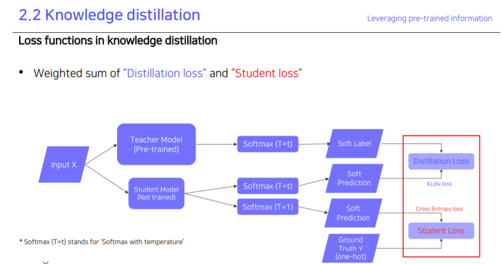


> Weighted Sum of **Distillation loss** and **Student loss**

그럼 weight는 알아서 업데이트 되는 파라미터일까 우리가 정하는 hyperparameter일까?

- 우리가 정해주는 hyperparameter이다.

- 참고 : https://keras.io/examples/vision/knowledge_distillation/

그럼 보통 alpha값을 몇으로 주는 걸까?

- alpha * D loss + (1-alpha) * S loss 로 보통 정의를 하며 alpha값을 더 크게 한다고 한다.
- 이것은 **Distillation loss**를 더 작게 만들겠다는 목적을 가지고 있는 것이다.
- 즉, Student Model을 현재 Ground Truth에 더 가깝게 학습을 시키는 것이 아니라 Teacher Model에 더 가깝게 만들겠다는 것이다.
  - 이것은 보통 Transfer Learning에서 많이 볼 수 있는 현상으로 Pretrained 는 많이 건드리지 않고 (lr을 작게 하고), 현재 목적으로 하는 Task를 수행하기 위해 주어진 Ground Truth데이터에 빠르게 모델을 수렴시키는(lr을 크게 하고) 부분으로 보통 구성되는 Pre-trained Model들인 BERT, GPT-3를 떠올리게 한다. 


## 3. Leveraging unlabeled dataset for training

그렇다면 labeled된 데이터는 조금밖에 없고, Unlabel된 데이터가 매우 많을 때 Unlabeled된 데이터를 어떻게 활용해야 모델의 성능을 확보할 수 있을까?

### 3.1 Semi-Supervised Learning

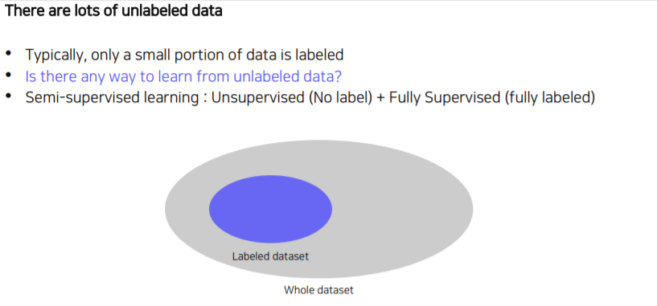

- Semi-SuperVised를 활용하는 것은 Unlabeled 데이터들을 목적성 있게 잘 사용하기 위한 방법이다.


다음 그림을 보면,

1. 라벨된 데이터들을 먼저 사용하여 사전학습 모델을 하나 만든다.

2. 해당 사전학습 모델로 Pseudo-Labeling을 Unlabeled Data에 수행해준다.
3. 그 후 Labeled Data와 Pseudo-Labeled Data를 합쳐서 모두 사용하여 새로운 모델을 학습시키고 최종 결과로 사용한다.

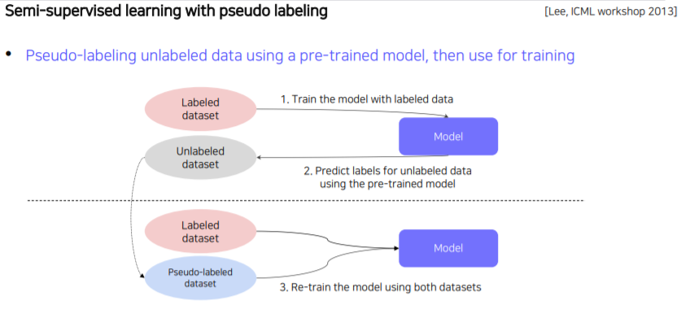


### 3.2 Self-training (KL Divergence 안씀, cross entropy만 씀)

Data Augmentation과 Knowledge Distillation, Semi-Supervised Learning을 적절하게 결합한 Self-Training이 Image Net에서 새로운 개평을 열었다.


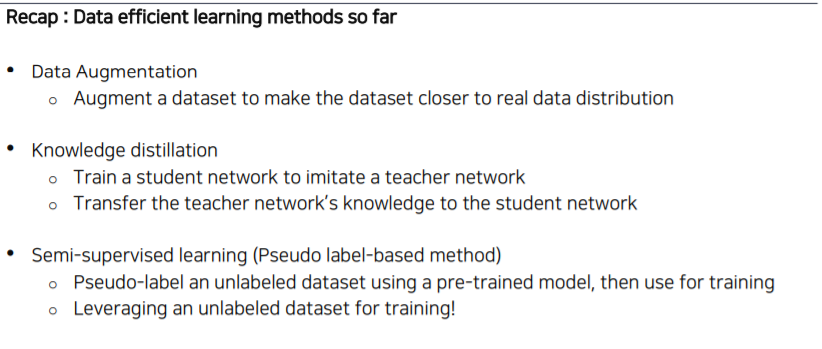


> 2019년 기준 SOTA 달성, 성능 부분에서 압도적이었음.

- Augmentation과 Teacher-Student Networks, Semi-SuperVised Learning을 합친 Noisy Student Training이 SOTA 달성
- 이전에 가장 좋았던 EfficientNet을 제쳤다.


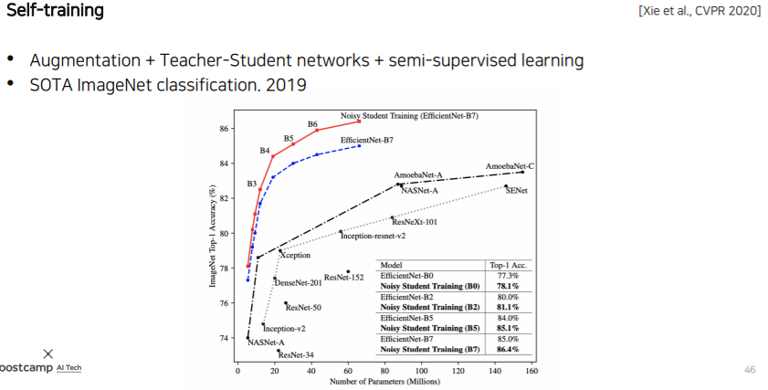


> 위에서 SOTA를 달성한 Noisy Student Training의 구조를 살펴보자.

1. 1백만개의 데이터를 가지고 Teacher Model을 사전학습시켰다(ImageNet)
2. 사전학습된 Teacher Model 을 이용하여 3억개의 Unlabed Data에 Pseduo-Labeling을 해준다.
3. 1백만개의 데이터와 3억개의 데이터를 합쳐서(더 방대한 데이터를 이용해서) Student Model을 학습시킨다.(이전에 배웠던 RandAugment를 이용해서 )
4. 이후 3번에서 나온 Student Model을 다시 Teacher Model로서 삼아서, 3억개의 (300M)의 라벨링되지 않은 데이터에 대해 Pseduo-Labeling을 또 한번 시도한다
5. 이렇게 2\~4번을 하나의 과정으로서 2\~3번 반복한다.

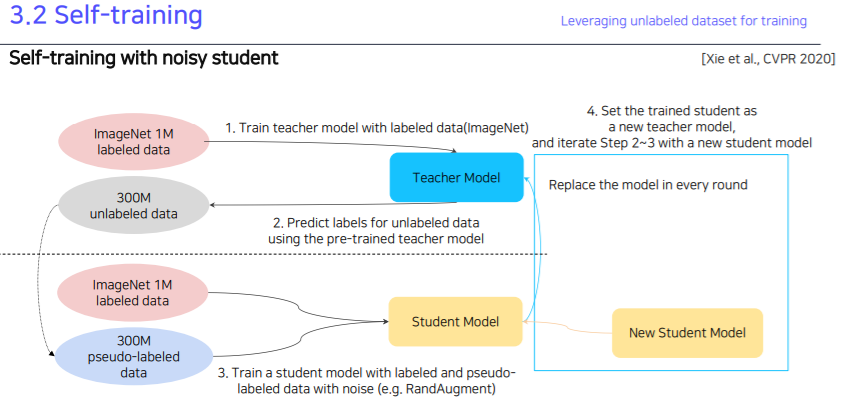

※ 다시 말해, noisy student model은 이전의 Knowledge distillation에서의 student model보다 크다. 정확히 말하면, 점점 커져가는 구조다. (Knowledge distillation에서는 Teacher Network가 더 크고 Student Model이 더 작았음에 반해)


아래 그림을 통해 다시한번 설명하자면, 

- Model1(Teacher Model) 을 활용하여 Unlabeled에 Pseduo-Labeling, RandAugment까지 활용하여 Model2(Student Model)를 생성
- Model2(Student Model)가 New teacher 가 되어 Pseduo-Labeling, RandAugment까지 활용하여 Model3 ( New Student Model )을 생성
- ....
- 이러한 과정을 계속 거치면서, Student가 Student 학습에 관여하는 구조이기 때문에 매 반복시마다 Student Model이 점점 더 커지게 된다.

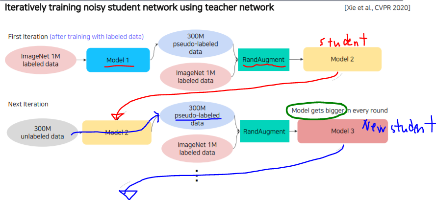


> 마지막 정리

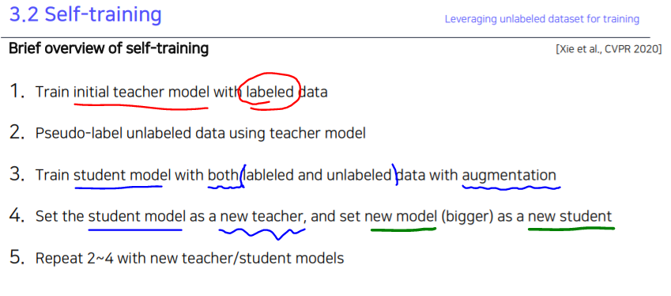


> +번외질문 : (self-training에서 여러번 iteration한다고 성능이 계속 올라갈까?)

> Self-training with noisy student과정에서 한번의 pseudo label을 이용하여 student model을 학습하고 이것으로 teacher model을 교체하여 다시 pseudo label을 만들어 이를 또 student model이 학습하는것에 대한 성능향상은 dramatic할것이다. (1번의 iteration 때에는 성능 대폭향상이 기대됨)

> **하지만 이후 iteration에서는 성능의 향상이 굉장히 미미하지 않을까?(만약 data augumentation을 해주지 않는다면)**
>
> label의 변화도 적을뿐더러 미미한 성능향상이 되지 않을까? 따라서 이후의 iteration에서는 주요한 성능향상의 요인이 **<u>data augumentation</u>**에 의한 것일까

- 어느정도 일리가 있는 것 같다. 따라서 강의자료에도 이러한 iteration을 2-3회 한다고 기술되있는 것으로 보아, 이후의 iteration은 미미한 성능향상을 보일것 같다.


