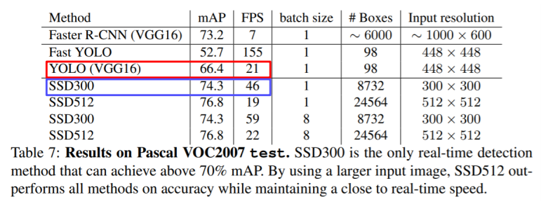

# Object detection(객체 검출)

Object detection, 객체 검출은 CV에서 가장 시장수요가 높은 task 중 하나이다.

특히 자율주행(Autonomous driving), OCR(Optical Character Recognition) 등의 핵심 기술이다.

기존의 Semantic Segmentation과 2가지(**`Instance segmentation`**, **`Panoptic segementation`**)의 차이점은, 전자는 class를 구별하지만 후자는 개체를 구별한다는 데에 있다(Instance를 구별하는가?)

- 예를 들어, **`Semantic Segmentation`**은 이미지에 나온 모든 사람들을 '사람'이라는 하나의 class로 묶어서 동일하게 취급하는데에 비하여,
- **`Instance segmentation`**, **`Panoptic segementation`**는 Alex, Chris 등으로 각각 다른 사람으로 구별한다.
- 이 중 **Panoptic segemetation**은 **Instance segementation**을 포함하고 있는 좀 더 큰 개념의 기술이다.

**※ <u>객체 검출(Object detection)</u>은 이미지 분류(Image Classification)와 Box Localization의 조합이다.**

- 일반 영상인식보다 좀 더 고차원의 task로, 먼저 Box의 좌표(좌상단, 우하단)를 잡아 객체를 찾아낸 뒤, 해당 객체의 카테고리를 분류한다.

# 기존 방법 - 수작업하기

## Gradient-based detector

"객체를 검출하기 위해, 경계선을 따면 좋지 않을까?"라는 생각으로 경계선 검출에 집중했다.

- 영역 내의 수평선/수직선 등의 분포를 모델링하고, linear classifier의 weight를 학습시켜 visualization했다.

- 예를 들어, '어깨부분에 사선이 많고, 팔다리 부분에 수직선이 많은 사진은 사람으로 판별하라'라는 등의 로직이다.
- 결국, feature를 뽑아내는 부분은 사람이 직접 디자인하므로 매우 노력이 많이 들어가게 되고, 반면  학습가능한 linear 모델의 weight부분은 상대적으로 비중이 적은 셈이었다.

## Selective Search

1.  Over-segmentation : 영상을 비슷한 색끼리 잘게 분할을 하는 방법

2. Iteratively merging similar regions : 비슷한(색깔, gradient 특징, 분포 등) 영역들끼리 합침

3. Extracting candidate boxes from all remaining segmentations : 영역들을 포함하는 bounding box를 추천해서 물체의 후보군으로 사용

- 사실 최근까지도 많이 사용한 기술로, 사람이나 특정 물체 뿐만 아니라, 다양한 물체 후보군의 영역 후보군을 지정해주는 방식이다.

- 즉, 수많은 Bounding Box(BB)를 제안해준다.

- 제안받은 여러 BB중 가장 객체의 영역을 tight하게 잘 잡아내는 Box를 찾도록 학습시킨다.
- 딥러닝을 이용한 초기 Object Detection에도 이 방식이 많이 사용되었다.

실제로 딥러닝 기반의 Object Detection 기법들은 2014년 이후 나오기 시작했으며, 크게 두 갈래로 분류할 수 있다.

1. `Two-stage detector`
2. `Single-stage detector`

# Two-stage detector

## R-CNN

2012년 당시 AlexNet의 Image Classification 네트워크가 압도적인 성능을 보여주자, AlexNet은 바로 Object detection에 응용되었다.

기존 방법 대비 압도적으로 높은 성능을 보여주며 객체 검출영역에 데뷔하게 되었었다.

*Regions with CNN features*의 약자로, CNN에 Region proposal 방식을 도입한 것이다.

-  Selective Search와 같은 방법으로 region proposals를 수행 (~2k개 미만으로)

-  CNN에 적절한 input size로 warped 시킨 후, CNN에 넣고 classification 수행 (classifier는 SVM 사용)

### 작동 과정

1. 이미지를 입력한다.
2. 약 2000개(2k) 이하로 region proposal(BB 후보군)을 추출한다.
3. 각 region proposal을 CNN input에 적절한 크기로 warping(이미지 사이즈 일정하게 조정)을 해준다
4. target task가 아닌 다른 task에 대해 학습된 Pre-trained CNN에 넣는다.
5. CNN의 FC layer에서 추출된 feature를 기반으로 SVM의 linear classifier만을 이용해서 클래스를 학습한다.(fine-tuning)

> 그러나, 이 방식은 2천개나 되는 box에 대해 일일이 다 수행을 해주므로 **굉장히 느리다**는 문제가 있었다.
>
> 또한 결국 region proposal은 selective search같은 수작업 알고리즘 기반이라, **학습이 불가능하다**는 한계가 있었다.

## Fast R-CNN

따라서 R-CNN의 단점을 보완하기 위해 영상 전체에 대한 feature를 한번에 추출하고, 이렇게 미리 검출된 feature map에 ROI를 수행하여 객체를 검출하는 **`Fast R-CNN`**이 등장했다.

### 작동방식

1. 원본 이미지에서 Convolution layer까지 feature map을 미리 검출한다.

   - 이 시점에서의 feature map은 conv를 거쳤으므로 tensor형태(C,H,W)가 된다.

   - Fully convolutional Network는 입력 사이즈를 따로 warping하지 않아도 feature map을 추출할 수 있다.

     

   

2. 한번 뽑아놓은 feature를 여러번 재활용하기 위해 region proposal이 제시한 물체들 중 **`RoI(Region of Interest)`**에 해당하는 feature만을 추출한다.

   - (ROI는 Region proposal이 제시한 **`물체의 후보 위치들`**이라고 이해하면 될듯)

     

     

3. RoI feature를 고정된 사이즈(fixed size)로 resampling(Resizing)한다. 이 과정을 *RoI pooling layer*라고 한다.

4. 이후, resampling된 RoI feature를 다음의 두 과정에 동시

   - 이미지 분류 : softmax에 통과시킨다.
   - 정확한 BB(Bounding Box) 위치 찾기 : bbox regressor에 통과시킨다. (좌표, 너비, 높이 등 정교한 위치를 찾으려 회귀함)

   

> 이렇게 feature만 재활용했는데도 기존의 R-CNN에 비해 18배나 빠른 수준이었다.
>
> 그러나 region proposal은 아직도 selective search를 했으므로, 학습이 불가능한 부분이 수작업 알고리즘이 존재한다.
>
> 즉, 여전히 한계가 존재했다.

## Faster R-CNN

앞선 두 R-CNN의 최대 단점인 Selective search를 제거하고, 그 부분을 NN으로 대체하였다. 따라서 object detection 분야에서 **최초의 end-to-end 모델**(모든 파트들이 NN기반)이 되었다.

#### 1) IOU 

**IOU**는 두 영역의 overlap을 측정하는 기준을 제공하는 metric이다.

- 이 수치가 높을수록 두 영역이 잘 정합했다고 볼 수 있습니다. (Excellent)

$$
IoU = \frac{Area\ of\ Overlap(교집합)}{Area\ of\ Union(합집합)}
$$

#### 2) Anchor boxes

**Anchor Boxes**는 는 각 위치에서 발생할 것 같은 box를 미리 rough하게 정의해놓은(pre-defined) 후보군이다.

- Anchor Boxes : Feature Map의 각 위치에서 발생할 것 같은 box들을 미리 정의해놓은 후보군
  - ratio와 scale이 다른 영역들, 각 위치마다 미리 정의해놓고 사용하게 됩니다.
- Faster R-CNN에서는 서로 다른 ratio 3개와 서로 다른 scale 3개, 총 9개의 anchor box를 사용했습니다. 
- 따라서 각 anchor box의 IOU를 계산해 0.7을 넘은 box의 경우 positive sample(정답)로 판별하고, 0.3보다 작을 경우 negative sample로 간주하여 loss를 통해 학습할 수 있도록 했다.
  - IOU with GT > 0.7 => positive sample
  - IOU with GT < 0.3 => negative sample
- box의 개수와 종류는 우리가 정하는 하이퍼파라미터이긴 하다.
  - Faster R-CNN에서는 서로 다른 ratio 3개와 서로다른 scale 3개, 총 9개의 anchor box를 설정했습니다.

### Faster R-CNN의 작동방식

시간이 오래 걸리고, 일종의 3rd-party 알고리즘이었던 Selective search 방식을 **`Region Proposal Network(RPN)`**으로 대체하였다.

1. Fast R-CNN과 마찬가지로, 영상 하나에서 나오는 feature를 미리 뽑아둔다.
2. RPN에서 region proposal을 여러가지 제공한다.
3. region proposal을 바탕으로 RoI Pooling을 수행하고, 그 결과를 바탕으로 classify한다.

#### 3) RPN (Region Proposal Network)

시간이 오래 걸리고, 일종의 3rd-party 알고리즘이었던 Selective search 방식을 **`Region Proposal Network(RPN)`**으로 대체하였다.

- 영상 하나에서부터 공유되는 feature map을 뽑은 후, RPN에서 Region Proposal을 여러개 하게 되고, 뽑아진 Region Porposal을 가지고 ROI pooling을 수행합니다.

> 위의 그림을 예시로 봅시다.

conv feature map을 256D로 뽑아내면, 다음의 두 score를 만들어낸다

1. cls layer - object 여부를 판단하는 2k개의 classification scores
   - 각각의 anchor box에 대해 object인지/아닌지를 계산하므로 2k개
2. reg layer - k개 anchor box의 정교한 위치를 회귀하는 4k개의 bounding box regression output
   - BB 하나를 정하기 위해서 한 꼭짓점의 (x,y)좌표, 너비 w, 높이 h 총 4개의 변수가 필요하므로 4k개
   - anchor box가 아주 촘촘하면 이렇게 하지 않아도 되겠지만, 그러면 계산속도가 아주 느려질 것이다.

#### 4) Non-Maximum Suppression(NMS)

위까지의 과정처럼 아무리 objectiveness score를 판단한다고 해도, 객체로 판단되는 BB가 너무 많을 수 있습니다. 

그래서 NMS라는 과정을 수행합니다.

- **NMS**는 이 중 하나를 정확히 특정하기 위해서 그럴듯한 BB를 모두 가져다놓고 다른 박스와의 IOU를 측정해 너무 많이 겹치는(ex-IoU≥50%) 것들을 모두 제거하는 방식입니다.
  - 제일 높은 점수의 박스를 고르고 이것과 다른 박스들 간의 IOU를 각각 모두 구합니다.
  - 그들 중 50% 이상에 해당하는 박스들은 다 필터링합니다.
  - 그 다음으로 점수가 가장 높은 박스를 고르고 이것과 다른 박스들 간의 IOU를 계산하고 필터링.
  - 위 과정을 반복합니다.

- 사실 이 기술은 딥러닝 이전의 방식에서도 흔히 사용되어오던 것이었고, 딥러닝에서도 BB를 필터링하기 위해 사용되는 아주 일반적인 알고리즘입니다.

> 이때까지 보았던 위의 R-CNN 계열 모델들을 간단하게 사진으로 보면 다음과 같다.

# Single-stage detector

two-stage detecor와는 다르게, 정확도를 조금 포기하더라도 속도를 올리는 데에 초점을 맞춘 **real-time detector**입니다.

※ **region proposal**을 기반으로 한 **<u>RoI pooling을 사용하지 않고,</u>** 곧바로 **box regression과 classification만 사용**하므로 그 구조가 비교적 간단하고 속도가 훨씬 빠릅니다.

## You Only Look Once(YOLO) 

### 작동방식

1. 이미지를 그리드로 나눈다.
2. 각 grid에 대해서 score를 예측한다.B개의 Bounding box마다 박스 정보 4개(x,y,w,h)와 confident score(objectiveness score) 1개를 예측한다.class score(class probability)도 따로 예측한다.
3. 최종 결과는 위에서 보았던 NMS를 통해 확정한다. (IOU 보고 0.5 필터링)

> hyperparmeter
>
> - S : 마지막 conv layer의 해상도
> - B : anchor box의 갯수
> - C : class의 갯수

#### 예시보기

- YOLO Architecture의 구성은 일반 CNN의 구성과 거의 동일합니다.

- 그림을 보면, 결과는 7 x 7의 해상도에 30 channel의 결과가 나오는 것을 확인할 수 있습니다.

  - 여기선 최종 출력이 7X7의 해상도에 30 channel이니까 해상도는 7X7. 즉 S=7입니다. (S X S grid로 나눈다는 것을 기억해야함)
  - 여기서 channel이 30개가 나오는 이유는 bounding box의 anchor는 2개를 사용했고, Class는 20개를 고려했기 때문에,

  - channel의 개수 = (`x`, `y`, `w`, `h`, `obj score`) : 5개 x B : 2개 + class : 20개 = 30으로 나오게 됩니다. (5B+C)

### SingleShotMultiBox Detector(SSD)

YOLO의 prediction은 마지막 layer에서 단 한번만 수행하기 때문에, Faster R-CNN에 비해 localization 정확도가 조금 떨어지는 아쉬움이 있었습니다.

이를 보완하기 위해 `SSD`가 나왔습니다.

SSD는 Multi-scale object를 더 잘 처리하기 위해서 중간 feature를 각 해상도에 적절한 bounding box들을 출력할 수 있도록, 그런 multi-scale 구조를 만들었습니다.

아래 그림과 같이 8 x 8 feature map에서는 bounding box가 작은 크기를 갖게 되고, 4 x 4 feature map에서는 bounding box가 큰 크기를 가지게 됩니다. 즉, 각 feature map마다 해상도에 적절한 bounding box의 크기들을 예측할 수 있도록 만들었습니다.

> SSD의 Architecture는 다음과 같습니다.

- SSD는 Multiscale object를 더 잘 처리하기 위하여 중간 feature map을 여러 해상도에 맞추어 출력할 수 있도록 만들었습니다.
  - VGG-16을 Backbone으로 해서 처음 feature map에서 마지막 feature map까지를 각 scale마다 다양하게 출력할 수 있게끔 하였습니다.
  - 여기에 Multi-scale classifier를 사용했음.
- 따라서 다양하게 각 Scale마다 Object detection 결과를 출력해서 다양한 scale의 결과에 더 잘 대응할 수 있도록 만들었습니다.

- 출력 channel의 값은 (class의 개수 + (x,y,w,h) : 4개) x anchor box 개수 : 4 or 6개로 구성됩니다.

>SSD는 YOLO보다 빠른 속도, 더 좋은 성능을 보입니다.

## Two-stagedetector  vs  one-stagedetector

### Focal loss & Class Imbalance

Focal loss를 왜 쓰는데?

- Class imbalance 문제 때문에 사용합니다.

- Single stage 방법들은 ROI pooling이 없기 때문에 모든 영역에서의 Loss가 계산되고, 일정 gradient가 발생하게 됩니다. 

- 이 문제는 전체 사진에서 Postive 부분은 엄청 적은 반면에 배경과 같은 유용하지 못한 정보들은 엄청나게 많은 계수 문제로 Class imbalance 문제를 발생시키게 됩니다.

  

- 모든 Single-stage detector들이 이 문제를 가지고 있습니다.

> 이런 **`class imbalance`** 문제를 해결하기 위해 **`focal loss`**라는 것이 도입되었는데, cross-entropy의 확장이라고 보면 됩니다.
>
> 
> $$
> CE(p_t) = -log(p_t)
> \\
> FL(p_t) = -(1-p_t)^{\gamma}log(p_t)
> $$
> 
>
> p_{t}가 맞출 확률을 나타내고 있습니다.
>
> Cross Entropy에서 확률 term이 추가되었는데, 이 부분에서 *`γ`* 는 크게 설정할 수록 못 맞췄을 때의 패널티를 크게 만드는 역할을 합니다. 
>
> 그래서 잘 맞추었을 경우 loss를 더 적게 주고, 못 맞추었을 경우 loss를 더 크게 주어 penalty를 imbalance problem에 합리적인 역할을 할 수 있도록 설계되어있습니다.
>
> 즉, *`γ`*가 클수록 훨씬 더 sharp하게 변화하게 된다.

그림으로 이해해보겠습니다.

- 여기서 파란색 선은 Cross Entropy이며, Truth class에 대한 score가 높게 나와서 정답을 잘 맞추게 되는 영역 (well-classificated examples)은 낮은 Loss값을 반환하고, 맞추지 못한 부분은 큰 Loss값을 반환합니다.

- Focal loss는 이러한 Cross Entropy에 확률 term을 붙여준 형태인데, 이 의미는 정답을 잘 맞춘 영역은 loss를 더 낮게 만들고, 맞추지 못한 영역은 더 sharp한 Loss를 반환합니다.

*`γ`*가 큰 경우에 오답일 때는 더 작은 Loss를 갖게 되는데 이 의미는 gradient (위 선의 기울기)를 취하게 될 때 더 급격하게 변하게 됩니다. 

### RetinaNet

Pyramid 구조를 가져서 low level의 feature와 high level의 feature를 잘 활용하면서도 각 scale별로 물체를 잘 찾기 위한 구조를 갖기 위해 multi-scale 구조가 설계가 되었습니다.

중간 중간의 feature들을 뒷 layer에 넘겨주고 거기서 덧셈 operation이 일어나게 됩니다.

(c)와 (d)는 class head와 box head가 따로따로 구성이 되어서 classification과 box regression을 각 위치마다 densely하게 수행하게 됩니다.

> RetinaNet은 SSD보다 빠른 속도를 가지면서 높은 성능을 보였습니다

## Detection with Transformer

### DETR(Detection TRansformer)

페이스북에서 2020년 발표한 모델로, Objecte detection에 Transformer를 적용시킨 사례이다.

> 구조는 다음과 같다.

1. 우선 기본적으로 CNN에을 통과한 feature (`backbone 영역`)를 positional encoding으로서  쌍으로 하여 입력 토큰을 만들어줍니다
   - input image를 각 위치의 multi dimension으로 표현한 positional encoding을 쌍으로 하여 입력 토큰을 생성한다는 뜻이며, 이 때의 position을 나타내는 값은 **해당 position에서의 feature**가 그 역할을 합니다.
2. 입력 토큰을 encoder의 입력으로 하나씩 넣어주고, output을 뽑습니다. (`Encoder의 영역`)
3. Transformer Encoder로부터 정리된 feature들을 decoder에 넣어주는데 이 때, object queries도 Decoder에 같이 넣어 해당 위치에 어떤 feature가 존재하는지를 출력합니다. (`Decoder의 영역`)
   - 이 때 object queries는 학습된 positional encodings for querying를 말한다.
4. 받아낸 출력값을 토대로 detection 파트(prediction heads)에서 box를 어떻게 그려야하는지 출력해주게 된다.
   - **빨간색**, **초록색**, **노란색**, **파란색** 등 각가의 위치에 있는 물체 정보나 질의의 결과가 parsing되어서 나오게 됩니다. (`prediction heads 영역`)

※ 여기서 Object query를 넣어줄 때 무작정 넣어주는 것이 아니라 하나의 image에서 최대 n개의 objects가 발생 가능하다라는 maximum값을 미리 정해줍니다. (이 값은 하이퍼파라미터 N으로서 넣어줍니다.)

- 이렇게 하면 N개의 object query를 물어보고 N개의 위치에 대해서 bounding box를 출력해줍니다.

> 최근에는 box regression 대신에 중심점을 찾아서 하는 방법이나 box의 양끝점을 찾아서 regression을 피해서 효율적 계산을 취하는 방법들이 다음과 같이 개발되기도 했습니다.

