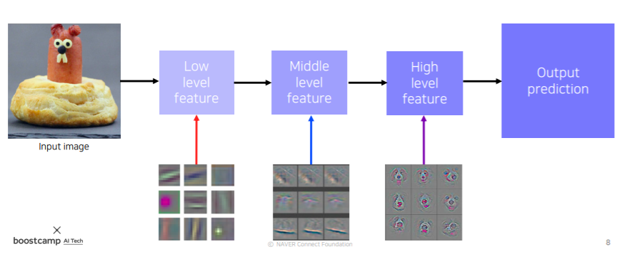
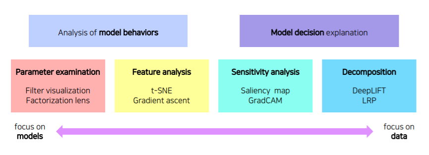
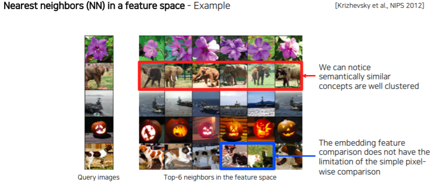
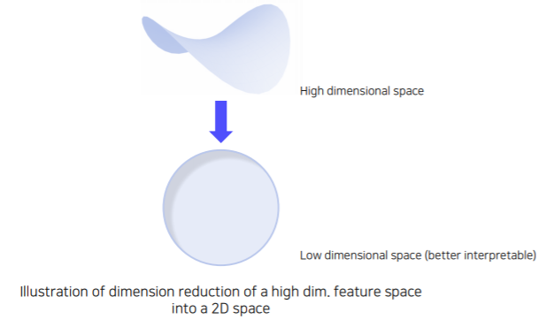
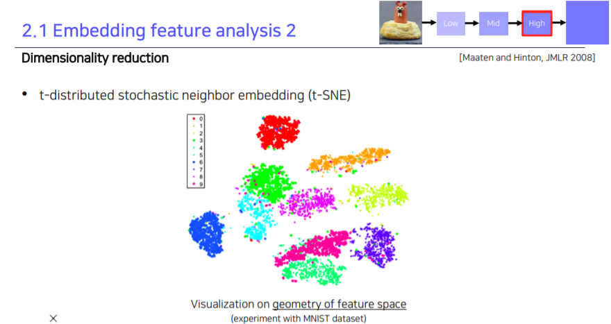

# Visualizing CNN

CNN visualization은 CNN를 시각화하는 방법입니다.

Visualization은 CNN에서 Debugging tool 역할을 합니다.

일반 debugging으로는 CNN의 구조나 weight들이 복잡하게 되어있어서 무슨 의미인지 잘 모르기 때문입니다. (BlackBox 모델)

 

#### ZFNet example

- Deconvolution을 이용해서 Visualization을 시도한 2014년 논문입니다.
- Low 계층에는 방향성이 있는, 선을 찾는 filter들, block을 찾는기본적인 영상처리 filter 모양을 가지고 있습니다.
- High 계층에는 의미가 있는 표현을 학습한다는 것을 알 수 있습니다.




 

#### Filter weight visualization

- AlexNet의 1st conv.layer의 filter은 11 x 11 size의 입력 channel입니다.
- 첫번째 conv.layer의 filter는 다양한 operation들이 학습되었다는 것을 알 수 있습니다.

- 또한, Filter visualization에다가 Convolution을 취한 Activation map에서는 영상의 각도에 해당하는 결과나 소소한 detail, 색깔로 경계선을 구분한 결과 등을 알 수 있습니다. 


 

> [한계]
>
> 하지만 Mid layer나 High layer의 경우에는 Filter의 차원수가 높아서 직관적으로 Visualization을 하기 어려움이 있습니다.

 

#### Neural Network Visualization 종류

- Analysis of model behaviors : 모델 자체의 특성을 분석
- Model decision explanation : 하나의 입력 데이터에서부터 모델이 어떤 결론을 내었을 때 어디서 그러한 결론으로 도출되었는지 출력을 분석



 

- Analysis of model Behaviors
  - 왼쪽으로 갈수록 model을 이해하기 위한 노력 (모델 자체의 행동 특성을 분석)
- Model Decision explanation
  - 오른쪽으로 갈수록 data 결과를 분석하는데 초점을 맞췄습니다. (하나의 입력데이터로 부터 어떻게 이런 출력이 나오는지 분석)

 

### 2. Analysis of model Behaviors

방금 보았던 그림에서 왼쪽 부분, model behavior을 이해하기 위한 노력에 관하여 보도록 하겠습니다.

#### 2.1 Embedding feature analysis

###### 2.1.1 Nearest neighbors (NN) Search

 

- DB가 먼저 존재하고, 그 데이터 베이스 내에 분석을 위한 예제 데이터를 많이 준비해놓는다.
- Query Data가 들어오면 그 Query 영상과 이웃 영상을 찾기 위해 DB를 찾는다.
- 각 query와 db image를 Neural Network에 넣고, High Level Layer의 결과로 나온 Feature Map의 유사도를 비교한다.
  1. Semantically similar concepts are well clustered
  2. Pixel wise comparison이 아닌 의미론적인 비교를 통해 찾는 다는 것을 보여준다.


> 위 결과 해석예시)

- **빨간색 부분**을 보면, similar한 concept을 가진 사진들끼리 clustering되어 있다는 것을 알 수 있습니다.
- **파란색 부분**은 강아지 모양이 다른 위치에 있음에도 불구하고 같은 강아지의 사진이 골라진 것을 알 수 있습니다.
  - 이들은 피쳐가 정보를 잘 담고 있다는 뜻입니다.
  - 즉, 학습된 feature가 물체의 위치변화에 강인하게, 대신에 concept을 잘 학습했다는 것을 알 수 있습니다.


###### Nearest neighbors (NN) Search의 과정

> High Dimensional의 Feature Space로 Image를 옮겨서 유사도를 측정한다.


- Query image들을 Fully Connected Layer 이전단계까지 forward를 시키고 나온 결과물을 featrue space에 찍는다.


- Query 뿐만 아니라 DB에 저장된 예시 Image Database에 있는 Image도 마찬가지로 작업을 진행한다.


- Feature Vector끼리 유사도를 측정해서 Nearest Neighbors를 적용한다.


> 한계)
>
> - 만약 포즈와 위치가 다른 이미지들도 명확하게 neighbor로 분류한다면, 이는 모델이 위치변화에 강인하게, 컨셉을 제대로 학습했다는 의미이므로 모델의 Robustness를 입증할 수 있게 된다.
> - 하지만 그 정도로 잘 되기가 매우 어렵지...
>
> - DB에 수많은 사진들을 넣어놓고 특정 Query image를 날려 해당 image와 비슷한 feature space의 images를 찾아내는지 확인한다.
>   - 그냥 간단하게 가지고 있는 사진들 중에 모델 이용해서 검색하는 것임.
> - 결과를 눈으로 직접 보고, 의미론적으로(semantically) 비슷한 이미지들이 잘 클러스터링되어있는지 확인할 수가 있다.
> - 이 방식은 결국 눈으로 예제를 보고 판단해야 하므로 전체적인 조감도를 보기는 어렵다는 단점이 있습니다.


###### 2.1.2 Dimensionality reduction

- 앞서 살펴보았던 Backbone network를 활용해서 feature를 추출하게 되면 고차원 feature vector가 나오게 됩니다.

- 이러한 고차원 feature vector는 해석하기 어렵다는 단점이 있습니다.

- 따라서 차원 축소를 통해 눈으로 쉽게 확인 가능하게 만들어줍니다.




 

> t-distributed stochastic neighbor embedding (t-SNE)
>
> - 가장 대표적인 예시 (비선형 기반의 차원축소)
> - t-distribution 이용함

example)



- 위는 0-9까지의 class로 이루어진 MNIST들의 feature들을 2차원 상으로 추출한 것입니다.
- 비슷한 class들끼리 분포가 잘되어있는 것을 알 수 있습니다.
- 여기서 3(연두), 5(하늘), 8(보라) 는 형태가 비슷하기 때문에 cluster가 비슷한 곳에 분포되어 있는 것을 알 수 있습니다.

 

#### 2.2 Activation investigation

Middle&High level를 해석하는 해석방법이다.


###### 2.2.1  Layer activation

※ Behaviors of mid- to high-level hidden units

각 Layer에서 Channel들의 Hidden node가 입력되는 이미지들에서 어떤 부분을 공통적으로 Activate하는지를 판단해서 역할을 시각화해줄 수 있습니다.


 

- AlexNet의 conv5 unit 138(channel)을 거쳐서 나온 Feature Map을 적당한 값으로 Threshold를 주고 영상에 Overlay를 시키면, 위와 같이 입력되는 여러 이미지에서 공통적으로 얼굴을 Activation한다는 것을 알 수 있다.
- 마찬가지로 conv5 unit 53(channel)을 거쳐서 나온 것은 계단의 경로 부분을 Activation 해준다는 것을 알 수 있다.
- 이를 통해서 Hidden Layer의 Channel이 어떤 역할을 하는지를 시각화할 수 있다.


###### 2.2.2 Maximally activating patches


역할을 파악하고 싶은 특정 Channel을 고르고 이미지의 랜덤 부분을 입력으로 줌,  높은 activation 나온 순으로 보여줌

각 Channel(Hidden Node)에서 **가장 높은 값을 가지는** 위치 근방의 Patch를 image별로 뜯어서 나열해보면 어떤 역할을 하는지 파악할 수 있다. (Mid Layer의 국부적인 특징을 분석할 때 유용)

- 위 그림을 보면, row별로 다른 hidden node들이다.
  - 맨 위의 채널은 강아지의 눈을 찾는 역할
  - 두번째 채널은 약간 커브가 들어간 부분을 찾는 역할


> 구현과정)
>
> - 역할을 파악하고 싶은 특정 Channel을 고릅니다. (conv5의 14 채널을 골랐음)
>
>   
>
> - BackBone Network에 예제데이터를 넣고 각 layer의 Activation map을 다 뽑음. 
>   - Mid에 있는 우리가 워하는 14 채널의 정보를 가지고 오기 위해서는 Mid Channel에 있는 activation map을 추출해야 합니다.
>
> 
>
> 
>
> - 이후, 추출된 Activation map에서 Maximum Value를 도출하게 한 그 위치에 거슬러 올라가서 입력 도메인의 receptive field 부분을 가지고 올 수 있을 것입니다.
>
> - 그 receptive field에 대한 입력 영상의 해당 패치를 아래와 같이 가져올 수 있습니다.
>
>   - 아래와 같이 각 hidden node 별로 나열을 해주었습니다.
>
> - 결과적으로 이 hidden layer가 어떤 부분을 주의깊게 살펴보는지를 알 수 있습니다.
>
>   - 이후는 위에서 해석했던 대로.
>
>   
>
> 


 

###### Class Visulization

계속해서 예제데이터를 가지고 처리해왔는데,

그렇다면 이번엔 data 없이 모델에 저장된 Class 자체에서 visualization하는 방법입니다.

 

여기서는 Gradient Ascent 개념을 사용하는데 합성 영상을 만들기 위해서 Loss를 만들어줍니다.

일단, 두 개의 Loss를 합성해서 사용합니다.

*`I`* : 입력 영상

*`f`* : CNN 모델

*`f`_{dog}*( *`I`* ) : dog 관련 score만 출력하는 부분

*`argmax f_{dog}(I)`* : dog 관련 score가 최대가 되는 II의 값

*`Reg(I)`* : Regularzation(정규화) 부분

 


 

Reg(I)는 다음과 같이 사용합니다.

제곱이 붙었기 때문에 argmaxargmax를 구할 때 II의 크기가 0이 될수록 유리해집니다. (그러면 argmax값이 커짐)

 


 

원래 Loss는 최소값(argminargmin)을 구하지만, 여기서는 argmax를 구하기 때문에 gradient ascent라는 개념으로 사용합니다.

 

순서는 다음과 같습니다.

(1) **빈 image** 또는 **random값으로 초기화된 image**를 넣어서 최종 prediction score을 받아옵니다.

 


https://www.edwith.org/bcaitech1


 

(2) Backpropagation을 통해서 입력단의 gradient를 구합니다. 따라서 입력이 어떻게 변해야지 이 target class score가 높아지는지를 찾습니다. 즉, target score를 높이는 방향으로 빈 image를 update해줍니다.

 

그래서 Loss를 측정할 때, Score값에 마이너스를 붙여서 내려가는 방향으로 만들어놓고 gradient를 계산하면 이전 neural network에서 학습했던 gradient descent 알고리즘을 그대로 사용할 수 있습니다.

 


https://www.edwith.org/bcaitech1


 

(3) image를 update해줍니다.

 


https://github.com/auduno/deepdraw/


 

(4) 이 update 과정을 가지고 (1)을 다시 반복합니다.

 


https://github.com/auduno/deepdraw/


 

(5) 이 과정을 여러번 반복하게 되면 target class에 들어있던 이미지의 형태를 구할 수 있습니다.

 


https://github.com/auduno/deepdraw/


 

Gradient descent는 현재 영상을 어떤식으로 update할지 local search하기 때문에 조금조금씩 변화를 주면서 이 score를 올리는 방법을 찾습니다. 이 말을 바꿔서 이야기하면 초기값을 어떻게 설정하냐에 따라서 다양한 결과를 얻어볼 수 있습니다.

 

[Model decision explanation]

 

Model이 어떤 특정 각도로 영상을 바라보고 있는지에 대해 해석하는 방법입니다.

 


[V.Petsiuk etal.,BMVC2018]


 

[Occlusion map]

영상이 주어졌을 때, 영상이 제대로 판정되기 위한 각 영역의 중요도를 추출하는 방법입니다.

 

아래 사진과 같이 코끼리 사진을 넣어줬을 때 A라는 큰 패치를 이용해서 Occlusion으로 가려줍니다. 

따라서 model이 이 사진을 코끼리라고 인식할 확률을 구하는 것입니다.


https://www.edwith.org/bcaitech1


 

따라서 영상에서 Occlusion으로 어떤 위치를 가려주냐에따라 확률이 바뀌게 됩니다.

물체의 중요한 부분을 가리게 되면 Score가 많이 떨어지고, 물체와 상관없는 배경 부분을 가리게 되면 Score가 적게 떨어집니다.

 

따라서 Occlusion 패치를 다양한 부분에 가려본 후, 패치의 위치에 따라 변하는 지도를 그릴 수 있습니다.

 


https://www.edwith.org/bcaitech1


 

위 Heatmap에서 보이듯이 검정색 부분은 물체의 검출에 민감한 부분이고, 밝은 부분은 별로 상관없는 부분이라는 것을 알 수 있습니다.

 

 

[via Backpropagation]

 

앞서보였던 gradient ascent를 이용해서 특정 image를 classification한 후, 최종 결론이 나온 class에 결정적으로 영향을 미친 부분이 어디인지를 heatmap 형태로 나타내는 기법입니다.

 

이 사진에서는 흰색 부분이 물체 검출에 민감한 부분이고, Model이 흰색 부분을 보고 최종 score를 결정합니다. 

 


[Simonyan et al.,CoRR 2013]


 

구하는 순서는 다음과 같습니다.

 

(1) 강아지 사진을 넣게되면 해당 Class의 score가 나오게 됩니다.

 


[Simonyan et al.,CoRR 2013]


 

(2) Backpropagation을 입력 domain까지 계산해서 구합니다. 이렇게 얻어진 gradient에 절대값(또는 제곱)을 취해줍니다. 그리고 구한 값을 이미지 형태로 출력합니다.

 

여기서 gradient에 제곱이나 절대값을 취해주는 이유가 gradient의 크기 자체가 중요한 정보이기 때문에, 입력에서 gradient가 큰 부분이 바껴야 score가 크게 바뀐다는 의미입니다. 즉, gradient가 큰 부분은 민감한 부분이라는 것을 의미합니다. 따라서 부호보다는 크기가 더 중요해서 gradient에 제곱이나 절대값을 취해줍니다.


[Simonyan et al.,CoRR 2013]


 

(3) 다시 (1)부터 반복합니다.

 

 

[Rectified unit (backward pass)]

 

\- Saliency Map

일반적으로 CNN에서는 ReLU가 많이 사용되는데 ReLU를 사용할 때 forward pass에서 음수가 나온 부분을 0으로 masking해 가려줍니다. 이런 masking pattern을 저장해놓았다가 Backpropagation을 수행할 때 양수와 음수가 합쳐진 gradient가 오게 되면, 음수 mask로 저장되어있던 masking pattern으로 masking을 해줍니다(오른쪽 Backward pass에서 빨간색이 masking pattern이며, backpropagation이 왔을 때 빨간색 모양대로 '0'처리).

 

\- Deconvolution (Zeiler et al)

Foward 시의 ReLU pattern을 사용하는 것이 아니라 Deconvolution된 activation이 backward되어서 내려올 때 (오른쪽 Backward pass : "deconvnet") 양수와 음수 값을 따져서 activation의 음수값을 masking을 합니다.

 

 


Images from [(C) Dhruv Batra and Zsolt Kira], [Kimetal, ICCV 2019]


 

이것을 수식으로 나타내면 다음과 같습니다.

 

첫번째 수식 hl+1=max(0,hl)hl+1=max(0,hl)은 ReLU가 적용된 모습입니다.

 

두번째 수식 ∂L∂hl=[(hl>0)∂L∂hl+1]∂L∂hl=[(hl>0)∂L∂hl+1]은 **ReLU부분 [(hl>0)][(hl>0)]** 을 그대로 사용해서 곱해서 사용했습니다. 

 

세번째 수식 ∂L∂hl=[(hl+1>0)∂L∂hl+1]∂L∂hl=[(hl+1>0)∂L∂hl+1]에서는 **상위의 Actiation의 ReLU를 적용한 mask [(hl+1>0)][(hl+1>0)]**를 사용해서 곱해서 사용했습니다.

 

 


[(C)Dhruv Batra andZsolt Kira]


 

두 개의 Backward pass 과정을 섞어서 사용하면 다음과 같습니다.

이 과정을 **Guided backpropagation**이라고 합니다.

 


[(C)Dhruv Batra andZsolt Kira]


 

**Guided backpropagation**을 사용하면 Backpropagation이나 Deconvolution을 수행한 것보다 훨씬 직관적으로 잘 나오는 것을 알 수 있습니다.

 


https://www.edwith.org/bcaitech1


 

두 mask를 모두 사용한 것이 **(1)** **Foward를 할 때도 결과에 긍정적인 영향을 미친 양수들을 참조**하고, **(2)** **Backward를 할 때도 gradient를 통해서 더 강화하는 방향으로 움직이는 Activation을 고른 것**입니다.

 

그래서 위 두개의 조건들을 모두 만족하는 Activation들이 Guided backpropagation에 나탄나는 것입니다.

 

 

[CAM (Class activation mapping)]

 

CAM은 사용하게되면 어떤 부분을 참조해서 어떤 결과가 나왔는지 보기 좋은 heatmap 형태로 표현해줍니다.

 


[Zhou et al.,CVPR2016]


 

CAM은 CNN에서 마지막으로 나온 Convolution Feature map을 FC layer를 바로 통과하지 않고 Global average pooling(GAP) layer를 통과하도록 바꿔주어야합니다. 그 다음에 FC layer를 하나만 통과하여 classification을 수행합니다.

 


[Zhou et al.,CVPR2016]


 

수식은 다음과 같습니다.

 

cc : 하나의 Class

ScSc : 하나의 Class에 대한 score

WckWkc : 마지막 FC layer의 Class에 해당하는 weight들

FkFk : 마지막의 GAP feature

kk : channel 수

 


 

∑kwckFk∑kwkcFk : 각각의 공간축에 평균값을 낸 부분

각각의 feature vector들의 element들의 WW가 linear combination으로 곱해져서 최종 ScSc를 만듭니다.

 


 

여기서 GAP feature Fk=∑(x,y)fk(x,y)Fk=∑(x,y)fk(x,y)를 나타내는데 **모든 pixel (x,y)(x,y)에 대해서 convolution feature map fk(x,y)fk(x,y)를 각 channel kk마다 평균을 취한 것**입니다.

 

ScSc를 구하는 수식은 모두 선형이기 때문에 순서를 바꿔줄 수 있습니다. (∑∑의 위치 바꿈)

아래의 **빨간색 box 부분을 CAM**이라고 부릅니다.

 


 

CAM은 Global average pooling ∑(x,y)∑(x,y)을 아직 적용하기 전이기 때문에 "공간에 대한 정보"가 남아있게 됩니다.

그래서 영상처럼 visualization을 수행하면 아래와 같은 형태가 나오게 됩니다.

 


[Zhou et al.,CVPR2016]


 

Class Activation Map (CAM)은 어떤 부분을 참조했는지 결과가 눈에 보이게 됩니다.

CAM이 놀라운 이유가 **어떤 물체에 대한 위치 정보를 주지 않았는데도 단순한 영상 인식기를 학습을 해서 위치를 파악할 수 있다는 점**입니다.

 

다만 CAM이 적용이 가능한 제약으로는 마지막 layer 구성이 FC layer로 만들어져야한다는 것이 단점입니다.

아래와 같이 FC layer로 구조를 변경한 후에 사용이 가능합니다.

 


[Zhou et al.,CVPR2016]


 

다만 GoogLeNet이나 ResNet의 구조에서는 마지막에 Global average pooling이 들어가기 때문에 CAM을 활용하기에 유용한 구조입니다. 즉, 구조를 수정하지 않고 CAM을 추출하는 것이 가능합니다.

 


[Zhou et al.,CVPR2016]


 

 

[Grad-CAM]

Model의 구조를 변경하지 않고 pre-trained된 Model에서 CAM을 뽑아낼 수 있는 방법입니다.

 


[Selvaraju et al.,ICCV 2017]


 

Grad-CAM은 기존 pre-trained된 network를 변경하지 않고 구할 수 있기 떄문에 꼭 영상 인식 task에 국한될 필요가 없습니다. 어떤 task던지 backbone이 CNN이기만 하면 사용할 수 있습니다.

 

 

이전에는 입력영상까지 Backpropagation을 수행했지만, 이번에는 우리가 관심을 가지고 있는 Activation map까지만 backpropagation을 수행합니다.

 

\- ycyc : 현재 task에서 해석하고 싶은 결과 (class에 대한 score)

\- AkijAijk : 마지막 conv layer의 k번째 feature map

\- ∂yc∂Akij∂yc∂Aijk : backprogagation의 gradients

\- ZZ : i×ji×j 크기의 모든 pixel 수 (receptive field의 크기)

\- 1Z∑i∑j1Z∑i∑j : Global average pooling

 

따라서 각 channel cc의 gradient 성분의 크기 αckαkc를 구합니다.

그리고 이 αα를 activation map을 결합하기 위한 성분으로 사용합니다.

 


[Selvaraju et al.,ICCV 2017]


 

즉, A가 마지막 fully connected layer의 feature map인데 '사람' class를 검출하는 과정이라면

A heatmap의 어떤 pixel 값을 높게 줬더니 '사람' class의 score 값 (y)이 크게 향상 된 경우(변화율 증가) -> 그곳에 사람이 있다고 생각되서 alpha 값을 크게주고
A heatmap의 어떤 pixel 값을 높게 줬더니 '사람' class의 score 값 (y)이 낮게 향상 된 경우(변화율 감소) -> 그곳에 사람이 없다고 생각되서 alpha 값을 낮게 줍니다.

 

그리고는 ReLU를 사용해서 선형 결합을 하게 됩니다. 이때, ReLU를 사용했기 떄문에 양수값만 사용하게 됩니다.

 

여기서 A heatmap의 αα를 계수로 사용해, "alphaalpha값이 강한 곳 * 물체 위치 (A feature map에서 강하게 나온 값)"은 강한색으로 나타냅니다.

 


[Selvaraju et al.,ICCV 2017]


 

따라서 Grad-CAM은 Image Classification, Image Captioning, Visual Question Answering 모든 부분에 사용이 가능합니다. BackBone model만 CNN이면 됩니다.

 

 


[Selvaraju et al.,ICCV 2017]


 

여기서 Guided Backpropagation과 Grad-CAM 방법을 결합해서 사용할 수 있습니다.

Grad-CAM은 smooth한 특성을 가지고 있고, Guided Backprop은 sharp한 특성(class에 대한 구분성)을 가지고 있기 떄문에 두 개를 곱해서 좀 더 sensitive한 Guided Grad-CAM이 나올 수 있습니다.


---


###### Q1) **`FC는 공간정보가 없어지는 단점이 있어서 GAP가 나온 것이다`**라고 하는데, (GAP) Global Average Pooling이 어떻게 공간정보를 가지고 있게 되는 걸까?


- 만약 Global Average Pooling의 Input으로서 C개의 채널의 feature map이 들어온다면, 각 채널에 Average Pooling을 통해 1x1 feature map를 C개 만들고 이를 concat하는 것이다.

- 결국 GAP의 결과는 C개의 각 채널의 정보를 1개의 픽셀(Average)로 표현하여 C개만큼 가지고 있는 것이다.
  - GAP는 각 채널의 대푯값(분포)만 뽑은 다음 concat하여 이렇게 만들어진 Flatten Vector를 FC layer에서 이용해 Task를 수행합니다
  - 이 과정에서 틀렸을 때의 loss가 발생할 것이고 이를 통해 여지껏 그랬던 것처럼 역전파 과정을 수행합니다
  - 위 그림에선 n개의 채널 분포값 중 어느 것이 중요한지를 loss에서 비롯된 역전파를 거쳐 가중치가 업데이트되겠죠.
  - 마치 해당 Task를 수행하는 것에 있어서 어느 채널이 중요한지 Attention 메커니즘을 수행하는 것이라고 볼 수도 있겠습니다.


```
말로 설명하기보단, 이제 위의 그림을 다시 한번 살펴보면서 GAP결과를 좀 더 Feature의 관점으로 이해해보자.

GAP 이전의 n개의 채널을 각각 압축시켜 n개의 정보들(Flatten Vector : w1, ... wn)로 만들고, 이를 FC Layer에 넣어 Task를 수행하는 정보가 된 것이다.

- 예를 들어, mnist의 경우에 최종 출력이 (1, 1, 10)이고 각 배열 안에 각 숫자에 대한 softmax 값이 들어있습니다.


그냥 이전부터 CNN에서 하던 flatten 이후 FC layer를 통과시키는 것과 과정이 거의 동일한 것이다 (과정에서 Flatten 대신 1x1 C랑 GAP를 사용했을 뿐)
```


###### Q2) 1x1 kernel size 로 컨볼루션하는데 왜 Fully Convoultion 결과값이 1x1xdimension 이 되는거에요?

> 어떤 feature map size가 W x H x C라고 가정해보자.
>
> 1. 이 때 해당 layer에서 1 x 1 convolution을 쓰면 (W, H, number of filter)이 됩니다, (filter 수는 우리가 조정가능함, 최종적으로 원하는 output의 class로 설정하면 되는거임)
> 2. Global Average Pooling을 쓰면 (1, 1, C)가 됩니다.
>
> - 참고 : 그냥 flatten을 쓰면 (1, W x H x C)가 됩니다.
>   - 이 경우에는 우리가 최종적으로 원하는 아웃풋을 뽑고 싶으면, (원하는 결과 차원수가 있다면) nn.Linear() 등과 같이 output channel를 class 갯수만큼 줄여주는 과정을 추가해야 한다.
>
> 
>
> 주의할 점 : GAP 부분은 flatten처럼 펼쳐주는 개념이 아니라 fc layer처럼 (1, 1, channel) 꼴로 만드는 것
>
> 
>
> 결론 : Fully Connected Layer를 대체하려면, (1x1 convolution과 Global Average Pooling을 함께 사용하며, 이것을 Fully Convolution Layer라고 부르는 것이다.)


```
※ 결론)

만약 내가 Input size에 상관없이 FC layer처럼 내가 원하는 shape의 출력을 얻고 싶다면,
1. 마지막 conv layer보다 먼저 1 x 1 convolution을 사용해서 내가 원하는 output channel만큼 줄인 후,
2. gap를 사용해 fc layer처럼 (1, 1, channel) 꼴로 만듭니다.
3. 그 후 내가 원하는 Task를 수행하기 위해 
```


※ 결론)

만약 내가 Input size에 상관없이 FC layer처럼 내가 원하는 shape의 출력을 얻고 싶다면,

1. 마지막 conv layer에 1 x 1 convolution을 먼저 사용해서 내가 원하는 output channel만큼 줄인 후,
2.  gap를 사용해 fc layer처럼 (1, 1, channel) 꼴로 만듭니다.


예를들어 mnist의 경우에 최종 출력이 (1, 1, 10)이고 각 배열 안에 각 숫자에 대한 softmax 값이 들어있습니다.

gap으로 flatten처럼 펼쳐주는게 아니라 fc layer처럼 (1, 1, channel) 꼴로 만드는 것