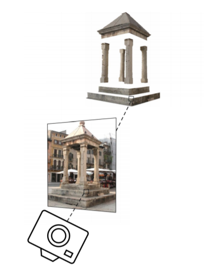
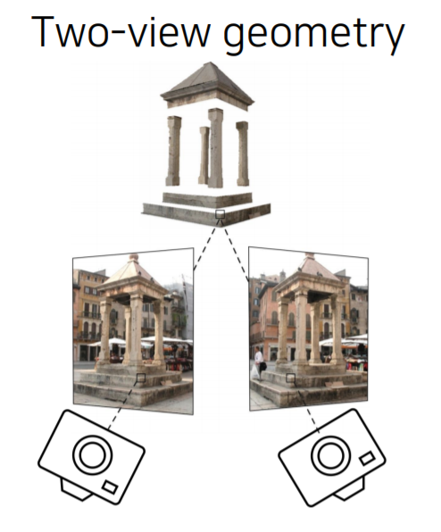
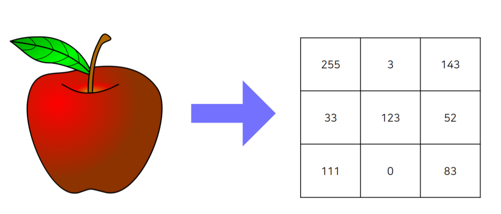
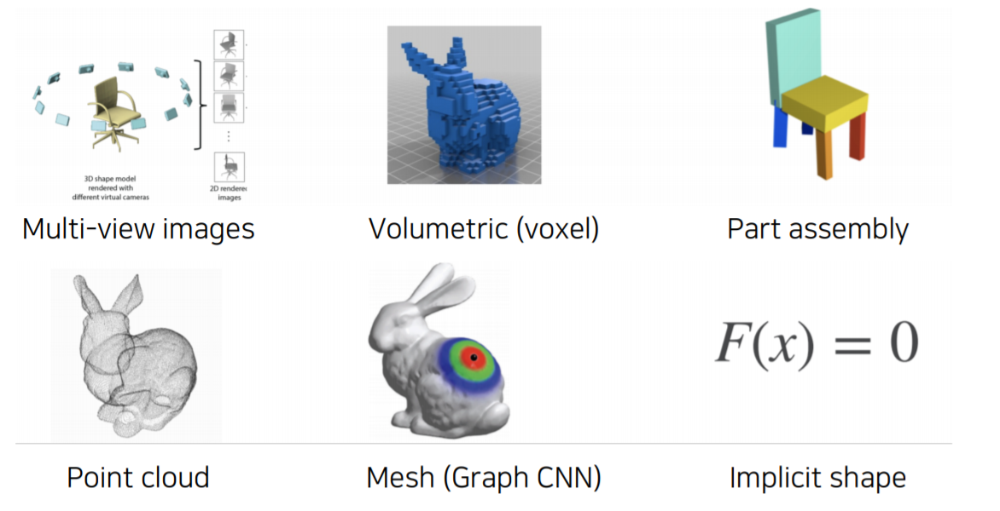
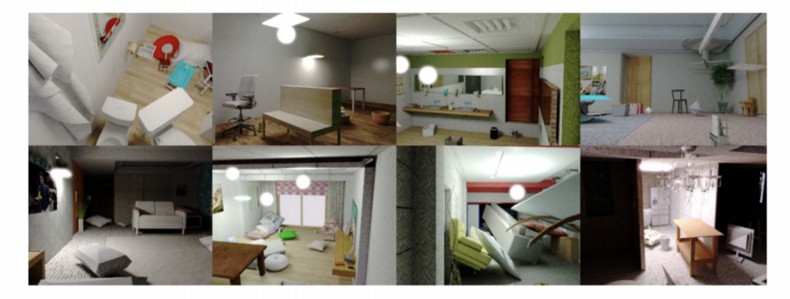
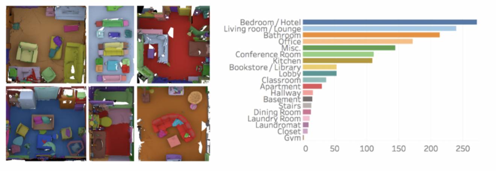
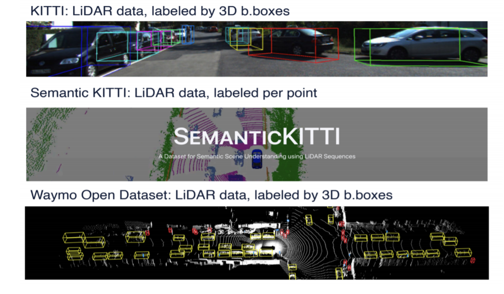
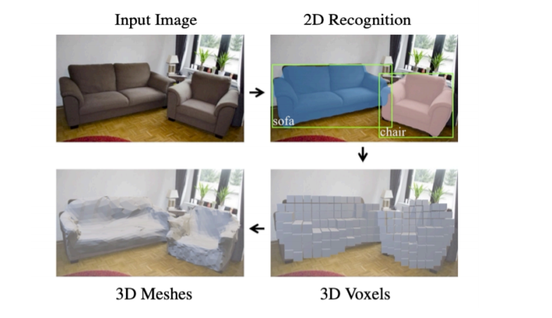
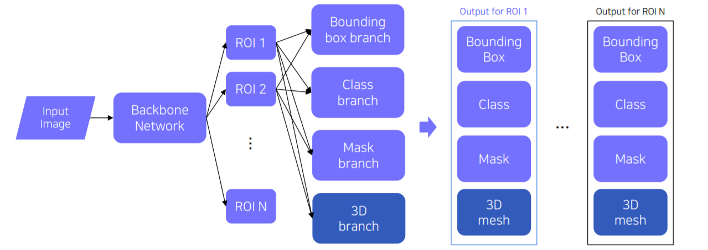
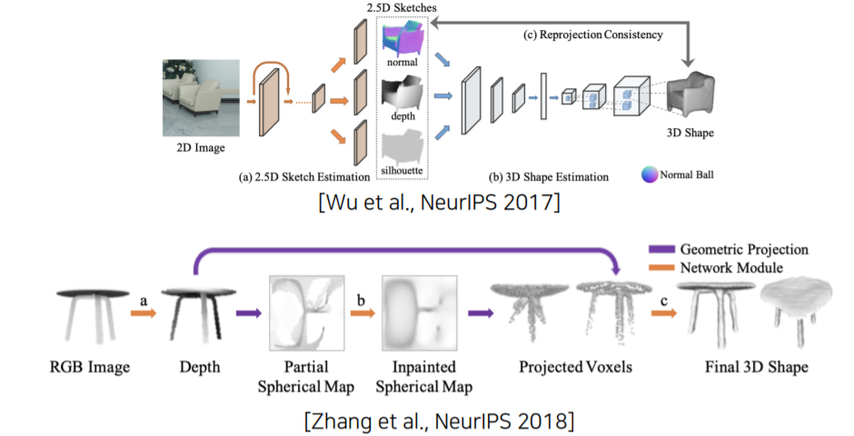

# The Way We Observe 3D

## **Triangulation**

 

Camerea는 3D 장면을 2D image로 projection 시키는 물체입니다.

 

그런데 재밌는 사실은 projection된 사진 2개만 있으면 3D를 추출할 수 있습니다.

한 점에서 교차하는 부분이 3D 포인트가 됩니다. 이 것을 **Triangulation**이라고 합니다.

그래서 2D image에서 3D를 구하는 방법은 Triangulation이라는 방법에 의존하게 됩니다.

## 3D Data Representation  

2D image는 각각의 pixel에 대해 RGB value를 가지고 2D array에 저장이 됩니다.

 

3D를 표현하는 방법은 다음과 같습니다.

 

- **Multi-view images :** 3D 물체가 있을 때 물체를 중심으로 여러 각도에서 사진 촬영 후 보관
- **Volumetric(voxel) :** 3D space를 적당한 격자로 나눠서 각각의 격자가 3D 물체를 차지하고 있는지를 비교
- **Part assembly :** 기본적인 도형들의 집합으로 part를 표현
- **Point cloud :** Point들의 집합을 이용해서 3D space를 표현
- **Mesh (Graph CNN) :** (x,y,z) 형태로 표현된 vertex와 그 것들을 잇는 edge로 만들어진 graph 표현
- **Implict shape :** 고차원의 Function 형태로 3D를 표현, 그리고 0과 교차하는 부분을 확인하면 3D가 나옴

 

## 3D dataset

 

### ShapeNet : 55개의 category에 대해 51,300개의 object

 

###  PartNet

Fine-grained dataset (하나의 object들의 detail(손잡이 등)에 대해 annotation된 dataset)

26,671개의 3D model 중 573,585개의 part instances들을 가지고 있습니다.

 

### SceneNet

500만개의 RGB image와 depth pair의 영상 dataset입니다.

indoor image를 3D 모델을 통해서 시뮬레이션 데이터로 가지고 있습니다.

### ScanNet

RGB-Depth pair의 dataset이며 250만개를 가지고 있습니다.

실제 scan본 1500개를 가지고 있습니다.

 

### Outdoor 3D scene dataset

대부분의 outdoor 3D dataset은 자율주행 자동차에 사용하는 dataset입니다.

 

# 3D tasks

 

### 3D object recognition

 

2D CNN을 사용해서 label 정보를 얻는 것처럼 3D도 3D 전용 CNN을 사용해서 label 정보를 얻습니다.

 

### 3D object detection

 

대부분 자율주행에서 object들을 detection할 때 사용됩니다.

 

### 3D object segmentation

 

물체의 구조를 나눌 때 많이 사용됩니다.

 

### Conditional 3D generation

 

#### Mesh R-CNN

2D image를 input으로 받아서 3D mesh 형태로 output이 나옵니다. 

 

Mask R-CNN의 head를 mesh 형태로 변환함으로써 구현할 수 있습니다.

따라서 Mask R-CNN 구조에서 **3D branch head를 추가**해줍니다.

 

#### More complex 3D reconstruction model

 

3D object를 여러개의 sub-problem으로 decomposing한 model입니다.

Sub-problem들은 물리적으로 의미있는 disentanglement(분리)를 하는 형태로 구성되게 됩니다.

