# Multi-modal: Captioning and speaking

## 1. Overview of multi-modal learning

Multi-modal learning은 다양한 데이터 type (이미지와 텍스트, 이미지와 오디오, 오디오와 텍스트 등)을 사용해서 학습하는 것을 의미합니다.

먼저, Mutli-modal learning에서 겪는 어려운 점은 다음과 같습니다.

 

1. 데이터들이 서로 다른 표현방법을 가지고 있기 때문에 학습이 쉽지 않습니다.

   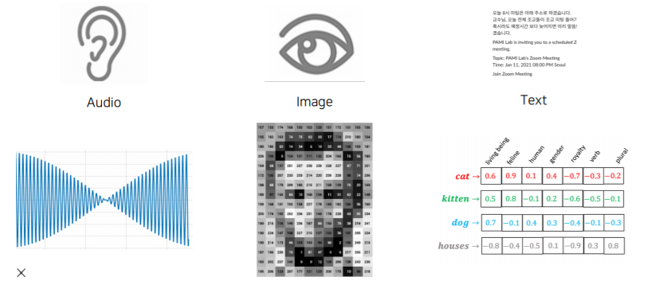

2. 서로 다른 데이터들의 양이 unbalanced하고 각각의 feature space도 unbalanced합니다.

   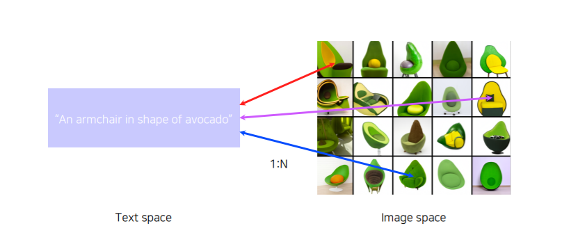

3. 모델을 사용해서 학습을 할 때 여러 modality를 사용하게될 경우에 여러 modality를 fair하게 참조하지 못하고 **bias**되는 경향이 잇습니다.

   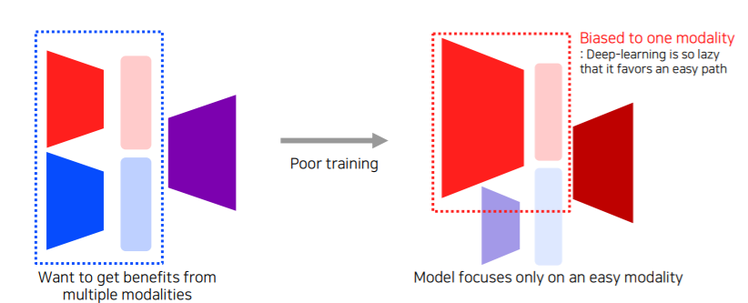

그래서 Multi-modal learning 이용하는데에는 일정한 학습방법들(pattern)이 있습니다.

- **Matching :** 하나의 데이터 type의 data(빨강)와 또 디른 데이터 type의 data(파랑)를 공통된 space(보라)로 보내서 서로 matching시키는 구조
  - 다시 말해서, 두 도메인의 임베딩을 같은 공간에 두고 유사도를 높게 설정하는 방식으로 학습하는 방법. (고양이라는 텍스트와 고양이 이미지는 임베딩 결과 유사도가 높게 설정)
- **Translating :** 하나의 modality data(빨강)를 다른 modality data(파랑)으로 translate해주는 구조
  - 다른 도메인으로 변환하는 방식을 학습하는 방법
- **Referencing :** 하나의 modality data(빨강)에서 똑같은 modality data(빨강)로 출력하고 싶은데 다른 modality data(파랑)를 참조하는 구조
  - 다른 도메인을 참조하는 방식으로 학습하는 방법

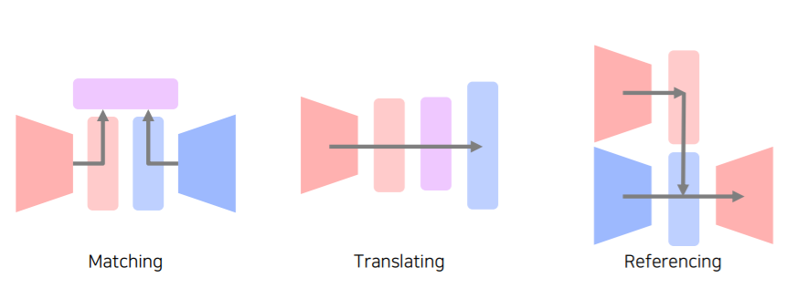

 ## 2. Multi-modal tasks (1) - Visual data & Text

 ### 2.1 Joint Embedding

각 도메인 데이터의 임베딩 벡터를 구한 후에, 같은 임베딩 공간에 Joint합니다. 이때 **두 개의 feature vector의 dimension은 같아야합니다.** 그렇기 때문에 이미지의 임베딩 벡터는 spatial 정보를 가질 수 없습니다.

#### 2.1.1 Application - Image tagging

주어진 image를 가지고 tag를 생성할 수 있고, tag를 사용해 image를 찾을 수 있습니다.

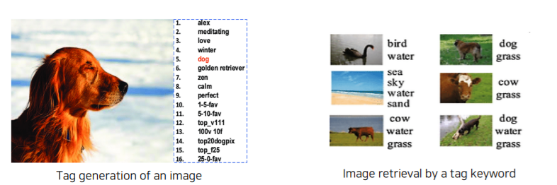

 

- Image tagging은 pre-trained된 unimodal model (각각의 model)들을 합쳐줍니다.

  

- text를 하나의 feature vector 형태로 표현해주고, image data 또한 하나의 feature vector 형태로 표현해줍니다.

- 이후, 두 개의 feature vector가 호환성이 있도록 **Joint embedding**을 해주어야 합니다.

- 이는 같은 embedding space에 mapping을 해주는 것이고, 그 후 서로 embedding 간의 distance를 줄이거나 늘이는 방향으로 (pair라면 유사도를 높게 해주고 unpair라면 유사도가 낮게끔) 학습을 해주어야 할 것입니다.

  - pair를 matching이라고, unpair를 unmatching이라고도 함, 아무튼 유사도를 어떻게 할지 설정하고 학습하는 방법임.

    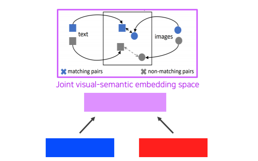

- 이렇게 distance(유사도)를 기반으로 해서 학습하는 방법을 Metric learning이라고 합니다.

- 아래 그림과 같은 작업도 가능합니다. dog를 빼고 cat을 더했더니 같은 잔디밭에 고양이가 있는 이미지를 찾았습니다.

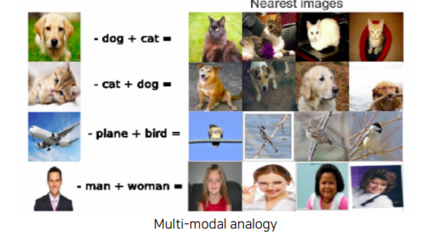

 

#### 2.1.2 Application - Image & food recipe retrieval

 

Image를 넣어줬을 때 그 image에 따른 recipe를 알려주고, recipe를 넣어줬을 때 그에따른 image를 보여줍니다.

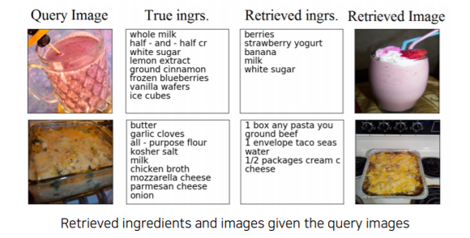

 

 

두 번째 loss는 semantic regularization loss로써 cosine similarity loss로 해결이 안되는 regularization 부분들을 해결할 수 있습니다. 전체 정보 중에서 일부의 정보만이라도 중요하게 catch했으면 좋겠다라는 값을 넣어줍니다.

 

1. **Text(Recipe, Instrucction)**은 순서가 있는 text이기 때문에 재료(ingredients)들이 어떤 순서로 추가가 되느냐를 RNN 계열의 network를 통해서 하나의 fixed vector를 출력해야합니다.
   - Ingredients vector와 instruction vector 두 개를 concatenation해서 하나의 vector로 만들어줍니다. 이 vector가 text를 대표하는 vector가 됩니다.
2.  **Image**는 CNN backbone network를 이용해서 하나의 feature vector로 만들어주고 text와 똑같은 dimension의 vector로 만들어줍니다.
3. 코사인 유사도를 loss로 이용한다. matched pair끼리는 loss를 작게, 즉 유사도를 높게 주고 unmatched pair라면 (text와 image가 연관이 안되어있다면) loss를 높게(유사도를 낮게) 설정하면 된다.
4. 코사인 유사도만으로는 완벽히 분류하기가 힘들기 때문에 두 번째 loss부분과 같이 semantic regularization loss로 보완해줍니다.
   - 이는 high-level semantics를 구분해줄 수 있는, 전체 정보 중에서 일부의 정보만이라도 Catch해냈으면 좋겠다는 목적이 담겨있습니다.
   - 예를 들어 fried fish라는 같은 카테고리일 경우 그 중 일부만이라도 캐치하겠다는 것입니다.

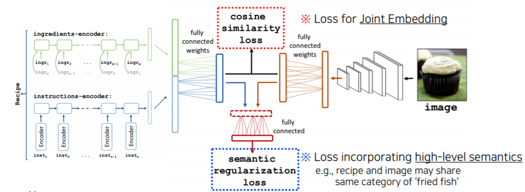

 

### 2.2 Cross modal translation 방법

#### 2.2.1 Application - Image cationing

 

Image가 주어지면은 그 Image를 잘 설명하는 text discription을 생성해내는 방법입니다.

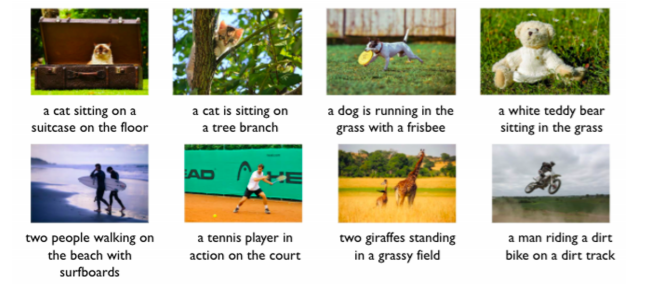

 

Image translation에서는 Image는 CNN을 사용하고, text에는 RNN 구조를 사용하게 됩니다. 이러한 방법을 **Show and tell**이라고 합니다.

 

- **Encoder :** ImageNet 데이터로 pre-trained된 CNN 모델을 사용하여 Image가 input으로 들어오면 fixed dimension vector로 바꿔주고
- **Decoder :** 문장 반환 디코더로는 LSTM을 사용해서 입력을 넣은 다음 text를 출력합니다

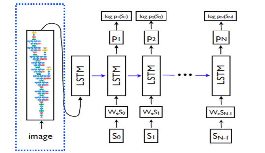

 

**`Show, attend and tell`**은 "Show and tell"에서 Image의 어떤 부분에 attention을 해야하는지를 추가한 방법입니다. **`Show, attend, and tell`**에서는 input image에서 Convolution feature를 뽑기 위해 먼저 input image를 CNN에 넣습니다.

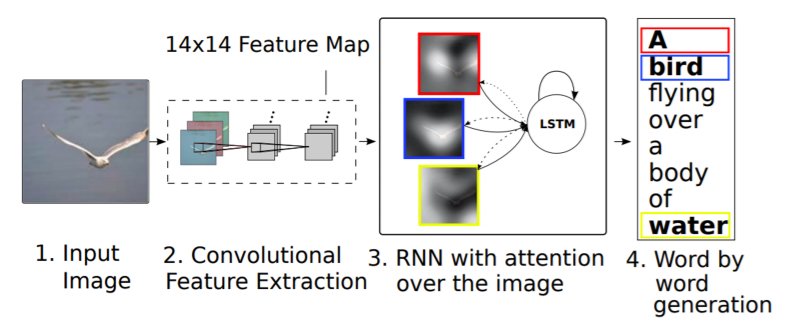

근데 여기서 다른 점은 feature dimension vector로 그냥 출력하는 것이 아닌, 공간 정보를 유추할 수 있는 **14 x 14 feature map을 출력하고, 이 feature map을 RNN에 넣어줍니다.**

이 RNN은 반복해서 하나의 word를 생성할 때마다 이 14 x 14 feature map을 referencing해서 계속 예측을 해나갑니다.

이렇게 하는 이유는 사람 역시도 이미지를 볼 때 슬라이딩 윈도우 방식으로 보는게 아니라, 특징적인 부분(얼굴에서는 눈코입 등)을 먼저 혹은 집중해서 보기 때문에 같은 방식으로 학습하는 것입니다.

> **Attention을 사용한 메카니즘은 다음과 같습니다.**

Special한 feature (a)가 들어오게 되면 RNN을 통과시켜서 어디를 referencing해야하는지 heatmap으로 만들어줍니다. 이 **attention과 feature를 잘 결합해서 Z라는 vector**를 만들어줍니다. 이러한 방법은 **Soft attention embedding**이라고 말합니다.

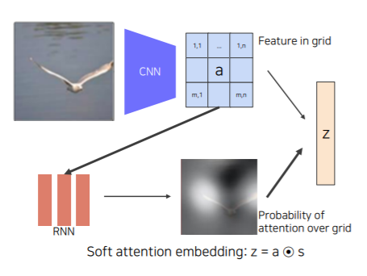

 

> **Attention 메커니즘의 Inference 과정**

- Image가 주어지면은 Feature를 추출해서 LSTM에 넣어줍니다.

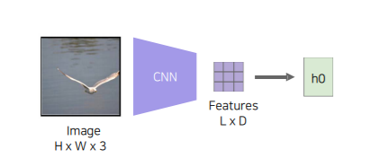

 

그러면 Condition으로 넣어주면 **어떤 부분을 attention할지 spatial attention을 weight로 출력**해 줍니다(아래 그림에서 S1). 그렇다면 이 weight를 이용해서 Feature하고 inner product를 해서 하나의 vector(아래 그림에서 Z1)를 만들게 됩니다.

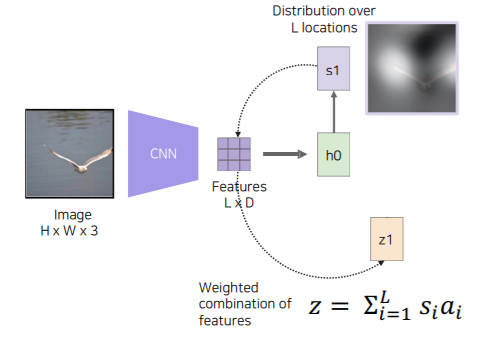

 

그 후, RNN step에 Z1을 Condition으로 넣어주게 되고 Start word token (아래 그림에서 y1)을 넣어주게 됩니다.

사진에서는 갈매기의 날개부분이 밝게 빛나는 것을 알 수 있는데 이 Feature를 통해서 Start word token이 주어졌을 때 어떤 첫 글자를 뽑을지 h1(RNN에서) 고민하게 됩니다.

 

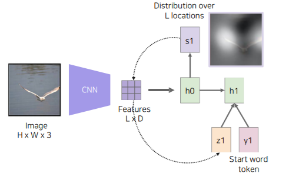

그래서 처음 시작한 단어는 "A"가 나오게 됩니다.

그리고 나서는 **h1이 어떤 부분을 Referencing할 것인지 S2에게 예측**을 해줍니다.

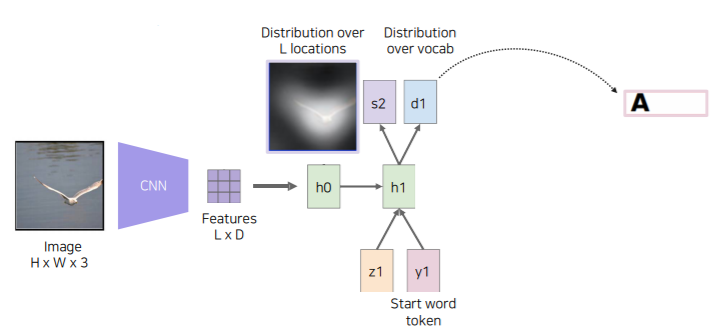

 

h1의 예측을 받은 S2가 다시 Feature와 inner product를 해서 Z2라는 conditional vector를 만들어줍니다.

S2에서 갈매기의 양 날개 부분을 referencing해서 Feature와 inner product를 했기 때문에 **Feature에서는 양 날개 위치 부분을 주의 깊게 (attention)** 보게 됩니다. (S2 weight들이 그쪽 부분에 값이 높기 때문에 feature와 내적을 하면 그 부분이 높음)

 

y2에는 이전에 출력했던 "A"라는 문자를 넣어주게 됩니다.

 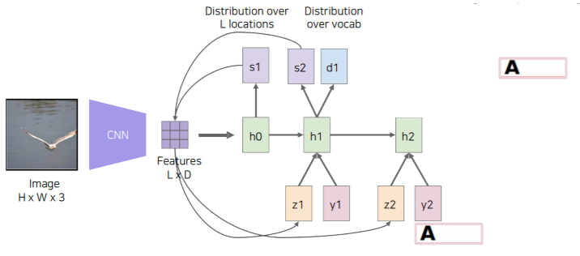

 

다시 그러면 h2가 z2, y2를 가지고 다음 단어를 prediction하게 됩니다.

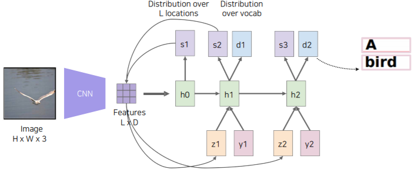 

 

이번에는 Text가 주어지면 image를 만들어주는 model입니다. 이때, image는 한 장만 나오는 것이 아니라 여러 장이 나와야합니다.

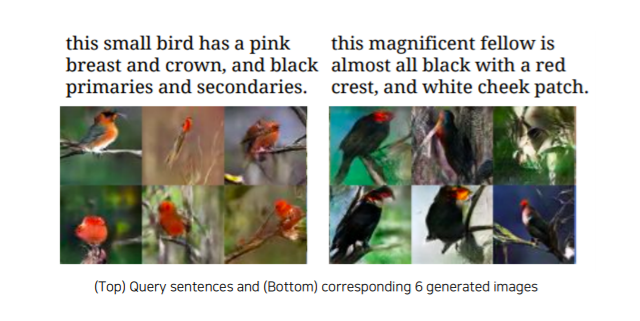

 

**Generator network**에서는 **text가 들어왔을 때 Fixed dimension vector로 만들어주는 네트워크(아래 그림에서 φ)**가 있어야합니다.

 

그리고 fixed dimension vector 앞에다가 Gaussian Random code ( z N(0,1) )를 붙여줍니다. Gaussian Random code의 역할은 항상 똑같은 input이 들어갔을 때 항상 output 결과가 똑같이 나오는 것을 방지해줍니다. 그래서 다양한 결과가 나올 수 있도록 해줍니다.

 

그리고 decoder를 거쳐서 image 형태로 generation을 합니다.

 

**Discriminator network**는 처음 image가 들어오면 encoder 부분을 거치게 됩니다.

 

그리고 Generator Network에서 사용했던 text 정보를 Discriminator에서 가지고 와서 사용하게 됩니다. 그래서 **이 sentence condition 하에 input 영상이 make sence한 것인가를 판단하도록 learning을 수행**합니다.

 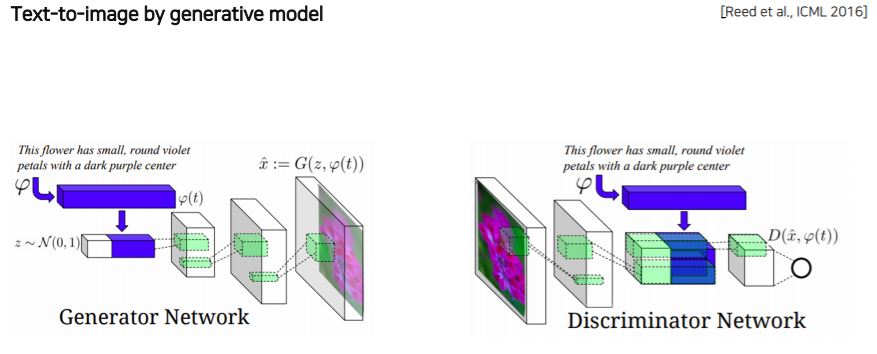

### 2.3 Cross modal Reasoning (Referencing 방법)

#### 2.3.1 Visual Question Answering

Visual question answering은 영상이 주어지고 질문이 주어지면 답을 도출하는 task입니다.

Visual question answering 아키텍쳐는 다음과 같습니다.

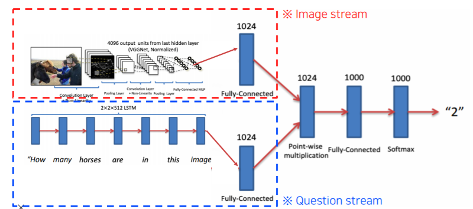

Visual question answering은 Image stream과 Question stream으로 구성되어 있습니다.

Image stream은 pre-trained된 network를 사용해서 fixed dimension vector 형태로 출력하게 됩니다.

Question stream은 text의 sequence로 RNN으로 encoding을 하게 됩니다.

이 두 개의 vector를 **Point-wise multiplication을 해서 두 개의 embedding feature가 interrection을 할 수 있도록 만듭니다.** 

그리고 이 전체 부분을 **end-to-end** training을 수행하게 됩니다. 

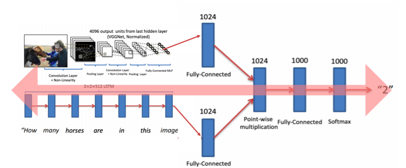

 

## 3. Multi-modal tasks (2) - Visual data & Audio

### 3.1 Sound representation

#### 3.1.1 사운드의 표현방식 

> **Waveform :** 1d signal로 시간축에 대해 wave 형태로 존재

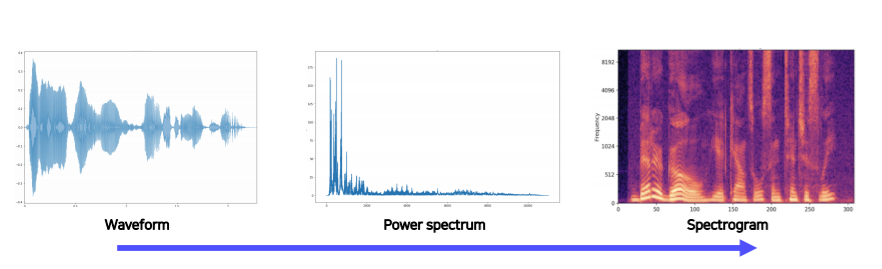

Waveform에서 Spectrogram으로 변환시키기 위해서는 **Fourier transform**을 사용합니다.

하지만 Fourier transform을 그냥 사용하는 것이 아니라 다른 방법으로 변환해서 사용합니다.

> **Short-time Fourier transform(STFT)**

시간축 t에 대해서 존재하는 waveform 전체에 대해 fourier transform을 적용하면 **주파수축으로 옮겨가게 됩니다**. 그렇지만 주파수축으로 모두 전부 옮겨가게 되면 시간에 따른 변화를 파악할 수가 없습니다. 따라서 제안된 것이 STFT입니다.

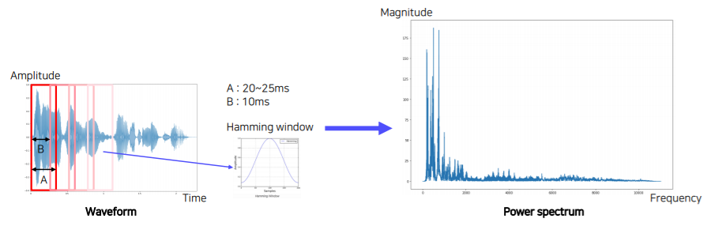

- **STFT는 굉장히 짧은 window 구간 내에서만 fourier transform을 수행합니다.**

 **Hamming window**으로 boundary에 대한 weight를 약하게 주고, **가운데 부분을 강조하는 형태로 window를 곱해줌으로써** 퓨리에 변환을 적용합니다.

이 방법을 사용하면 연결된 부분을 window slicing 할 때 확 잘려서 signal이 급격하게 변하는 것을 방지할 수 있습니다.

 

그리고 Power spectrum을 가지게 되는데 Power spectrum은 시간에 따라 바뀌기 때문에 여러 Power spectrum을 추출할 수 있습니다. 근데 이것을 **일정간격 띄어서 추출**합니다(B: 10ms로 띄어서). **이 일정간격 띄는 것을 Hop 또는 Offset이라고 부릅니다**.

 

> **그렇다면 Fourier transform을 왜 할까요?**

시간 축에 input signal이 주어지게 되면 **Fourier transform을 통해서 각각의 삼각함수가 어느정도 성분으로 들어가 있는지 다 분해**하게 됩니다. 이렇게 **각 주파수 성분을 파악**할 수 있게 됩니다.

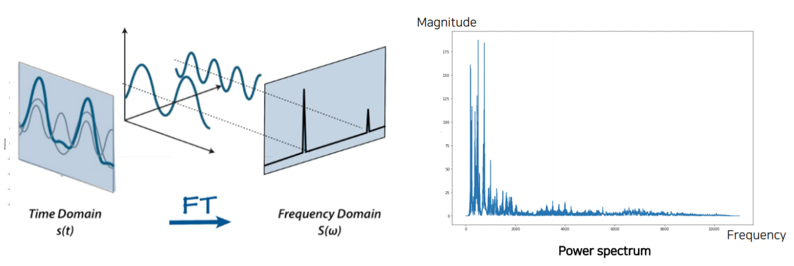

> **Spectrogram**

그래서 이러한 spectrum 하나하나를 한 window에서 구현하게 되면, 하나하나를 세로로 stack하게 됩니다.

그러면 시간(t)에 따라서 주파수 성분이 어떻게 변해가는지 눈으로 볼 수 있게 됩니다.

 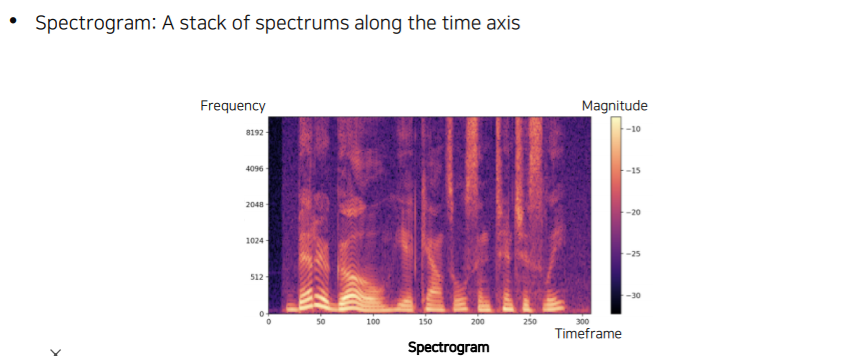

 

mel spectrogam : 인간이 안쓰는 주파수 영역 (7000-8000) 차이를 줄이기 위해 spectrogram에 log를 취해줌. (log함수는 값이 커질수록 점점 값 차이가 생기지 않음)

###  3.2 Joint embedding - (Image와 Audio Matching 방법)

#### 3.2.1 **SoundNet**

Sound를 통해서 현재의 sound를 어떤 장소에서 일어난지 추측해서 현재 장면을 추측하는 task입니다.

 

이를 위해 SoundNet이라는 Network 모델을 사용하게 됩니다.

 

input으로는 label이 되어있지 않은 video를 사용하고, **labeling을 사용하지 않고** 기존에 pre-trained 되어있는 Visual Recognition Network를 사용합니다. 이 부분에 Unlabeled Video를 넣어줍니다.

 

그러면 Visual Recogition Network에서

**Object Distribution**은 Object가 어떤 것이 들어가 있는지에 대한 distribution을 출력해주고,

**Scene Distribution**은 Places CNN으로 지금 현재 video가 어떤 장면(scene)에서 촬영되고 있는지를 출력해줍니다.

그리고 video는 audio를 동반하고 있기 때문에 **audio를 Raw Waveform 형태로 추출을 해서 CNN에 넣어줍니다.**

CNN은 1D-CNN이며, 맨 마지막에는 2개의 head로 분리해줍니다.

**첫 번째 head**는 Scene Distribution을 따라하도록, 즉, place recognition을 할 수 있도록 

**두 번째 head**는 Object Dsitribution을 할 수 있도록, 즉, 어떤 obejct들이 존재하는지를

**KL divergence를 minimize하는 형태로 학습**을 시켜줍니다.

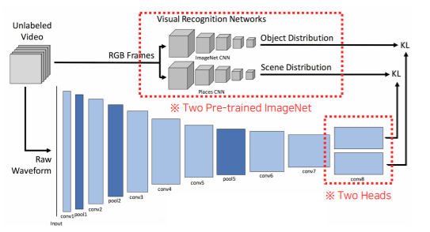

 

따라서 이러한 학습 방식을 **teacher-student** 방식의 학습 방법입니다.

이 방법은 visual knowledge를 sound에게 transfer했다라고 말할 수 있습니다.

 

만약 특정 target task가 있을 경우, **pool5에 있는 feature를 추출해서 사용**합니다.

Conv8에 존재하는 head들에서 feature를 추출하기에는 Object distribution과 Scene distribution에 너무 optimizer되어 있기 때문에 pool5 부분이 조금 더 generalizable되어있다고 말할 수 있습니다.

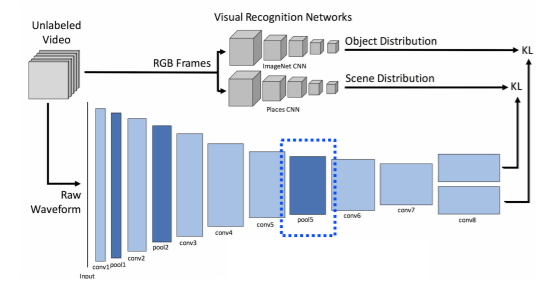

### 3.3 Crossmodal translation 방법 (Image-Audio) 

#### 3.3.1 **Speech2Face**

어떤 Voice를 듣고 그 Voice를 기반으로 Face를 생성해내는 방법입니다.

그래서 Speech2Face Model은 Spectrogram이 input으로 들어가고 Fixed dimension vector가 나오면 Face Decoder에 들어가서 얼굴을 reconstruction해주는 translation 모델입니다.

 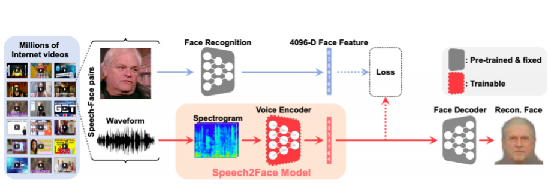

Speech2Face는 Module networks를 적극적으로 활용합니다.

Module network는 각자 담당하고 있는 network가 미리 학습된 것을 잘 조합해서 사용합니다.

 

VGG-Face Model은 얼굴 image가 들어오면 Fixed dimension vector 형태로 가지고 옵니다. (pre-trained)

Face Decoder는 face feature가 들어오면 reconsturction해서 face를 출력하게 됩니다. (pre-trained)

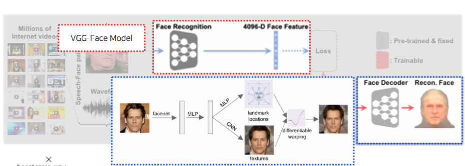

 

따라서 video에서 image와 speech를 따로 분리한 후, VGG-Face Model과 Speech2Face Model에 보내서 Fixed dimension vector를 추출합니다. 이 두개의 Fixed dimension vector의 Loss를 구해 차이를 점차 없애가는 방법입니다.

 

그렇게 되면 Face Decoder는 Face Feature에 호환이 되도록 학습이 되었기 떄문에 추가적인 학습 없이 **"voice encoder에서 출력된 feature"와 "face feature"와 호환이 되기만 하면 Face Decoder에 넣어줄 수 있습니다.**

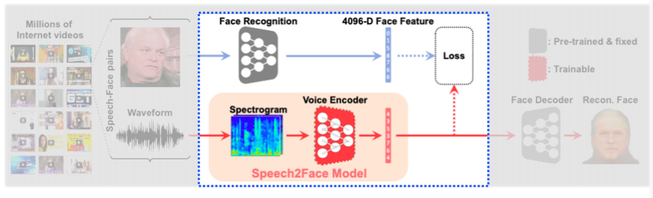

 

이 방법은 annotation이 필요하지 않습니다. Self supervised 방법이기 때문입니다. 

왜냐하면 video 내에서 얼굴 image와 voice가 이미 paired 되어있는게 자동으로 annotation이 된 것이라고 생각할 수 있습니다.

 

#### 3.3.2 Application : Image-to-speech synthesis

Image-to-speech synthesis는 **image에서부터 speech를 만드는 방법**입니다.

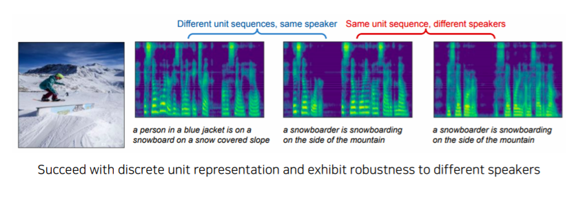

 

여기서의 Module network는 image가 들어오면 CNN을 통해서 14 x 14 feature map으로 만들어줍니다. 그리고 **LSTM + Attention 구조 ( "Show, Attend, and Tell" 구조를 동일하게 사용)를 사용**합니다. 대신 하나의 word를 추출하는 것이 아니라 **sub-word unit 단위 (ex. token)로 출력**을 해줍니다.

 

그리고 이 sub-word unit에서 speech를 복원하는 **Unit-to-Speech Model**을 따로 학습해놓습니다.

여기서 Tacotron2 모델을 사용했느데, Tacotron2는 TTS (Text To Speech) 아키텍쳐입니다. 

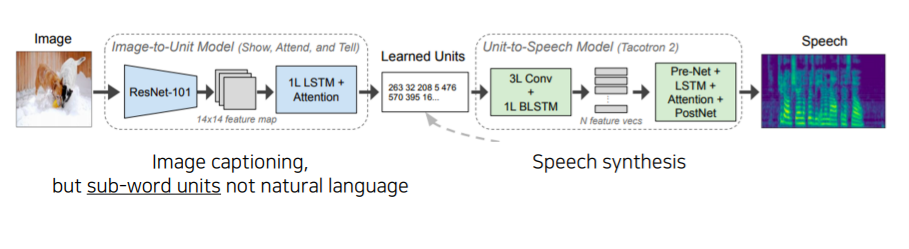

 

Learn Units은 Image-to-Unit Model과 Unit-to-Speech Model사이에서 unit이 잘 호환이 될 수 있도록 유도해줍니다.

Speech가 들어오면 Unit이 나오는 Network (Speech-to-Unit Model)을 구성해놓고, Unit이 나오면 Learned Units module에 들어가서 사용이 됩니다. 

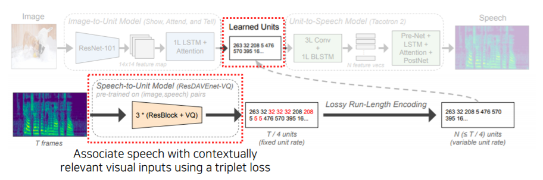

 

그러면 Speech가 **Learned Units**에 들어오면 항상 Unit을 출력할 수 있기 때문에 **Learned Units -> Image, 또는 Learned Units -> Speech 방향으로 해서 input / output 관계로 따로따로 학습이 가능해집니다.** 

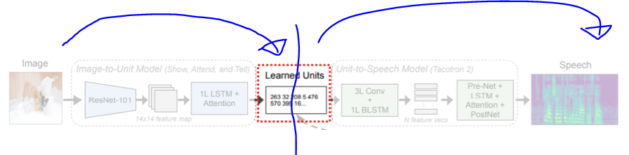

###  3.3 Crossmodal Referencing방법 (Image-Audio) 

#### 3.3.1 Application : Sound source localization

소리를 input으로 넣어주고 image를 넣어주었을 때 이 소리가 어디에서 나는지 image에서 찾는 방법입니다.

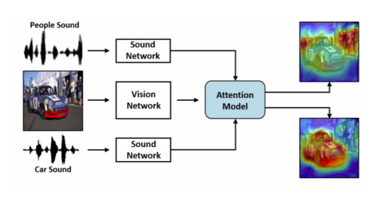

 

아키텍쳐 구조는 다음과 같습니다.

Image는 Visual recogniziation net으로 학습된 Visual net을 사용하고, Audio도 SoundNet처럼 학습된 CNN 구조를 사용하게 됩니다.

 

그렇지만 Visual Net에서는 fixed dimension vector를 사용하지 않고 **spactial feature**를 Attention net에 넘겨주게 됩니다. 따라서 아래 사진에서 Visual Net에서 온 Spactial feature (주황색)와 Audio net에서 온 fixed dimension vector (파란색)을 내적을 통해서 **유사도를 측정**합니다. 

 

그러면 **그 내적값이 Localization score로 나타나게 됩니다.**

 

Sound source localization은 Unsupervised 방법으로도 학습이 가능합니다.

Image에서 Audio는 annotation으로 활용이 가능하기 때문입니다.

 

**Visual Net에서 추출한 Visual feature map을 X 부분까지 가지고 오고, Localization Score를 Weight로 사용합니다.** 그리고 feature map과 Weight를 weighted sum을 해서 pooling을 수행합니다. 그리고 **Attended visual feature**를 생성합니다.

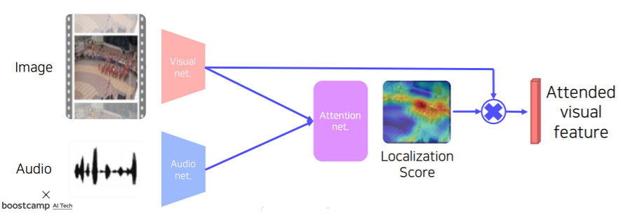

 

이렇게 추출한 Attended visual feature하고 sound에서 나온 feature하고 metric learning 형태로 구해줍니다.

같은 video에서 audio가 나왔다면 가까워지고, 다른 video에서 audio가 나왔다면 멀어지는 형태를 갖습니다.

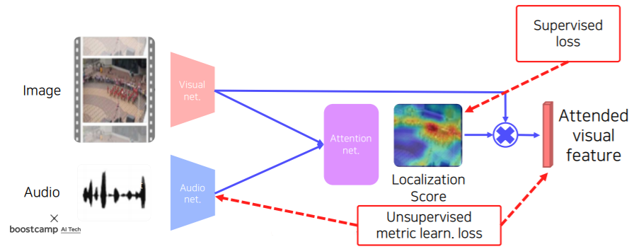

 

#### 3.3.2 Application : Speech seperation

 

Visual 정보를 참조를 해서 speech seperate를 하는 방법입니다.

이 방법에서는 Visual Stream과 Audio Stream이 필요합니다. 

 영상에서 N명의 얼굴을 찾고, Face Embedding을 수행하여 N개의 해당 얼굴 object마다 Feature map을 추출합니다.

이렇게 나온 Face Feature vector와 Speech data를 concat 해주고, 각각에 대해서 이 spectrogram을 어떻게 분리해야하는지 판단하여 <u>Complex masked된 형태</u>를 뽑아냅니다.

이 spectrogram mask를 다시 원본의 스펙트로그램에 곱해주면 <u>마스킹된 부분만의 사운드 정보</u>를 가진 최종 스펙트로그램이 완성된다. (Seperated Speech Spectrogram)

그리고 Seperated speech spectrogram을 복호화를 해줘서 wavform으로 변환해주면 소리를 들어볼 수 있습니다.

 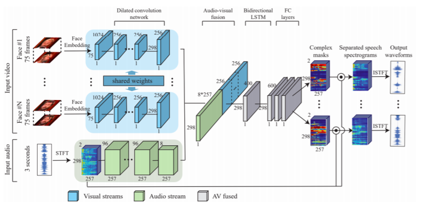

> **문제점**

가장 큰 문제점이 있는데, 위 모델을 학습시키기 위해서는 ground truth 즉, clean spectrogram이 필요합니다. 여기서 clean 데이터란 여러명의 음성이 겹쳐진 데이터가 아니라, 한명의 음성만 가진 데이터를 말합니다. 그렇지만 이렇게 합쳐진 video에서 여러사람이 말하는 경우 clean spectrogram을 얻기가 어렵다는 것입니다.

즉, 다시말해 음성을 깨끗하게 분리하기 위해서 모델을 만드는 것인데, 분리된 clean 음성 데이터가 필요하고 이런 annotation된 데이터가 없는데 학습을 어떻게 해야하나가 문제점입니다.(모순)

> **해결방법**

아주 특이한 방식을 이용합니다. 따로 존재하는 clean 동영상 2개를 합성해서 train data로 만들어 사용하는 것입니다. (혼자 말하는 동영상 + 혼자 말하는 동영상 2개의 비디오를 concat으로 이어붙이고 음성데이터는 그냥 더해버린다). 이렇게 하면 Supervised Learning의 Ground Truth가 생겼고 Ground Truth 자체가 합성데이터이기 때문에 L2 Loss를 구하는 등 학습이 가능해진다.