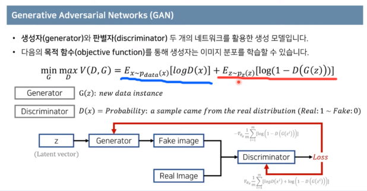
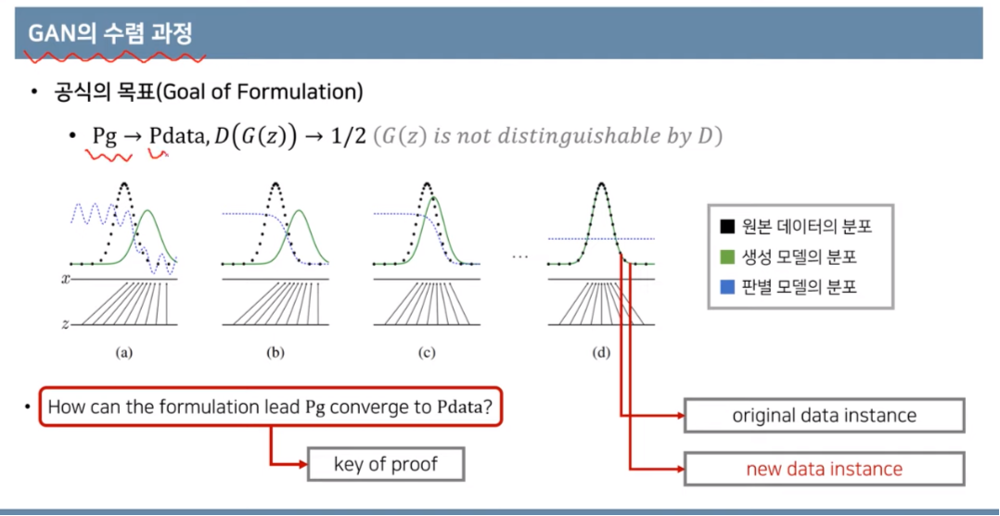
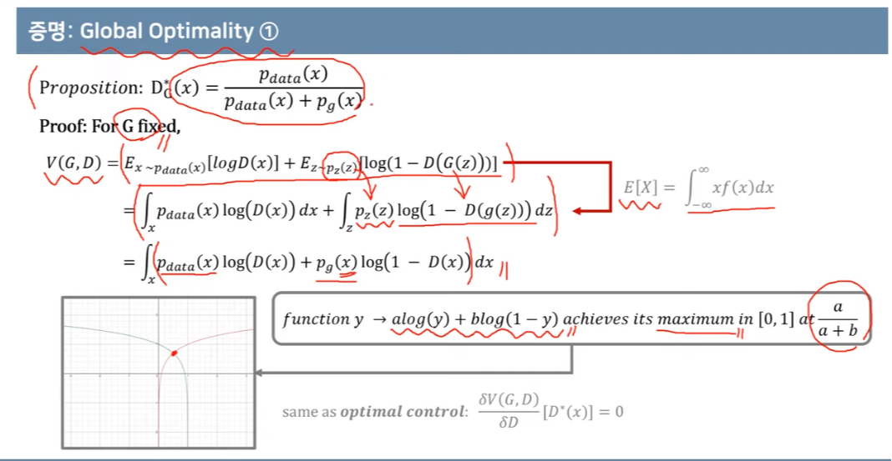
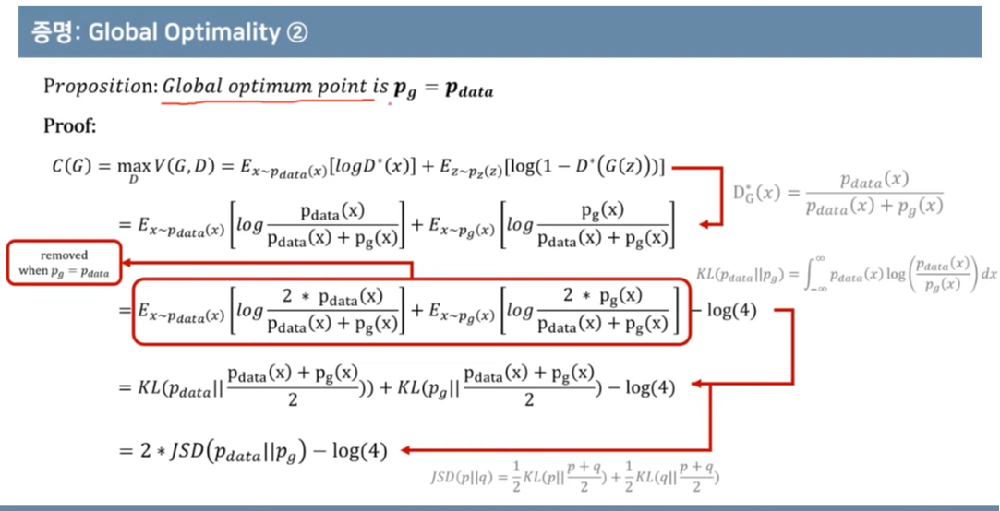

---

# GAN

GAN의 개념 중 헷갈릴만한 부분을 정리하였습니다.

## 목적함수 살펴보기

> 목적함수를 살펴보자.

1. 파랑색으로 밑줄친 log(D(x)) where x~p_data(x)

 - 파랑색으로 밑줄친 부분을 보면, p_data(x)라는 notation은 original data가 따르는 확률분포를 나타냅니다.
 - 해당 original distribution에서 추출된 x 데이터에 대하여 Discriminator를 수행하는데 목적함수를 높이기 위해 노력하기 때문에 original data에 대한 Discriminator 결과가 1에 가까울수록 좋다는 것일 겁니다.
 - 따라서 원래 original data를 Real로 판단할 수 있게 되어야 한다는 뜻입니다.

2. 빨간색으로 밑줄친 log(1-D(G(z))) where z~P_z(z)

 - 빨간색으로 밑줄친 부분을 보면, generator로부터 생성된 z data에 대한 항이다.
 - <b><u class="cdx-underline">Generator인 G(z)의 관점에서 보면_</b>, 목적함수를 작게 만드는 것이 목표이기 때문에 (1-D(G(z)))를 작게 만들고 싶어 하고, 이것은 곧 D(G(z))를 크게 만들고 싶어하는 것과 동치입니다.
 - 결국, D(G(z))를 Generator 관점에서 바라보면 새로 generate한 데이터에 대해서 Real Data처럼 만들어야 목표를 달성하게 됩니다.
 - 하지만,&nbsp; D(G(z))를 <b><u class="cdx-underline">Discriminator 관점에서 바라보면(_</b>목적함수를 크게만들고 싶어함) 이 D(G(z)) 값을 작게 만들고 싶어합니다. 새로 generate한 데이터에 대해서 0(Fake)이라고 판별하는 것을 목표로 하는 것이죠.

> 바로 이러한 관점에서 Discriminator와 Generator가 목표로 하는 부분이 상충되어 Adversarial이라는 이름이 붙은 것입니다.

> 결론적으로 요약정리해보면, 진짜데이터 x에 대해서 Discriminator결과를 1(Real)로 판단하는 것은 기본으로 목표함수가 첫번째 항에 가지고 있습니다. 그리고 두번째 항을 보면 Generator는 진짜처럼 데이터를 만들려고 하고, Discriminator는 Generator가 만든 데이터는 0(Fake)라고 판별하고 싶어하는 구조인 것이죠.&nbsp;

 - Pg : Generator의 분포, Pdata : Original 분포
 - D(G(z))가 1/2로 수렴하게 한다.&nbsp;
 - 왜 0이 아니라 1/2일까요?라는 의문이 드신다면, Discriminator는 데이터를 입력으로 받았을 때 해당 데이터가 real로부터 왔는지 genrator로부터 왔는지를 확률 결과로 출력합니다.
 - 여기선 Discriminator가 아예 판별할 수 없을 만큼 real data의 분포와 generator의 분포를 아예 똑같이 만드는 것이 목표함수의 최적값입니다.
 - 즉, 가짜데이터가 왔을 때 real로부터 왔을 확률이 0.5, generator로부터 왔을 확률이 0.5라고 판단하게 되는 식으로 만드는 것이 Discriminator가 가장 기능을 할 수 없게 하는 것과 동치입니다.

## Global Optimality

아래는 Global Optimality가 존재함과 최적의 해가 어떤 값인지를 증명하는 과정입니다.

> y에 대한 함수로 볼때 최대값이 되는 지점을 쉽게 찾을 수 있습니다.

JSD는 쿨백라이블러 발산을 평균내서 도출할 수 있는 Distance metric이라고 간단히 생각하면 편하다.

(쿨백라이블러 발산은 거리 개념처럼 쓰이긴 하지만, 사실 명백히 거리 개념은 아니기 때문에)

