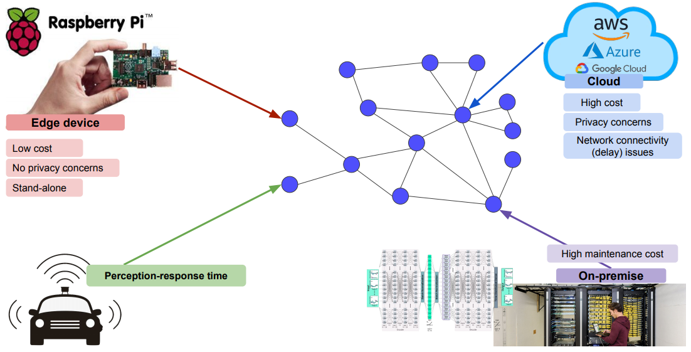
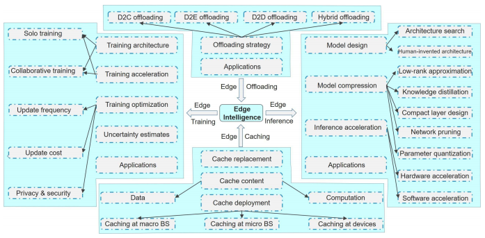

## Edge Device

모델을 경량화하는 대개의 이유는, **edge device에 모델을 넣기 위함이다.** 그렇다면 edge device는 뭘까? 그냥 우리가 흔히 들고다니는 스마트폰도 edge device의 일종이 될 수 있다. 아래 그림을 보자.

가운데에 그려져 있는 그래프는 network graph로, 인터넷으로 연결될 수 있는 각종 시스템들이 그려져있다. **Edge device**는 위와 같이 네트워크 구조에서 말단(edge)에 있는 것을 말한다.

모델 경량화는 모델을 cloud나 on-premise등 크기가 큰 곳에 원격으로 올리지 않고 edge device 자체에 올리는 한편 그 device에서 돌아갈 수 있도록 모델의 크기나 계산량을 줄이기 위해 존재한다.

그렇다면 우리는 왜 모델을 edge device에 올리려고 할까? 당연히 속도 때문이다. LAN을 통해 cloud나 여타 서버에 접속하는 latency를 줄이려면 그 모델이 직접적으로 필요한 곳에 모델을 올려야 한다. 또한 cloud 등에 올리려면 금전적 비용도 만만치 않다. 이러한 금전적 비용도 줄이기 위해 경량화가 사용된다.

edge device라는 단어를 찾아보면 ‘Dumb and fast’라는 구절이 나온다. 같지만(성능은 떨어지지만) 빠르다는 것을 의미한다.

#### Edge Intelligence

우리가 Edge device에 모델을 올린다고 하면 device 상에서 무엇을 할 수 있을까? training? inference? 당연하겠지만 지금 당장의 목표는 inference이다. training부터 edge device에서 시작하는 것은 아직 갈 길이 멀다. training에는 많은 리소스가 소모된다. 현 시점에서 모델 경량화라고 하면 대부분이 inference에 집중해있는 편이다.

한편, Edge단에 가까운 서버를 두어 latency를 최소화하되 edge에 직접 모델을 다 올리지는 않는 **edge offloading**이나 training/inference 시에 필요한 데이터를 미리 캐싱해놓는(hit를 최대화하고, miss를 최소화하는) **edge caching** 등의 literature도 존재한다.