## **1. Entropy 관점**

 

**Entropy**는 **불확실성의 측정**을 뜻합니다.

 

아래 그림과 같이,

**정렬된 왼쪽 상태**를 **Low Entropy**라 부르며 **경우의 수는 거의 1개 밖에 없습니다.**

**불규칙한 오른쪽 상태**를 **High Entropy**라 부르며 **경우의 수는 여러개로 나올 수 있습니다.**

 

Low Entropy는 과거의 상태이며, 여기에 Energy를 집어넣게 되면, 미래의 상태 High Entropy로 변화합니다.

 

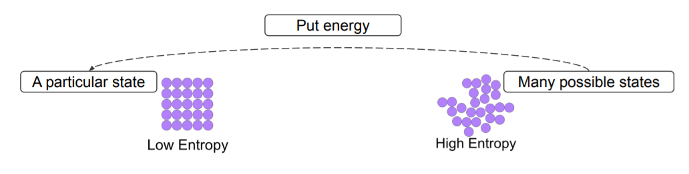

 

딥러닝에서도 적용해보면 다음과 같습니다.

**무질서한 사진들 (High Entropy, 오른쪽)을 딥러닝에 넣고 돌리면 Classification된 사진들 (Low Entropy, 왼쪽)으로 나오게 됩니다.**

 

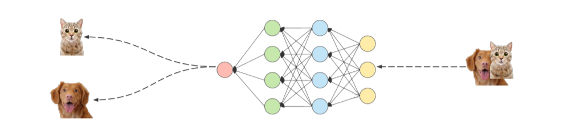

 

통계학적 관점에서 보면 다음과 같습니다.

 

아래 그림과 같이 **uniform distribution** (ex. 주사위)에서는 무엇이 무질서한지 모르게 되고, 랜덤하게 뽑게 됩니다. 즉, 무엇을 뽑는게 좋은 것인지 나쁜 것인지 모르게 됩니다.

 

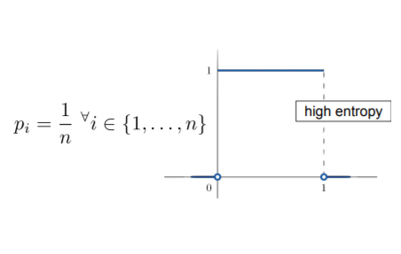

 

여기서 우리가 **Testable information (실험적인 정보)**를 집어넣게 되면 오른쪽 그림과 같이 분포가 변하게 됩니다. 즉, **왼쪽 분포에서 지식과 정보가 들어간 오른쪽 분포로 변화시킵니다.**

 

"무작위로 되어있는 분포" (왼쪽분포, high entropy)에서 information을 집어넣어서 "정렬된 분포" (오른쪽 분포, low entropy)로 바꿉니다.

 

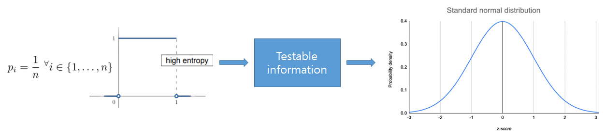

 

아래와 같이 Entropy 수식에서 "동전이 나올 확률"을 계산하면 다음과 같습니다. (여기서 bit는 정보량(정보수)을 의미합니다.)

 

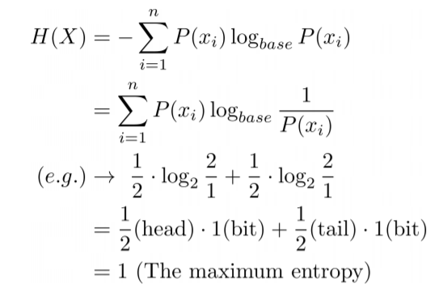

 

여기서 최종적으로 **1 (The maximum entropy)**가 나오는데 maximum entropy의 의미는 **완전히 무질서해서 좋고 나쁨을 따질 수 없는 상태를 의미**합니다. 즉, 정보가 없는 상태(완전히 확률적인 상태 = 무질서한 상태 = 측정할 수 없는 상태)를 의미합니다.

 

 

## **2. Entropy 관점의 Encoding**

 

Encoding을 Entropy 관점에서 보면 다음과 같습니다.

 

아래 그림과 같이 MNIST를 수행하는 딥러닝(Classifier 또는 Encoder)이 있습니다.

여기서 **Q(i)**는 **딥러닝이 예측한 값의 확률**들을 의미하며, 파란색은 예측한 확률값, 빨간색은 one-hot vector로 표현한 값을 의미합니다. **P(i)**는 **실제 Ground truth**를 의미합니다.

 

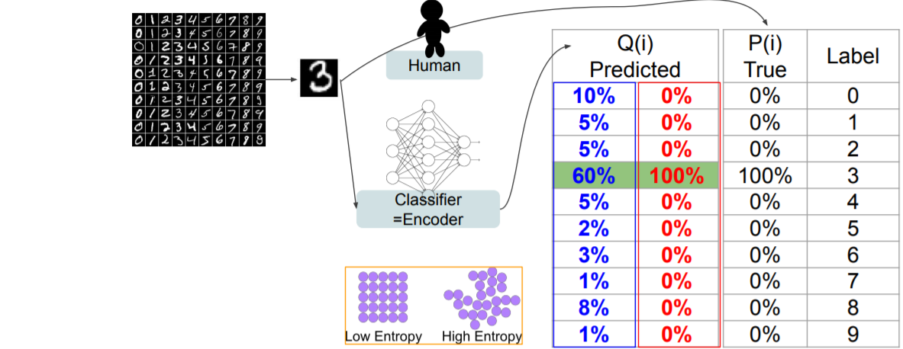

 

여기서 두 개의 확률분포 P(i), Q(i)의 Loss를 구하기 위해 **KL divergence**를 사용하며, 이때, Entropy 개념이 등장하게 됩니다. 아래 수식에서 보라색은 cross-entropy, 주황색은 entropy를 의미합니다.

 

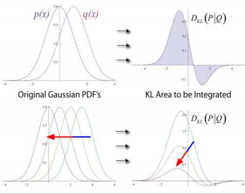

 

이 **KL divergence 수식**을 가지고 예측된 확률값(파란색)과 one-hot vector(빨간색)을 구하면 다음과 같습니다.

예측된 확률값(파란색)은 다른 확률값이 섞여있기 때문에 Entropy 관점에서 보면 약간의 무질서한 상태가 섞여있습니다.

one-hot vector(빨간색)은 다른 확률값은 0%, 오로지 정답만 100%이기 떄문에 Entropy 관점에서 보면 Low Entropy (무질서가 0이다라는 뜻) 입니다.

 

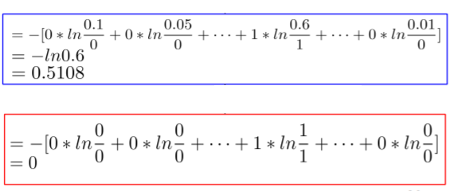

 

그렇다면 KL divergence에 있는 Cross-Entropy가 무엇을 의미하는 걸까요?

 

먼저 각각의 class를 encode하는 것에서부터 시작합니다.

 

다음은 각각의 class에 맞게 Encode를 수행한 **codewords**입니다.

 

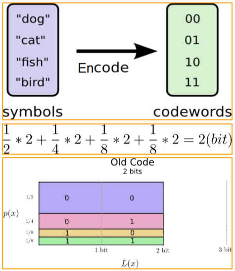

 

만약, **Huffman code**로 Encode를 수행하게 되면 **훨씬 적은 bit로 codewords**를 만들 수 있습니다.

 

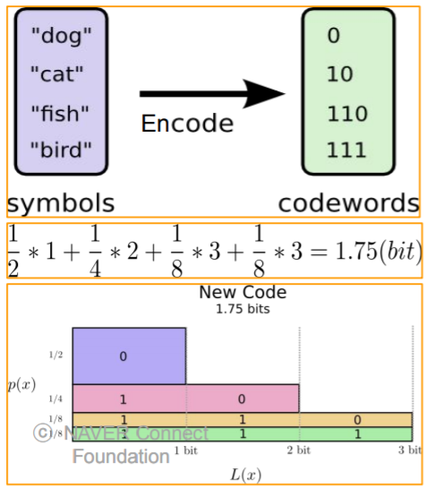

 

하지만 Huffman code로 줄인 1.75bit보다 더 적은 bit로 줄일 수는 없습니다. 즉, 데이터를 주고받을 때 평균 1.75bit 이상의 데이터를 주고받아야 합니다.

 

이때 최적의 평균 길이(optimal average length)를 **"분포의 엔트로피(the entropy of the distribution)"**라고 합니다.

 

따라서 P(i) 분포의 entropy H(p)H(p)를 구하면 다음 식과 같습니다.

(이 공식은 KL divergence의 entropy 부분에 사용됩니다.)

 

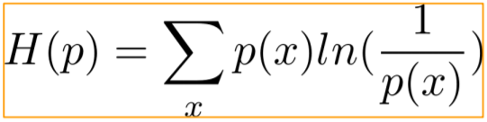

 

**Cross-Entropy**는 **Q(i) 분포의 codebook (codewords의 집합)을 가지고 P(i)라는 message를 해독했을 때의 average length**입니다.

즉, Q(i)라는 codebook을 가지고 P(i)의 message를 해독할 때, P(i)의 message가 optimal하게 encoding 되기 위한 평균 길이(average length)를 뜻합니다.

 

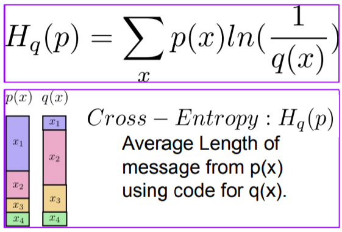

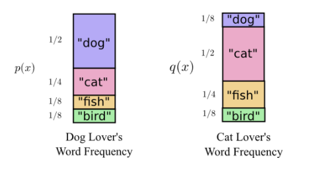

 

하지만 Hq(p)Hq(p)만 가지고 encoding을 하기에는 **약간의 오차가 발생합니다.**

Encode를 수행한 code들에서 어떤 부분은 과하게 측정되고, 어떤 부분은 부족하게 측정되어 오차가 생기게 됩니다.

 

따라서 KL divergence를 구할 때 

**Cross-entropy 부분**은 **Q(i)라는 codebook의 입장에서 P(i)라는 message(정답 set)를 encoding 했을 때의 나오는 무질서도를 의미합니다.** 이때, 무질서도가 0에 가까울수록 optimal하게 됩니다.

**Entropy 부분**은 위에서 주황색 식 H(p)H(p), 즉, P(i)라는 message를 P(i)라는 codebook으로 encoding 했을 때를 의미합니다. 이때 entropy의 값은 0이 나오지는 않고, **P(i) 분포가 기본적으로 가지고 있는 minimum entropy가 나오게 됩니다.**

 

따라서 **Cross-entropy에서 \**Entropy를 뺸다는\**** **의미**는 Q라는 codebook을 가지고 P라는 message를 해독했을 때의 무질서도에서 P라는 codebook을 가지고 P라는 message를 해독 (P분포의 minimum entropy)했을 때의 무질서도를 뺸 값입니다. 

즉, P분포의 minimum entropy는 P분포의 baseline(극소값)이므로 cross-entropy에서 entropy(P분포의 minimum entropy)를 뺌으로써 **KL divergence는 변화량을 회득하게 됩니다.**

 

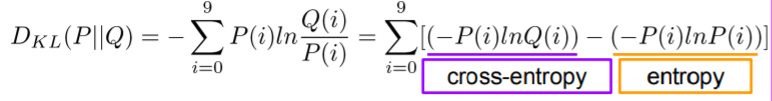