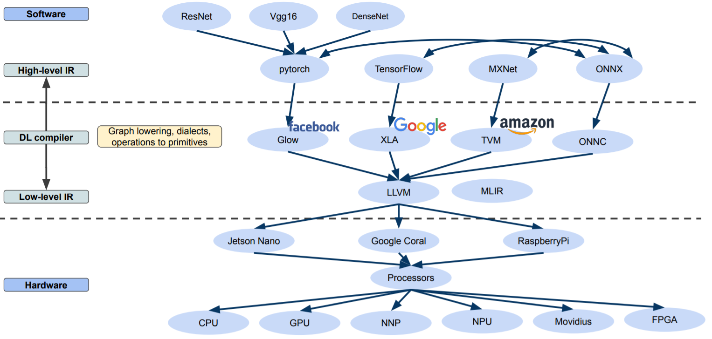
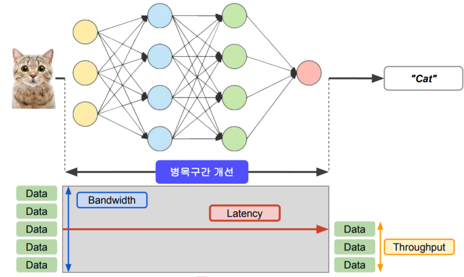
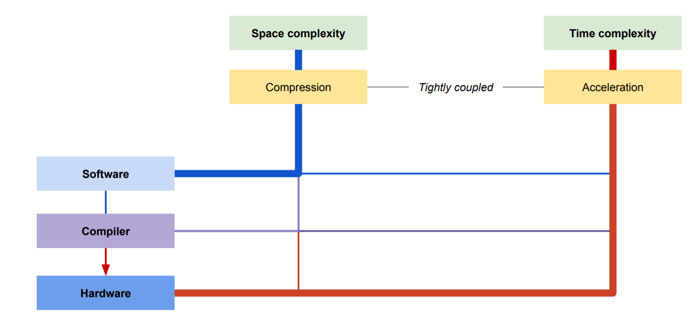
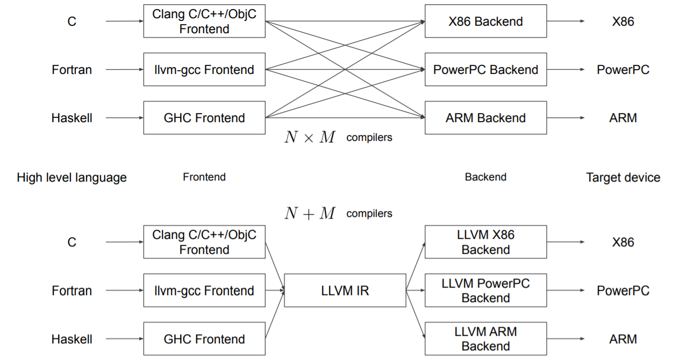
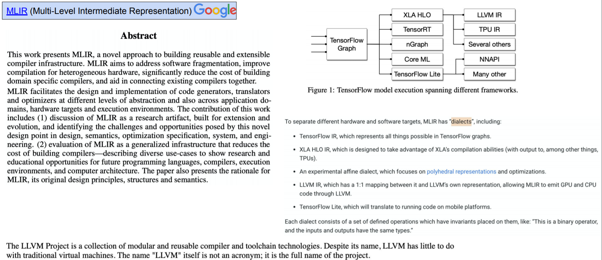
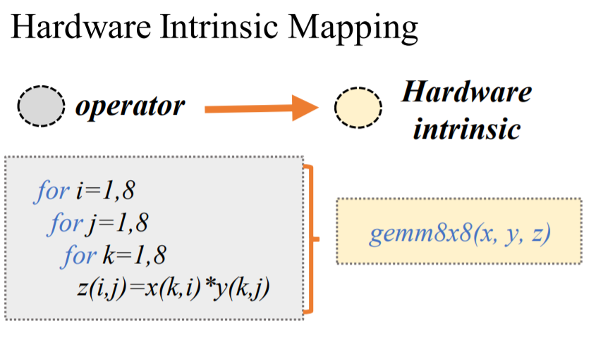
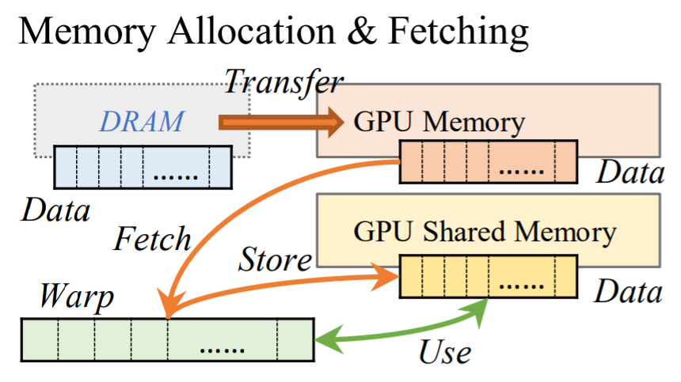
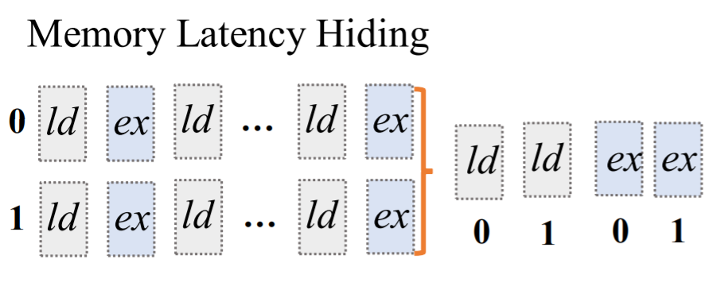
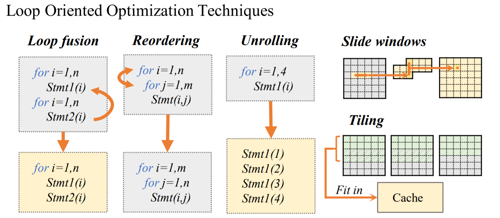
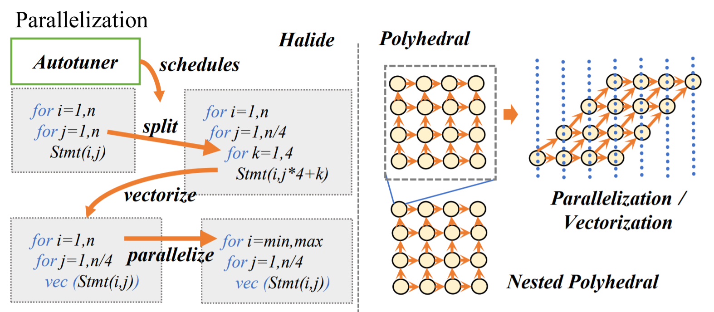

## **1. Graph lowering**

 

High-level IR로 만든 Software (model)가 Hardware에서 동작하기 위해서는 **DL compiler을 통해 Hardware가 이해할 수 있는 형태로 변환해야 합니다.** 이 과정을 **Graph lowering**이라고 합니다.

 

 

 

 

## **2. Acceleration 관련 용어**

 

- **Bandwidth :** 데이터가 한 번에 이동할 수 있는지 용량

  

- **Latency :** 정보가 매질 자체를 통과할 때 걸리는 시간

  

- **Throughput :** 실제로 전송되는 양 (성능)

 

 

## **3. 머신러닝에서 Acceleration**

 

머신러닝에서 계산량이 많은 layer일수록 병목현상이 일어납니다.

따라서 머신러닝에서는 **계산량이 많은 layer의 Bandwidth와 Latency들을 개선하는 것이 목표**입니다.

 

 

 

## **4. Compression vs Acceleration**

 

**Compression**은 Size에 대한 중요하지 않은 정보를 빼내고 중요한 정보만 가지고 압축하겠다는 의미입니다. Software에서 많이 사용합니다.

**Acceleration**은 하드웨어 부분 (low level libaray)에서 가속을 할 때 많이 사용합니다.

 

 

 

## **5. DeepLearning compiler**

#### **1) LLVM**

원래의 Compiler는 C, Fortran, Haskell 등 여러 언어를 가지고 각각의 architecture (X86, PowerPC, ARM)에 dependent 한 Backend를 만들어냅니다. (아래 그림에서 위쪽)

 

하지만 **LLVM IR**을 사용하면 **Frontend에서 어떤 언어가 들어오던 원하는 architecture로 변환해줍니다.**(아래 그림에서 아래쪽)

 

 

 

 

#### **2) MLIR**

MLIR은 **LLVM의 Machine Learning 버전**입니다.

 

Tensorflow나 PyTorch Graph를 실행하기 위해서는 여러 Compiler를 거쳐야 하는데, MLIR에서는 **중간에 있는 compiler들을 조립 후 통합해서 "통합 Framework"를 사용할 수 있게 만들었습니다.**

 

 

 

 

 

#### **3) DL complier에 적용하는 Hardware-specific optimizations**

 

- **Hardware Intrinsic Mapping**

 

 

 

- **Memory Allocation & Fetching**

 

 

 

- **Memory Latency Hiding**

 

 

 

- **Loop Oriented Optimization Techniques

  **Loop문의 기술 또는 slide window를 사용해서 optimization하는 방법입니다.

  한번 사용한 데이터를 재사용하는 기술입니다.

 

 

 

- **Parallelization

  **병렬처리가 안 되는 loop를 병렬처리가 되도록 변환하는 방법입니다.

 

