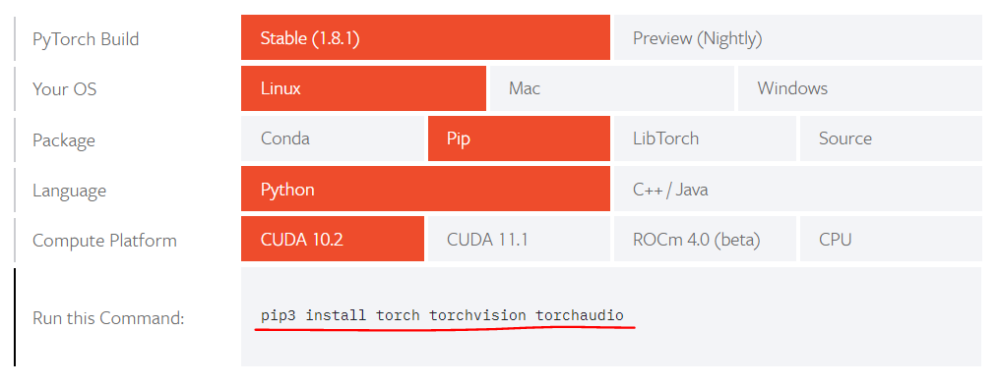

## RuntimeError: The NVIDIA driver on your system is too old (found version 10010). Please update your GPU driver by downloading and installing a new version from the URL: http://www.nvidia.com/Download/index.aspx Alternatively, go to: https://pytorch.org to install a PyTorch version that has been compiled with your version of the CUDA driver.


> 실패

https://pytorch.org/get-started/locally/#linux-pip




>성공

- /opt/CHAN-DST/requirements.txt

```
# nsml: pytorch/pytorch:1.7.0-cuda11.0-cudnn8-runtime
-f https://download.pytorch.org/whl/torch_stable.html
torch==1.7.0+cu101
torchvision==0.8.1
torchaudio==0.7.0
transformers==3.5.1
wandb==0.10.28
pytorch-transformers==1.2.0

```


```bash
pip install -r requirements.txt
```


